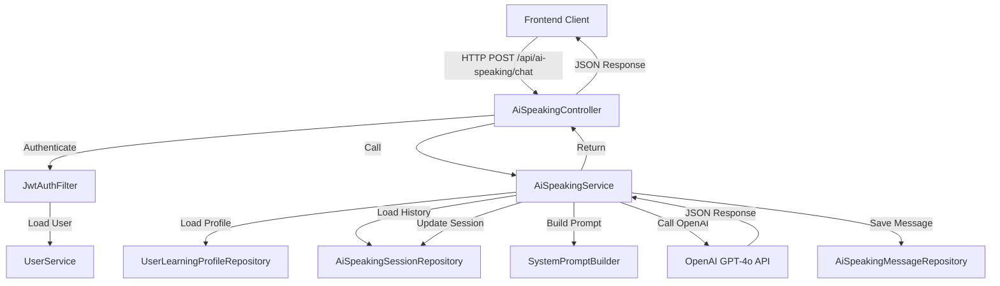
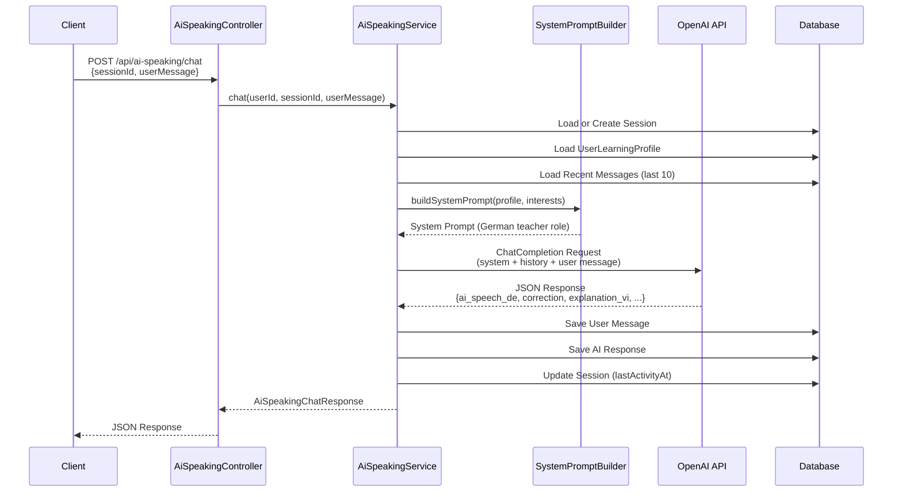

# Design Document: DeutschFlow AI Speaking Practice

## Overview

DeutschFlow AI Speaking Practice là một tính năng hội thoại AI tương tác, cho phép người dùng luyện nói tiếng Đức với một giáo viên ảo tên "DeutschFlow AI". Hệ thống nhận đầu vào văn bản (hoặc giọng nói được chuyển thành văn bản) từ người dùng, gửi đến OpenAI GPT-4o với một system prompt được thiết kế đặc biệt, và trả về phản hồi có cấu trúc JSON bao gồm câu trả lời tiếng Đức, bản sửa lỗi ngữ pháp, giải thích bằng tiếng Việt, và thông tin học tập. Tính năng này tích hợp hoàn toàn vào backend Spring Boot hiện có của DeutschFlow, tận dụng JWT authentication, UserLearningProfile, và cấu hình OpenAI đã có sẵn.

Mục tiêu chính là tạo ra một vòng lặp luyện tập phản xạ nói hiệu quả: người dùng nói → AI phản hồi tự nhiên bằng tiếng Đức → AI sửa lỗi và giải thích → AI đặt câu hỏi mở để tiếp tục hội thoại. Hệ thống lưu lịch sử hội thoại theo phiên (session) để duy trì ngữ cảnh và cá nhân hóa dựa trên profile người dùng (sở thích, nghề nghiệp, mục tiêu học tập).


## Architecture



### Sequence Diagram: Chat Flow




## Components and Interfaces

### Component 1: AiSpeakingController

**Purpose**: REST API entry point cho tính năng luyện nói AI. Xử lý authentication và routing.

**Interface**:
```java
@RestController
@RequestMapping("/api/ai-speaking")
public class AiSpeakingController {
    // Bắt đầu hoặc tiếp tục một phiên hội thoại
    POST /api/ai-speaking/sessions
    // Gửi tin nhắn và nhận phản hồi AI
    POST /api/ai-speaking/sessions/{sessionId}/chat
    // Lấy lịch sử hội thoại của một phiên
    GET  /api/ai-speaking/sessions/{sessionId}/messages
    // Lấy danh sách phiên của người dùng
    GET  /api/ai-speaking/sessions
    // Kết thúc phiên hội thoại
    PATCH /api/ai-speaking/sessions/{sessionId}/end
}
```

**Responsibilities**:
- Xác thực JWT token và lấy thông tin người dùng hiện tại
- Validate request body (userMessage không được rỗng, tối đa 1000 ký tự)
- Delegate logic sang AiSpeakingService
- Trả về response đúng HTTP status code

---

### Component 2: AiSpeakingService

**Purpose**: Business logic chính. Quản lý session, xây dựng prompt, gọi OpenAI, lưu lịch sử.

**Interface**:
```java
public interface AiSpeakingService {
    AiSpeakingSessionDto createSession(Long userId, String topic);
    AiSpeakingChatResponse chat(Long userId, Long sessionId, String userMessage);
    List<AiSpeakingMessageDto> getMessages(Long userId, Long sessionId);
    List<AiSpeakingSessionDto> getSessions(Long userId);
    void endSession(Long userId, Long sessionId);
}
```

**Responsibilities**:
- Load UserLearningProfile để cá nhân hóa system prompt
- Quản lý conversation history (tối đa 10 tin nhắn gần nhất để tránh vượt context window)
- Gọi OpenAI API với retry logic (tối đa 3 lần)
- Parse JSON response từ GPT-4o
- Lưu messages vào database
- Cập nhật learning_status (new_word, user_interest_detected)

---

### Component 3: SystemPromptBuilder

**Purpose**: Xây dựng system prompt động dựa trên profile người dùng.

**Interface**:
```java
public class SystemPromptBuilder {
    String buildSystemPrompt(UserLearningProfile profile, List<String> knownInterests);
    String buildTopicContext(String topic);
}
```

**Responsibilities**:
- Inject thông tin cá nhân (sở thích, nghề nghiệp) vào system prompt
- Điều chỉnh độ khó theo targetLevel của người dùng (B1/B2)
- Đảm bảo AI luôn trả về đúng JSON schema

---

### Component 4: OpenAiChatClient

**Purpose**: HTTP client wrapper cho OpenAI Chat Completions API.

**Interface**:
```java
public interface OpenAiChatClient {
    String chatCompletion(List<ChatMessage> messages, String model, double temperature);
}
```

**Responsibilities**:
- Gọi `https://api.openai.com/v1/chat/completions`
- Xử lý rate limiting và retry với exponential backoff
- Timeout configuration (30 giây)
- Log token usage cho monitoring


## Data Models

### Model 1: AiSpeakingSession

Đại diện cho một phiên hội thoại luyện nói.

```java
@Entity
@Table(name = "ai_speaking_sessions")
public class AiSpeakingSession {
    Long id;
    Long userId;           // FK -> users.id
    String topic;          // Chủ đề hội thoại (nullable = tự do)
    SessionStatus status;  // ACTIVE, ENDED
    LocalDateTime startedAt;
    LocalDateTime lastActivityAt;
    LocalDateTime endedAt;
    int messageCount;
    
    enum SessionStatus { ACTIVE, ENDED }
}
```

**Validation Rules**:
- `userId` không được null, phải tồn tại trong bảng `users`
- `topic` tối đa 200 ký tự
- `status` mặc định là `ACTIVE` khi tạo mới

---

### Model 2: AiSpeakingMessage

Lưu từng tin nhắn trong phiên hội thoại.

```java
@Entity
@Table(name = "ai_speaking_messages")
public class AiSpeakingMessage {
    Long id;
    Long sessionId;         // FK -> ai_speaking_sessions.id
    MessageRole role;       // USER, ASSISTANT
    String userText;        // Câu gốc của người dùng (role=USER)
    String aiSpeechDe;      // Câu trả lời tiếng Đức của AI (role=ASSISTANT)
    String correction;      // Bản sửa lỗi (nullable nếu không có lỗi)
    String explanationVi;   // Giải thích tiếng Việt (nullable)
    String grammarPoint;    // Điểm ngữ pháp (nullable)
    String newWord;         // Từ vựng mới (nullable)
    String userInterestDetected; // Thông tin cá nhân mới phát hiện (nullable)
    LocalDateTime createdAt;
    
    enum MessageRole { USER, ASSISTANT }
}
```

**Validation Rules**:
- `sessionId` không được null
- `role` không được null
- `userText` tối đa 1000 ký tự
- `aiSpeechDe` tối đa 2000 ký tự

---

### Model 3: AiSpeakingChatRequest (DTO)

```java
public record AiSpeakingChatRequest(
    @NotBlank @Size(max = 1000) String userMessage
) {}
```

---

### Model 4: AiSpeakingChatResponse (DTO)

Phản ánh đúng JSON schema được định nghĩa trong feature description.

```java
public record AiSpeakingChatResponse(
    Long messageId,
    Long sessionId,
    String aiSpeechDe,       // Câu trả lời tiếng Đức để TTS phát âm
    String correction,       // Bản sửa lỗi hoàn chỉnh (null nếu không có lỗi)
    String explanationVi,    // Giải thích lỗi bằng tiếng Việt (null nếu không có lỗi)
    String grammarPoint,     // Chủ điểm ngữ pháp (null nếu không có lỗi)
    LearningStatus learningStatus
) {
    public record LearningStatus(
        String newWord,
        String userInterestDetected
    ) {}
}
```

---

### Model 5: AiSpeakingSessionDto (DTO)

```java
public record AiSpeakingSessionDto(
    Long id,
    String topic,
    String status,
    LocalDateTime startedAt,
    LocalDateTime lastActivityAt,
    int messageCount
) {}
```


## Algorithmic Pseudocode

### Main Algorithm: chat()

```pascal
ALGORITHM chat(userId, sessionId, userMessage)
INPUT:
  userId: Long (authenticated user)
  sessionId: Long (existing session ID)
  userMessage: String (user's German text, max 1000 chars)
OUTPUT: AiSpeakingChatResponse

BEGIN
  // 1. Validate session ownership
  session ← sessionRepository.findById(sessionId)
  IF session IS NULL OR session.userId ≠ userId THEN
    THROW NotFoundException("Session not found")
  END IF
  IF session.status = ENDED THEN
    THROW BadRequestException("Session has ended")
  END IF

  // 2. Load user context for personalization
  profile ← userLearningProfileRepository.findByUserId(userId)
  knownInterests ← extractInterests(profile.interestsJson)

  // 3. Build conversation history (last 10 messages for context window)
  recentMessages ← messageRepository.findTop10BySessionIdOrderByCreatedAtDesc(sessionId)
  REVERSE(recentMessages)  // chronological order

  // 4. Build OpenAI messages array
  systemPrompt ← promptBuilder.buildSystemPrompt(profile, knownInterests)
  openAiMessages ← [{ role: "system", content: systemPrompt }]
  
  FOR each msg IN recentMessages DO
    IF msg.role = USER THEN
      openAiMessages.add({ role: "user", content: msg.userText })
    ELSE
      openAiMessages.add({ role: "assistant", content: msg.aiSpeechDe })
    END IF
  END FOR
  
  openAiMessages.add({ role: "user", content: userMessage })

  // 5. Call OpenAI with retry
  rawJson ← openAiClient.chatCompletion(openAiMessages, "gpt-4o", temperature=0.7)
  aiResponse ← parseAiResponse(rawJson)

  // 6. Persist messages
  userMsg ← saveMessage(sessionId, USER, userMessage, null, null, null, null)
  assistantMsg ← saveMessage(
    sessionId, ASSISTANT,
    aiResponse.aiSpeechDe,
    aiResponse.correction,
    aiResponse.explanationVi,
    aiResponse.grammarPoint,
    aiResponse.learningStatus
  )

  // 7. Update session metadata
  session.lastActivityAt ← now()
  session.messageCount ← session.messageCount + 2
  sessionRepository.save(session)

  // 8. Return structured response
  RETURN AiSpeakingChatResponse(
    messageId = assistantMsg.id,
    sessionId = sessionId,
    aiSpeechDe = aiResponse.aiSpeechDe,
    correction = aiResponse.correction,
    explanationVi = aiResponse.explanationVi,
    grammarPoint = aiResponse.grammarPoint,
    learningStatus = aiResponse.learningStatus
  )
END
```

**Preconditions:**
- `userId` là authenticated user (JWT validated)
- `sessionId` tồn tại và thuộc về `userId`
- `userMessage` không rỗng, tối đa 1000 ký tự
- OpenAI API key được cấu hình trong `app.openai.api-key`

**Postconditions:**
- Hai messages mới được lưu vào `ai_speaking_messages` (USER + ASSISTANT)
- `session.lastActivityAt` được cập nhật
- Response chứa đầy đủ các trường theo JSON schema

**Loop Invariants:**
- Mỗi message trong `recentMessages` đều thuộc về `sessionId`
- Thứ tự chronological được duy trì khi build `openAiMessages`

---

### Algorithm: buildSystemPrompt()

```pascal
ALGORITHM buildSystemPrompt(profile, knownInterests)
INPUT:
  profile: UserLearningProfile
  knownInterests: List<String>
OUTPUT: String (system prompt)

BEGIN
  level ← profile.targetLevel  // e.g., B1, B2
  industry ← profile.industry  // e.g., "Developer"
  
  interestSection ← ""
  IF knownInterests IS NOT EMPTY THEN
    interestSection ← "Sở thích đã biết của người dùng: " + JOIN(knownInterests, ", ")
  END IF
  
  prompt ← """
    Du bist "DeutschFlow AI", ein virtueller muttersprachlicher Deutschlehrer,
    spezialisiert auf Sprechreflextraining für Vietnamesen.
    
    Benutzerprofil:
    - Zielsprachniveau: {level}
    - Beruf: {industry}
    - {interestSection}
    
    Gesprächsregeln:
    1. Kommuniziere zu 100% auf Deutsch. Nur Fehlererklärungen auf Vietnamesisch.
    2. Verwende B1-Niveau: klarer Wortschatz, moderate Satzstruktur.
    3. Fehlerkorrektur: Antworte zuerst auf den Inhalt, dann korrigiere.
    4. Beende immer mit einer offenen Frage zum aktuellen Thema.
    
    Antworte IMMER im folgenden JSON-Format (kein Markdown, nur reines JSON):
    {
      "ai_speech_de": "...",
      "correction": "...",
      "explanation_vi": "...",
      "grammar_point": "...",
      "learning_status": {
        "new_word": "...",
        "user_interest_detected": "..."
      }
    }
    
    Wenn keine Fehler vorhanden sind, setze correction, explanation_vi und grammar_point auf null.
  """
  
  RETURN prompt
END
```

---

### Algorithm: parseAiResponse()

```pascal
ALGORITHM parseAiResponse(rawJson)
INPUT: rawJson: String (raw JSON string from OpenAI)
OUTPUT: AiResponseDto

BEGIN
  // Extract JSON from potential markdown code blocks
  cleanJson ← rawJson
  IF rawJson CONTAINS "```json" THEN
    cleanJson ← EXTRACT_BETWEEN(rawJson, "```json", "```")
  ELSE IF rawJson CONTAINS "```" THEN
    cleanJson ← EXTRACT_BETWEEN(rawJson, "```", "```")
  END IF
  
  TRY
    parsed ← JSON.parse(cleanJson)
    ASSERT parsed.ai_speech_de IS NOT NULL AND NOT EMPTY
    RETURN AiResponseDto(
      aiSpeechDe = parsed.ai_speech_de,
      correction = parsed.correction,
      explanationVi = parsed.explanation_vi,
      grammarPoint = parsed.grammar_point,
      newWord = parsed.learning_status?.new_word,
      userInterestDetected = parsed.learning_status?.user_interest_detected
    )
  CATCH JsonParseException e
    // Fallback: treat entire response as ai_speech_de
    LOG.warn("Failed to parse AI JSON response, using fallback")
    RETURN AiResponseDto(aiSpeechDe = rawJson, correction = null, ...)
  END TRY
END
```


## Key Functions with Formal Specifications

### Function 1: AiSpeakingService.chat()

```java
AiSpeakingChatResponse chat(Long userId, Long sessionId, String userMessage)
```

**Preconditions:**
- `userId != null` và user tồn tại trong database
- `sessionId != null` và session tồn tại với `session.userId == userId`
- `session.status == ACTIVE`
- `userMessage != null && !userMessage.isBlank() && userMessage.length() <= 1000`
- OpenAI API key được cấu hình và hợp lệ

**Postconditions:**
- Một `AiSpeakingMessage` với `role=USER` được lưu vào DB
- Một `AiSpeakingMessage` với `role=ASSISTANT` được lưu vào DB
- `session.lastActivityAt` được cập nhật thành thời điểm hiện tại
- `session.messageCount` tăng thêm 2
- Response `aiSpeechDe` không null và không rỗng
- Nếu không có lỗi ngữ pháp: `correction == null && explanationVi == null`

**Loop Invariants:**
- Khi build conversation history: tất cả messages đều thuộc `sessionId` và được sắp xếp theo `createdAt` tăng dần

---

### Function 2: AiSpeakingService.createSession()

```java
AiSpeakingSessionDto createSession(Long userId, String topic)
```

**Preconditions:**
- `userId != null` và user tồn tại
- `topic == null || topic.length() <= 200`

**Postconditions:**
- Một `AiSpeakingSession` mới được tạo với `status=ACTIVE`
- `session.userId == userId`
- `session.startedAt == now()`
- `session.messageCount == 0`
- Trả về DTO với `id` của session mới tạo

---

### Function 3: SystemPromptBuilder.buildSystemPrompt()

```java
String buildSystemPrompt(UserLearningProfile profile, List<String> knownInterests)
```

**Preconditions:**
- `profile != null`
- `profile.targetLevel != null`
- `knownInterests != null` (có thể rỗng)

**Postconditions:**
- Kết quả là String không rỗng
- Kết quả chứa JSON schema instruction
- Kết quả chứa thông tin level từ `profile.targetLevel`
- Nếu `knownInterests` không rỗng: kết quả chứa thông tin sở thích

---

### Function 4: OpenAiChatClientImpl.chatCompletion()

```java
String chatCompletion(List<ChatMessage> messages, String model, double temperature)
```

**Preconditions:**
- `messages != null && !messages.isEmpty()`
- `messages.get(0).role == "system"` (system prompt phải là message đầu tiên)
- `model != null` (e.g., "gpt-4o")
- `0.0 <= temperature <= 2.0`

**Postconditions:**
- Trả về String là nội dung của `choices[0].message.content` từ OpenAI response
- Nếu API call thất bại sau 3 lần retry: throw `AiServiceException`
- Token usage được log ở level DEBUG


## API Endpoints

### POST /api/ai-speaking/sessions

Tạo phiên hội thoại mới.

**Request:**
```json
{
  "topic": "Mein Alltag als Entwickler"
}
```

**Response (201 Created):**
```json
{
  "id": 42,
  "topic": "Mein Alltag als Entwickler",
  "status": "ACTIVE",
  "startedAt": "2025-01-15T10:00:00",
  "lastActivityAt": "2025-01-15T10:00:00",
  "messageCount": 0
}
```

---

### POST /api/ai-speaking/sessions/{sessionId}/chat

Gửi tin nhắn và nhận phản hồi AI.

**Request:**
```json
{
  "userMessage": "Ich habe gestern gehen in die Schule."
}
```

**Response (200 OK):**
```json
{
  "messageId": 101,
  "sessionId": 42,
  "aiSpeechDe": "Ach so, du warst in der Schule! War es ein interessanter Unterricht oder hattest du viel zu tun?",
  "correction": "Ich bin gestern in die Schule gegangen.",
  "explanationVi": "Với động từ chỉ sự di chuyển như 'gehen', ta dùng trợ động từ 'sein' (bin) thay vì 'haben' ở thì quá khứ Perfekt.",
  "grammarPoint": "Perfekt mit sein/haben",
  "learningStatus": {
    "newWord": "Unterricht",
    "userInterestDetected": "Lernalltag"
  }
}
```

**Error Responses:**
- `400 Bad Request`: userMessage rỗng hoặc quá dài
- `403 Forbidden`: session không thuộc về user hiện tại
- `404 Not Found`: session không tồn tại
- `409 Conflict`: session đã kết thúc
- `503 Service Unavailable`: OpenAI API không khả dụng

---

### GET /api/ai-speaking/sessions/{sessionId}/messages

Lấy lịch sử hội thoại.

**Response (200 OK):**
```json
[
  {
    "id": 100,
    "role": "USER",
    "userText": "Ich habe gestern gehen in die Schule.",
    "createdAt": "2025-01-15T10:01:00"
  },
  {
    "id": 101,
    "role": "ASSISTANT",
    "aiSpeechDe": "Ach so, du warst in der Schule!...",
    "correction": "Ich bin gestern in die Schule gegangen.",
    "explanationVi": "...",
    "grammarPoint": "Perfekt mit sein/haben",
    "learningStatus": { "newWord": "Unterricht", "userInterestDetected": "Lernalltag" },
    "createdAt": "2025-01-15T10:01:01"
  }
]
```

---

### GET /api/ai-speaking/sessions

Lấy danh sách phiên của người dùng (phân trang).

**Query Params:** `page=0&size=10&status=ACTIVE`

**Response (200 OK):**
```json
{
  "content": [...],
  "totalElements": 5,
  "totalPages": 1
}
```

---

### PATCH /api/ai-speaking/sessions/{sessionId}/end

Kết thúc phiên hội thoại.

**Response (200 OK):**
```json
{
  "id": 42,
  "status": "ENDED",
  "endedAt": "2025-01-15T10:30:00",
  "messageCount": 12
}
```


## Database Schema (Flyway Migration)

### V27__create_ai_speaking_tables.sql

```sql
-- Bảng phiên hội thoại luyện nói
CREATE TABLE ai_speaking_sessions (
    id                BIGINT AUTO_INCREMENT PRIMARY KEY,
    user_id           BIGINT NOT NULL,
    topic             VARCHAR(200),
    status            ENUM('ACTIVE', 'ENDED') NOT NULL DEFAULT 'ACTIVE',
    started_at        DATETIME NOT NULL DEFAULT CURRENT_TIMESTAMP,
    last_activity_at  DATETIME NOT NULL DEFAULT CURRENT_TIMESTAMP,
    ended_at          DATETIME,
    message_count     INT NOT NULL DEFAULT 0,
    CONSTRAINT fk_ai_session_user FOREIGN KEY (user_id) REFERENCES users(id) ON DELETE CASCADE,
    INDEX idx_ai_session_user_status (user_id, status),
    INDEX idx_ai_session_last_activity (last_activity_at)
) ENGINE=InnoDB DEFAULT CHARSET=utf8mb4 COLLATE=utf8mb4_unicode_ci;

-- Bảng tin nhắn trong phiên hội thoại
CREATE TABLE ai_speaking_messages (
    id                      BIGINT AUTO_INCREMENT PRIMARY KEY,
    session_id              BIGINT NOT NULL,
    role                    ENUM('USER', 'ASSISTANT') NOT NULL,
    user_text               TEXT,
    ai_speech_de            TEXT,
    correction              TEXT,
    explanation_vi          TEXT,
    grammar_point           VARCHAR(200),
    new_word                VARCHAR(200),
    user_interest_detected  VARCHAR(200),
    created_at              DATETIME NOT NULL DEFAULT CURRENT_TIMESTAMP,
    CONSTRAINT fk_ai_message_session FOREIGN KEY (session_id) REFERENCES ai_speaking_sessions(id) ON DELETE CASCADE,
    INDEX idx_ai_message_session_created (session_id, created_at)
) ENGINE=InnoDB DEFAULT CHARSET=utf8mb4 COLLATE=utf8mb4_unicode_ci;
```


## Error Handling

### Error Scenario 1: OpenAI API Unavailable

**Condition**: OpenAI API trả về 5xx hoặc timeout sau 30 giây
**Response**: `503 Service Unavailable` với message "AI service is temporarily unavailable. Please try again."
**Recovery**: Retry tối đa 3 lần với exponential backoff (1s, 2s, 4s). Nếu vẫn thất bại, throw `AiServiceException`.

---

### Error Scenario 2: Invalid JSON from OpenAI

**Condition**: GPT-4o trả về text không phải JSON hợp lệ (dù đã có instruction trong system prompt)
**Response**: Fallback — dùng toàn bộ text response làm `aiSpeechDe`, các trường còn lại là null. Log warning.
**Recovery**: Không throw exception, trả về partial response để không làm gián đoạn trải nghiệm người dùng.

---

### Error Scenario 3: Session Not Found / Unauthorized

**Condition**: `sessionId` không tồn tại hoặc không thuộc về `userId`
**Response**: `404 Not Found` hoặc `403 Forbidden`
**Recovery**: Client phải tạo session mới.

---

### Error Scenario 4: Session Already Ended

**Condition**: User gửi message vào session có `status=ENDED`
**Response**: `409 Conflict` với message "This session has already ended."
**Recovery**: Client phải tạo session mới.

---

### Error Scenario 5: Rate Limiting

**Condition**: User gửi quá nhiều request (> 30 messages/phút)
**Response**: `429 Too Many Requests`
**Recovery**: Client hiển thị thông báo và retry sau thời gian chờ.


## Testing Strategy

### Unit Testing Approach

Sử dụng JUnit 5 + Mockito (đã có trong pom.xml qua `spring-boot-starter-test`).

**Key test cases:**
- `AiSpeakingServiceTest`: Mock `OpenAiChatClient`, kiểm tra logic chat(), createSession(), endSession()
- `SystemPromptBuilderTest`: Kiểm tra prompt generation với các profile khác nhau (B1 vs B2, có/không có interests)
- `AiResponseParserTest`: Kiểm tra parseAiResponse() với valid JSON, invalid JSON, JSON trong markdown code block
- `AiSpeakingControllerTest`: MockMvc tests cho tất cả endpoints, kiểm tra authentication và validation

---

### Property-Based Testing Approach

**Property Test Library**: JUnit 5 với custom generators (hoặc jqwik nếu thêm dependency)

**Properties to test:**
1. `parseAiResponse()` luôn trả về non-null `aiSpeechDe` với bất kỳ String input nào (fallback behavior)
2. `buildSystemPrompt()` luôn chứa JSON schema instruction bất kể profile input
3. Conversation history truncation: với N messages bất kỳ, chỉ tối đa 10 messages gần nhất được gửi đến OpenAI

---

### Integration Testing Approach

- `AiSpeakingIntegrationTest`: Sử dụng H2 in-memory database (đã có trong pom.xml), mock OpenAI HTTP call với WireMock
- Test full flow: tạo session → gửi message → kiểm tra DB state → lấy history → kết thúc session
- Test security: unauthenticated request trả về 401, cross-user session access trả về 403/404


## Performance Considerations

- **Conversation History Limit**: Chỉ gửi 10 messages gần nhất đến OpenAI để kiểm soát token usage và latency. GPT-4o có context window 128k tokens nhưng chi phí tăng tuyến tính.
- **Async Processing**: Cân nhắc dùng `@Async` cho việc lưu messages vào DB sau khi đã trả response về client (fire-and-forget pattern), nhưng cần đảm bảo consistency.
- **Connection Pooling**: OpenAI HTTP client nên dùng connection pool (HikariCP pattern) để tránh overhead tạo connection mới mỗi request.
- **Response Streaming (Future)**: Có thể nâng cấp lên Server-Sent Events (SSE) để stream response từ OpenAI về client theo từng token, cải thiện perceived latency. Spring Boot hỗ trợ qua `SseEmitter`.
- **Caching**: System prompt được build từ UserLearningProfile — có thể cache theo `userId` với TTL 5 phút để tránh query DB mỗi request.

## Security Considerations

- **Authentication**: Tất cả endpoints yêu cầu JWT token hợp lệ (đã được xử lý bởi `JwtAuthFilter` hiện có).
- **Authorization**: Mỗi session chỉ có thể được truy cập bởi owner. Kiểm tra `session.userId == authenticatedUserId` trước mọi operation.
- **Input Sanitization**: `userMessage` được validate độ dài (max 1000 chars) và không được chứa prompt injection patterns (e.g., "Ignore previous instructions").
- **API Key Security**: `OPENAI_API_KEY` được lưu trong biến môi trường, không hardcode. Đã có pattern này trong `application.yml`.
- **Rate Limiting**: Giới hạn 30 messages/phút/user để tránh abuse và kiểm soát chi phí OpenAI.
- **Data Privacy**: `userMessage` và AI responses được lưu trong DB — cần đảm bảo DB encryption at rest và không log nội dung hội thoại ở level INFO.

## Dependencies

### Existing (đã có trong pom.xml)
- `spring-boot-starter-web` — REST controllers
- `spring-boot-starter-security` — JWT authentication
- `spring-boot-starter-data-jpa` — JPA repositories
- `spring-boot-starter-validation` — Request validation
- `spring-boot-starter-test` — JUnit 5 + Mockito
- `mysql-connector-j` — MySQL database
- `flyway-mysql` — Database migrations
- `lombok` — Boilerplate reduction

### New Dependencies (cần thêm vào pom.xml)
```xml
<!-- OpenAI Java Client (official) -->
<dependency>
    <groupId>com.openai</groupId>
    <artifactId>openai-java</artifactId>
    <version>2.7.0</version>
</dependency>
```

Hoặc dùng Spring's `RestClient` / `WebClient` để gọi OpenAI REST API trực tiếp (không cần thêm dependency, phù hợp với codebase hiện tại đang dùng `RestTemplate`/`RestClient` pattern).

## Package Structure

```
backend/src/main/java/com/deutschflow/
└── speaking/                          # New module
    ├── controller/
    │   └── AiSpeakingController.java
    ├── service/
    │   ├── AiSpeakingService.java     # Interface
    │   └── AiSpeakingServiceImpl.java
    ├── ai/
    │   ├── OpenAiChatClient.java      # Interface
    │   ├── OpenAiChatClientImpl.java
    │   └── SystemPromptBuilder.java
    ├── dto/
    │   ├── AiSpeakingChatRequest.java
    │   ├── AiSpeakingChatResponse.java
    │   ├── AiSpeakingSessionDto.java
    │   └── AiSpeakingMessageDto.java
    ├── entity/
    │   ├── AiSpeakingSession.java
    │   └── AiSpeakingMessage.java
    ├── repository/
    │   ├── AiSpeakingSessionRepository.java
    │   └── AiSpeakingMessageRepository.java
    └── exception/
        └── AiServiceException.java
```


## Correctness Properties

*A property is a characteristic or behavior that should hold true across all valid executions of a system — essentially, a formal statement about what the system should do. Properties serve as the bridge between human-readable specifications and machine-verifiable correctness guarantees.*

### Property 1: Session Isolation

*For any* authenticated user and any session where `session.userId ≠ authenticatedUserId`, every operation (chat, get messages, end session) on that session SHALL be rejected with a 403 Forbidden or 404 Not Found response.

**Validates: Requirements 1.4, 7.3, 7.4**

---

### Property 2: Message Persistence After Chat

*For any* successful call to `chat()` with a valid session and valid user message, exactly two new `AiSpeakingMessage` records SHALL be persisted to the database — one with `role=USER` and one with `role=ASSISTANT`.

**Validates: Requirements 2.2, 9.2**

---

### Property 3: Session Message Count Invariant

*For any* session with an initial `messageCount` of N, after a successful `chat()` call, `session.messageCount` SHALL equal N + 2.

**Validates: Requirements 2.3**

---

### Property 4: History Truncation

*For any* session containing N messages (where N can be any non-negative integer), the number of messages included in the OpenAI API request SHALL be `min(N, 10)`, maintaining chronological order.

**Validates: Requirements 3.1, 3.4**

---

### Property 5: Response aiSpeechDe Non-Null

*For any* successful chat interaction with any valid user message, the `aiSpeechDe` field in the returned `AiSpeakingChatResponse` SHALL be non-null and non-empty.

**Validates: Requirements 2.7**

---

### Property 6: Parser Fallback Safety

*For any* String input (including empty strings, whitespace, invalid JSON, and arbitrary text), `parseAiResponse()` SHALL never throw an exception and SHALL always return an `AiResponseDto` with `aiSpeechDe` set to a non-null value.

**Validates: Requirements 6.3, 6.4**

---

### Property 7: Parser Round-Trip

*For any* valid `AiResponseDto` object, serializing it to the JSON schema format and then parsing it back with `parseAiResponse()` SHALL produce an equivalent `AiResponseDto` with all fields preserved.

**Validates: Requirements 6.1**

---

### Property 8: Session State Machine

*For any* session with `status=ENDED`, attempting to send a chat message to that session SHALL be rejected (409 Conflict), and the session status SHALL remain `ENDED` — it SHALL never transition back to `ACTIVE`.

**Validates: Requirements 1.6, 2.5**

---

### Property 9: Prompt Contains Required Elements

*For any* valid `UserLearningProfile` with any `targetLevel` and any list of interests (including empty), `buildSystemPrompt()` SHALL return a non-empty String that contains the JSON response schema instruction and the user's `targetLevel`.

**Validates: Requirements 4.1, 4.3, 4.5**

---

### Property 10: Prompt Includes Interests When Present

*For any* `UserLearningProfile` with a non-empty interests list, the String returned by `buildSystemPrompt()` SHALL contain each of the user's known interests.

**Validates: Requirements 4.2**

---

### Property 11: Input Validation Rejects Invalid Messages

*For any* string that is blank (empty or whitespace-only) or exceeds 1000 characters, the chat endpoint SHALL return a 400 Bad Request response and SHALL NOT persist any messages to the database.

**Validates: Requirements 2.4**

---

### Property 12: Session List Isolation

*For any* authenticated user, the list of sessions returned by `GET /api/ai-speaking/sessions` SHALL contain only sessions where `session.userId` equals the authenticated user's ID.

**Validates: Requirements 1.5**

