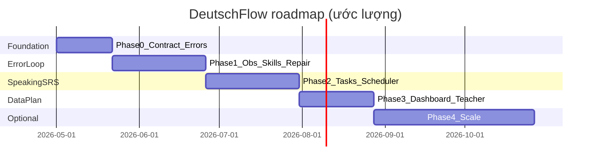
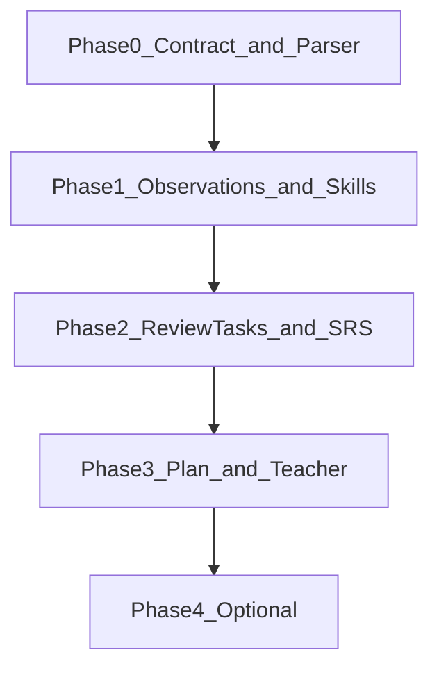

# Lộ trình triển khai — DeutschFlow

**Phiên bản:** 1.1  
**Ngày:** 2026-05-01  
**Ngôn ngữ:** Tiếng Việt  

---

## Liên kết với tài liệu khác

| Tài liệu | Vai trò |
|----------|---------|
| **[STRATEGY_DeutschFlow.md](STRATEGY_DeutschFlow.md)** | **Vì sao** cạnh tranh và **đi đâu** — định vị, USP, 3 trụ cột, đối thủ, KPI tổng thể, phụ lục taxonomy/prompt |
| **ROADMAP_DeutschFlow.md** (tài liệu này) | **Khi nào** triển khai và **đo lường** theo phase |
| **[SRS_DeutschFlow.md](SRS_DeutschFlow.md)** | **Hợp đồng kỹ thuật** — API, module, acceptance criteria; cập nhật khi thêm `errors[]`, DB drill, scheduler, **gói & quota AI** (§5.7 SRS 1.1+) |

Mỗi phase kết thúc bằng việc **đồng bộ SRS** (Module 8 Vocabulary, 9 Vocab Practice, 10 AI Speaking, và migration DB khi có).

---

## 0. Cách đọc roadmap

Mỗi phase gồm:

- **Goal** — kết quả kinh doanh/kỹ thuật mong muốn  
- **Deliverables** — phần việc cụ thể  
- **Acceptance** — điều kiện nghiệm thu  
- **KPI to monitor** — chỉ số theo dõi trong phase  
- **Competitive checkpoint** — “đã đủ mạnh để so với đối thủ nào”  

Thời gian giai đoạn là **ước lượng** (tuần làm việc); có thể song song FE/BE tuỳ đội.

---

## Timeline tổng quan

---

## Phase 0 — Foundation (khoảng 2–3 tuần)

### Goal

Chốt **hợp đồng dữ liệu** (`errors[]` + taxonomy) để mọi feature sau cùng một pipeline: AI → parse → lưu/log → UI.

### Deliverables

- AI output contract mở rộng: thêm `errors[]` với `errorCode`, `severity`, `confidence`, `wrongSpan`/`correctedSpan`, `rule_vi_short`, `example_correct_de` (theo [STRATEGY Phụ lục B](STRATEGY_DeutschFlow.md)).
- File taxonomy / catalog: ~25 `error_code` + nhãn tiếng Việt (theo STRATEGY Phụ lục A/C).
- Logging schema cho observations (có thể chỉ log structured JSON trước khi persist DB đầy đủ).
- Parser backend/FE: extractor JSON + retry repair prompt 1 lần + safe fallback.

### Acceptance

- ≥ **95%** lượt AI Speaking parse được payload có `errors` (mảng, có thể rỗng).
- Retry + fallback: ≥ **90%** session không để user thấy JSON thô / kẹt UI (đã có AC tương tự trong SRS Module 10).

### KPI to monitor

- `ai.speaking.errors_emitted_per_session` (trung bình / histogram — hoặc tổng từ `speaking.errors.emitted` Prometheus)  
- **`speaking.ai_parse`** theo tag `status`: tỉ lệ `structured` vs `fallback_parse_error` / `fallback_missing_ai_speech` (thay cho tên KPI cũ `ai.speaking.json_parse_fail`; đo trên Grafana/Prometheus scrape `/actuator/prometheus`)  

### Competitive checkpoint

Có thể demo **feedback có cấu trúc** cho stakeholder — chưa cần SRS đầy đủ.

---

## Phase 1 — Error Loop MVP (khoảng 4–6 tuần)

### Goal

Vòng lặp tối thiểu: sau khi nói, người học **thấy lỗi** và có thể **sửa ngay** (ít nhất dạng REWRITE).

### Deliverables

- Bảng `user_error_observations` + ghi từ AI Speaking (và tuỳ chọn Vocab Practice khi map được).
- Bảng `user_error_skills` aggregate cơ bản: count theo `error_code`, `last_seen`, `priority_score` đơn giản (severity × frequency).
- UI **Error Summary** sau session: top 2–3 lỗi + **Sửa ngay (2 phút)**.
- **Drill engine MVP:** chỉ REWRITE + `anchors_required` / fuzzy (theo STRATEGY Phụ lục D).
- **Error Library v1:** danh sách lỗi theo priority.

### Acceptance

- 100% session AI Speaking có **error summary** (kể cả `errors=[]`).
- ≥ **40%** session có user hoàn thành ≥ **1** repair task (baseline có thể điều chỉnh sau cohort đầu).

### KPI to monitor

- `error.repair.completed_rate`  
- `error.repair.correct_rate`  
- `time_to_first_repair_ms`  

### Competitive checkpoint

Chất lượng **feedback theo buổi** có thể **ngang** các app course-first (Babbel/Busuu) ở chiều “sửa lỗi có hệ thống”, dù chưa có SRS đầy đủ.

---

## Phase 2 — Speaking-SRS (khoảng 4–6 tuần)

### Goal

Lỗi được **lên lịch ôn**; không chỉ “thấy một lần rồi quên”.

### Deliverables

- Bảng `error_review_tasks` + scheduler: `next_review_at`, khoảng SRS 1 → 3 → 7 → 14 ngày (điều chỉnh được).
- Hai dạng task thêm: **CHOOSE_ORDER**, **SPEAK_SENTENCE** (STT + scoring như STRATEGY).
- **Daily review queue:** “Bạn có N lỗi đến hạn ôn”.
- Scoring engine v2: `order_constraints`, `anchors_forbidden`, Levenshtein theo độ dài.
- Thông báo in-app khi có lỗi đến hạn (optional push sau).

### Acceptance

- ≥ **60%** user active mở review queue ≥ **3** lần/tuần (baseline đo trong cohort beta).
- Sau **14 ngày**, cohort đo: giảm tần suất **top-3 error_code** ≥ **25%** (so với tuần 1).

### KPI to monitor

- `srs.review.due_completion_rate`  
- `error.recurrence.rate` (cùng code xuất hiện lại)  
- `speaking.accuracy.trend`  

### Competitive checkpoint

Vượt **Anki/Memrise** ở chiều **productive speaking** (đầu ra nói), không chỉ nhận diện thẻ.

---

## Phase 3 — Data-driven Learning Plan (khoảng 4 tuần)

### Goal

Dashboard và kế hoạch ngày **sinh từ dữ liệu** skills + history + teacher (nếu bật).

### Deliverables

- Dashboard **“Hôm nay học gì”** generate từ: due repairs + độ ưu tiên skills + lịch sử topic AI Speaking.
- AI Speaking: **topic suggestion** có chủ đích ôn `error_code` / pattern đang yếu.
- **Weekly progress report:** lỗi giảm / lỗi mới / gợi ý can-do.
- **Teacher view (B2B nhẹ):** error map theo lớp; speaking homework; báo cáo tổng hợp (theo scope SRS Module 11).
- **Outcome score:** % lượt không có error MAJOR+ (tuỳ định nghĩa).

### Acceptance

- ≥ **70%** user có “today plan” **khác nhau** giữa các ngày (đo entropy hoặc sampling manual QA).
- Luồng Teacher: tạo quiz/lớp → học viên làm speaking homework → báo cáo **end-to-end** (theo routes đã có trong repo + mở rộng nếu cần).

### KPI to monitor

- **D7 / D30** retention  
- **Weekly active speaking minutes** / user  
- **NPS** (student + teacher nếu có)  

### Competitive checkpoint

Cá nhân hoá lộ trình vượt **DW/Pimsleur** (không đua thư viện course); có **wedge B2B** mà nhiều app B2C không có.

---

## Phase 4 — Mở rộng (tuỳ chọn)

### Goal

Mở rộng moat và thị trường sau khi Phase 1–3 ổn định.

### Deliverables (chọn lựa)

- **Pronunciation scoring** (phoneme/CTC) thay cho chỉ khớp transcript — giảm false negative STT.
- **PWA hoặc native app** + nhắc nhở để giữ habit.
- **Marketplace deck** do giáo viên đóng góp (gắn error_code).
- **Mở rộng locale** (ví dụ EN UI market) — không thay đổi core “VN-first pedagogy” trong STRATEGY.

### Acceptance & KPI

Theo từng initiative con; gắn với KPI engagement/outcome trong STRATEGY §7.

---

## Phụ lục R1 — Phụ thuộc kỹ thuật giữa các phase

- Phase 1 **phụ thuộc** Phase 0 (schema `errors[]` ổn định).  
- Phase 2 **phụ thuộc** Phase 1 (có observations/skills để schedule).  
- Phase 3 **phụ thuộc** Phase 2 (có queue + trend đủ tin cậy để plan).

---

## Phụ lục R2 — Risk register

| Rủi ro | Mô tả | Giảm thiểu |
|--------|--------|------------|
| **AI provider** | Rate limit, đổi model, chi phí | Retry/backoff (đã có NFR); abstraction provider; cache prompt nhỏ |
| **STT chất lượng** | Sai transcript → chấm sai | Cho retry mic; confidence thấp → không trừ điểm; giới hạn anchors |
| **Taxonomy coverage** | Lỗi ngoài 25 code | Fallback `OTHER` + vẫn lưu text; periodic review để map tay |
| **Content debt** | Drill không đủ hay | Bắt đầu với REWRITE template + generate từ ví dụ AI |
| **Scope creep** | Đua course như DW | Anti-goals bên dưới |

---

## Phụ lục R3 — Anti-goals

**Không làm** (dù bị cám dỗ) trong giai đoạn 0–3:

- Không đua **thư viện bài học khổng lồ** kiểu Deutsche Welle — trừ khi đã có loop lỗi + SRS vững.
- Không xây **mạng xã hội** kiểu Tandem — chỉ tích hợp “chuẩn bị trước khi lên Tandem”.
- Không làm **từ điển toàn diện** kiểu Linguee — vocab đã có filter CEFR/tag là đủ cho wedge speaking.

---

*Tài liệu này định nghĩa lộ trình triển khai; khi thứ tự hoặc scope đổi, cập nhật phiên bản.*
