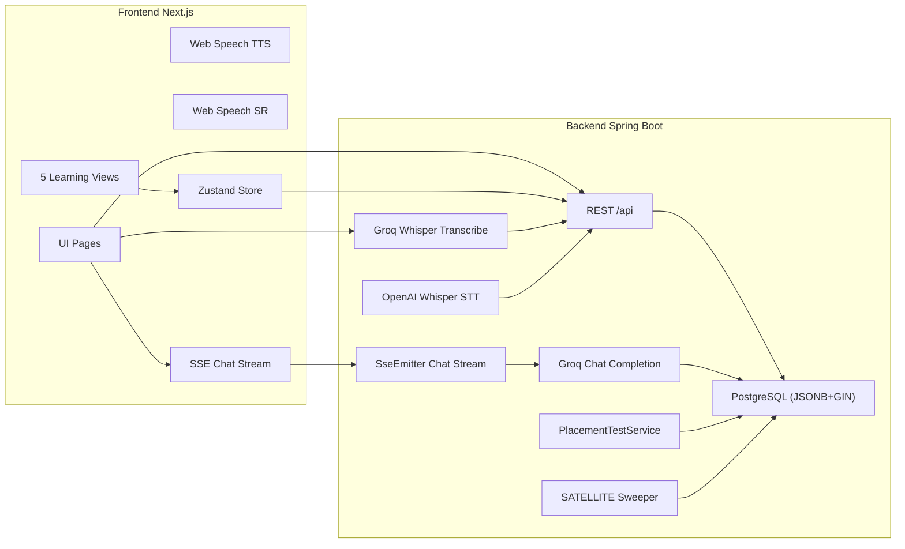

# SRS — DeutschFlow (Software Requirements Specification)

**Phiên bản:** 2.0  
**Ngày:** 2026-05-09  
**Ngôn ngữ:** Tiếng Việt  

**Changelog v2.0:** Triển khai **Unified Curriculum V2** — kiến trúc DAG Skill Tree toàn diện (A1-C2). (1) **Database Migration V66-V71**: Schema mới với `module_number`, `tags TEXT[]`, `satellite_status`, GIN indexes trên JSONB; 35 nodes (10 full content, 25 skeleton); bảng `placement_questions` + `placement_test_sessions`. (2) **All-in-One Content API**: `GET /api/skill-tree/node/{nodeId}/session` trả ~30KB JSONB → Gzip ~5KB, zero-latency tab switching qua Zustand store. (3) **5 Unified Learning Views**: GrammarView (color-coded DER🔵/DIE🔴/DAS🟢 + tag filter), ReadingView (split-screen tap-to-translate), ListeningView (karaoke sync + fill-blank), SpeakingView (Web Audio waveform + Groq LLM pronunciation eval), WritingView (debounced 2s AI correction). (4) **Placement Test**: 10 câu hỏi Goethe-chuẩn 4 kỹ năng (Hören/Sprechen/Lesen/Schreiben), pass ≥ 7/10, retry sau 3 ngày đề khác. (5) **Onboarding V2**: 4 bước (chọn trình độ → mục tiêu/ngành → weekly target → placement test hoặc bắt đầu từ A0). (6) **WhisperApiClient**: Java-native OpenAI Whisper STT (loại bỏ Python sidecar), word-level timestamps. (7) **SATELLITE**: Orphan sweeper @Scheduled 15 phút, GENERATING > 10min → FAILED. (8) **Pronunciation Eval**: Groq LLM đánh giá phát âm (không dùng Levenshtein — chống anti-pattern Whisper auto-correct). (9) **Writing Correction**: Groq LLM sửa bài viết với phân loại lỗi (grammar/spelling/style).

**Changelog v1.9:** Triển khai **Automated Error Remediation Flow** và **Learning Roadmap Data Fixes**. (1) **Error Remediation Flow**: Xoá bỏ thao tác thủ công (nút "Đã nhớ"), thay bằng cơ chế tự động ghi nhận trạng thái `RESOLVED` sau khi hoàn thành drill sửa lỗi; (2) **Regression Detection**: Tự động mở lại lỗi (re-open) nếu tái phạm sau 7 ngày (không tính là lỗi mới để giữ lịch sử); (3) **Student Error UI**: Refactor màn hình lỗi thành 2 khu vực rõ rệt "Lỗi đang mở" (Open) và "Đã khắc phục" (Resolved), bổ sung administrative visibility. (4) **Roadmap Data Fixes**: Sửa lỗi seeding dữ liệu giáo trình A1 và đảm bảo endpoint `/api/skill-tree/me` trả về đúng personalized student roadmap.

**Changelog v1.8:** Triển khai **System Stability & Admin Data Management**. (1) **Backend Connection Pool Hardening**: Cấu hình HikariCP (5s timeout, 30s max-lifetime), refactor LLM integration (SkillTree & Interview) sang non-blocking transactions, thiết lập memory limits chống OOM. (2) **Admin Profile Management & Data Integrity**: Bắt buộc đăng ký số điện thoại VN (có uniqueness validation) và bổ sung tính năng Admin cập nhật thông tin học tập của học viên (Student Learning Profile). (3) **Frontend Build Optimization**: Sửa lỗi TypeScript block-scoped variables, sửa ReactNode type definitions trong admin modals, dọn dẹp các file rác/duplicate pages, tối ưu hoá AWS Amplify build caching.

**Changelog v1.7:** Mở rộng Curriculum Phase 2 và Nâng cấp AI Speaking. (1) **Curriculum Phase 2**: Áp dụng DAG-based skill tree (Days 15-28), mở rộng các node ngữ pháp (Modalverben, Akkusativ, Trennbare Verben). (2) **Template & Context Injection**: Tự động sinh nội dung học cá nhân hoá theo ngành nghề của user (IT, Medicine, Education) dựa trên `UserLearningProfile`. (3) **AI Speaking Enhancements**: Tích hợp giọng đọc nhân bản từ ElevenLabs cho 4 Personas; thêm Character profile images trên UI chọn Persona. (4) **AI Error Remediation & Evaluator Cooldown**: Cải thiện logic bắt lỗi, ngăn chặn over-correction; `TurnEvaluator` lưu lại các mã cooldown (như `CASE.PREP_DAT_MIT`) vào `SpeakingUserState` để giới hạn tần suất đánh giá một lỗi trong phiên hội thoại.

**Changelog v1.6:** Triển khai **Production Stabilization & Brand Identity**. (1) **Hệ thống Logo Bauhaus** — Component `DeutschFlowLogo` 3 biến thể (`horizontal` / `vertical` / `icon-only`); `DeutschFlowLoader` thay thế Loader2 spinner; `DeutschFlowSplash` màn hình intro; áp dụng toàn bộ: Login, Register, Landing page, StudentShell sidebar, AdminShell sidebar, Dashboard loading state. (2) **Logout tập trung** — Hàm `logout()` trong `authSession.ts`: gọi `POST /api/auth/logout` revoke refresh token trên server, xóa toàn bộ localStorage (không chỉ 2 key token), xóa cookies, hard redirect `window.location.href` thay `router.push` để wipe React state — ngăn state của user cũ rò rỉ sang session kế tiếp; fix 6 page có `onLogout={() => {}}` (no-op) và 13+ page dùng `clearTokens() + router.push()`. (3) **HikariCP Keepalive** — Thêm `keepalive-time: 120s` và `connection-test-query: SELECT 1` vào `application.yml`; ngăn stale connection khi AWS NLB cắt TCP idle sau 350 giây — loại bỏ lỗi "Connection is not available, request timed out after 20000ms" sau khi hệ thống idle ban đêm. (4) **Production Deployment** — AWS Amplify (Frontend, CI/CD auto-deploy từ branch `main`), AWS EC2 t2.micro (Backend Docker), AWS RDS PostgreSQL (Database), Cloudflare Flexible SSL, Nginx reverse proxy port 80→8080; domain `https://mydeutschflow.com` và `http://api.mydeutschflow.com`.


**Changelog v1.4:** Triển khai toàn bộ Architectural Remediation Plan — (1) **Production Cache Layer**: Caffeine 6 caches mới (`aiVocabCache` 24h, `ttsAudio` 24h, `aiVocabShort` 6h, `aiVocabQuiz` 1h, `achievements` 60min, `weeklyPrompts` 30min); `@Cacheable` cho `AIVocabularyService` (7 methods) + `ElevenLabsTtsService`; admin purge endpoint `POST /api/admin/cache/purge`; (2) **XP Leaderboard**: `GET /api/xp/leaderboard?limit=N`, `LeaderboardDto`, JPQL GROUP BY query trên `UserXpEvent`; (3) **AI Vocab security**: `@PreAuthorize("isAuthenticated()")` cho `AIVocabularyController`; (4) **Frontend FE-BE Gap Resolution**: 4 API adapters (`vocabAiApi.ts`, `reviewApi.ts`, `xpApi.ts`, `aiToolsApi.ts`); 6 màn hình mới (VocabAI Panel §23, Review Queue §24, Vocab Analytics §25, XP Leaderboard §26, Quick AI Toolbar §27, Error Drill rewired); `StudentShell` +3 nav items; (5) §22 cập nhật "Đã triển khai" và bổ sung §23-27.

**Changelog v1.3:** Bổ sung module Onboarding Wizard 4 bước (§6); ElevenLabs TTS + Persona Voice Mapping (§10.9); Module Lego Game (§19); Module Swipe Cards (§20); Module Groq Usage Tracking UI (§21); cập nhật bảng phạm vi (scope); thêm `hideSidebar` cho `StudentShell`; cập nhật kiến trúc TTS cascade (ElevenLabs API → Browser Web Speech); bổ sung §22 Đề xuất cải tiến kỹ thuật (cache, async AI, startup isolation); chỉnh sửa format Mục lục.  

**Changelog v1.2:** Đồng bộ với codebase — PostgreSQL làm DB chính (Flyway, Testcontainers); bổ sung Today/adaptive API, Error Review Tasks, hàng chờ ôn SRS (`/api/reviews`), thông báo + SSE, admin export training dataset & weekly speaking prompts; curriculum Netzwerk A1; Ability score API; chỉnh mô tả AI Speaking (chat blocking, danh sách session, kết thúc session); sửa mục HTTP lỗi parse AI (fallback, không ép 502).  

---

## Mục lục

1. Giới thiệu & phạm vi  
2. Thuật ngữ & viết tắt  
3. Yêu cầu phi chức năng chung (NFR)  
4. Kiến trúc & luồng dữ liệu (high-level)  
5. Module AUTH & phân quyền (kèm 5.7 gói & quota AI)  
6. Module ONBOARDING Wizard & UserLearningProfile  
7. Module LEARNING PLAN & Dashboard học viên  
8. Module VOCABULARY (tra cứu, filter, admin)  
9. Module VOCAB PRACTICE (nghe & nói theo chủ đề)  
10. Module AI SPEAKING (SSE streaming, STT, TTS, persistence)  
11. Module QUIZ & TEACHER  
12. Module ADMIN OPS (batch jobs, auto-tagging, audit)  
13. Chuẩn lỗi (Error handling spec)  
14. Metrics, logging & observability  
15. Kế hoạch kiểm thử (Test plan)  
16. Tiêu chí nghiệm thu (Acceptance criteria)  
17. Phụ lục — Xuất sang Word (.docx)  
18. Bổ sung theo trạng thái codebase — API & dữ liệu mới (v1.2)  
19. Module LEGO GAME (Gamification) *(v1.3)*  
20. Module SWIPE CARDS (Vocab Flashcard Swipe) *(v1.3)*  
21. Module GROQ USAGE TRACKING UI *(v1.3)*  
22. Cải tiến kỹ thuật — Trạng thái & bổ sung *(v1.3 → v1.4)*  
23. Module AI VOCABULARY INSIGHTS (VocabAI Panel) *(v1.4)*  
24. Module REVIEW QUEUE (Spaced Repetition Flashcards) *(v1.4)*  
25. Module VOCAB ANALYTICS Dashboard *(v1.4)*  
26. Module XP LEADERBOARD *(v1.4)*  
27. Module QUICK AI TOOLBAR *(v1.4)*  
28. Production Deployment & Infrastructure *(v1.6)*  
29. Brand Identity & Logo System *(v1.6)*  
30. Auth & Session Management — Logout Flow *(v1.6)*  
31. Curriculum Phase 2 & DAG Skill Tree *(v1.7)*
32. System Stability & Admin Data Management *(v1.8)*
33. Automated Error Remediation Flow & Roadmap Fixes *(v1.9)*
34. Unified Curriculum V2 & Learning Views *(v2.0)*
35. Onboarding V2 & Placement Test *(v2.0)*

---


## 1. Giới thiệu & phạm vi

### 1.1 Mục tiêu sản phẩm

DeutschFlow là nền tảng học tiếng Đức (CEFR) kết hợp:

- Lộ trình học cá nhân hoá (dashboard + session/plan).
- Từ vựng tra cứu theo CEFR và **chủ đề (tags)**; quản trị chất lượng dữ liệu ở Admin.
- **Luyện nói từ vựng**: nghe (TTS) + nói (SpeechRecognition) + feedback.
- **Luyện nói AI**: hội thoại streaming (SSE), nhận diện giọng (STT qua Groq Whisper), phản hồi có sửa lỗi + giải thích + lưu điểm yếu ngữ pháp.
- Quiz/lớp học cho Teacher + báo cáo.

### 1.2 Phạm vi (Scope)

**Trong phạm vi hiện tại**

| Khu vực | Mô tả |
|--------|--------|
| Tài khoản | Đăng ký/đăng nhập, JWT, refresh token (theo implement repo), phân quyền Student/Teacher/Admin |
| **Onboarding Wizard** *(v1.3)* | 4-step wizard (Mục tiêu → Mentor → Bản thân → Xác nhận); dark immersive UI; redirect bắt buộc sau đăng ký |
| Learning plan | Dashboard học viên, tuần/buổi học, tiến độ |
| Vocabulary | API list words + tags; filter CEFR/tag/loại/giống; i18n UTF-8 |
| Vocab practice | Flashcard + TTS + SR + tổng kết |
| AI Speaking | Session (Hội thoại & Phỏng vấn); SSE chat stream; STT; Phỏng vấn 5 phase + bản đánh giá AI (Interview Report); lưu messages + grammar errors |
| **Persona System** *(v1.3)* | 4 personas (Lukas, Emma, Anna, Klaus) với brand colors, voice IDs, system prompt builder (mở rộng role theo ngành nghề khi Phỏng vấn) |
| **ElevenLabs TTS** *(v1.3)* | Cascade: ElevenLabs API → Browser Web Speech fallback; voice mapping theo persona |
| Teacher/Quiz | Lớp học, quiz, join, báo cáo (theo routes đã có trong repo) |
| Admin | Enrich/import/reset; auto-tag taxonomy; audit; gán/ghi nhận gói & quota (theo policy BE); **weekly speaking prompts**; **export training dataset** (JSONL) |
| **Gói & hạn mức AI** | Bảng `subscription_plans` / `user_subscriptions`; quota token theo **lịch ngày Asia/Ho_Chi_Minh**; ví token lăn cho gói trả phí; ledger `ai_token_usage_events`; API `GET /api/auth/me/plan` |
| **Today / Adaptive** | `GET /api/today/me`: gợi ý buổi học trong ngày (due repair tasks, chủ đề/Cefr adaptive, streak) |
| **Error Review Tasks** | Nhiệm vụ ôn lỗi lên lịch: `GET /api/review-tasks/me/today`, `POST /api/review-tasks/{id}/complete` |
| **Ôn tập SRS (learn plan)** | Hàng chờ ôn vocab/grammar của lộ trình (khác Error Review Tasks): `GET /api/reviews/due`, `POST /api/reviews/{id}/grade` |
| **Notifications** | In-app notifications + SSE real-time (`/api/notifications`, stream), rate-limit poll/stream |
| **Curriculum / tiện ích** | Dữ liệu khung giáo trình chỉ đọc: ví dụ `GET /api/curriculum/netzwerk-neu/a1`; `POST /api/ability/score` (endpoint tính điểm năng lực server-side nếu client gọi) |
| **ai-server (Python)** | Repo có `ai-server/` (FastAPI) cho thử Llama cục bộ / `generate`; **không** bắt buộc cho luồng production Groq của AI Speaking trong README chính |
| **Lego Game** *(v1.3)* | Mini-game kéo-thả khối từ vựng xây câu tiếng Đức; `/student/game` |
| **Swipe Cards** *(v1.3)* | Ôn từ vựng kiểu swipe (Biết / Chưa biết); `/student/swipe-cards` |
| **Groq Usage** *(v1.3)* | UI theo dõi token AI đã dùng / quota còn lại; `/student/groq-usage` |
| **Production Cache Layer** *(v1.4)* | Caffeine 6 named caches: `aiVocabCache` 24h, `ttsAudio` 24h, `aiVocabShort` 6h, `aiVocabQuiz` 1h, `achievements` 60min, `weeklyPrompts` 30min; `@Cacheable` trên `AIVocabularyService` + `ElevenLabsTtsService`; admin purge `POST /api/admin/cache/purge` |
| **AI Vocabulary Insights** *(v1.4)* | Panel 6 tabs trong Vocab Detail Modal: Ví dụ · Cách nhớ · Từ tương tự · Câu chuyện · Nguồn gốc · Mini Quiz; lazy load; `POST /api/vocabulary/ai/*` (auth required) |
| **Review Queue** *(v1.4)* | Flashcard SM-2 spaced repetition: `GET /api/reviews/due`, `POST /api/reviews/{id}/grade`; 5 quality buttons; `/student/review-queue` |
| **Vocab Analytics** *(v1.4)* | SVG charts: độ phủ từ theo CEFR + lịch sử; `GET /api/words/coverage`, `GET /api/words/coverage/history`; `/student/vocab-analytics` |
| **XP Leaderboard** *(v1.4)* | Top 20 users theo XP; `GET /api/xp/leaderboard?limit=N`; medals top 3; highlight user hiện tại; `/student/leaderboard` |
| **Quick AI Toolbar** *(v1.4)* | Floating toolbar 4 tools: DE→EN, EN→DE, sửa ngữ pháp, giải thích; `POST /api/ai/translate/*`, `/api/ai/grammar/*`; Ctrl+Enter hotkey |
| **DeutschFlow Logo System** *(v1.6)* | Component `DeutschFlowLogo` Bauhaus-inspired: `horizontal` (sidebar + auth), `vertical` (splash), `icon-only` (loader); `DeutschFlowLoader` (icon spin); `DeutschFlowSplash` (full-page intro); áp dụng toàn bộ: Login, Register, Landing, StudentShell, AdminShell, Dashboard |
| **Production Deployment** *(v1.6)* | AWS Amplify (FE CI/CD), AWS EC2 t2.micro + Docker (BE), AWS RDS PostgreSQL 18.3, Cloudflare Flexible SSL, Nginx port 80→8080; domain `mydeutschflow.com` / `api.mydeutschflow.com` |
| **Logout Flow** *(v1.6)* | `logout()` centralized: revoke refresh token server-side (`POST /api/auth/logout`), xóa toàn bộ localStorage, xóa cookies, hard redirect; fix no-op handlers trên 6 page; ngăn state bleed giữa các session |
| **System Stability & Admin** *(v1.8)* | Bắt buộc SĐT VN khi đăng ký; Admin cập nhật UserLearningProfile; HikariCP Connection Pool hardening (5s timeout, non-blocking LLM); Tối ưu hoá AWS Amplify build cache & TS types |
| **Unified Curriculum V2** *(v2.0)* | DAG Skill Tree 35 nodes (A1→C2); V66-V71 migrations; JSONB + GIN indexes + TEXT[] arrays; All-in-one content API (~30KB Gzip ~5KB); Zustand `useNodeSessionStore` zero-latency tab switching; 5 Learning Views (Grammar + Reading + Listening + Speaking + Writing); Orphan Sweeper @Scheduled 15min; Pronunciation eval (Groq LLM); Writing correction (Groq LLM) |
| **Onboarding V2 + Placement Test** *(v2.0)* | 4-step onboarding (level → goal/industry → weekly target → placement test); Placement Test 10 câu 4 kỹ năng Goethe (Hören/Sprechen/Lesen/Schreiben); Pass ≥ 7/10 → nhảy level; Fail → retry 3 ngày đề khác; Weekly target ảnh hưởng unlock cá nhân hóa |
| **WhisperApiClient** *(v2.0)* | Java-native OpenAI Whisper STT (loại bỏ Python dependency); Word-level timestamps cho karaoke sync; `transcribeText()` cho pronunciation eval; Config `${OPENAI_API_KEY}` |


**Ngoài phạm vi (hiện tại)**

- **Cổng thanh toán** (Stripe, MoMo, v.v.) — chưa tích hợp; gói có thể gán thủ công / migration / admin.
- Ứng dụng native iOS/Android.
- Offline-first đầy đủ.

### 1.3 Giả định & ràng buộc

- UTF-8 end-to-end (UI, API JSON, PostgreSQL UTF-8 / `JSONB` nơi có cấu trúc).
- Khóa API AI (Groq) được cấu hình qua biến môi trường, không commit vào git.
- Trình duyệt cho SpeechRecognition có khác nhau (Chrome ổn định hơn Safari).

---

## 2. Thuật ngữ & viết tắt

| Thuật ngữ | Ý nghĩa |
|----------|---------|
| CEFR | Khung trình độ ngôn ngữ châu Âu (A1…C2) |
| Tag / chủ đề | Phân loại chủ đề; canonical **tiếng Đức** trong DB (`tags.name`); UI có `localizedLabel` |
| TTS | Text-to-Speech (Web Speech API phía client) |
| STT | Speech-to-Text (Groq Whisper API phía server cho AI Speaking; Web Speech API cho vocab practice) |
| SSE | Server-Sent Events (streaming token) |

---

## 3. Yêu cầu phi chức năng chung (NFR)

### 3.1 Hiệu năng

- API list words phân trang; `size` tối đa theo backend (thường 100).
- Streaming SSE: không block UI; có abort/cancel.

### 3.2 Bảo mật

- JWT cho API protected.
- Không log secret keys / token đầy đủ.
- SSE/async dispatch: security filter không được làm “đơ” luồng async (đã xử lý bằng cấu hình security cho async dispatcher).

### 3.3 Độ tin cậy AI

- Retry/backoff khi provider trả 429/5xx (ở client Groq).
- Parser JSON robust khi model trả text lẫn JSON.

### 3.4 i18n / UTF-8

- UI theo locale người chọn (next-intl).
- Tags: filter bằng `name` tiếng Đức; hiển thị bằng `localizedLabel` theo locale.

---

## 4. Kiến trúc & luồng dữ liệu (high-level)



---

## 5. Module AUTH & phân quyền

### 5.1 Mục tiêu

Xác thực người dùng và áp quyền theo role cho route FE và API BE.

### 5.2 Functional requirements

- **FR-AUTH-001**: Đăng nhập thành công nhận JWT access token.
- **FR-AUTH-002**: Endpoint `/api/auth/me` trả `role`, `locale`.
- **FR-AUTH-003**: Student chỉ truy cập `/student/*`; Teacher `/teacher/*`; Admin `/admin/*` (theo middleware/route guard).

### 5.3 Data contract (ví dụ)

`GET /api/auth/me`

```json
{
  "id": 1,
  "email": "student@example.com",
  "role": "STUDENT",
  "locale": "vi"
}
```

### 5.4 Error handling

| HTTP | Ý nghĩa |
|------|---------|
| 401 | Sai token / hết hạn |
| 403 | Sai role |

### 5.5 Test plan

- Integration: gọi API protected không token → 401.
- E2E: login → vào dashboard đúng role.

### 5.6 Metrics

- `auth.login.success`, `auth.login.fail`
- `security.http_403.count{endpoint}`

### 5.7 Gói đăng ký & hạn mức token AI (subscription + quota)

**Mục tiêu:** Kiểm soát chi phí LLM; phân tầng người dùng; hiển thị “plan” trên client mà không cần cổng thanh toán.

**Dữ liệu (PostgreSQL + Flyway)**

- `subscription_plans`: `code`, `monthly_token_limit` (di sản), `daily_token_grant`, `wallet_cap_days`, `features_json`, `is_active`.
- `user_subscriptions`: đăng ký theo user, `plan_code`, `status` (`ACTIVE`/`ENDED`), `starts_at`, `ends_at`, tùy chọn `monthly_token_limit_override` (BE map sang grant hằng ngày khi join).
- `user_ai_token_wallets`: số dư token **lăn** cho gói ví (PRO / ULTRA; mã `PREMIUM` được xử lý cùng nhóm ví trong code nếu có bản ghi).
- `ai_token_usage_events`: ghi nhận `total_tokens` theo lượt gọi AI (phục vụ quota “đã dùng trong ngày” theo VN).

**Mã gói (seed / thực tế repo)**

| `plan_code` | Vai trò tóm tắt |
|-------------|-----------------|
| `DEFAULT` | Không hạn mức AI (0 grant) khi user không còn gói khác — user mới được reconcile sang subscription hoạt động. |
| `FREE` | Hạn mức **theo ngày lịch VN** (`daily_token_grant`); trial FREE có thể có `ends_at` (+7 ngày, xem migration). |
| `PRO` | Grant hằng ngày + **ví lăn** tối đa `wallet_cap_days` × daily (ví dụ 30 ngày). |
| `ULTRA` | Tương tự PRO với grant/ví cao hơn. |
| `INTERNAL` | Không trừ quota (vô hạn hiệu dụng) — dùng nội bộ. |

**Luật nghiệp vụ (rút gọn, đúng với `QuotaService`)**

- “Ngày” usage và accrual ví dùng **Asia/Ho_Chi_Minh** (`QuotaVnCalendar`).
- Trước khi gọi AI: `assertAllowed` so sánh hạn mức còn lại với ước lượng tối thiểu; vượt → **HTTP 429** (`QuotaExceededException`, Problem Details).
- Sau khi gọi AI: `AiUsageLedgerService` ghi event; với gói ví, `applyUsageDebit` trừ `user_ai_token_wallets.balance`; hết ví → kết thúc gói trả phí và quay về DEFAULT (theo implement).

**API**

- `GET /api/auth/me/plan` → `{ "planCode": "FREE", "tier": "BASIC", "startsAtUtc": "2026-05-01T12:34:56Z", "endsAtUtc": null }` — `tier` là `PREMIUM`/`ULTRA` tuỳ gói; `endsAtUtc` null khi không có ngày kết thúc (mở).

**Test**

- Integration: `AuthMePlanIntegrationTest`, `QuotaBillingIntegrationTest`.

---

## 6. Module ONBOARDING Wizard & UserLearningProfile

### 6.1 Mục tiêu

Thu thập profile để cá nhân hoá nội dung, **system prompt AI**, giao diện, và làm cơ sở cho **Template & Context Injection** (sinh nội dung bài tập theo ngữ cảnh ngành nghề của người học). Onboarding là luồng bắt buộc cho user mới sau đăng ký.

### 6.2 Onboarding Wizard (Frontend — v1.3)

Route: `/onboarding` (route group `(auth)`, standalone — không dùng `StudentShell`).

**Thiết kế**: Dark immersive UI, Framer Motion `AnimatePresence` slide/fade transitions, ambient orb phát sáng theo màu Persona được chọn.

| Bước | Nội dung | Dữ liệu thu thập |
|------|----------|-------------------|
| **Step 1** — Mục tiêu | Cards: "Đi làm / Công việc" hoặc "Thi chứng chỉ" (Lucide icons) | `goalType: WORK \| CERT` |
| **Step 2** — Chọn Mentor | Grid 4 persona (Lukas, Emma, Anna, Klaus) với floating animation, avatar, brand color | `persona: LUKAS \| EMMA \| ANNA \| KLAUS` |
| **Step 3** — Bản thân | Input ngành nghề + toggleable interest tags | `industry: string`, `interests: string[]` |
| **Step 4** — Xác nhận | Summary card + nút "Bắt đầu học" | — (submit) |

**Dynamic styling**: Nút "Tiếp tục", progress bar, và ambient background tự động đổi màu theo Persona đã chọn ở Step 2 (ví dụ: Klaus = Đỏ `#F87171`, Lukas = Cyan `#22D3EE`).

**Redirect flow**: `Register → /onboarding → (PATCH /api/auth/me) → /dashboard`

### 6.3 Functional requirements

- **FR-PROF-001**: Lưu `targetLevel`, `industry`, `interestsJson`, `locale`.
- **FR-PROF-002**: AI Speaking dùng profile + weak points để prompt.
- **FR-PROF-003** *(v1.3)*: Sau đăng ký, user STUDENT được redirect sang `/onboarding` thay vì `/dashboard`.
- **FR-PROF-004** *(v1.3)*: Wizard hoàn thành gọi `PATCH /api/auth/me` để đồng bộ dữ liệu về backend.

### 6.4 Error handling

- Validation fail → 400.
- Profile chưa có → tạo default (theo policy backend).
- API lỗi khi submit Wizard → silent catch, redirect `/dashboard` (non-blocking).

### 6.5 Test plan

- Unit: merge interests không trùng.
- Integration: onboarding submit → DB có profile.
- E2E: register → wizard 4 bước → dashboard.

### 6.6 Metrics

- `onboarding.completed`
- `onboarding.step_reached{step=1|2|3|4}` *(v1.3)*
- `profile.updated`

---


## 7. Module LEARNING PLAN & Dashboard học viên

### 7.1 Mục tiêu

Hiển thị lộ trình, buổi học, tiến độ; submit session/exercise.

### 7.2 Functional requirements

- **FR-PLAN-001**: Load plan theo tuần/buổi.
- **FR-PLAN-002**: Submit session cập nhật progress.

### 7.3 Error handling

- Session không tồn tại → 404.
- Submit trùng / conflict → 409 hoặc idempotent.

### 7.4 Test plan

- Integration: submit → progress thay đổi.
- E2E: student đi hết một buổi.

### 7.5 Metrics

- `plan.session.started`, `plan.session.completed`
- `plan.submit.latency_ms`

### 7.6 API Today (Adaptive Policy)

**Mục tiêu:** Tổng hợp “hôm nay nên làm gì” dựa trên streak, profile, **due error review tasks** và **SpeakingPolicy** adaptive (focus error codes, gợi ý topic/CEFR, link gợi ý vào Speaking & Vocab practice).

**API**

- **`GET /api/today/me`** (authenticated student): response `TodayPlanDto` — gồm danh sách repair due (rút từ cùng nguồn với review tasks), gợi ý học Speaking/Vocab có query string topic/CEFR, tiến độ/tóm tắt (rolling accuracy, knob, … theo BE).

---

## 8. Module VOCABULARY (tra cứu, filter, admin)

### 8.1 Mục tiêu

Tra cứu từ vựng phong phú (IPA, ví dụ, giống DER/DIE/DAS…) và lọc theo CEFR + chủ đề.

### 8.2 API contracts

#### `GET /api/words`

Query: `cefr`, `q`, `tag`, `dtype`, `gender`, `locale`, `page`, `size`

Response (rút gọn):

```json
{
  "items": [
    {
      "id": 123,
      "dtype": "Noun",
      "baseForm": "Tisch",
      "cefrLevel": "A1",
      "meaning": "cái bàn",
      "tags": ["Alltag", "Wohnen"]
    }
  ],
  "page": 0,
  "size": 25,
  "total": 10000
}
```

#### `GET /api/tags?locale=vi|en|de`

```json
[
  {
    "id": 1,
    "name": "Reise",
    "color": "#a78bfa",
    "localizedLabel": "Du lịch"
  }
]
```

**Quy ước**

- `name`: canonical tiếng Đức — dùng cho `GET /api/words?tag=Reise`.
- `localizedLabel`: nhãn hiển thị theo locale UI.

### 8.3 Admin filter theo tag

Admin vocabulary page truyền `tag=<canonicalName>` cùng `locale=<uiLocale>` để không lẫn VI/EN.

### 8.4 Error handling

- Param không hợp lệ (`dtype`, `gender`, `cefr`) → 400.

### 8.5 Test plan

- Integration:
  - `/api/tags?locale=en` → label tiếng Anh.
  - `/api/words?tag=Beruf&locale=vi` → chỉ từ có tag đó.

### 8.6 Metrics

- `vocab.words.requests`, `vocab.words.latency_ms`
- `vocab.tags.requests`

---

## 9. Module VOCAB PRACTICE (nghe & nói theo chủ đề)

### 9.1 User stories

- Là học viên, tôi chọn **CEFR + chủ đề** để luyện phát âm.
- Tôi nghe TTS, sau đó nói lại và nhận đúng/sai + ôn lại từ sai.

### 9.2 Functional requirements

- **FR-VP-001**: Load words qua `/api/words` với `tag` + `cefr`.
- **FR-VP-002**: TTS phát âm (article + lemma nếu có).
- **FR-VP-003**: SR nhận transcript (de-DE).
- **FR-VP-004**: So khớp transcript vs target (normalize + fuzzy).

### 9.3 Logic chấm điểm (spec)

- Chuẩn hoá: lowercase, loại article phổ biến, bỏ ký tự không chữ.
- Fuzzy: Levenshtein ngưỡng theo độ dài từ.

### 9.4 Error handling

- Browser không hỗ trợ SpeechRecognition → thông báo + vẫn cho nghe.
- Mic denied → hướng dẫn cấp quyền.

### 9.5 Test plan

- Unit FE: `normalize`, `levenshtein`, `isAccepted`.
- Manual QA: Chrome; kiểm tra skip/next/summary.

### 9.6 Metrics (client)

- `vp.start`, `vp.correct`, `vp.wrong`
- `vp.speech_unsupported`, `vp.mic_denied`

---

## 10. Module AI SPEAKING (SSE streaming, STT, TTS, persistence)

### 10.1 User stories

- Tạo session mới khi bắt đầu (không lẫn ngữ cảnh hôm trước).
- Chat streaming hiển thị text trước; phát TTS song song.
- Ghi âm → transcript → gửi chat stream.

### 10.2 API contracts (khái quát)

#### `POST /api/ai-speaking/sessions`

```json
{ 
  "topic": "Reise", 
  "cefrLevel": "B1", 
  "persona": "EMMA", 
  "sessionMode": "INTERVIEW",
  "interviewPosition": "Software Engineer",
  "experienceLevel": "1-2Y",
  "responseSchema": "V1" 
}
```

- `sessionMode` (optional): `COMMUNICATION` (mặc định) hoặc `INTERVIEW`. 
- `persona` (optional): `DEFAULT` | `LUKAS` | `EMMA` | `KLAUS` — giọng/kịch bản tutor (Module 10). Bỏ qua hoặc giá trị lạ → `DEFAULT`.
- `interviewPosition` (optional): Vị trí ứng tuyển (vd: Frontend Developer). Bắt buộc nếu là INTERVIEW mode.
- `experienceLevel` (optional): `0-6M`, `6-12M`, `1-2Y`, `3Y`, `5Y`. Dùng để điều chỉnh độ khó và bộ đếm thời gian gợi ý (Smart Suggestion Timer: 70s cho junior, 10s cho senior).
- `responseSchema` (optional): `V1` | `V2` — song song hai contract JSON (`V1` = tutor đầy đủ; `V2` = compact `content` / `translation` / `feedback` / `action`). Bỏ qua → `V1`.

#### `POST /api/ai-speaking/sessions/{id}/chat`

Chat **đồng bộ** (không stream); response `AiSpeakingChatResponse` (một lần).

#### `POST /api/ai-speaking/sessions/{id}/chat/stream`

Request:

```json
{ "userMessage": "Ich mag Pizza." }
```

SSE events:

- `token`: delta (ghost text)
- `done`: payload đã parse metadata
- `error`: lỗi

#### `GET /api/ai-speaking/sessions`

Danh sách session của user (phân trang `Pageable`).

#### `GET /api/ai-speaking/sessions/{id}/messages`

Lịch sử tin nhắn trong session.

#### `PATCH /api/ai-speaking/sessions/{id}/end`

Kết thúc session; cập nhật trạng thái (`ENDED`).
Đặc biệt, nếu session là `INTERVIEW`, backend sẽ gọi LLM (1200 token limit) sinh ra bản đánh giá (Interview Evaluation Report) và lưu vào `interview_report_json`. Response của API này sẽ chứa field `interviewReportJson`.

#### `POST /api/ai-speaking/transcribe`

Multipart `audio` → `{ "transcript": "..." }`

### 10.3 JSON schema AI (canonical contract)

Model phải trả **JSON thuần** (không markdown). Schema:

```json
{
  "ai_speech_de": "string",
  "correction": "string|null",
  "explanation_vi": "string|null",
  "grammar_point": "string|null",
  "errors": [
    {
      "error_code": "string",
      "severity": "string",
      "confidence": 0.0,
      "wrong_span": "string|null",
      "corrected_span": "string|null",
      "rule_vi_short": "string|null",
      "example_correct_de": "string|null"
    }
  ],
  "learning_status": {
    "new_word": "string|null",
    "user_interest_detected": "string|null"
  }
}
```

**Quy tắc**

- `ai_speech_de`: luôn có; 100% tiếng Đức.
- `explanation_vi`: chỉ tiếng Việt (giải thích lỗi), có thể null.
- Nếu không lỗi: `correction`, `explanation_vi`, `grammar_point` = null và **`errors` = []**.
- `errors`: mảng các lỗi có cấu trúc; `error_code` thuộc **whitelist** cố định phía backend (`ErrorCatalog`, MVP ~25 mã). Giá trị không hợp lệ bị loại bỏ (không làm fail toàn payload). `confidence` ∈ [0, 1].

#### Mapping sang UI/DTO (done event)

Frontend nhận camelCase (theo client types), ví dụ:

```json
{
  "messageId": 1001,
  "sessionId": 999,
  "aiSpeechDe": "...",
  "correction": null,
  "explanationVi": null,
  "grammarPoint": null,
  "errors": [
    {
      "errorCode": "VERB_AUX_ORDER",
      "severity": "medium",
      "confidence": 0.82,
      "wrongSpan": "...",
      "correctedSpan": "...",
      "ruleViShort": "...",
      "exampleCorrectDe": "..."
    }
  ],
  "learningStatus": {
    "newWord": null,
    "userInterestDetected": null
  }
}
```

### 10.4 Persistence & Trạng thái Session

- `ai_speaking_sessions`: 
  - Fields hiện tại: `topic`, `cefr_level`, `persona`, `response_schema` (`V1`|`V2`), `session_mode` (`COMMUNICATION`|`INTERVIEW`), `timestamps`, `status`.
  - Fields phỏng vấn: `interview_position`, `experience_level`, `interview_report_json`.
- `ai_speaking_messages`: role USER/ASSISTANT + payload fields; thêm `assistant_action`, `assistant_feedback` (V2 / feedback khích lệ).
- `user_grammar_errors`: lưu feedback ngữ pháp.
  - **Legacy**: khi model chỉ trả `correction` / `grammar_point` (không có `errors[]`), vẫn ghi row như trước.
  - **Structured**: với mỗi phần tử trong `errors[]`, ghi **một row** (idempotent theo `message_id` + `error_code`).
  - Cột bổ sung: `error_code`, `confidence`, `wrong_span`, `corrected_span`, `rule_vi_short`, `example_correct_de`, `repair_status` (`OPEN` | `RESOLVED` | `SNOOZED`).
- `user_learning_profiles`: merge interest phát hiện.
- **`speaking_user_states` *(v1.7)***: Bảng lưu trữ trạng thái người dùng xuyên suốt các phiên (session state), bao gồm lịch sử lỗi đã gặp và các mã **Evaluator Cooldown** (xem §10.5b).

### 10.5 Error Skills API (tổng hợp lỗi & sửa drill)

REST API đọc aggregate từ `user_grammar_errors`, phục vụ **Error Library** và nút “Sửa ngay” sau session.

#### `GET /api/error-skills/me?days=30`

Query `days`: chỉ tính các lỗi trong cửa sổ thời gian (mặc định 30 ngày).

Response (mảng; sort theo `priorityScore` giảm dần):

```json
[
  {
    "errorCode": "VERB_AUX_ORDER",
    "count": 5,
    "lastSeenAt": "2026-04-28T12:00:00Z",
    "priorityScore": 12.3,
    "sampleWrong": "...",
    "sampleCorrected": "..."
  }
]
```

#### `POST /api/error-skills/me/{errorCode}/repair-attempt`

Đánh dấu các bản ghi `OPEN` gần nhất của user cho `error_code` là **`RESOLVED`** sau khi học viên hoàn thành drill REWRITE phía client (204 No Content).

### 10.5a Error Review Tasks (lịch ôn lỗi / “Speaking-SRS” task row)

Bảng `error_review_tasks` + scheduler nội bộ; **khác** hàng ôn `learning_review_items` (xem §18).

**API (STUDENT)**

- `GET /api/review-tasks/me/today` — tối đa 5 task đến hạn (`PENDING`, `dueAt` ≤ now).
- `POST /api/review-tasks/{taskId}/complete` — body `{ "passed": true|false }`; 204 khi thành công.

### 10.5b AI Error-Remediation & Evaluator Cooldown *(v1.7)*

**Mục tiêu**: Ngăn chặn tình trạng AI "over-correction" (bắt lỗi quá gắt gao liên tục) đối với các lỗi ngữ pháp cơ bản, gây giảm tự tin và làm đứt đoạn mạch hội thoại.

**Logic Cooldown**:
- Sau khi đánh giá một lỗi (ví dụ: thiếu giới từ Dativ, sai trật tự từ) với `error_code` xác định (vd: `CASE.PREP_DAT_MIT`), `TurnEvaluatorService` sẽ ghi một mã cooldown vào `SpeakingUserState`.
- AI Speaking Pipeline sẽ kiểm tra `SpeakingUserState` trước mỗi lượt phản hồi. Nếu một lỗi đang trong thời gian cooldown (e.g., đã nhắc nhở trong 3 lượt hội thoại gần nhất), hệ thống sẽ bỏ qua hoặc giảm độ ưu tiên nhắc nhở lỗi đó.
- Cấu trúc: `TurnEvaluatorCooldownTest` và `turnEvaluatorService` kết hợp cùng `SpeakingUserState` để duy trì chính sách này.

### 10.6 Error handling

- Provider 429/5xx: retry/backoff; FE hiển thị retry.
- **JSON / schema model:** `AiResponseParser` luôn trả DTO (không ném exception). Nếu JSON lỗi hoặc thiếu `ai_speech_de`, dùng **fallback** (raw text làm nội dung thoại); `errors[]` không áp dụng khi fallback. Stream/blocking vẫn kết thúc với bubble hợp lệ — không map parse fail cứng sang 502 trừ lỗi hạ tầng khác.
- Quota AI: HTTP **429** khi vượt hạn mức token (xem §5.7).
- SSE security: async dispatch không bị 403.

### 10.7 Test plan

**Backend**

- Unit: JSON extraction + parse edge cases.
- Integration: SSE emits token + done; DB có messages.

**Frontend**

- SSE parser: token accumulation; done replaces bubble.
- Mic pipeline: record → transcribe → send stream.

### 10.8 Metrics / logging

**Micrometer (Prometheus) — đặt tên thực tế trong codebase**

| Metric | Tag / ghi chú |
|--------|----------------|
| `speaking.chat.requests` | `kind` = `blocking` \| `stream`, `status` = `ok` \| `error` |
| `speaking.chat.latency` | `kind` |
| **`speaking.ai_parse`** | **`status`** = `structured` \| `fallback_parse_error` \| `fallback_missing_ai_speech` \| `fallback_null_input` (một lần / lượt assistant sau parse) |
| `speaking.errors.emitted` | `error_code`, `severity` (mỗi phần tử trong `errors[]`) |
| `speaking.turns.total`, `speaking.turns.no_major` | độ chính xác lượt (không MAJOR/BLOCKING) |
| `speaking.repair.attempts` | `result` |
| `speaking.policy.*` | adaptive policy |

**Đồng bộ KPI roadmap:** tỉ lệ `fallback_*` / `structured` của `speaking.ai_parse` thay cho tên đề xuất cũ `ai.speaking.json_parse_fail.count` (có thể lấy tương đương: `fallback_parse_error` + `fallback_missing_ai_speech`).

Ghi nhận bổ sung (logging/telemetry HTTP): filter telemetry toàn cục, STT/STT latency nếu bổ sung sau này — không bắt buộc trùng tên bảng trên.

- `error.skills.list` / `error.skills.repair_attempt` (theo implement logging)

### 10.9 AI Interview Mode (v2) & Persona Selection

Module AI Speaking hỗ trợ chế độ phỏng vấn (INTERVIEW) với cấu trúc và flow chuyên nghiệp, mô phỏng quá trình tuyển dụng thực tế, cũng như chọn nhân vật giao tiếp (COMMUNICATION).

**1. Setup Flow (CompanionSelect & Persona)**
Người dùng chọn `Session Mode` = `INTERVIEW` hoặc `COMMUNICATION`.
- Giao diện chọn **Persona** sẽ hiển thị **Character profile images** trực quan cho từng nhân vật (Lukas, Emma, Anna, Klaus). Mỗi nhân vật đại diện cho một phong cách hội thoại và tính cách riêng biệt.
- **Giọng đọc nhân bản (Cloned Voices)**: Tích hợp trực tiếp **ElevenLabs** API để áp dụng các giọng đọc đã được tuỳ chỉnh cho từng Persona, giúp tăng độ chân thực và cảm xúc cho AI.
- Nếu là `INTERVIEW`, frontend sẽ yêu cầu cung cấp thêm thông tin:
  - **Position**: Vị trí ứng tuyển (có danh sách gợi ý tuỳ thuộc vào Persona — vd: Lukas có IT/Software, Klaus có Gastronomy).
  - **Experience Level**: Mức kinh nghiệm từ `0-6M`, `6-12M`, `1-2Y`, `3Y`, `5Y+`.

**2. 5-Phase Interview Structure**
System prompt của LLM được thiết kế để ép buộc AI tuân thủ flow 5 giai đoạn:
1. **Phase 1: Begrüßung**: AI tự giới thiệu (theo Role & Position) và yêu cầu ứng viên giới thiệu bản thân.
2. **Phase 2: Ice-Breakers**: 2 câu hỏi làm quen (động lực, tính cách).
3. **Phase 3: Hard Skills**: 4 câu hỏi chuyên môn đi sâu dần + 1 tình huống thực tế.
4. **Phase 4: Soft Skills (STAR)**: 3 câu hỏi dựa trên phương pháp STAR (Situation, Task, Action, Result).
5. **Phase 5: Abschluss**: Cảm ơn và hỏi ứng viên có câu hỏi nào cho nhà tuyển dụng không.

**3. Adaptive Logic (Điều chỉnh độ khó)**
- LLM sẽ theo dõi câu trả lời của ứng viên trong **Phase 3 (Hard Skills)**. 
- Nếu ứng viên trả lời yếu hoặc sai **2 trên 4 câu**, AI sẽ tự động giảm độ khó và hỏi một câu hỏi cơ bản, mang tính gỡ điểm trước khi chuyển sang Phase 4.

**4. Smart Suggestion Timer**
Tuỳ thuộc vào kinh nghiệm, thời gian hiển thị thanh gợi ý (Suggestion Bar) sẽ thay đổi:
- **Junior (0-12M)**: Gợi ý sẽ hiện sau **70 giây** suy nghĩ, cung cấp các câu trả lời hoàn chỉnh, chi tiết (ausformulierte Sätze).
- **Senior (1Y+)**: Gợi ý sẽ hiện sau **10 giây**, chỉ cung cấp định hướng (Denkanstöße) dạng ý chính/từ khoá để ứng viên tự ghép câu.

**5. Bản Đánh Giá (Interview Evaluation Report)**
Khi kết thúc session (`PATCH /api/ai-speaking/sessions/{id}/end`), BE gọi một LLM service riêng (1200 tokens) để chấm điểm toàn diện cuộc phỏng vấn.
Report được lưu dưới định dạng JSON (`interview_report_json`) bao gồm:
- **Verdict**: PASS, CONDITIONAL_PASS, NOT_PASS (có màu sắc trên UI).
- **4 Categories**: Điểm số trên thang 10, Green Flags (khen ngợi), Red Flags (nhắc nhở), nhận xét (tiếng Việt có đính kèm keyword tiếng Đức).
- **German Language Assessment**: Độ chuẩn xác ngữ pháp (%), mức từ vựng, độ trôi chảy và lỗi thường gặp.
- **Remediation**: 3-5 giải pháp cải thiện cụ thể.
- **Encouragement**: Lời động viên cá nhân hóa.

---

## 11. Module QUIZ & TEACHER

### 11.1 Functional requirements

- Teacher tạo quiz, gán lớp, học viên join bằng code/link.
- Báo cáo theo lớp/quiz/học viên.

### 11.2 Error handling

- Join code sai → 404/400.
- Quiz đã đóng → 409.

### 11.3 Test plan

- Integration: create quiz → join → submit → aggregate report.

### 11.4 Metrics

- `quiz.created`, `quiz.joined`, `quiz.submitted`

---

## 12. Module ADMIN OPS (batch jobs, auto-tagging)

### 12.1 Auto-tagging

#### `POST /api/admin/vocabulary/auto-tag/batch?limit=&dryRun=&resetTags=`

Response:

```json
{
  "status": "ok",
  "dryRun": true,
  "wordsProcessed": 100,
  "wordsTagged": 85,
  "tagLinksCreated": 140,
  "preview": [{ "wordId": 1, "baseForm": "Ticket", "tags": ["Reise"] }]
}
```

**Quy trình khuyến nghị**

1. `dryRun=true`, `limit` nhỏ (50–200) → xem preview.
2. Nếu OK → `dryRun=false` để ghi DB.
3. `resetTags=true` chỉ khi muốn làm lại taxonomy (cẩn thận).

### 12.2 Error handling

- Thiếu API key → lỗi rõ ràng, không silent fail.
- Rate limit → giảm batch/limit.

### 12.3 Audit

- Ghi audit khi apply (không audit dry-run hoặc audit riêng flag).

### 12.4 Metrics

- `admin.auto_tag.batch.duration_ms`
- `admin.auto_tag.words_processed`

---

## 13. Chuẩn lỗi (Error handling spec)

### 13.1 Format JSON lỗi (chuẩn đề xuất)

```json
{
  "timestamp": "2026-04-30T01:23:45.123Z",
  "status": 400,
  "error": "Bad Request",
  "message": "Chi tiết lỗi người đọc được",
  "path": "/api/..."
}
```

### 13.2 Phân loại lỗi theo module

| Module | Lỗi thường gặp | HTTP |
|--------|----------------|------|
| Auth | Sai token | 401 |
| AI | Provider rate limit / quota token | **429** |
| AI | Payload model không parse được schema đầy đủ | **Fallback** trong luồng stream/blocking (xem §10.6); **không** dùng 502 chỉ vì JSON parse không đạt structured |
| AI | Hạ tầng provider / gateway lỗi thật sau khi hết retry | **5xx** tùy tầng (theo handler) |
| Notifications | Poll/stream quá thường xuyên | **429** (rate limit) |
| SSE | Client disconnect | — (client log) |

---

## 14. Metrics, logging & observability

### 14.1 Logging (backend)

- Log có correlation id (request id).
- Không log JWT đầy đủ / secrets.

### 14.2 Telemetry

- Histogram latency theo endpoint (HTTP filter telemetry + Micrometer MVC nếu bật).
- Error rate theo endpoint và **theo provider AI** (`ai_token_usage_events`, logs client).
- **AI Speaking pipeline:** Prometheus scrape Actuator (`/actuator/prometheus`); dashboard theo `speaking.ai_parse`, `speaking.chat.requests`, `speaking.errors.emitted`.

### 14.3 Audit log (admin)

- Mọi thao tác import/reset/auto-tag phải có actor + metadata.

---

## 15. Kế hoạch kiểm thử (Test plan)

### 15.1 Unit tests (ưu tiên)

- Parser JSON AI: `AiResponseParserTest` (`parse` / `parseWithOutcome`, fence markdown, whitelist `error_code`, fallback + `AiParseStatus`).
- Normalize/fuzzy matching vocab practice.

### 15.2 Integration tests

- `/api/tags` localized labels.
- `/api/words?tag=` filter đúng.
- SSE chat stream happy path + error path.

### 15.3 E2E tests (manual checklist)

- Student: vocab → filter tag → mở chi tiết → TTS.
- Student: vocab practice → mic → scoring → summary.
- Student: AI speaking → record → stream → không raw JSON → summary.
- Admin: auto-tag dry-run → apply nhỏ.

---

## 16. Tiêu chí nghiệm thu (Acceptance criteria)

- **AC-01**: Không trộn locale: tags hiển thị đúng `localizedLabel` theo UI locale; filter vẫn dùng canonical `name` tiếng Đức.
- **AC-02**: Admin lọc theo tag hoạt động (danh sách thay đổi đúng).
- **AC-03**: AI Speaking streaming hoàn tất với event `done`; không kẹt “đang gửi”.
- **AC-04**: Không hiển thị JSON thô trong bubble AI (parse đúng schema).
- **AC-05**: Secrets không nằm trong git (`.env`, keys…) — theo `.gitignore`.
- **AC-06**: `GET /api/today/me` trả về cấu trúc không lỗi khi không có learning plan (streak/coherence an toàn như hiện tại BE).

---

## 17. Phụ lục — Xuất sang Word (.docx) **không cần pandoc**

**Cách A — Microsoft Word**

1. Mở file `SRS_DeutschFlow.md` bằng Word (hoặc đổi đuôi tạm sang `.txt` rồi mở).
2. **File → Save As… → Word Document (*.docx)**.

**Cách B — Google Docs**

1. Upload `SRS_DeutschFlow.md` lên Google Drive.
2. Open with Google Docs → **File → Download → Microsoft Word (.docx)**.

---

## 18. Bổ sung theo trạng thái codebase — API & dữ liệu mới (v1.2)

Mục này tóm tắt các phần **đã có trong repo** (backend Spring Boot chủ đạo) so với bản SRS 1.1; không thay thế chi tiết từng DTO — tham khảo controller/service tương ứng.

### 18.1 Cơ sở dữ liệu & migration tiêu biểu

- **PostgreSQL + Flyway** — migrations hiện tới **V56** (ví dụ: quota `V42`, subscription `V38`–`V41`, grammar errors có cấu trúc `V32`, error observations/skills `V34`, **error review tasks** `V35`, speaking user state `V36`, **learner companion** báo cáo/check-in `V43`, **weekly speaking** rubric/prompt `V44`–`V51`, notifications `V52`, **training_dataset** export `V53`, user learning progress `V54`, **AI Speaking persona** `V55`, **Speaking response schema (V1/V2)** `V56`).
- Companion DB (`learner_period_check_ins`, `learner_progress_reports`, …) được thiết kế trong migration & tài liệu `docs/COACHING_COMPANION_DESIGN.md`; các job rollup (vd. weekly) có trong service như **`WeeklyCompanionRollupService`** — REST surface cho học viên có thể mở rộng sau, không nhất thiết đã là một “module SRS” độc lập trong FE.

### 18.2 API thông báo (Notifications)

Base: **`/api/notifications`**

- `GET` — phân trang, lọc `unreadOnly`.
- `GET /unread-count`
- `GET /stream` — **SSE**, giới hạn kết nối theo policy.
- `POST /{id}/read`, `POST /read-all`
- Poll/stream bị giới hạn tốc độ → có thể trả **429** (`RateLimitExceededException`, kèm `retryAfterSeconds` nếu client xử lý).

### 18.3 Hàng chờ ôn tập SRS (Learning plan) vs Error Review Tasks

| Khái niệm | Endpoint | Ý nghĩa |
|-----------|----------|--------|
| **Learning reviews** | `/api/reviews/due`, `/api/reviews/{id}/grade` | Ôn theo **`learning_review_items`** (SRS/chất lượng ôn của buổi học plan). Role **STUDENT**. |
| **Error review tasks** | §10.5a | ôn/ghi nhận sửa theo **`error_review_tasks`** (gắn `error_code`, due date). |

### 18.4 Admin — Weekly speaking prompts

- **`/api/admin/speaking/weekly-prompts`** — CRUD prompt theo tuần (LIST/GET/POST/PUT/DELETE deactivate), chỉ **ADMIN**.

### 18.5 Admin — Training dataset export

Base: **`/api/admin/training-dataset`** (ADMIN)

- `GET /stats` — thống kê dataset.
- `GET /export/conversations` — JSONL (Alpaca): query `cefrLevel`, `errorsOnly`, `limit` (cap server).
- `GET /export/errors` — JSONL mẫu lỗi / correction.

### 18.6 Curriculum & Ability

- **`GET /api/curriculum/netzwerk-neu/a1`** — skeleton giáo trình Netzwerk neu A1 (read-only).
- **`POST /api/ability/score`** — nhận `AbilityScoreRequest`, trả điểm số computed server-side (`AbilityScoreResponse`).

### 18.7 API Speaking AI phụ (`/api/speaking/ai`)

- **`AISpeakingController`** `/api/speaking/ai/*` — các helper đối thoại / practice không thay cho luồng session chính **`/api/ai-speaking`**; dùng khi FE hoặc công cụ nội bộ gọi trực tiếp helpers (đảm bảo đúng `@PreAuthorize` / security trong code).

---

## 19. Module LEGO GAME (Gamification) *(v1.3)*

### 19.1 Mục tiêu

Mini-game xây dựng câu tiếng Đức bằng cách kéo-thả các khối "Lego" (từ vựng) vào đúng vị trí ngữ pháp. Tăng tính tương tác và ghi nhớ cấu trúc câu.

### 19.2 Functional requirements

- **FR-LEGO-001**: Hiển thị câu tiếng Đức bị xáo trộn dưới dạng các khối kéo-thả.
- **FR-LEGO-002**: Kiểm tra đáp án theo thứ tự đúng (normalize whitespace, case-insensitive).
- **FR-LEGO-003**: Hiển thị feedback đúng/sai + streak counter.
- **FR-LEGO-004**: Tích hợp `StudentShell` với navigation.

### 19.3 Routes

- FE: `/student/game` (trong `StudentShell`, nav item "Lego Game" với icon `Gamepad2`).

### 19.4 Test plan

- Unit: logic kiểm tra đáp án, normalize.
- Manual QA: drag-drop trên Chrome/Safari mobile.

---

## 20. Module SWIPE CARDS (Vocab Flashcard Swipe) *(v1.3)*

### 20.1 Mục tiêu

Ôn từ vựng kiểu Tinder-swipe: vuốt phải = "Biết", vuốt trái = "Chưa biết". Hỗ trợ SRS (Spaced Repetition) phía client.

### 20.2 Functional requirements

- **FR-SWIPE-001**: Load words từ `/api/words` theo CEFR + tag filter.
- **FR-SWIPE-002**: Swipe gesture (touch + mouse) với animation mượt.
- **FR-SWIPE-003**: Phân loại "Biết" / "Chưa biết" và hiển thị tổng kết.
- **FR-SWIPE-004**: Tích hợp `StudentShell`.

### 20.3 Routes

- FE: `/student/swipe-cards` (nav item "Swipe Learn" với icon `Repeat2`).

### 20.4 Test plan

- Manual QA: swipe gesture trên mobile/desktop.
- Unit (FE): logic phân loại từ + statistics.

---

## 21. Module GROQ USAGE TRACKING UI *(v1.3)*

### 21.1 Mục tiêu

Cho phép student theo dõi lượng token AI đã sử dụng, quota còn lại, và lịch sử sử dụng.

### 21.2 Routes

- FE: `/student/groq-usage`
- API: `GET /api/auth/me/plan` + `ai_token_usage_events` aggregation.

### 21.3 Functional requirements

- **FR-USAGE-001**: Hiển thị plan hiện tại (FREE / PRO / ULTRA).
- **FR-USAGE-002**: Biểu đồ token đã dùng theo ngày (7/30 ngày).
- **FR-USAGE-003**: Cảnh báo khi gần hết quota.

---

## 22. Cải tiến kỹ thuật — Trạng thái & bổ sung *(v1.3 → v1.4)*

### 22.1 Cache Layer (Caffeine) ✅ *Đã triển khai — v1.4*

**Đã triển khai** 6 named Caffeine caches trong `CacheConfig.java`:

| Cache | TTL | Max entries | Nội dung |
|-------|-----|-------------|----------|
| `aiVocabCache` | 24h | 2 000 | AI: examples/usage/mnemonic/similar/etymology |
| `ttsAudio` | 24h | 500 | ElevenLabs `byte[]` MP3 (~30 MB RAM ước tính) |
| `aiVocabShort` | 6h | 500 | AI story generation |
| `aiVocabQuiz` | 1h | 200 | Quiz questions (fresh variety mỗi giờ) |
| `achievements` | 60min | 50 | Achievement definitions |
| `weeklyPrompts` | 30min | 10 | Weekly speaking prompts |

- `@Cacheable` trên 7 methods của `AIVocabularyService` và `synthesize()` của `ElevenLabsTtsService`.
- Admin emergency purge: `POST /api/admin/cache/purge?name={cacheName}` → logged to AuditLog.

### 22.2 Async AI Calls ✅ *Đã triển khai — v1.3*

`TtsController` dùng `DeferredResult` + `aiExecutor` thread pool tách khỏi HTTP serving thread.  
**Lưu ý**: Không inject `@Async` trực tiếp vào SSE stream để tránh mất `TransactionTemplate` context.

### 22.3 Startup Import Isolation *(còn đề xuất)*

`GoetheVocabularyAutoImportRunner` nên chạy `@Async` + `@EventListener(ApplicationReadyEvent)`.

### 22.4 Database Indexing *(còn đề xuất)*

- `words(LOWER(base_form))` — upsert check.
- `ai_token_usage_events(user_id, created_at)` — quota window query.
- `user_grammar_errors(user_id, error_code, created_at)` — error skills aggregation.

### 22.5 ElevenLabs TTS & Persona Voice Mapping ✅ *Đã triển khai — v1.3 + caching v1.4*

```
Priority 1: ElevenLabs API (/api/tts/speak) → MP3 bytes [cached 24h — v1.4]
  → Voice ID theo persona (Lukas, Emma, Anna, Klaus)
Priority 2: Browser Web Speech API (fallback)
  → Khi ElevenLabs fail hoặc không có API key
```

| Persona | Voice ID config | Mô tả |
|---------|-----------------|-------|
| Lukas | `elevenlabs.voices.lukas` | Male, young, tech professional |
| Emma | `elevenlabs.voices.emma` | Female, creative, energetic |
| Anna | `elevenlabs.voices.anna` | Female, warm, teacher |
| Klaus | `elevenlabs.voices.klaus` | Male, mature, gastronomy |

### 22.6 Frontend Test Infrastructure *(khuyến nghị)*

Vitest + React Testing Library + MSW (Mock Service Worker).  
Priority targets: `useSpeakingChat.ts`, `useSpeech.ts`, Onboarding Wizard.

### 22.7 Redis L2 Distributed Cache *(đề xuất — Phase 2)*

Khi scale > 1 instance: thêm Redis làm L2 distributed cache. `CacheConfig` đã thiết kế extensible.

---

## 23. Module AI VOCABULARY INSIGHTS (VocabAI Panel) *(v1.4)*

### 23.1 Mục tiêu

Cung cấp 6 loại insight AI trực tiếp trong Vocab Detail Modal, giúp học viên hiểu sâu từ vựng hơn mà không phải rời trang.

### 23.2 Kiến trúc

- **Component**: `VocabAiPanel.tsx` — accordion expand/collapse bên dưới phần detail từ.
- **Lazy loading**: Mỗi tab chỉ gọi API khi được click lần đầu.
- **Client cache**: Đã fetch tab nào → lưu trong `useRef`, không gọi lại khi switch tab.
- **Server cache**: Caffeine `aiVocabCache` (24h) — repeated requests gần như miễn phí.

### 23.3 Functional requirements

- **FR-VOCABAI-001**: 6 tabs: Ví dụ (3 câu), Cách nhớ (mnemonic), Từ tương tự, Câu chuyện, Nguồn gốc, Mini Quiz.
- **FR-VOCABAI-002**: Hiển thị loading spinner khi đang gọi AI.
- **FR-VOCABAI-003**: Nút "Thử lại" khi API lỗi.
- **FR-VOCABAI-004**: Mini Quiz có 4 lựa chọn A/B/C/D với visual feedback đúng/sai.
- **FR-VOCABAI-005**: Chỉ hiển thị với user đã xác thực (endpoint yêu cầu auth).

### 23.4 API contracts

Tất cả `POST /api/vocabulary/ai/*` — body `{ "word": "...", ... }`:

| Endpoint | Body thêm | Cache |
|----------|-----------|-------|
| `/examples` | `count: number` | 24h |
| `/usage` | — | 24h |
| `/mnemonic` | `meaning: string` | 24h |
| `/similar` | — | 24h |
| `/story` | `words: string[]` | 6h |
| `/etymology` | — | 24h |
| `/quiz` | `questionsPerWord: number` | 1h |

### 23.5 Error handling

- API fail → hiển thị message lỗi + nút retry.
- Quota vượt → 429 → hiển thị "Đã hết lượt AI hôm nay".

### 23.6 Test plan

- Manual QA: mở Detail Modal → click từng tab → verify content.
- Unit: client cache logic (không gọi API lần 2 cho cùng tab/word).

---

## 24. Module REVIEW QUEUE (Spaced Repetition Flashcards) *(v1.4)*

### 24.1 Mục tiêu

Giao diện flashcard để học viên ôn tập theo thuật toán SM-2 (Spaced Repetition). Bài ôn được xếp lịch backend; client chỉ grade và hiển thị.

### 24.2 Functional requirements

- **FR-REVIEW-001**: Fetch tối đa 20 thẻ cần ôn hôm nay từ `GET /api/reviews/due?limit=20`.
- **FR-REVIEW-002**: Mỗi thẻ có phần "front" (prompt) và "back" (reveal khi click).
- **FR-REVIEW-003**: 5 nút grade chất lượng SM-2 (quality 0/2/3/4/5 = Quên hoàn toàn/Khó nhớ/Nhớ ra/Dễ nhớ/Quá dễ).
- **FR-REVIEW-004**: Grade gọi `POST /api/reviews/{id}/grade` — server tính interval mới.
- **FR-REVIEW-005**: Progress bar hiển thị tiến độ trong phiên.
- **FR-REVIEW-006**: Summary screen sau khi hoàn thành: tổng đúng/sai, % chính xác, XP kiếm được.
- **FR-REVIEW-007**: Khi không có thẻ cần ôn → màn hình "Hoàn thành rồi!" với nút về trang chủ.

### 24.3 Routes

- FE: `/student/review-queue` (nav item "Ôn tập hôm nay" + icon `Brain`).

### 24.4 XP Integration

- Mỗi thẻ grade quality ≥ 3 (nhớ) → `+3 XP` server-side qua `XpService.awardVocabReview()`.

### 24.5 Test plan

- Unit: SM-2 quality mapping; summary statistics.
- Integration: grade → interval thay đổi trong DB.

---

## 25. Module VOCAB ANALYTICS Dashboard *(v1.4)*

### 25.1 Mục tiêu

Cho học viên xem độ phủ từ vựng theo cấp độ CEFR và xu hướng theo thời gian.

### 25.2 Functional requirements

- **FR-ANALYTICS-001**: Bar chart — tổng số từ và số từ có nghĩa theo từng cấp (A1→C2).
- **FR-ANALYTICS-002**: Line chart — coverage % theo thời gian (lịch sử).
- **FR-ANALYTICS-003**: Big number — tổng coverage % toàn bộ kho từ.
- **FR-ANALYTICS-004**: Breakdown table — từng level với progress bar và số liệu chi tiết.
- **FR-ANALYTICS-005**: Nút refresh tải lại dữ liệu.

### 25.3 API contracts

- `GET /api/words/coverage` → `{ totalWords, coveredWords, byLevel: { A1: { total, withMeaning, withIpa }, ... } }`
- `GET /api/words/coverage/history` → `[{ date, coveragePercent, totalWords }]`

### 25.4 Technical notes

- Biểu đồ thuần SVG (không thêm chart library) — nhẹ và custom animation.
- Graceful degradation: nếu endpoint chưa implement trả 404 → ẩn section đó.

### 25.5 Routes

- FE: `/student/vocab-analytics` (nav item "Thống kê từ vựng" + icon `BarChart2`).

---

## 26. Module XP LEADERBOARD *(v1.4)*

### 26.1 Mục tiêu

Bảng xếp hạng học viên theo tổng XP tích lũy — thúc đẩy cạnh tranh lành mạnh và giữ chân người dùng.

### 26.2 Functional requirements

- **FR-LEADER-001**: Top N (tối đa 50) user theo XP; mặc định 20.
- **FR-LEADER-002**: Mỗi row: rank, avatar (chữ cái đầu), displayName, level badge, totalXp.
- **FR-LEADER-003**: Highlight user hiện tại bằng màu nổi bật.
- **FR-LEADER-004**: Medal icons cho top 3 (🥇🥈🥉).
- **FR-LEADER-005**: Banner "Xếp hạng của bạn" hiển thị rank + XP hiện tại ở header.
- **FR-LEADER-006**: Nút refresh.

### 26.3 API contracts

`GET /api/xp/leaderboard?limit=20` (authenticated):

```json
[
  {
    "rank": 1,
    "userId": 42,
    "displayName": "Nguyễn Văn A",
    "totalXp": 4250,
    "level": 9
  }
]
```

**Security**: Chỉ expose `displayName` — không expose email hay thông tin cá nhân.

### 26.4 Backend implementation

- `UserXpEventRepository.findTopUsersByXp(Pageable)` — JPQL GROUP BY + JOIN `User` để lấy `displayName`.
- `XpService.getLeaderboard(int limit)` — map Object[] → `LeaderboardDto`.
- Level tính theo `XpService.computeLevel(int totalXp)` (triangular formula).

### 26.5 Routes

- FE: `/student/leaderboard` (nav item "Bảng xếp hạng" + icon `Trophy`).

---

## 27. Module QUICK AI TOOLBAR *(v1.4)*

### 27.1 Mục tiêu

Công cụ AI tức thì ở mọi màn hình vocabulary — dịch và kiểm tra ngữ pháp tiếng Đức không cần rời trang.

### 27.2 Thiết kế

- **Floating button** bottom-right: biểu tượng `Sparkles`, gradient tím.
- Click → panel mở với slide animation.
- Click lại / nút X → đóng.

### 27.3 Functional requirements

- **FR-AITOOL-001**: 4 tools trong tab bar: DE→EN dịch, EN→DE dịch, Sửa ngữ pháp, Giải thích ngữ pháp.
- **FR-AITOOL-002**: Textarea input — Ctrl+Enter để submit (hotkey).
- **FR-AITOOL-003**: Hiển thị loading spinner khi chờ AI.
- **FR-AITOOL-004**: Nút "Sao chép" kết quả vào clipboard với visual feedback.
- **FR-AITOOL-005**: Kết quả giữ nguyên khi switch tab (reset khi đổi tool).

### 27.4 API contracts

| Endpoint | Input | Output |
|----------|-------|--------|
| `POST /api/ai/translate/to-english` | `{ text }` | `{ original, translation, direction }` |
| `POST /api/ai/translate/to-german` | `{ text }` | `{ original, translation, direction }` |
| `POST /api/ai/grammar/correct` | `{ text }` | `{ original, corrected, explanation }` |
| `POST /api/ai/grammar/explain` | `{ text }` | `{ text, explanation }` |

### 27.5 Test plan

- Manual QA: dịch 1 câu DE→EN → copy kết quả.
- Manual QA: nhập câu sai ngữ pháp → verify corrected.

---


*Tài liệu này mô tả yêu cầu và hợp đồng dữ liệu theo trạng thái hiện tại của codebase DeutschFlow; khi API thay đổi, cần cập nhật phiên bản SRS.*

---

## 28. Production Deployment & Infrastructure *(v1.6)*

### 28.1 Kiến trúc triển khai

```
User Browser
    │ HTTPS
    ▼
Cloudflare (Flexible SSL, proxy mode)
    │
    ├─► AWS Amplify ──── mydeutschflow.com (Frontend Next.js 14)
    │                    CI/CD tự động từ branch main
    │
    └─► Nginx (EC2) ─── api.mydeutschflow.com
            │ port 80 → 8080
            ▼
        Docker Container (Spring Boot)
            │
            ▼
        AWS RDS PostgreSQL 18.3
        (deutschflow.cs7y6k2kosr4.us-east-1.rds.amazonaws.com)
```

### 28.2 Chi tiết hạ tầng

| Thành phần | Dịch vụ | Chi tiết |
|---|---|---|
| Frontend | AWS Amplify | Auto-deploy từ `main`; build Next.js 14 SSR |
| Backend | AWS EC2 t2.micro | Docker container; `NEXT_PUBLIC_BACKEND_URL=http://api.mydeutschflow.com` |
| Database | AWS RDS PostgreSQL 18.3 | 69 bảng, Flyway migrations, db: `deutschflow` |
| Reverse Proxy | Nginx | Port 80 → 8080; cho phép Cloudflare Flexible SSL |
| DNS/SSL | Cloudflare | Flexible mode; proxy enabled cho cả 2 domain |
| Source control | GitHub | Branch `AI_model` → merge force vào `main` khi deploy |

### 28.3 Biến môi trường production quan trọng

| Biến | Mô tả |
|---|---|
| `DB_HOST`, `DB_USERNAME`, `DB_PASSWORD` | Thông tin kết nối RDS |
| `JWT_SECRET` | Khóa ký JWT |
| `CORS_ALLOWED_ORIGINS` | `https://mydeutschflow.com,https://www.mydeutschflow.com,...` |
| `NEXT_PUBLIC_BACKEND_URL` | `http://api.mydeutschflow.com` (hardcode trong `amplify.yml`) |
| `ELEVENLABS_API_KEY`, `GROQ_API_KEY` | Khóa AI services |

### 28.4 Quy trình deploy backend (sau thay đổi code)

```bash
# Trên máy local
git add . && git commit -m "feat: ..." && git push
git push origin AI_model:main --force

# Trên EC2
ssh -i deutschflow-key.pem ubuntu@3.82.43.113
cd ~/deutschflow && git pull
docker compose up --build -d
```

### 28.5 HikariCP Connection Pool (v1.6 fix)

Vấn đề: AWS NLB cắt TCP connection idle sau 350 giây → HikariCP giữ "stale connection" → timeout 20s khi request.

Fix trong `application.yml`:
```yaml
hikari:
  keepalive-time: 120000      # Gửi SELECT 1 mỗi 2 phút (< 350s NLB timeout)
  connection-test-query: SELECT 1  # Validate trước khi đưa cho thread
  max-lifetime: 1800000       # Tái tạo connection sau 30 phút
```

---

## 29. Brand Identity & Logo System *(v1.6)*

### 29.1 Tổng quan

Logo DeutschFlow được thiết kế theo phong cách **Bauhaus** — hình học đơn giản, chức năng, biểu tượng hóa chữ "D" với mũi tên đỏ (flow) và hình vuông vàng (Bauhaus element).

### 29.2 Component `DeutschFlowLogo`

**File:** `frontend/src/components/ui/DeutschFlowLogo.tsx`

**Nguồn gốc:** Chuyển thể từ `CompleteBauhausLogo.tsx` trong thư mục design concepts.

#### Các biến thể (variants)

| Variant | Mô tả | Dùng ở |
|---|---|---|
| `horizontal` *(default)* | Icon D-shape + "myDeutschFlow" ngang | Login, Register, Landing nav/footer, StudentShell sidebar, AdminShell sidebar |
| `vertical` | Icon + text xếp dọc | Splash screen, onboarding |
| `icon-only` | Chỉ icon D-shape | Loading states, favicon |

#### Props

| Prop | Type | Default | Mô tả |
|---|---|---|---|
| `variant` | `'horizontal' \| 'vertical' \| 'icon-only'` | `'horizontal'` | Kiểu hiển thị |
| `size` | `number` | `200` | Kích thước cơ sở (px) |
| `animated` | `boolean` | `true` | Bật hiệu ứng draw-in khi mount |
| `spin` | `boolean` | `false` | Xoay icon (dùng cho loading) |

#### Màu sắc thương hiệu

| Yếu tố | Màu |
|---|---|
| D-shape outline | `#00305E` (Navy Blue) |
| "Flow" text | `#DA291C` (Red) |
| Triangle (mũi tên) | `#DA291C` (Red) |
| Square (Bauhaus) | `#FFCD00` (Yellow) |

### 29.3 Exports bổ sung

| Export | Mô tả |
|---|---|
| `DeutschFlowLoader` | Full loading state: icon spin + label text |
| `DeutschFlowSplash` | Full-page splash: vertical logo + fade-out sau 2.4s |

### 29.4 Áp dụng trong codebase

- **Login page** (`/login`): horizontal, size=220, animated
- **Register page** (`/register`): horizontal, size=220, animated
- **Landing page** (`/`): navbar (size=180, animated) + footer (size=160, no-anim)
- **StudentShell** sidebar: horizontal, size=160, no-anim
- **AdminShell** sidebar: horizontal, size=150, no-anim
- **Dashboard** loading: `<DeutschFlowLoader>` thay Loader2 spinner

---

## 30. Auth & Session Management — Logout Flow *(v1.6)*

### 30.1 Vấn đề đã giải quyết

Khi đăng xuất student rồi đăng nhập admin, hệ thống bị lỗi do:
1. `clearTokens()` chỉ xóa 2 key localStorage → các key khác (state cache, preferences) vẫn còn
2. `router.push('/login')` là **soft navigation** → React component tree không unmount → state user cũ còn trong memory
3. **6 page** có `onLogout={() => {}}` (hàm rỗng) — bấm logout không làm gì
4. Refresh token không bị revoke trên server → vẫn có thể dùng lại

### 30.2 Giải pháp: `logout()` centralized

**File:** `frontend/src/lib/authSession.ts`

```typescript
export async function logout(): Promise<void> {
  // 1. Revoke refresh token trên server (best-effort)
  const token = localStorage.getItem('accessToken')
  if (token) {
    await fetch('/api/auth/logout', {
      method: 'POST',
      headers: { Authorization: `Bearer ${token}` },
      signal: AbortSignal.timeout(3000),
    })
  }
  // 2. Xóa TOÀN BỘ localStorage (không chỉ token keys)
  clearTokens() // → xóa tất cả keys
  // 3. Hard redirect → reload page, wipe toàn bộ React state
  window.location.href = '/login'
}
```

### 30.3 `clearTokens()` (v1.6 cập nhật)

```typescript
export function clearTokens(): void {
  // Xóa TẤT CẢ keys trong localStorage (không chỉ accessToken/refreshToken)
  const keysToRemove = []
  for (let i = 0; i < localStorage.length; i++) keysToRemove.push(localStorage.key(i))
  keysToRemove.forEach(k => localStorage.removeItem(k))
  // Expire cookies
  setCookie(AUTH_ACCESS_COOKIE, '', 0)
  setCookie(AUTH_ROLE_COOKIE, '', 0)
  setCookie(AUTH_LOGGED_IN_COOKIE, '', 0)
}
```

### 30.4 Backend API

| Endpoint | Auth | Mô tả |
|---|---|---|
| `POST /api/auth/logout` | Bearer token | Revoke toàn bộ refresh tokens của user trong DB |

### 30.5 Danh sách page đã fix

| Page | Trước | Sau |
|---|---|---|
| `/dashboard` | `clearTokens() + router.push()` | `logout()` |
| `/student/vocab-analytics` | `onLogout={() => {}}` *(no-op)* | `logout()` |
| `/student/roadmap` | `onLogout={() => {}}` *(no-op)* | `logout()` |
| `/student/leaderboard` | `onLogout={() => {}}` *(no-op)* | `logout()` |
| `/student/tutor` | `onLogout={() => {}}` *(no-op)* | `logout()` |
| `/student/review-queue` | `onLogout={() => {}}` *(no-op)* | `logout()` |
| `/student/errors` | `onLogout={() => {}}` *(no-op)* | `logout()` |
| `/roadmap`, `/student/plan`, `/speaking`, `/teacher`, v.v. | `clearTokens() + router.push()` | `logout()` |
| `AdminShell` | `clearTokens() + router.push()` | `logout()` |

---

*Tài liệu này mô tả yêu cầu và hợp đồng dữ liệu theo trạng thái hiện tại của codebase DeutschFlow; khi API thay đổi, cần cập nhật phiên bản SRS.*

---

## 31. Curriculum Phase 2 & DAG Skill Tree *(v1.7)*

### 31.1 DAG-based Skill Tree Migration

Bản cập nhật V62 mở rộng giáo trình sang **Phase 2 (Days 15-28)** với cấu trúc mạng lưới (DAG) thay vì tuyến tính.
- Các node học tập được phân bổ đa chiều, cho phép học viên mở khoá nội dung tuỳ theo lộ trình và độ thành thạo (Ability Score).
- Nội dung trọng tâm ngữ pháp mới: **Modalverben** (Động từ khuyết thiếu), **Akkusativ** (Cách 4), **Trennbare Verben** (Động từ tách rời).

### 31.2 Template & Context Injection

**Mục tiêu**: Tăng tính thực tiễn của bài học dựa trên hồ sơ người dùng (`UserLearningProfile`).
- Dựa trên trường thông tin `industry` và `interests` thu thập từ lúc Onboarding (vd: IT, Medicine, Education), hệ thống tự động sinh (inject) các bài học và bài tập theo đúng ngữ cảnh ngành nghề đó.
- *Ví dụ*: Với bài học về "Trennbare Verben" (Động từ tách rời):
  - User làm IT sẽ học với ngữ cảnh: "Ich *schalte* den Computer *ein*." (Tôi bật máy tính).
  - User làm Y tế sẽ học với ngữ cảnh: "Der Arzt *bereitet* die Operation *vor*." (Bác sĩ chuẩn bị ca mổ).
- Tích hợp sâu với các endpoint của Skill Tree Service và lộ trình Today / Adaptive.

---

## 32. System Stability & Admin Data Management *(v1.8)*

### 32.1 Backend Connection Pool Hardening
- **HikariCP Configuration**: Cấu hình fail-fast connection settings (5s timeout, 30s statement limit) để ngăn chặn tình trạng cạn kiệt connection pool.
- **Non-blocking Transactions**: Refactor các điểm tích hợp LLM có độ trễ cao (như SkillTree và Interview services) chuyển sang sử dụng mô hình non-blocking transaction patterns.
- **Memory Management**: Áp dụng các giới hạn memory strict trên container để phòng tránh OOM (Out Of Memory) gây downtime cho dịch vụ backend.

### 32.2 Frontend Build Optimization
- **TypeScript Compliance**: Khắc phục triệt để các lỗi block-scoped variable declaration orders trong module roadmap.
- **Type Safety**: Sửa lỗi định nghĩa ReactNode type trong các admin modals.
- **Build Pipeline**: Tối ưu hoá tiến trình build trên AWS Amplify, loại bỏ các trang duplicate page khỏi build path và tối ưu hoá bộ đệm (caching).

### 32.3 Admin Profile Management & Data Integrity
- **Mandatory Phone Numbers**: Yêu cầu bắt buộc cung cấp và xác thực tính duy nhất của số điện thoại Việt Nam trong quá trình đăng ký.
- **Student Profile Management**: Mở rộng module quản trị (Admin Dashboard) cho phép Admin cập nhật thông tin học tập của học viên (Student Learning Profile) một cách an toàn thông qua API backend nội bộ.

---

## 33. Automated Error Remediation Flow & Roadmap Fixes *(v1.9)*

### 33.1 Automated Error Remediation & Regression Detection
**Mục tiêu**: Tối ưu hóa quy trình khắc phục lỗi ngữ pháp (Error Review) của học viên, giúp hệ thống tự động theo dõi và đánh giá độ hiểu bài thay vì phụ thuộc vào việc học viên tự đánh dấu "Đã nhớ".
- **Loại bỏ nút "Đã nhớ" (Manual Completion)**: Học viên không còn tự đánh dấu lỗi đã hoàn thành. Thay vào đó, sau khi học viên vượt qua bài tập sửa lỗi (remediation drill), hệ thống sẽ tự động chuyển trạng thái của lỗi sang `RESOLVED`.
- **Administrative Visibility**: Admin có thể xem được lịch sử sửa lỗi và các lỗi đã hoàn thành (`RESOLVED`) của học viên để đánh giá sự tiến bộ.
- **Regression Detection (Phát hiện tái phạm)**: Nếu một lỗi đã được đánh dấu `RESOLVED` nhưng học viên lại mắc phải lỗi tương tự sau 7 ngày, hệ thống sẽ tự động **mở lại (re-open)** lỗi đó thay vì tạo ra một bản ghi lỗi mới. Điều này giúp duy trì lịch sử học tập nhất quán và ngăn chặn việc đếm sai (duplicate counting).

### 33.2 Student Error Interface Refactoring
- **Giao diện 2 phần rõ rệt**: Màn hình lỗi của học viên được tái cấu trúc thành hai khu vực trực quan: "Lỗi đang mở" (Open) và "Đã khắc phục" (Resolved).
- Học viên dễ dàng theo dõi những lỗi nào cần ôn tập ngay và những lỗi nào đã được hệ thống xác nhận là đã nắm vững.

### 33.3 Learning Roadmap Data Fixes
- **A1 Curriculum Data**: Sửa lỗi quy trình tích hợp và seeding dữ liệu giáo trình mạng lưới (DAG) cho level A1 trong `CurriculumService` và `SkillTreeService`. Đảm bảo các node bài học có sẵn dữ liệu và sẵn sàng phân phối.
- **Personalized Student Roadmap**: Đảm bảo endpoint `GET /api/skill-tree/me` xử lý mượt mà và trả về đúng tiến trình học được cá nhân hóa cho học viên. Frontend roadmap page cũng được nâng cấp để xử lý tốt các API responses và hiển thị các trạng thái lỗi (error states) một cách thân thiện.

---

## 34. Unified Curriculum V2 & Learning Views *(v2.0)*

### 34.1 Kiến trúc DAG Skill Tree V2

**Mục tiêu**: Chuyển đổi từ giáo trình tuyến tính sang kiến trúc DAG toàn diện (A1→C2), với nội dung JSONB được phân phối qua một API duy nhất.

**Database Migrations (V66-V70)**:

| Migration | Nội dung |
|---|---|
| V66 | Schema: `module_number`, `module_title_vi/de`, `session_type`, `satellite_status`, `generating_started_at`, `tags TEXT[]`; GIN indexes trên `tags` và `content_json` |
| V67 | Node 1-3 Module 0 **Phonetik**: Alphabet, Diphthonge, Konsonanten — full `content_json` JSONB |
| V68 | Node 4-6 Module 1 **Verben**: sein, haben, V2-Regel — full `content_json` JSONB |
| V69 | Node 7-10 Module 2 **Nomen**: Artikel, Zahlen, W-Fragen, Akkusativ — full `content_json` JSONB |
| V70 | Node 11-35 Module 3-10: Skeleton nodes (`content_json = NULL`, LLM auto-generates on first access) |

**Node Content Structure** (JSONB ~30KB → Gzip ~5KB):

```json
{
  "theory_cards": [{ "title_de": "...", "title_vi": "...", "content_html": "...", "examples": [...] }],
  "vocabulary": [{ "word": "...", "article": "der|die|das", "meaning_vi": "...", "ipa": "...", "gender_label": "m|f|n" }],
  "phrases": [{ "de": "...", "vi": "...", "audio_hint": "..." }],
  "reading_passage": { "text_de": "...", "text_vi": "...", "glossary": [...] },
  "audio_content": { "audio_url": "...", "transcript_sync": [...], "fill_blanks": [...] },
  "speaking_drills": [{ "prompt_de": "...", "expected_text": "...", "focus_phonemes": [...] }],
  "writing_prompt": { "task_de": "...", "task_vi": "...", "bullet_points": [...], "min_words": 30, "ai_grading_rubric": "..." }
}
```

### 34.2 All-in-One Content API

| Endpoint | Method | Mô tả |
|---|---|---|
| `GET /api/skill-tree/node/{nodeId}/session` | GET | Trả node metadata + full content_json; trigger LLM generation cho skeleton nodes |
| `POST /api/skill-tree/evaluate-pronunciation` | POST (multipart) | Upload audio → Whisper STT → Groq LLM pronunciation evaluation |
| `POST /api/skill-tree/correct-writing` | POST | Text + task → Groq LLM sửa bài viết (grammar/spelling/style) |

**Response `GET .../session`**:
```json
{
  "nodeId": 1, "titleDe": "...", "titleVi": "...", "emoji": "🔤",
  "cefrLevel": "A1", "moduleNumber": 0, "moduleTitleVi": "Phonetik",
  "xpReward": 50, "hasContent": true,
  "content": { /* full JSONB structure above */ }
}
```

### 34.3 Frontend Zustand Store

**File**: `stores/useNodeSessionStore.ts`

- Quản lý `session`, `loading`, `error`, `activeView` (grammar|reading|listening|speaking|writing)
- `fetchSession(nodeId)` → API call → populate store
- Zero-latency tab switching (tất cả content đã tải sẵn)

### 34.4 Five Unified Learning Views

| View | Component | Tính năng chính |
|---|---|---|
| **Grammar** | `GrammarView.tsx` | Card grid; color-coded DER🔵/DIE🔴/DAS🟢 + accessibility label (m/f/n); tag filter; vocabulary expansion; phrases with audio hints |
| **Reading** | `ReadingView.tsx` | Split-screen 60/40 (DE/VI); tap-to-translate via `getSelection()` Event Delegation; "Save to flashcard" button |
| **Listening** | `ListeningView.tsx` | Audio player + progress bar; speed control (0.5x/0.75x/1x/1.25x); karaoke word-by-word sync highlighting; fill-in-the-blank inline inputs |
| **Speaking** | `SpeakingView.tsx` | Web Audio API `AnalyserNode` waveform visualization; `MediaRecorder` audio capture; Groq LLM word-by-word feedback (correct/minor_error/major_error); IPA expected display |
| **Writing** | `WritingView.tsx` | Textarea with debounced 2s AI correction; word count + progress bar; error categorization (grammar🔴/spelling🟡/style🔵); final submit with score |

### 34.5 Shared Components

| Component | File | Mô tả |
|---|---|---|
| `GenderBadge` | `LearnComponents.tsx` | Color dot + letter (m/f/n) — accessible cho color-blind users |
| `VocabTag` | `LearnComponents.tsx` | Pill badge (e.g., `#Akkusativ`, `#TrennbareVerben`) with hover effect |
| `AudioButton` | `LearnComponents.tsx` | 3 states: idle → loading → playing; Edge TTS integration |
| `VocabCard` | `LearnComponents.tsx` | Expandable vocabulary card with gender, IPA, meaning, example |

### 34.6 SATELLITE & Orphan Sweeper

- **@Scheduled** (cron `0 0/15 * * * *`): Quét `skill_tree_nodes` WHERE `satellite_status = 'GENERATING'` AND `generating_started_at < NOW() - INTERVAL '10 minutes'` → cưỡng chế `FAILED`
- **Use case**: Khi container crash trong lúc LLM đang generate content, node sẽ bị kẹt ở trạng thái `GENERATING` mãi mãi → sweeper tự động recovery

### 34.7 WhisperApiClient (Java-native)

**File**: `WhisperApiClient.java`

**Mục tiêu**: Loại bỏ Python sidecar, gọi OpenAI Whisper API trực tiếp từ Spring Boot.

| Method | Mô tả | Use case |
|---|---|---|
| `transcribeWithTimestamps(byte[], filename)` | Word-level timestamps (`verbose_json`) | Karaoke sync cho ListeningView |
| `transcribeText(byte[], filename)` | Plain text transcription (`language=de`) | Pronunciation evaluation |

**Config**: `app.openai.api-key` = `${OPENAI_API_KEY}` (gitignored, `.env` only)

**Chi phí**: ~$0.006/phút audio. 10 nodes × 3 phút = ~$0.18 một lần.

### 34.8 Extended Skill Tree Query

`getSkillTreeForUser(userId)` query mở rộng thêm:
- `module_number`, `module_title_vi`, `module_title_de` — cho frontend module grouping
- `session_type`, `satellite_status` — cho roadmap display logic
- `tags` (via `array_to_json`) — cho frontend tag filtering
- `has_content` — xác định node có content hay cần LLM generate

---

## 35. Onboarding V2 & Placement Test *(v2.0)*

### 35.1 Onboarding Flow V2

**Route**: `/onboarding` (route group `(auth)`, standalone — không dùng `StudentShell`)

**Thay đổi so với v1.3**: Thêm bước chọn trình độ hiện tại (A0-B2) + weekly target + placement test. Loại bỏ bước chọn Persona (chuyển sang Speaking module).

| Bước | Nội dung | Dữ liệu thu thập |
|------|----------|-------------------|
| **Step 1** — Trình độ | Cards: A0 (Chưa biết gì) → A1 → A2 → B1 → B2 | `currentLevel` |
| **Step 2** — Mục tiêu | GoalType (Công việc/Chứng chỉ) + Ngành nghề (IT/Medizin/...) + Target level | `goalType`, `industry`, `targetLevel` |
| **Step 3** — Nhịp học | Weekly target (3/5/7 bài/tuần); thông báo A0 bắt đầu từ Alphabet | `weeklyTarget` |
| **Step 4a** — A0 | "Bắt đầu từ Bảng chữ cái" → redirect `/student/roadmap` | — |
| **Step 4b** — A1-B2 | Placement Test (10 câu, 15 phút) → kết quả → redirect `/student/roadmap` | `placementResult` |

**Weekly Target Logic**: Ảnh hưởng đến logic unlock cá nhân hóa — user chọn target cao hơn sẽ được mở rộng thêm chủ đề phụ (ví dụ: user thích cầu lông → mở thêm bài về cách chơi, chọn vợt, v.v.)

### 35.2 Placement Test System

**Migration V71**: `placement_questions` + `placement_test_sessions` + `weekly_target` column

#### Ngân hàng câu hỏi

| # | Kỹ năng | Loại | Nội dung | Weak nodes nếu sai |
|---|---|---|---|---|
| 1 | 🎧 Hören | MCQ | Nghe thông báo ga tàu (Uhrzeit) | `Uhrzeit_und_Alltag`, `Hoerverstehen_Zahlen` |
| 2 | 🎧 Hören | MCQ | Nghe hội thoại (Modalverben) | `Modalverben`, `Alltagsgespraeche` |
| 3 | 🎤 Sprechen | Speaking | Gọi món (Akkusativ) | `Im_Cafe_bestellen`, `Akkusativ_Endungen` |
| 4 | 🎤 Sprechen | Speaking | Trả lời W-Fragen (Perfekt) | `Perfekt_Vergangenheit` |
| 5 | 📚 Lesen | MCQ | Wechselpräpositionen + Dativ | `Dativ_Praepositionen` |
| 6 | 📚 Lesen | MCQ | Đọc hiểu thư tín | `Leseverstehen_Briefe` |
| 7 | 📚 Lesen | MCQ | Possessivartikel | `Possessivartikel` |
| 8 | ✍️ Schreiben | Reorder | Sắp xếp câu (Satzbau) | `Satzbau_Hauptsatz`, `Position_2_Verb` |
| 9 | ✍️ Schreiben | Fill-blank | Trennbare Verben | `Trennbare_Verben` |
| 10 | ✍️ Schreiben | Free-write | Viết lại câu với Modalverben | `Modalverben_Satzbau` |

#### API Endpoints

| Endpoint | Method | Mô tả |
|---|---|---|
| `POST /api/skill-tree/placement-test` | POST | Tạo bài test: shuffle 10 câu, lưu session. Body: `{ "claimedLevel": "A1" }` |
| `POST /api/skill-tree/placement-test/{testId}/submit` | POST | Nộp bài: chấm điểm, trả kết quả. Body: `{ "answers": { "1": "...", ... } }` |

#### Logic chấm điểm

- **MCQ/Fill-blank**: So sánh case-insensitive, trim whitespace, hỗ trợ `alternative_answers`
- **Speaking**: Keyword matching ≥ 50% `grading_keywords` → pass
- **Free-write**: Keyword matching + alternative answers
- **Pass**: ≥ 7/10 → `startingNodeId` = node đầu level tiếp theo; update `currentLevel`
- **Fail**: Trả `weakModules` → frontend highlight trên roadmap; `next_retry_at` = +3 ngày

#### Retry Policy

- Fail → cooldown **3 ngày** trước khi được làm lại
- Đề mới (shuffle) mỗi lần test
- Kiểm tra `next_retry_at > NOW()` trước khi cho phép tạo test mới

### 35.3 Data Model Extensions

```sql
-- user_learning_profiles (mở rộng)
ALTER TABLE user_learning_profiles
    ADD COLUMN weekly_target INTEGER DEFAULT 5;
    ADD COLUMN placement_result_json JSONB;
```

### 35.4 Test plan

- Integration: tạo test → submit → chấm điểm → verify pass/fail logic
- E2E: register → onboarding 4 bước → placement test → roadmap
- Unit: `gradeAnswer()` — MCQ, fill-blank, keyword matching
