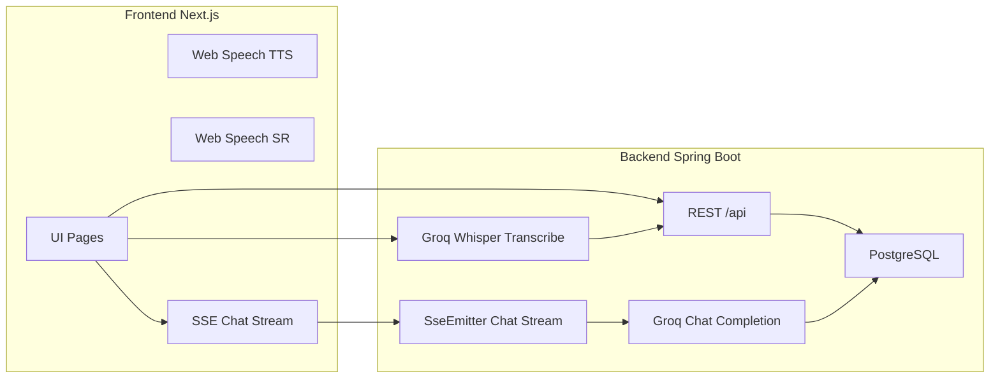

# SRS — DeutschFlow (Software Requirements Specification)

**Phiên bản:** 1.2  
**Ngày:** 2026-05-04  
**Ngôn ngữ:** Tiếng Việt  

**Changelog v1.2:** Đồng bộ với codebase — PostgreSQL làm DB chính (Flyway, Testcontainers); bổ sung Today/adaptive API, Error Review Tasks, hàng chờ ôn SRS (`/api/reviews`), thông báo + SSE, admin export training dataset & weekly speaking prompts; curriculum Netzwerk A1; Ability score API; chỉnh mô tả AI Speaking (chat blocking, danh sách session, kết thúc session); sửa mục HTTP lỗi parse AI (fallback, không ép 502).  

---

## Mục lục

1. Giới thiệu & phạm vi  
2. Thuật ngữ & viết tắt  
3. Yêu cầu phi chức năng chung (NFR)  
4. Kiến trúc & luồng dữ liệu (high-level)  
5. Module AUTH & phân quyền (kèm 5.7 gói & quota AI)  
6. Module ONBOARDING & UserLearningProfile  
7. Module LEARNING PLAN & Dashboard học viên  
8. Module VOCABULARY (tra cứu, filter, admin)  
9. Module VOCAB PRACTICE (nghe & nói theo chủ đề)  
10. Module AI SPEAKING (SSE streaming, STT, TTS, persistence)  
11. Module QUIZ & TEACHER  
12. Module ADMIN OPS (batch jobs, auto-tagging, audit)  
13. Chuẩn lỗi (Error handling spec)  
14. Metrics, logging & observability  
15. Kế hoạch kiểm thử (Test plan)  
16. Tiêu chí nghiệm thu (Acceptance criteria)  
17. Phụ lục — Xuất sang Word (.docx)  
18. Bổ sung theo trạng thái codebase — API & dữ liệu mới (v1.2)  

---

## 1. Giới thiệu & phạm vi

### 1.1 Mục tiêu sản phẩm

DeutschFlow là nền tảng học tiếng Đức (CEFR) kết hợp:

- Lộ trình học cá nhân hoá (dashboard + session/plan).
- Từ vựng tra cứu theo CEFR và **chủ đề (tags)**; quản trị chất lượng dữ liệu ở Admin.
- **Luyện nói từ vựng**: nghe (TTS) + nói (SpeechRecognition) + feedback.
- **Luyện nói AI**: hội thoại streaming (SSE), nhận diện giọng (STT qua Groq Whisper), phản hồi có sửa lỗi + giải thích + lưu điểm yếu ngữ pháp.
- Quiz/lớp học cho Teacher + báo cáo.

### 1.2 Phạm vi (Scope)

**Trong phạm vi hiện tại**

| Khu vực | Mô tả |
|--------|--------|
| Tài khoản | Đăng ký/đăng nhập, JWT, refresh token (theo implement repo), phân quyền Student/Teacher/Admin |
| Onboarding | Thu thập profile học tập (level mục tiêu, ngành nghề, sở thích, locale) |
| Learning plan | Dashboard học viên, tuần/buổi học, tiến độ |
| Vocabulary | API list words + tags; filter CEFR/tag/loại/giống; i18n UTF-8 |
| Vocab practice | Flashcard + TTS + SR + tổng kết |
| AI Speaking | Session + topic + level; SSE chat stream; STT; lưu messages + grammar errors |
| Teacher/Quiz | Lớp học, quiz, join, báo cáo (theo routes đã có trong repo) |
| Admin | Enrich/import/reset; auto-tag taxonomy; audit; gán/ghi nhận gói & quota (theo policy BE); **weekly speaking prompts**; **export training dataset** (JSONL) |
| **Gói & hạn mức AI** | Bảng `subscription_plans` / `user_subscriptions`; quota token theo **lịch ngày Asia/Ho_Chi_Minh**; ví token lăn cho gói trả phí; ledger `ai_token_usage_events`; API `GET /api/auth/me/plan` |
| **Today / Adaptive** | `GET /api/today/me`: gợi ý buổi học trong ngày (due repair tasks, chủ đề/Cefr adaptive, streak) |
| **Error Review Tasks** | Nhiệm vụ ôn lỗi lên lịch: `GET /api/review-tasks/me/today`, `POST /api/review-tasks/{id}/complete` |
| **Ôn tập SRS (learn plan)** | Hàng chờ ôn vocab/grammar của lộ trình (khác Error Review Tasks): `GET /api/reviews/due`, `POST /api/reviews/{id}/grade` |
| **Notifications** | In-app notifications + SSE real-time (`/api/notifications`, stream), rate-limit poll/stream |
| **Curriculum / tiện ích** | Dữ liệu khung giáo trình chỉ đọc: ví dụ `GET /api/curriculum/netzwerk-neu/a1`; `POST /api/ability/score` (endpoint tính điểm năng lực server-side nếu client gọi) |
| **ai-server (Python)** | Repo có `ai-server/` (FastAPI) cho thử Llama cục bộ / `generate`; **không** bắt buộc cho luồng production Groq của AI Speaking trong README chính |

**Ngoài phạm vi (hiện tại)**

- **Cổng thanh toán** (Stripe, MoMo, v.v.) — chưa tích hợp; gói có thể gán thủ công / migration / admin.
- Ứng dụng native iOS/Android.
- Offline-first đầy đủ.

### 1.3 Giả định & ràng buộc

- UTF-8 end-to-end (UI, API JSON, PostgreSQL UTF-8 / `JSONB` nơi có cấu trúc).
- Khóa API AI (Groq) được cấu hình qua biến môi trường, không commit vào git.
- Trình duyệt cho SpeechRecognition có khác nhau (Chrome ổn định hơn Safari).

---

## 2. Thuật ngữ & viết tắt

| Thuật ngữ | Ý nghĩa |
|----------|---------|
| CEFR | Khung trình độ ngôn ngữ châu Âu (A1…C2) |
| Tag / chủ đề | Phân loại chủ đề; canonical **tiếng Đức** trong DB (`tags.name`); UI có `localizedLabel` |
| TTS | Text-to-Speech (Web Speech API phía client) |
| STT | Speech-to-Text (Groq Whisper API phía server cho AI Speaking; Web Speech API cho vocab practice) |
| SSE | Server-Sent Events (streaming token) |

---

## 3. Yêu cầu phi chức năng chung (NFR)

### 3.1 Hiệu năng

- API list words phân trang; `size` tối đa theo backend (thường 100).
- Streaming SSE: không block UI; có abort/cancel.

### 3.2 Bảo mật

- JWT cho API protected.
- Không log secret keys / token đầy đủ.
- SSE/async dispatch: security filter không được làm “đơ” luồng async (đã xử lý bằng cấu hình security cho async dispatcher).

### 3.3 Độ tin cậy AI

- Retry/backoff khi provider trả 429/5xx (ở client Groq).
- Parser JSON robust khi model trả text lẫn JSON.

### 3.4 i18n / UTF-8

- UI theo locale người chọn (next-intl).
- Tags: filter bằng `name` tiếng Đức; hiển thị bằng `localizedLabel` theo locale.

---

## 4. Kiến trúc & luồng dữ liệu (high-level)



---

## 5. Module AUTH & phân quyền

### 5.1 Mục tiêu

Xác thực người dùng và áp quyền theo role cho route FE và API BE.

### 5.2 Functional requirements

- **FR-AUTH-001**: Đăng nhập thành công nhận JWT access token.
- **FR-AUTH-002**: Endpoint `/api/auth/me` trả `role`, `locale`.
- **FR-AUTH-003**: Student chỉ truy cập `/student/*`; Teacher `/teacher/*`; Admin `/admin/*` (theo middleware/route guard).

### 5.3 Data contract (ví dụ)

`GET /api/auth/me`

```json
{
  "id": 1,
  "email": "student@example.com",
  "role": "STUDENT",
  "locale": "vi"
}
```

### 5.4 Error handling

| HTTP | Ý nghĩa |
|------|---------|
| 401 | Sai token / hết hạn |
| 403 | Sai role |

### 5.5 Test plan

- Integration: gọi API protected không token → 401.
- E2E: login → vào dashboard đúng role.

### 5.6 Metrics

- `auth.login.success`, `auth.login.fail`
- `security.http_403.count{endpoint}`

### 5.7 Gói đăng ký & hạn mức token AI (subscription + quota)

**Mục tiêu:** Kiểm soát chi phí LLM; phân tầng người dùng; hiển thị “plan” trên client mà không cần cổng thanh toán.

**Dữ liệu (PostgreSQL + Flyway)**

- `subscription_plans`: `code`, `monthly_token_limit` (di sản), `daily_token_grant`, `wallet_cap_days`, `features_json`, `is_active`.
- `user_subscriptions`: đăng ký theo user, `plan_code`, `status` (`ACTIVE`/`ENDED`), `starts_at`, `ends_at`, tùy chọn `monthly_token_limit_override` (BE map sang grant hằng ngày khi join).
- `user_ai_token_wallets`: số dư token **lăn** cho gói ví (PRO / ULTRA; mã `PREMIUM` được xử lý cùng nhóm ví trong code nếu có bản ghi).
- `ai_token_usage_events`: ghi nhận `total_tokens` theo lượt gọi AI (phục vụ quota “đã dùng trong ngày” theo VN).

**Mã gói (seed / thực tế repo)**

| `plan_code` | Vai trò tóm tắt |
|-------------|-----------------|
| `DEFAULT` | Không hạn mức AI (0 grant) khi user không còn gói khác — user mới được reconcile sang subscription hoạt động. |
| `FREE` | Hạn mức **theo ngày lịch VN** (`daily_token_grant`); trial FREE có thể có `ends_at` (+7 ngày, xem migration). |
| `PRO` | Grant hằng ngày + **ví lăn** tối đa `wallet_cap_days` × daily (ví dụ 30 ngày). |
| `ULTRA` | Tương tự PRO với grant/ví cao hơn. |
| `INTERNAL` | Không trừ quota (vô hạn hiệu dụng) — dùng nội bộ. |

**Luật nghiệp vụ (rút gọn, đúng với `QuotaService`)**

- “Ngày” usage và accrual ví dùng **Asia/Ho_Chi_Minh** (`QuotaVnCalendar`).
- Trước khi gọi AI: `assertAllowed` so sánh hạn mức còn lại với ước lượng tối thiểu; vượt → **HTTP 429** (`QuotaExceededException`, Problem Details).
- Sau khi gọi AI: `AiUsageLedgerService` ghi event; với gói ví, `applyUsageDebit` trừ `user_ai_token_wallets.balance`; hết ví → kết thúc gói trả phí và quay về DEFAULT (theo implement).

**API**

- `GET /api/auth/me/plan` → `{ "planCode": "FREE", "tier": "BASIC", "startsAtUtc": "2026-05-01T12:34:56Z", "endsAtUtc": null }` — `tier` là `PREMIUM`/`ULTRA` tuỳ gói; `endsAtUtc` null khi không có ngày kết thúc (mở).

**Test**

- Integration: `AuthMePlanIntegrationTest`, `QuotaBillingIntegrationTest`.

---

## 6. Module ONBOARDING & UserLearningProfile

### 6.1 Mục tiêu

Thu thập và lưu profile để cá nhân hoá nội dung và **system prompt AI**.

### 6.2 Functional requirements

- **FR-PROF-001**: Lưu `targetLevel`, `industry`, `interestsJson`, `locale`.
- **FR-PROF-002**: AI Speaking dùng profile + weak points để prompt.

### 6.3 Error handling

- Validation fail → 400.
- Profile chưa có → tạo default (theo policy backend).

### 6.4 Test plan

- Unit: merge interests không trùng.
- Integration: onboarding submit → DB có profile.

### 6.5 Metrics

- `onboarding.completed`
- `profile.updated`

---

## 7. Module LEARNING PLAN & Dashboard học viên

### 7.1 Mục tiêu

Hiển thị lộ trình, buổi học, tiến độ; submit session/exercise.

### 7.2 Functional requirements

- **FR-PLAN-001**: Load plan theo tuần/buổi.
- **FR-PLAN-002**: Submit session cập nhật progress.

### 7.3 Error handling

- Session không tồn tại → 404.
- Submit trùng / conflict → 409 hoặc idempotent.

### 7.4 Test plan

- Integration: submit → progress thay đổi.
- E2E: student đi hết một buổi.

### 7.5 Metrics

- `plan.session.started`, `plan.session.completed`
- `plan.submit.latency_ms`

### 7.6 API Today (Adaptive Policy)

**Mục tiêu:** Tổng hợp “hôm nay nên làm gì” dựa trên streak, profile, **due error review tasks** và **SpeakingPolicy** adaptive (focus error codes, gợi ý topic/CEFR, link gợi ý vào Speaking & Vocab practice).

**API**

- **`GET /api/today/me`** (authenticated student): response `TodayPlanDto` — gồm danh sách repair due (rút từ cùng nguồn với review tasks), gợi ý học Speaking/Vocab có query string topic/CEFR, tiến độ/tóm tắt (rolling accuracy, knob, … theo BE).

---

## 8. Module VOCABULARY (tra cứu, filter, admin)

### 8.1 Mục tiêu

Tra cứu từ vựng phong phú (IPA, ví dụ, giống DER/DIE/DAS…) và lọc theo CEFR + chủ đề.

### 8.2 API contracts

#### `GET /api/words`

Query: `cefr`, `q`, `tag`, `dtype`, `gender`, `locale`, `page`, `size`

Response (rút gọn):

```json
{
  "items": [
    {
      "id": 123,
      "dtype": "Noun",
      "baseForm": "Tisch",
      "cefrLevel": "A1",
      "meaning": "cái bàn",
      "tags": ["Alltag", "Wohnen"]
    }
  ],
  "page": 0,
  "size": 25,
  "total": 10000
}
```

#### `GET /api/tags?locale=vi|en|de`

```json
[
  {
    "id": 1,
    "name": "Reise",
    "color": "#a78bfa",
    "localizedLabel": "Du lịch"
  }
]
```

**Quy ước**

- `name`: canonical tiếng Đức — dùng cho `GET /api/words?tag=Reise`.
- `localizedLabel`: nhãn hiển thị theo locale UI.

### 8.3 Admin filter theo tag

Admin vocabulary page truyền `tag=<canonicalName>` cùng `locale=<uiLocale>` để không lẫn VI/EN.

### 8.4 Error handling

- Param không hợp lệ (`dtype`, `gender`, `cefr`) → 400.

### 8.5 Test plan

- Integration:
  - `/api/tags?locale=en` → label tiếng Anh.
  - `/api/words?tag=Beruf&locale=vi` → chỉ từ có tag đó.

### 8.6 Metrics

- `vocab.words.requests`, `vocab.words.latency_ms`
- `vocab.tags.requests`

---

## 9. Module VOCAB PRACTICE (nghe & nói theo chủ đề)

### 9.1 User stories

- Là học viên, tôi chọn **CEFR + chủ đề** để luyện phát âm.
- Tôi nghe TTS, sau đó nói lại và nhận đúng/sai + ôn lại từ sai.

### 9.2 Functional requirements

- **FR-VP-001**: Load words qua `/api/words` với `tag` + `cefr`.
- **FR-VP-002**: TTS phát âm (article + lemma nếu có).
- **FR-VP-003**: SR nhận transcript (de-DE).
- **FR-VP-004**: So khớp transcript vs target (normalize + fuzzy).

### 9.3 Logic chấm điểm (spec)

- Chuẩn hoá: lowercase, loại article phổ biến, bỏ ký tự không chữ.
- Fuzzy: Levenshtein ngưỡng theo độ dài từ.

### 9.4 Error handling

- Browser không hỗ trợ SpeechRecognition → thông báo + vẫn cho nghe.
- Mic denied → hướng dẫn cấp quyền.

### 9.5 Test plan

- Unit FE: `normalize`, `levenshtein`, `isAccepted`.
- Manual QA: Chrome; kiểm tra skip/next/summary.

### 9.6 Metrics (client)

- `vp.start`, `vp.correct`, `vp.wrong`
- `vp.speech_unsupported`, `vp.mic_denied`

---

## 10. Module AI SPEAKING (SSE streaming, STT, TTS, persistence)

### 10.1 User stories

- Tạo session mới khi bắt đầu (không lẫn ngữ cảnh hôm trước).
- Chat streaming hiển thị text trước; phát TTS song song.
- Ghi âm → transcript → gửi chat stream.

### 10.2 API contracts (khái quát)

#### `POST /api/ai-speaking/sessions`

```json
{ "topic": "Reise", "cefrLevel": "B1", "persona": "EMMA", "responseSchema": "V1" }
```

- `persona` (optional): `DEFAULT` | `LUKAS` | `EMMA` | `KLAUS` — giọng/kịch bản tutor (Module 10). Bỏ qua hoặc giá trị lạ → `DEFAULT`.
- `responseSchema` (optional): `V1` | `V2` — song song hai contract JSON (`V1` = tutor đầy đủ; `V2` = compact `content` / `translation` / `feedback` / `action`). Bỏ qua → `V1`.

#### `POST /api/ai-speaking/sessions/{id}/chat`

Chat **đồng bộ** (không stream); response `AiSpeakingChatResponse` (một lần).

#### `POST /api/ai-speaking/sessions/{id}/chat/stream`

Request:

```json
{ "userMessage": "Ich mag Pizza." }
```

SSE events:

- `token`: delta (ghost text)
- `done`: payload đã parse metadata
- `error`: lỗi

#### `GET /api/ai-speaking/sessions`

Danh sách session của user (phân trang `Pageable`).

#### `GET /api/ai-speaking/sessions/{id}/messages`

Lịch sử tin nhắn trong session.

#### `PATCH /api/ai-speaking/sessions/{id}/end`

Kết thúc session; cập nhật trạng thái theo service.

#### `POST /api/ai-speaking/transcribe`

Multipart `audio` → `{ "transcript": "..." }`

### 10.3 JSON schema AI (canonical contract)

Model phải trả **JSON thuần** (không markdown). Schema:

```json
{
  "ai_speech_de": "string",
  "correction": "string|null",
  "explanation_vi": "string|null",
  "grammar_point": "string|null",
  "errors": [
    {
      "error_code": "string",
      "severity": "string",
      "confidence": 0.0,
      "wrong_span": "string|null",
      "corrected_span": "string|null",
      "rule_vi_short": "string|null",
      "example_correct_de": "string|null"
    }
  ],
  "learning_status": {
    "new_word": "string|null",
    "user_interest_detected": "string|null"
  }
}
```

**Quy tắc**

- `ai_speech_de`: luôn có; 100% tiếng Đức.
- `explanation_vi`: chỉ tiếng Việt (giải thích lỗi), có thể null.
- Nếu không lỗi: `correction`, `explanation_vi`, `grammar_point` = null và **`errors` = []**.
- `errors`: mảng các lỗi có cấu trúc; `error_code` thuộc **whitelist** cố định phía backend (`ErrorCatalog`, MVP ~25 mã). Giá trị không hợp lệ bị loại bỏ (không làm fail toàn payload). `confidence` ∈ [0, 1].

#### Mapping sang UI/DTO (done event)

Frontend nhận camelCase (theo client types), ví dụ:

```json
{
  "messageId": 1001,
  "sessionId": 999,
  "aiSpeechDe": "...",
  "correction": null,
  "explanationVi": null,
  "grammarPoint": null,
  "errors": [
    {
      "errorCode": "VERB_AUX_ORDER",
      "severity": "medium",
      "confidence": 0.82,
      "wrongSpan": "...",
      "correctedSpan": "...",
      "ruleViShort": "...",
      "exampleCorrectDe": "..."
    }
  ],
  "learningStatus": {
    "newWord": null,
    "userInterestDetected": null
  }
}
```

### 10.4 Persistence

- `ai_speaking_sessions`: topic, `cefr_level`, `persona` (tên enum speaking tutor), `response_schema` (`V1`|`V2`), timestamps, status.
- `ai_speaking_messages`: role USER/ASSISTANT + payload fields; thêm `assistant_action`, `assistant_feedback` (V2 / feedback khích lệ).
- `user_grammar_errors`: lưu feedback ngữ pháp.
  - **Legacy**: khi model chỉ trả `correction` / `grammar_point` (không có `errors[]`), vẫn ghi row như trước.
  - **Structured**: với mỗi phần tử trong `errors[]`, ghi **một row** (idempotent theo `message_id` + `error_code`).
  - Cột bổ sung: `error_code`, `confidence`, `wrong_span`, `corrected_span`, `rule_vi_short`, `example_correct_de`, `repair_status` (`OPEN` | `RESOLVED` | `SNOOZED`).
- `user_learning_profiles`: merge interest phát hiện.

### 10.5 Error Skills API (tổng hợp lỗi & sửa drill)

REST API đọc aggregate từ `user_grammar_errors`, phục vụ **Error Library** và nút “Sửa ngay” sau session.

#### `GET /api/error-skills/me?days=30`

Query `days`: chỉ tính các lỗi trong cửa sổ thời gian (mặc định 30 ngày).

Response (mảng; sort theo `priorityScore` giảm dần):

```json
[
  {
    "errorCode": "VERB_AUX_ORDER",
    "count": 5,
    "lastSeenAt": "2026-04-28T12:00:00Z",
    "priorityScore": 12.3,
    "sampleWrong": "...",
    "sampleCorrected": "..."
  }
]
```

#### `POST /api/error-skills/me/{errorCode}/repair-attempt`

Đánh dấu các bản ghi `OPEN` gần nhất của user cho `error_code` là **`RESOLVED`** sau khi học viên hoàn thành drill REWRITE phía client (204 No Content).

### 10.5a Error Review Tasks (lịch ôn lỗi / “Speaking-SRS” task row)

Bảng `error_review_tasks` + scheduler nội bộ; **khác** hàng ôn `learning_review_items` (xem §18).

**API (STUDENT)**

- `GET /api/review-tasks/me/today` — tối đa 5 task đến hạn (`PENDING`, `dueAt` ≤ now).
- `POST /api/review-tasks/{taskId}/complete` — body `{ "passed": true|false }`; 204 khi thành công.

### 10.6 Error handling

- Provider 429/5xx: retry/backoff; FE hiển thị retry.
- **JSON / schema model:** `AiResponseParser` luôn trả DTO (không ném exception). Nếu JSON lỗi hoặc thiếu `ai_speech_de`, dùng **fallback** (raw text làm nội dung thoại); `errors[]` không áp dụng khi fallback. Stream/blocking vẫn kết thúc với bubble hợp lệ — không map parse fail cứng sang 502 trừ lỗi hạ tầng khác.
- Quota AI: HTTP **429** khi vượt hạn mức token (xem §5.7).
- SSE security: async dispatch không bị 403.

### 10.7 Test plan

**Backend**

- Unit: JSON extraction + parse edge cases.
- Integration: SSE emits token + done; DB có messages.

**Frontend**

- SSE parser: token accumulation; done replaces bubble.
- Mic pipeline: record → transcribe → send stream.

### 10.8 Metrics / logging

**Micrometer (Prometheus) — đặt tên thực tế trong codebase**

| Metric | Tag / ghi chú |
|--------|----------------|
| `speaking.chat.requests` | `kind` = `blocking` \| `stream`, `status` = `ok` \| `error` |
| `speaking.chat.latency` | `kind` |
| **`speaking.ai_parse`** | **`status`** = `structured` \| `fallback_parse_error` \| `fallback_missing_ai_speech` \| `fallback_null_input` (một lần / lượt assistant sau parse) |
| `speaking.errors.emitted` | `error_code`, `severity` (mỗi phần tử trong `errors[]`) |
| `speaking.turns.total`, `speaking.turns.no_major` | độ chính xác lượt (không MAJOR/BLOCKING) |
| `speaking.repair.attempts` | `result` |
| `speaking.policy.*` | adaptive policy |

**Đồng bộ KPI roadmap:** tỉ lệ `fallback_*` / `structured` của `speaking.ai_parse` thay cho tên đề xuất cũ `ai.speaking.json_parse_fail.count` (có thể lấy tương đương: `fallback_parse_error` + `fallback_missing_ai_speech`).

Ghi nhận bổ sung (logging/telemetry HTTP): filter telemetry toàn cục, STT/STT latency nếu bổ sung sau này — không bắt buộc trùng tên bảng trên.

- `error.skills.list` / `error.skills.repair_attempt` (theo implement logging)

---

## 11. Module QUIZ & TEACHER

### 11.1 Functional requirements

- Teacher tạo quiz, gán lớp, học viên join bằng code/link.
- Báo cáo theo lớp/quiz/học viên.

### 11.2 Error handling

- Join code sai → 404/400.
- Quiz đã đóng → 409.

### 11.3 Test plan

- Integration: create quiz → join → submit → aggregate report.

### 11.4 Metrics

- `quiz.created`, `quiz.joined`, `quiz.submitted`

---

## 12. Module ADMIN OPS (batch jobs, auto-tagging)

### 12.1 Auto-tagging

#### `POST /api/admin/vocabulary/auto-tag/batch?limit=&dryRun=&resetTags=`

Response:

```json
{
  "status": "ok",
  "dryRun": true,
  "wordsProcessed": 100,
  "wordsTagged": 85,
  "tagLinksCreated": 140,
  "preview": [{ "wordId": 1, "baseForm": "Ticket", "tags": ["Reise"] }]
}
```

**Quy trình khuyến nghị**

1. `dryRun=true`, `limit` nhỏ (50–200) → xem preview.
2. Nếu OK → `dryRun=false` để ghi DB.
3. `resetTags=true` chỉ khi muốn làm lại taxonomy (cẩn thận).

### 12.2 Error handling

- Thiếu API key → lỗi rõ ràng, không silent fail.
- Rate limit → giảm batch/limit.

### 12.3 Audit

- Ghi audit khi apply (không audit dry-run hoặc audit riêng flag).

### 12.4 Metrics

- `admin.auto_tag.batch.duration_ms`
- `admin.auto_tag.words_processed`

---

## 13. Chuẩn lỗi (Error handling spec)

### 13.1 Format JSON lỗi (chuẩn đề xuất)

```json
{
  "timestamp": "2026-04-30T01:23:45.123Z",
  "status": 400,
  "error": "Bad Request",
  "message": "Chi tiết lỗi người đọc được",
  "path": "/api/..."
}
```

### 13.2 Phân loại lỗi theo module

| Module | Lỗi thường gặp | HTTP |
|--------|----------------|------|
| Auth | Sai token | 401 |
| AI | Provider rate limit / quota token | **429** |
| AI | Payload model không parse được schema đầy đủ | **Fallback** trong luồng stream/blocking (xem §10.6); **không** dùng 502 chỉ vì JSON parse không đạt structured |
| AI | Hạ tầng provider / gateway lỗi thật sau khi hết retry | **5xx** tùy tầng (theo handler) |
| Notifications | Poll/stream quá thường xuyên | **429** (rate limit) |
| SSE | Client disconnect | — (client log) |

---

## 14. Metrics, logging & observability

### 14.1 Logging (backend)

- Log có correlation id (request id).
- Không log JWT đầy đủ / secrets.

### 14.2 Telemetry

- Histogram latency theo endpoint (HTTP filter telemetry + Micrometer MVC nếu bật).
- Error rate theo endpoint và **theo provider AI** (`ai_token_usage_events`, logs client).
- **AI Speaking pipeline:** Prometheus scrape Actuator (`/actuator/prometheus`); dashboard theo `speaking.ai_parse`, `speaking.chat.requests`, `speaking.errors.emitted`.

### 14.3 Audit log (admin)

- Mọi thao tác import/reset/auto-tag phải có actor + metadata.

---

## 15. Kế hoạch kiểm thử (Test plan)

### 15.1 Unit tests (ưu tiên)

- Parser JSON AI: `AiResponseParserTest` (`parse` / `parseWithOutcome`, fence markdown, whitelist `error_code`, fallback + `AiParseStatus`).
- Normalize/fuzzy matching vocab practice.

### 15.2 Integration tests

- `/api/tags` localized labels.
- `/api/words?tag=` filter đúng.
- SSE chat stream happy path + error path.

### 15.3 E2E tests (manual checklist)

- Student: vocab → filter tag → mở chi tiết → TTS.
- Student: vocab practice → mic → scoring → summary.
- Student: AI speaking → record → stream → không raw JSON → summary.
- Admin: auto-tag dry-run → apply nhỏ.

---

## 16. Tiêu chí nghiệm thu (Acceptance criteria)

- **AC-01**: Không trộn locale: tags hiển thị đúng `localizedLabel` theo UI locale; filter vẫn dùng canonical `name` tiếng Đức.
- **AC-02**: Admin lọc theo tag hoạt động (danh sách thay đổi đúng).
- **AC-03**: AI Speaking streaming hoàn tất với event `done`; không kẹt “đang gửi”.
- **AC-04**: Không hiển thị JSON thô trong bubble AI (parse đúng schema).
- **AC-05**: Secrets không nằm trong git (`.env`, keys…) — theo `.gitignore`.
- **AC-06**: `GET /api/today/me` trả về cấu trúc không lỗi khi không có learning plan (streak/coherence an toàn như hiện tại BE).

---

## 17. Phụ lục — Xuất sang Word (.docx) **không cần pandoc**

**Cách A — Microsoft Word**

1. Mở file `SRS_DeutschFlow.md` bằng Word (hoặc đổi đuôi tạm sang `.txt` rồi mở).
2. **File → Save As… → Word Document (*.docx)**.

**Cách B — Google Docs**

1. Upload `SRS_DeutschFlow.md` lên Google Drive.
2. Open with Google Docs → **File → Download → Microsoft Word (.docx)**.

---

## 18. Bổ sung theo trạng thái codebase — API & dữ liệu mới (v1.2)

Mục này tóm tắt các phần **đã có trong repo** (backend Spring Boot chủ đạo) so với bản SRS 1.1; không thay thế chi tiết từng DTO — tham khảo controller/service tương ứng.

### 18.1 Cơ sở dữ liệu & migration tiêu biểu

- **PostgreSQL + Flyway** — migrations hiện tới **V56** (ví dụ: quota `V42`, subscription `V38`–`V41`, grammar errors có cấu trúc `V32`, error observations/skills `V34`, **error review tasks** `V35`, speaking user state `V36`, **learner companion** báo cáo/check-in `V43`, **weekly speaking** rubric/prompt `V44`–`V51`, notifications `V52`, **training_dataset** export `V53`, user learning progress `V54`, **AI Speaking persona** `V55`, **Speaking response schema (V1/V2)** `V56`).
- Companion DB (`learner_period_check_ins`, `learner_progress_reports`, …) được thiết kế trong migration & tài liệu `docs/COACHING_COMPANION_DESIGN.md`; các job rollup (vd. weekly) có trong service như **`WeeklyCompanionRollupService`** — REST surface cho học viên có thể mở rộng sau, không nhất thiết đã là một “module SRS” độc lập trong FE.

### 18.2 API thông báo (Notifications)

Base: **`/api/notifications`**

- `GET` — phân trang, lọc `unreadOnly`.
- `GET /unread-count`
- `GET /stream` — **SSE**, giới hạn kết nối theo policy.
- `POST /{id}/read`, `POST /read-all`
- Poll/stream bị giới hạn tốc độ → có thể trả **429** (`RateLimitExceededException`, kèm `retryAfterSeconds` nếu client xử lý).

### 18.3 Hàng chờ ôn tập SRS (Learning plan) vs Error Review Tasks

| Khái niệm | Endpoint | Ý nghĩa |
|-----------|----------|--------|
| **Learning reviews** | `/api/reviews/due`, `/api/reviews/{id}/grade` | Ôn theo **`learning_review_items`** (SRS/chất lượng ôn của buổi học plan). Role **STUDENT**. |
| **Error review tasks** | §10.5a | ôn/ghi nhận sửa theo **`error_review_tasks`** (gắn `error_code`, due date). |

### 18.4 Admin — Weekly speaking prompts

- **`/api/admin/speaking/weekly-prompts`** — CRUD prompt theo tuần (LIST/GET/POST/PUT/DELETE deactivate), chỉ **ADMIN**.

### 18.5 Admin — Training dataset export

Base: **`/api/admin/training-dataset`** (ADMIN)

- `GET /stats` — thống kê dataset.
- `GET /export/conversations` — JSONL (Alpaca): query `cefrLevel`, `errorsOnly`, `limit` (cap server).
- `GET /export/errors` — JSONL mẫu lỗi / correction.

### 18.6 Curriculum & Ability

- **`GET /api/curriculum/netzwerk-neu/a1`** — skeleton giáo trình Netzwerk neu A1 (read-only).
- **`POST /api/ability/score`** — nhận `AbilityScoreRequest`, trả điểm số computed server-side (`AbilityScoreResponse`).

### 18.7 API Speaking AI phụ (`/api/speaking/ai`)

- **`AISpeakingController`** `/api/speaking/ai/*` — các helper đối thoại / practice không thay cho luồng session chính **`/api/ai-speaking`**; dùng khi FE hoặc công cụ nội bộ gọi trực tiếp helpers (đảm bảo đúng `@PreAuthorize` / security trong code).

---

*Tài liệu này mô tả yêu cầu và hợp đồng dữ liệu theo trạng thái hiện tại của codebase DeutschFlow; khi API thay đổi, cần cập nhật phiên bản SRS.*
