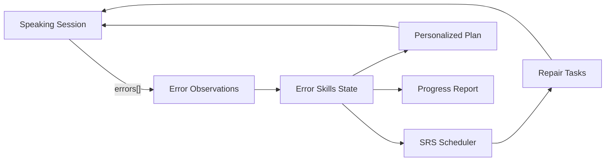

# Chiến lược sản phẩm — DeutschFlow

**Phiên bản:** 1.1  
**Ngày:** 2026-05-01  
**Ngôn ngữ:** Tiếng Việt  

---

## Liên kết với tài liệu khác

| Tài liệu | Vai trò |
|----------|---------|
| **STRATEGY_DeutschFlow.md** (tài liệu này) | **Vì sao** cạnh tranh và **đi đâu** — định vị, USP, 3 trụ cột, đối thủ, KPI, phụ lục taxonomy/prompt/UI |
| **[ROADMAP_DeutschFlow.md](ROADMAP_DeutschFlow.md)** | **Khi nào** triển khai và **đo lường** theo phase — deliverables, acceptance, KPI theo giai đoạn |
| **[SRS_DeutschFlow.md](SRS_DeutschFlow.md)** | **Hợp đồng kỹ thuật** — API, module, acceptance criteria implementation (cập nhật khi code đổi) |

Hai file STRATEGY và ROADMAP **không thay thế** SRS; khi triển khai `errors[]`, drill engine, scheduler — cần bổ sung tương ứng vào SRS (Module 8–10).

---

## 1. Executive Summary

**One-liner:** DeutschFlow là nền tảng luyện nói tiếng Đức (CEFR) cho người Việt, nơi mỗi buổi nói tạo **dữ liệu lỗi có cấu trúc**, hệ thống **nhớ lỗi** và **ép sửa đúng lúc** (Speaking-SRS), và **kế hoạch học** sinh ra từ dữ liệu đó — không phải template cố định.

**USP:** Bán **“giảm lỗi khi nói”**, không bán “chat với AI”.

**Tagline:** *Luyện nói tiếng Đức theo lỗi của bạn.*

**Ba trụ cạnh tranh (“moat” nếu thực thi đúng):**

1. **Speaking Feedback chuẩn** — output có `errors[]` chuẩn hoá + scoring rubric (anchors, order, fuzzy), không chỉ text tự do.
2. **Error Memory & Forced Repair** — observations → skills → review tasks + SRS theo lỗi thật.
3. **Data-driven Learning Plan** — “Hôm nay học gì” = due repairs + speaking có chủ đích chèn điểm yếu.



---

## 2. Định vị & ICP

### 2.1 Định vị

**Speaking-first tutor cho người Việt học tiếng Đức**, tập trung “nói trôi + giảm lỗi” qua vòng lặp: *nói → phát hiện lỗi có mã → lưu hồ sơ → ôn đúng lúc → đo tiến bộ*.

### 2.2 User chính (ICP)

| Phân khúc | Mô tả |
|-----------|--------|
| **Primary** | Người Việt học Đức **A2–B2**, mục tiêu thực dụng (Ausbildung, đi làm, du học). Đã có nền từ vựng/ngữ pháp nhưng **nói chậm, sợ sai, lặp lỗi dai**. |
| **Secondary** | Học viên có lớp/giáo viên (online/offline) cần bài nói + theo dõi lỗi; **giáo viên** cần báo cáo “lỗi cả lớp” và speaking homework. |

### 2.3 Pain points

- Biết nhưng **không nói được** — thiếu output có feedback có cấu trúc.
- **Không biết mình sai có hệ thống** — giới từ, mạo từ, trật tự câu lặp lại nhưng không ai “bắt” và ép sửa đúng cách.
- **Ôn tập không trọng tâm** — flashcard nhớ nghĩa nhưng không chuyển hoá thành **nói câu đúng**.
- **Feedback rời rạc** — chat AI/partner sửa nhưng không nhớ lỗi để kiểm tra lại sau 3–7–14 ngày.
- **Lỗi đặc thù người Việt** — V2, Nebensatz, giới từ + cách, der/die/das, Perfekt — cần giải thích tiếng Việt ngắn, hành động được.

### 2.4 Job to be done

> “Khi cần nói tiếng Đức cho công việc/cuộc sống, tôi muốn luyện nhanh mỗi ngày và **thấy lỗi giảm rõ rệt theo tuần**, không lan man.”

---

## 3. Ba trụ cột cạnh tranh (chi tiết)

### 3.1 Speaking Feedback chuẩn

**Mục tiêu:** Mỗi lượt nói/viết có thể map sang **mã lỗi** + **mức độ** + **gợi ý sửa**, để thống kê và tạo drill.

**Thành phần:**

- **AI output contract:** JSON có `errors[]` với `errorCode`, `severity`, `confidence`, `wrongSpan`/`correctedSpan` (nullable MVP), `rule_vi_short`, `example_correct_de` (xem Phụ lục B).
- **Hai lớp luyện (đã có trong SRS):**
  - **Vocab Practice:** TTS + SpeechRecognition + normalize + fuzzy (Levenshtein).
  - **AI Speaking:** SSE stream + STT (Whisper) + parse JSON + persistence `user_grammar_errors`.
- **Scoring rubric (drill):** `anchors_required`, `anchors_forbidden`, `order_constraints`, ngưỡng Levenshtein theo độ dài (Phụ lục D).

**Không làm:** Chỉ chat tiếng Đức “hay” mà không trích xuất lỗi có mã — không đủ để cạnh tranh với course-first hoặc SRS thuần.

---

### 3.2 Error Memory & Forced Repair (Speaking-SRS)

**Mục tiêu:** Lỗi được **lưu**, **ưu tiên hoá**, **ôn lại** theo lịch; người học không thoát session mà không qua bước “sửa ngay” (tuỳ policy UX).

**Thành phần:**

- **Taxonomy:** ~25 `error_code` MVP A1–B2, tập trung lỗi người Việt hay dính (Phụ lục A).
- **Ba lớp dữ liệu (đề xuất triển khai):**
  1. `user_error_observations` — mỗi lần phát hiện.
  2. `user_error_skills` — aggregate theo `error_code`: count, `last_seen`, `priority_score`, `next_review_at`.
  3. `error_review_tasks` — REWRITE / CHOOSE_ORDER / SPEAK_SENTENCE + trạng thái + kết quả.
- **Scheduling:** `priority_score` kết hợp severity × tần suất × recency; SRS 1→3→7→14 ngày nếu đúng; lùi nếu sai.
- **Ba dạng drill chuẩn:** mỗi `error_code` có 2–3 template task + tiêu chí chấm MVP (Phụ lục D).

---

### 3.3 Data-driven Learning Plan

**Mục tiêu:** Dashboard và “buổi học hôm nay” **sinh từ** skills + due tasks + lịch sử topic/AI — không copy một lộ trình cố định cho mọi người.

**Thành phần:**

- **“Hôm nay học gì”:** 3–10 repair task đến hạn + 1 speaking session gợi ý topic/chèn cấu trúc đang yếu.
- **Weekly report:** top lỗi giảm / lỗi mới / speaking accuracy trend.
- **Teacher (B2B nhẹ):** error map theo lớp, speaking homework, export/report.

---

## 4. So sánh đối thủ (theo 3 trụ)

| Nhóm / ví dụ | Họ mạnh | DeutschFlow thắng ở đâu |
|--------------|---------|-------------------------|
| **Course-first** (DW Learn German, Babbel, Busuu, Seedlang) | Lộ trình bài học, nội dung chuẩn, audio tốt | Feedback **theo lỗi cá nhân** + vòng sửa lỗi có lịch, không chỉ hoàn thành bài |
| **SRS power** (Anki) | SRS cực mạnh, tuỳ biến cao | **Speaking-SRS** — SRS trên **đầu ra nói** (productive), không chỉ nhận diện |
| **Microlearning** (Memrise, Drops) | Onboarding nhanh, học từ vựng vui | Chiều **B1+**: chuyển từ nhận biết → **nói đúng cấu trúc** |
| **Audio drilling** (Pimsleur) | Phản xạ nói theo audio, đều đặn | **Cá nhân hoá theo lỗi** + drill sinh từ transcript |
| **Social** (Tandem, HelloTalk) | Động lực xã hội, nói với người thật | Vai trò **coach**: chuẩn bị kịch bản + sau đó **review lỗi có hệ thống** |
| **Ngách** (Der Die Das, Grammatisch, Todaii, FluentPal…) | Giải quyết 1 pain cụ thể | **Ngách động**: app tự ưu tiên đúng “lỗi của bạn” theo taxonomy |

---

## 5. Messaging & Positioning

| Thành phần | Nội dung |
|------------|----------|
| **Tagline** | Luyện nói tiếng Đức theo lỗi của bạn. |
| **One-liner** | DeutschFlow nghe bạn nói, chỉ ra lỗi quan trọng, rồi ép bạn sửa lại đúng — theo lịch ôn tự động. |
| **Proof points** | Top lỗi tuần này; xu hướng giảm lỗi; bài **Sửa ngay (2–3 phút)** sau mỗi buổi nói; báo cáo giáo viên (B2B). |

---

## 6. Pricing (đề xuất)

| Tier | Quyền lợi chính |
|------|-----------------|
| **Free** | Vocab practice cơ bản (giới hạn lượt/ngày); AI Speaking giới hạn phút/ngày; error summary cơ bản (ví dụ top 3 lỗi). |
| **Pro** | AI Speaking đầy đủ hơn; **error memory** + repair drills không giới hạn; Speaking-SRS deck; báo cáo tiến bộ theo tuần. |
| **Teacher (B2B nhẹ)** | Lớp + quiz + speaking homework; dashboard lỗi theo lớp; export/báo cáo. |

**Nguyên tắc:** Giá trị bán là **giảm lỗi khi nói**, không phải “số phút chat AI”.

### 6.1 Monetization — trạng thái triển khai (quota & gói thủ công)

Chiến lược giá ở bảng trên là **định hướng sản phẩm**. Trên code hiện tại, **chưa tích hợp cổng thanh toán** (Stripe/MoMo/Apple IAP, v.v.): không có luồng checkout tự động. Thay vào đó hệ thống dựa trên **gói và hạn mức AI** được gán trong DB (**subscription plans / user subscriptions**), ví token lăn cho tier trả phí, và ledger usage — có thể cấp bằng migration, admin, hoặc thủ công. Điều này cho phép **kiểm soát chi phí LLM** và thử tiering **trước khi** bán qua gateway. Chi tiết kỹ thuật và API `GET /api/auth/me/plan` nằm ở **SRS §5.7**; KPI parse (`speaking.ai_parse`) và roadmap đồng bộ trong **ROADMAP Phase 0**.

---

## 7. KPI cạnh tranh (đo “vượt trội” thực sự)

| Loại | Metric | Gợi ý |
|------|--------|--------|
| **Engagement** | Weekly active speaking minutes / user | Thói quen nói đều |
| **Chất lượng** | % giảm tần suất **top-3 error_code** sau 2 tuần | “Lỗi của tôi” thật sự giảm |
| **Retention** | D7, D30; % user mở Error Library ≥ 3 lần/tuần | stickiness của vòng lỗi |
| **Outcome** | Speaking accuracy trend — tỷ lệ lượt không có error MAJOR+ | Đầu ra có ý nghĩa |
| **Acquisition** | CAC theo kênh; hệ số lan truyền qua lớp Teacher | kênh B2B2C |

---

## Phụ lục A — Bộ ~25 `error_code` MVP (A1–B2, VN-leaning)

**Quy ước:** `CATEGORY.SUBTYPE`

| # | errorCode | Ví dụ sai → đúng |
|---|-----------|------------------|
| 1 | WORD_ORDER.V2_MAIN_CLAUSE | Heute ich gehe… → Heute gehe ich… |
| 2 | WORD_ORDER.SUBCLAUSE_VERB_FINAL | Weil ich bin müde… → Weil ich müde bin… |
| 3 | WORD_ORDER.INVERSION_AFTER_ADVERBIAL | Morgen ich treffe… → Morgen treffe ich… |
| 4 | WORD_ORDER.NICHT_POSITION | Ich nicht verstehe. → Ich verstehe nicht. |
| 5 | WORD_ORDER.TE_KA_MO_LO | …im Park morgen mit… → …morgen mit… im Park |
| 6 | WORD_ORDER.MODAL_INF_END | Ich kann gehen heute. → Ich kann heute gehen. |
| 7 | WORD_ORDER.SEparable_PREFIX_POSITION | Ich stehe auf um 7 Uhr. → Ich stehe um 7 Uhr auf. |
| 8 | CASE.PREP_DAT_MIT | mit mein Freund → mit meinem Freund |
| 9 | CASE.PREP_AKK_FUER | für meinem Bruder → für meinen Bruder |
|10 | CASE.WECHSEL_AKK_VS_DAT | Ich bin in die Schule. → Ich bin in der Schule. |
|11 | CASE.DATIVE_INDIRECT_OBJECT | Ich gebe der Mann… → Ich gebe dem Mann… |
|12 | CASE.ACCUSATIVE_DIRECT_OBJECT | Ich sehe der Hund. → Ich sehe den Hund. |
|13 | CASE.GENITIVE_REQUIRED | wegen dem Wetter → wegen des Wetters |
|14 | ARTICLE.GENDER_WRONG_DER_DIE_DAS | die Tisch → der Tisch |
|15 | ARTICLE.INDEFINITE_EIN_EINE | ein Frau → eine Frau |
|16 | ARTICLE.CASE_DECLENSION_DEM_DEN_DES | mit den Mann → mit dem Mann |
|17 | ARTICLE.PLURAL_DECLENSION | mit die Kinder → mit den Kindern |
|18 | VERB.CONJ_PERSON_ENDING | Er gehen… → Er geht… |
|19 | VERB.AUX_SEIN_HABEN_PERFEKT | Ich habe … gegangen (movement) → Ich bin … gegangen. |
|20 | VERB.PARTIZIP_II_FORM | gegeht → gegangen (ngữ cảnh phù hợp) |
|21 | VERB.MODAL_PERFEKT_DOUBLE_INF | Ich habe gehen gemusst. → Ich habe gehen müssen. |
|22 | VERB.SEIN_HABEN_PRESENT | Ich bin Hunger. → Ich habe Hunger. |
|23 | AGREEMENT.SUBJECT_VERB_NUMBER | Die Leute ist… → Die Leute sind… |
|24 | DECLENSION.ADJECTIVE_ENDING | mit gut Freund → mit gutem Freund |
|25 | LEXICAL.FALSE_FRIEND_BEKOMMEN | Ngữ cảnh “có” → thường haben; bekommen = nhận được (tuỳ ngữ cảnh soạn drill) |

---

## Phụ lục B — Hợp đồng AI Speaking (`errors[]`) + fallback

### B.1 JSON schema (canonical)

Model trả **một object JSON duy nhất**, không markdown, không text ngoài JSON.

```json
{
  "ai_speech_de": "string",
  "correction": "string|null",
  "explanation_vi": "string|null",
  "grammar_point": "string|null",
  "errors": [
    {
      "errorCode": "WORD_ORDER.V2_MAIN_CLAUSE",
      "severity": "BLOCKING|MAJOR|MINOR",
      "confidence": 0.0,
      "wrongSpan": "string|null",
      "correctedSpan": "string|null",
      "rule_vi_short": "string",
      "example_correct_de": "string"
    }
  ],
  "learning_status": {
    "new_word": "string|null",
    "user_interest_detected": "string|null"
  }
}
```

**Ràng buộc:**

- `errors` luôn là mảng (có thể `[]`).
- `confidence` ∈ [0, 1].
- `errorCode` chỉ từ danh sách cho phép (Phụ lục A) hoặc mở rộng có kiểm soát.
- Nếu câu người học đủ đúng: `correction`, `explanation_vi`, `grammar_point` = null và `errors` = [].

### B.2 Fallback khi model không tuân

1. **Extractor:** lấy object `{...}` lớn nhất trong response rồi parse JSON.
2. **Repair prompt một lần:** “Return ONLY valid JSON matching schema…”.
3. **Safe default sau retry fail:** `ai_speech_de` ngắn (tiếng Đức), `errors=[]`, log metric `json_parse_fail` (đã spec trong SRS Module 10).

---

## Phụ lục C — Chuỗi UI tiếng Việt theo `error_code` (card)

**Layout card (chung):** tiêu đề · chip severity · “Bạn nói” / “Đúng hơn” · rule ngắn · CTA **Sửa ngay (2 phút)** · (mở rộng) giải thích + bẫy người Việt.

**CTA chung:** `Sửa ngay (2 phút)` · `Luyện thêm 1 vòng` · `Nhắc lại sau`

| errorCode | title_vi | rule_vi_short |
|-----------|----------|----------------|
| WORD_ORDER.V2_MAIN_CLAUSE | Động từ vị trí số 2 (V2) | Trong câu chính, động từ chia đứng vị trí thứ hai. |
| WORD_ORDER.SUBCLAUSE_VERB_FINAL | Mệnh đề phụ: động từ cuối câu | Sau weil/dass/wenn… động từ chia ở cuối mệnh đề phụ. |
| WORD_ORDER.INVERSION_AFTER_ADVERBIAL | Đảo sau trạng ngữ đầu câu | Mở đầu bằng trạng ngữ → động từ trước chủ ngữ. |
| WORD_ORDER.NICHT_POSITION | Đặt “nicht” đúng chỗ | “Nicht” thường sau động từ / đối tượng bị phủ định — không giống “không” trong tiếng Việt. |
| WORD_ORDER.TE_KA_MO_LO | Thứ tự trạng ngữ (Te-Ka-Mo-Lo) | Thường: thời gian → cách → nơi; lý do có thể chen trước “cách”. |
| WORD_ORDER.MODAL_INF_END | Modal + động từ nguyên mẫu cuối | können/müssen… + động từ nguyên mẫu ở cuối câu. |
| WORD_ORDER.SEparable_PREFIX_POSITION | Động từ tách: tiền tố cuối câu | Tiền tố tách (auf, an…) đứng cuối mệnh đề chính. |
| CASE.PREP_DAT_MIT | “mit” + Dativ | Sau “mit” dùng Dativ (dem/meinem…). |
| CASE.PREP_AKK_FUER | “für” + Akkusativ | Sau “für” dùng Akkusativ (den/meinen…). |
| CASE.WECHSEL_AKK_VS_DAT | in/auf/an: đi vs ở | Chuyển động → Akk; vị trí tĩnh → Dat (wo vs wohin). |
| CASE.DATIVE_INDIRECT_OBJECT | Tân ngữ gián tiếp (Dat) | “Ai nhận” thường Dativ. |
| CASE.ACCUSATIVE_DIRECT_OBJECT | Tân ngữ trực tiếp (Akk) | “Cái gì/ai chịu tác động trực tiếp” thường Akkusativ. |
| CASE.GENITIVE_REQUIRED | Giới từ + Genitiv (chuẩn) | wegen/trotz/während… thường + Genitiv trong văn phong học thuật/chuẩn thi. |
| ARTICLE.GENDER_WRONG_DER_DIE_DAS | Sai giống der/die/das | Học cụm article + danh từ cho các từ hay dùng. |
| ARTICLE.INDEFINITE_EIN_EINE | ein/eine | Nam/trung: ein; nữ (Nom.): eine. |
| ARTICLE.CASE_DECLENSION_DEM_DEN_DES | Article đổi theo cách | mit → dem; durch → durch den … (tuỳ giới từ). |
| ARTICLE.PLURAL_DECLENSION | Số nhiều + Dativ | Dativ plural thường den + -n (Kindern). |
| VERB.CONJ_PERSON_ENDING | Chia động từ theo ngôi | er/sie/es — đuôi đặc biệt (geht, macht…). |
| VERB.AUX_SEIN_HABEN_PERFEKT | sein/haben trong Perfekt | Nhiều động từ chuyển động/đổi trạng thái với sein. |
| VERB.PARTIZIP_II_FORM | Partizip II đúng dạng | Perfekt = Aux + Partizip II đúng bất quy tắc nếu có. |
| VERB.MODAL_PERFEKT_DOUBLE_INF | Modal trong Perfekt (B1) | haben + … + Infinitiv modal (müssen/können), không Partizip modal. |
| VERB.SEIN_HABEN_PRESENT | sein vs haben cố định | Hunger/Zeit/Angst… thường **haben**. |
| AGREEMENT.SUBJECT_VERB_NUMBER | Chủ-vị số ít/nhiều | Danh từ số nhiều → động từ chia số nhiều. |
| DECLENSION.ADJECTIVE_ENDING | Đuôi tính từ | sau Artikel/cách → đuôi -e/-en… đúng pattern. |
| LEXICAL.FALSE_FRIEND_BEKOMMEN | bekommen vs haben | “Có” (sở hữu) thường **haben**; bekommen ≈ nhận được (tuỳ drill). |

---

## Phụ lục D — Drill: dạng task + scoring MVP (tóm tắt)

**Ba dạng:** REWRITE · CHOOSE_ORDER · SPEAK_SENTENCE  

**Chấm MVP:** normalize (lowercase, ký tự thừa) → **anchors_required** / **anchors_forbidden** / **order_constraints** → fuzzy Levenshtein (ngưỡng theo độ dài). CHOOSE: khớp option đúng.

**Ví dụ anchors theo nhóm:**

- **V2:** bắt buộc trật tự token `heute gehe ich`.
- **weil:** pattern `weil ich .* müde bin`.
- **mit Dat:** transcript chứa `mit meinem`.
- **für Akk:** `für meinen`.
- **Separable:** động từ gần đầu, tiền tố cuối (`stehe … auf`).

Chi tiết mapping đầy đủ từng code → 2–3 task cụ thể có thể đặt trong `errorCatalog.drills.json` khi implement.

### D.1 Ví dụ `scoring` JSON (một `error_code`)

```json
{
  "errorCode": "WORD_ORDER.V2_MAIN_CLAUSE",
  "taskTypes": ["REWRITE", "CHOOSE_ORDER", "SPEAK_SENTENCE"],
  "rewriteTarget_de": "Heute gehe ich zur Arbeit.",
  "scoring": {
    "anchors_required": ["heute", "gehe", "ich"],
    "anchors_forbidden": [],
    "order_constraints": [
      { "before": "gehe", "after": "ich" },
      { "before": "heute", "after": "gehe" }
    ],
    "levenshtein_max_ratio": 0.25,
    "normalize": ["lowercase", "strip_punctuation"]
  }
}
```

---

*Tài liệu này tổng hợp chiến lược sản phẩm và phụ lục có thể triển khai; khi sản phẩm đổi, cập nhật phiên bản.*
