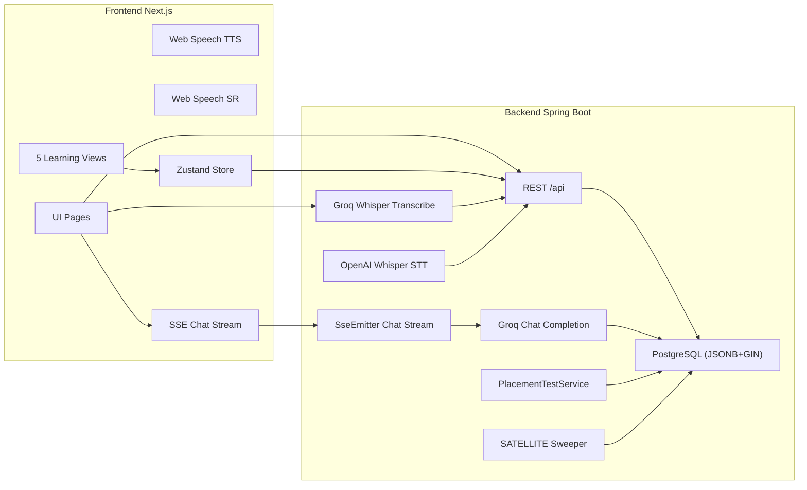

# SRS — DeutschFlow (Software Requirements Specification)

**Phiên bản:** 2.25  
**Ngày:** 2026-06-13  
**Ngôn ngữ:** Tiếng Việt  

**Changelog v2.25:** **B2B Organization Layer (P1–P3), Teacher Center Clusters + B2B GTM, SePay Bank-Transfer, Mock Exam Packs + Answer-Leak Fix, AI Grading JSON-Mode + Cost Accuracy, Free-Tier Caps, Co-brand Certificate, Codebase Review Remediation, Production Stabilization (DB Pool + AI Circuit Breaker + Redis Resilience)** — ~35 PRs (#71→#114), migrations V196→V218 (218 tổng). (1) **B2B Organization Foundation P1–P3 (PR #89, #108)**: Lớp tenant tổ chức (multi-tenant) — `organizations`/`org_members`/`org_invitations` (V204); roster CSV import + entitlement + seat management + org analytics (V205); billing/invoices + licence lifecycle + admin org UI (V206). `OrgService`, `OrgRosterService`, `OrgEntitlementService`, `OrgBillingService`, `OrgInvitationService`, `OrgQuotaService` (org-wide AI token pool + hard-cap enforcement). Org context (`orgId`/`orgRole`) inject vào JWT + `AuthResponse` (B2C non-org → cả hai null, y hệt cũ). Fix `org-create` 500 khi `plan_code` không tồn tại → `DataIntegrityViolationException` map sang 409 honest (#108). `docs/TEACHER_B2B_PHASE1_DESIGN.md`. (2) **Teacher Center Clusters + B2B GTM (PR #103, #92, #99)**: Cluster trung tâm dạy tiếng Đức — `teacher_center_name` (V215); admin growth/leads dashboard (D11-lite); B2B GTM instrumentation (PostHog); `marketing_leads` lead-capture (V211). Repositioning "Tự động hóa Sư phạm cho TT tiếng Đức" (vertical-only). (3) **SePay Bank-Transfer Payment C3 (PR #104)**: Webhook chuyển khoản ngân hàng (org-invoice auto-activation) — `SePayWebhookController` (Tiền-vào/JSON/API-Key auth, DFINV-code match, fail-closed); `org_invoice_payment` (V216). env `SEPAY_API_KEY` + bank vars. Kênh thanh toán VietQR/SePay cạnh MoMo/Stripe. (4) **Mock Exam Packs + Hardening (PR #84, #85, #106, #107)**: (a) Fix màn hình trắng `/student/mock-exam` — thiếu `min-h-0` trên flex scroll area → content tràn khỏi `fixed inset-0 overflow-hidden` shell (PR #84). (b) **Answer-leak (PR #85)**: `/start`+`/questions` lộ field `correct` ra client → `ExamQuestionSanitizer` strip đáp án + gửi field `type` cho FE render. (c) **Mock exam packs (PR #106/#107)**: admin CRUD `mock_exam_packs` (V217) + N+1 GROUP BY fix + FE pack drill-down + RBAC/auth tests. (5) **AI Grading JSON-Mode + Visibility (PR #93, #94, #96)**: Fix AI grading kẹt `SUBMITTED` — Groq ép `response_format=json_object` nhưng prompt thiếu chữ "json" → HTTP 400 bị `@Async` nuốt. Fix: JSON prompt + shared `AiGradeResultParser` + cost ledger + `GRADING_FAILED` visibility + FE poll fix; `markGradingFailed` (#93); grading model+eval upgrade (#96). (6) **AI Cost Accuracy (PR #91, #101)**: `AiCostEstimator` (split input/output pricing, fix ~43% llama underestimate); chính xác `aiCostDaily`/`aiUsageByFeature`; NEW `/api/admin/reports/ai-cost-summary`; real-ledger revenue cost (bỏ hardcode 5.35M); exclude demo accounts khỏi COGS (#101); token-analytics planning card (vi/en/de). (7) **Free-Tier Official + Daily Caps (PR #105, #99)**: Free tier chính thức + daily caps trên AI đắt tiền (D6) — `free_tier_usage` (V213) đóng lỗ margin non-org. (8) **Co-brand Certificate (PR #102)**: Chứng chỉ readiness đồng thương hiệu do org cấp — `org_certificates` (V214); khác V122 student cert. (9) **Codebase Review 2026-06-10 Remediation**: 6-agent full review → `docs/CODEBASE_REVIEW_2026-06-10.md`. Khắc phục SEC-1..10, BE-C2/C3, BE-H*, DB-C/H, FE-C/H, MB-H, AR-M1 (Capacitor purge): missing user FKs (V196), financial timestamps → `timestamptz` (V199), consistency batch FK+timestamptz+indexes (V200), `async_jobs` owner (V201), drop dead SRS tables (V202), drop legacy quiz tables (V203). (10) **Teacher B2B Group B (PR #86, #88)**: Xóa legacy quiz system khỏi teacher role (dead `classrooms` schema); 2 IDOR fixes; gradebook + co-teaching (existing `ClassTeacher`); admin re-point; V200. Reports moved → `/api/v2/teacher/reports`. Student evaluation (V209), class lesson logs/attendance (V208), teacher skill on assignments (V207), STT usage events (V210). **✅ PROD DEPLOYED 2026-06-10**. (11) **Production Stabilization — DB Pool + AI Circuit Breaker (PR #113, Đợt 1+2+2.3)**: Cầm máu pool DB — API telemetry buffered/batched (bỏ 1 INSERT/request làm starve Hikari pool), tách transaction, HTTP timeout, Tomcat threads 80→48 (fit EC2 t3.medium 2 vCPU), Hikari min-idle 2→5; resilience4j circuit breakers cho outbound AI (`aiServer`/`groqChat`/`groqWhisper` — fail fast khi upstream chết); `DataRetentionJob` nightly purge bảng event vô hạn (V218); `requestId` MDC log correlation; Grafana dashboard + Prometheus + alertmanager. Chuẩn bị load test 100 CCU (`docs/LOAD_TEST_100CCU_CHECKLIST.md`). LIVE P0: EC2 t3.medium + RDS db.t4g.micro (1GB, max_conn~112) là điểm nghẽn. (12) **Teacher Grading De-sync Fix (PR #113)**: FE chống mất đồng bộ khi pool DB nghẽn — error+retry UI, idempotent-GET-only jittered retries, WRITING type ×4, GradingPanel AI button disabled-with-reason, 3 surfaces unified trên `GradingPanel`. (13) **Redis Resilience Hardening (PR #114)** — ⚠️ **đính chính:** PR này KHÔNG phải fix của `ERR-161`/`ERR-74C` (chẩn đoán Redis ban đầu sai — xem RCA bên dưới). Nó là **hardening best-effort**: `spring.data.redis.timeout`+`connect-timeout`=300ms (Redis chết → fail nhanh → in-memory fallback ngay thay vì treo); `management.health.redis.enabled=false` (Redis best-effort — rate-limit + L2 cache optional, đều có fallback — không kéo health/readiness xuống DOWN, giống `mail` đã loại); regression test cho fallback. Vô hại + hữu ích, nhưng không phải nguyên nhân gốc của sự cố login. **RCA (`docs/RCA_ERR-161.md`):** `ERR-161` = `GlobalExceptionHandler` che một lỗi tầng DB chưa-xử-lý trên `/api/auth/login` — Hikari pool cạn (hoặc Postgres không với tới) → `authenticate()`/tx-begin chờ hết `connection-timeout` 5s → `CannotGetJdbcConnectionException`/`CannotCreateTransactionException`, không phải `BadCredentialsException` nên không bị catch → 500. Cùng nguyên nhân làm health 503. Timing 5.9s = Hikari 5000ms (Lettuce mặc định 10s/60s — Redis bị loại). **Fix gốc thật = PR #113** (DB pool stabilization), đi cùng chuyến deploy 18:06 (`205022c2`). Chứng minh bằng test xác định (`GlobalExceptionHandlerTest`, `AuthServiceUnitTest`, `AuthRateLimiterServiceUnitTest` — Redis-fail thì degrade, không 500). **Hardening tiếp theo:** thêm `@ExceptionHandler` map `DataAccessResourceFailureException`/`CannotCreateTransactionException` → **503 Service Unavailable + Retry-After** (trung thực + FE retry) thay vì 500 chung chung. (14) **Misc Fixes**: teacher-report score 0-100% (was 234.4 on "10-scale") (#112); admin-plans relative fetch (#111); prod smoke-test followups (#109); Sprechen Teil2 model-arg fix (#100); error friendly-names port (#90); middleware no-verifier graceful degradation 503→passthrough (#68); missing-endpoint → honest 404 (#71); assignment speaking-scenario lazy-gen (#72); motivation/daily-goal trên learning profile (V198). ✅ **Deploy status (cập nhật 2026-06-13 18:06):** backend ĐÃ deploy `205022c2` (blue-green) — login 400@0.8s, health UP@0.9s, ERR-161 hết. (Root cause là DB pool exhaustion fixed bởi #113, không phải Redis — xem RCA item 13.) Trước đó SSH tới EC2 bị chặn (security group — IP nhà đổi); đã whitelist IP mới cho port 22.

**Changelog v2.24:** **Video Lessons, SRS FSRS-4.5 Consolidation, Onboarding Mentor, Speaking Chat UX, Security Hardening Phase 0, Mobile Analytics, New-User Guide, Student Classes, Onboarding Value-First, P0 Security/Integrity/Auth** — 21+ commits, 197+ migrations tổng. (1) **Video Lessons (M1–M3, all merged 2026-06-05)**: `VideoLessonService` + `VideoLessonController` — M1 vocab player (image+German-narration), Phase B `.mp4` export với `ffmpeg` + burned captions (Dockerfile cập nhật: `ffmpeg` + `DejaVuSans-Bold.ttf`), SRS-due video source, grammar videos (text-cards, không LLM), listening/dialogue videos (Groq `llama-3.3-70b-versatile`, topic-picker), Unsplash admin image picker. NEEDS: backend deploy (Dockerfile mới có ffmpeg+DejaVu) + Groq LLM key trước khi verify `.mp4`/listening trên prod. (2) **SRS FSRS-4.5 Consolidation (dc516a6c, 25a010c5)**: FSRS-4.5 là canonical — SM-2 chỉ còn cho audit/rollback, tất cả card mới bắt đầu là FSRS. `SrsVocabScheduler` bridge 5 content flows (PracticeNodeService, SkillTreeService, LearningSessionWorkflowService, BeginnerJourneyService, VocabularyService). `FsrsWeightOptimizerService` nightly 03:00 UTC điều chỉnh `w17` per-user (≥50 reviews, correction ±0.3 max) → `user_learning_profiles.fsrs_weights_json` (V178). `FsrsWeightProvider` resolve per-review (không cache). `POST /srs/review/batch` cho offline queue. `countMastered` (≥21 ngày interval) = tín hiệu mastery thực cho phase progression và B1 readiness. SM-2 migrate-on-read: card SM-2 được upgrade FSRS trên lần review đầu tiên. (3) **Onboarding Mentor (PR #51, merged 2026-06-05)**: 5 loại onboarding O1-O5, Platform×Level matrix router (`GET /onboarding/route` + `GET /onboarding/mentor`). `FixedMentorResolver` — deterministic fixed-mentor assignment theo industry family. `OnboardingTypeResolver`. V192–V194. "Meet your mentor" reveal trên web + mobile. `MentorChip` trên dashboard. PostHog A/B flag `onboarding-mentor-upsell`. 95 backend tests (MockMvc HTTP). web+mobile tsc+eslint+i18n clean. Chỉ defer: email SEND provider + PostHog dashboard config. (4) **Speaking Chat UX (349a30f, 2026-06-03)**: Mobile AI-Speaking — persona avatars, `RevealText` word-by-word animation, long-chat perf (`memo MessageBubble` + paused-blink), correction card redesign. `expo-speech` autolinks on EAS (local pod stale — verify on device). (5) **Security Hardening Phase 0 (2026-06-03)**: Codegraph audit web+mobile+backend — 5 commits: prompt-injection S1 (system prompt isolation), actuator lockdown + XFF whitelist + PII log scrubbing, web CSP headers + middleware + ServiceWorker scope, mobile `SecureStore`/ATS config. S11–S21 deferred trong `docs/SECURITY_ANALYSIS.md`. (6) **Mobile Analytics Phase 0-2 (2026-06-04)**: PostHog React Native layer scaffold + guide instrumented (mirrors web taxonomy/US cloud). tsc-clean. ACTIVATION cần PostHog key trong `app.json` + EAS rebuild. Phase 3-4 (full app coverage) deferred. (7) **New-User Guide (2026-06-04)**: One-time product tour + help page trên web & mobile. `localStorage`/`SecureStore` persistence — existing users thấy tour 1 lần khi mở lại. `guide.*` i18n (vi/en/de). (8) **Student Classes + Teacher Lesson Checklist (PR #69, 2026-06-07)**: "Lớp của tôi" page cho student, teacher lesson checklist. `class_lessons` table (V197). Class progress = teacher-tick (không tự động từ assignments). Join luôn PENDING (teacher approves). Mobile = student-only. (9) **Onboarding Value-First Hybrid (PR #70, merged 2026-06-08)**: Duolingo value-first onboarding (PA2 Hybrid). Gated behind PostHog flag `onboarding-value-first` (OFF). 8/8 CI green. Needs: backend deploy + E2E/device test + flag enable. (10) **P0 Security/Integrity/Auth (PR #57, #58, #60, #63, #66, #67)**: Fix A1→B1 journey; missing FK constraints; V195 hot-path indexes (5 indexes mới: `user_notifications`/`user_xp_events`/`skill_tree_node_dependencies`/`skill_tree_user_progress`, drop duplicate `idx_words_cefr`); DailyNotificationJob fix (queried non-existent `review_queue` table); per-user rate limit trên Whisper transcribe endpoint (PR #63); prod CSP headers (PR #66); middleware moved to `src/` để thực sự run trên Next.js App Router (PR #67) + non-regressing auth gate; removed `--no-verify` từ deploy. (11) **Web A11y/UX (PR #64)**: Error boundaries, reduced-motion support, accessible Modal primitive với focus trap + keyboard navigation. (12) **Mobile A11y (PR #61, #62)**: Label base interactive primitives (a11y), handle mic-permission denial gracefully (không fall vào generic error). (13) **XP Formula Tests (PR #65)**: 25 test cases pin triangular level formula (test suite `xp`).

**Changelog v2.23:** **MVP Reconciliation + iOS B2C Loop Wired to Shared Core** — xem mục "Hoàn Thành Trong Phiên Làm Việc Trước (v2.23)" trong Current State.

**Changelog v2.22:** **Stripe Checkout, B1/B2 Exam Content, Answer Review, Vitest Tests, Redis L2, Performance Indexes, GlosbeAutoImport** — 1 commit (`f08b27a`), 185 migrations tổng. (1) **Stripe Checkout Backend**: `StripePaymentService` — VND→USD cents conversion (min 50¢), `createCheckoutSession()` lưu PENDING `PaymentTransaction` với `provider="STRIPE"`, `handleWebhook()` xác thực HMAC signature + gọi `SubscriptionActivationService`; graceful degradation khi `STRIPE_SECRET_KEY` trống; `StripePaymentController` — `POST /api/payments/stripe/create-session` (auth required) + `POST /api/payments/stripe/webhook` (raw body, permit all); `V182__stripe_payment.sql` thêm `stripe_session_id` column. (2) **Stripe Checkout Frontend**: `createStripeSession()` trong `paymentApi.ts`; pricing page thêm Stripe button cạnh MoMo (discriminated union loading key `momo-PRO/ULTRA/stripe-PRO/ULTRA`); `useSearchParams` detect `?stripe=success/cancel` return banner; i18n keys thêm vào vi/en/de. (3) **B1 Exam Content (V183)**: 2 Goethe B1 variants — Set 1 (Beruf/Freizeit/Reisen), Set 2 (Umwelt/Gesellschaft/Wohnen); mỗi set có LESEN (Richtig/Falsch + job matching + MC), HÖREN (MC dialogues + Richtig/Falsch radio interview), SCHREIBEN (2 FREE_TEXT prompts), SPRECHEN (2 SPEAKING_PROMPT). (4) **B2 Exam Content (V184)**: 2 Goethe B2 variants (100 phút, 4 sections 25pt mỗi) — Set 1 (Technologie/Wirtschaft/Gesundheit): AI in medicine, algorithm bias essay, startup negotiation speaking; Set 2 (Globalisierung/Bildung/Medien): journalism crisis analysis, university panel, argumentative essay. (5) **Answer Review Endpoint**: `GET /api/mock-exams/attempts/{id}/review` — trả `{ attemptId, totalScore, sections: [{sectionName, items: [{id, question, user_answer, correct_answer, is_correct, explanation}]}] }`; chỉ cho phép review attempt `COMPLETED`; parse `answers_submitted_json`, so sánh case-insensitive với `correct`/`correct_answer` field aliases. (6) **Answer Review UI**: mock-exam/page.tsx thêm view state `'review'`; nút "Xem đáp án chi tiết" trong result view; per-question cards với ✓ xanh / ✗ đỏ / "Chưa trả lời" xám; explanation text in nghiêng xám; border emerald/rose tương ứng. (7) **Vitest + RTL + MSW Infrastructure**: nâng `vitest ^2.1.8`, `@testing-library/react ^16.1.0`, thêm `@testing-library/user-event ^14.5.2`, `@vitest/ui ^2.1.8`; 26 tests mới — `useSpeakingChat.test.ts` (8 tests: initial state, handleSendMessage, guards, resetForNewSession), `useSpeech.test.ts` (8 tests: speak/stop/callbacks với `vi.stubGlobal`), `OnboardingWizard.test.tsx` (10 tests: step navigation, level selection, A0 shortcut, placement test flow); coverage threshold 60% cho `src/lib/**`. (8) **Performance Indexes (V185)**: `idx_words_lower_base_form` trên `LOWER(base_form)` cho case-insensitive vocab upsert; `idx_grammar_errors_user_point_created` trên `(user_id, grammar_point, created_at)` cho time-windowed weak-point queries; cả hai dùng `CONCURRENTLY IF NOT EXISTS`. (9) **Redis L2 Cache**: `RedisConfig` thêm `@ConditionalOnProperty(name = "spring.redis.host")` + `@ConditionalOnClass` — Redis chỉ activate khi `REDIS_HOST` được set; Caffeine L1 luôn active; tránh `NoSuchBeanDefinitionException` trong dev/test không có Redis. (10) **GlosbeAutoImport Startup**: `GlosbeVocabularyAutoImportRunner` thêm `@Async @EventListener(ApplicationReadyEvent)` để chạy incremental import ngay sau startup mà không block; `runScheduledImport()` và `onApplicationReady()` đều delegate sang `runImport(String trigger)` với log bao gồm trigger source.

**Changelog v2.21:** **Notification Scheduler, iOS Sprint Polish, Pronunciation Feedback, Teacher Marketplace, A2/B1 Content, FSRS Optimizer, Adaptive Engine, AI Cost Dashboard** — 11 commits mới, 181 migrations tổng. (1) **Notification System** (`a3ec919`, `edcca2c`): Hệ thống thông báo hoàn chỉnh với bell badge số chưa đọc; inbox redesign với date-groups + category-tabs; admin broadcast page; teacher announce modal; `NotificationSchedulerService` xử lý hàng chờ broadcast tự động (scheduled queue, exponential retry); `GET /notifications/unread-count`, `POST /notifications/broadcast/queue`. (2) **iOS Sprints 1–3 + iOS 26 Polish** (`111a381`–`b811aea`): Liquid Glass nav bar cho iOS 26 (`UINavigationBarAppearance`); safe-area gap fix cho Dynamic Island + iPhone 15 Pro; `DFLogo` refactor; Sprint 1 — offline error screen, deep links, status bar gaps; Sprint 2 — keyboard avoidance (`KeyboardAvoidingView`), notif tap routing, native detection; Sprint 3 — haptics expansion (success/warning/error), page-enter animation, `contentInset` fix; Sprint 3 P3 — offline banner, Sentry crash reporting, SwiftUI a11y improvements. (3) **Phase 0 Refactor**: Xóa `react-dnd`, giữ `@dnd-kit` duy nhất; eradicate `any` types ở critical paths; fix i18n leak ở pricing page. (4) **MoMo Payment End-to-End** (verified existing): `MomoPaymentService.createOrder()` → payUrl redirect → `handleIpn()` HMAC-SHA256 verify → `syncPendingOrderFromMomo()` 5-retry fallback; PostHog events `paywall_viewed`, `checkout_started`, `checkout_completed`, `checkout_abandoned`. (5) **PremiumGate Banners**: Thêm banner PRO gate cho `/student/mock-exam` và `/student/weekly-speaking` (trước đây không có gate). (6) **Offline SRS Batch Sync**: `offlineSync.syncPendingReviews()` nâng cấp từ individual requests → single `POST /srs/review/batch` — atomically clear queue on success, stay queued on failure. (7) **Pronunciation Feedback + Shadowing Practice**: `PronunciationFeedback.tsx` (standalone component): MediaRecorder → `POST /api/speaking/pronunciation-check` → word-by-word CORRECT/CLOSE/MISSING với hover tooltips + progress bar; `PronunciationScorerService.java` (LCS align + Levenshtein blended với Whisper `avg_logprob`); `GroqWhisperClient.transcribeVerbose()` (`response_format=verbose_json`, word timestamps); shadowing section inject vào `ListeningView.tsx` sau khi hoàn thành fill-in-the-blanks (passage text reconstructed từ word timestamps). (8) **A2/B1 Content Expansion** (V180–V181): `V180__content_a2_core_lessons.sql` — full content_json cho A2 days 31/35/39/40; `V181__curriculum_b1.sql` — 5 B1 nodes (days 51–55) + `skill_tree_edges`; `TeacherSession.java` entity với Status/PaymentStatus/PayoutStatus enums. (9) **Teacher Marketplace** (V179): `teacher_sessions` table + `hourly_rate_vnd` trên `teacher_profiles`; `TeacherSessionService` — `bookSession()`, `updateStatus()`, `getEarningsSummary()` (15% platform fee); `TeacherSessionController` 8 endpoints; Frontend: `/student/book-session/page.tsx` (duration selector + real-time price), `/teacher/sessions/page.tsx` (earnings dashboard), `/teachers/[id]` thêm CTA "Đặt lịch học". (10) **Per-User FSRS Weight Optimizer**: `FsrsWeightOptimizerService` — `@Scheduled(cron "0 0 3 * * *")` nightly job điều chỉnh `w17` per-user dựa trên retention error (≥50 reviews threshold). (11) **Adaptive Difficulty Engine**: `AdaptiveEngineService.getWeakPoints()` kết hợp grammar error history + SRS failure ranking để gợi ý bài ôn phù hợp. (12) **AI Cost Observability Dashboard**: `AiUsageLedgerService.record()` ghi token usage events; `/admin/token-analytics/page.tsx` hiển thị pie chart (cost by model) + area chart (token usage over time). (13) **E2E Tests**: `frontend/tests/e2e/payment-and-srs.spec.ts` — test flow payment + SRS offline sync. (14) **Speaking UI Polish**: `SpeakingPersonaFloat.tsx`, `SpeakingMessageBubble.tsx`, `SuggestionBar.tsx` refined; `SystemPromptBuilder.java` extended; iOS `Package.swift` SPM update.

**Changelog v2.20:** **iOS Native App Unification + Push Notifications + Mock Exam Hardening** — 10 commits, 174 migrations tổng. (1) **iOS Native UI Unification (S0–S5)**: `DesignTokens.swift` là single source of truth cho design tokens iOS (mirrors web CSS variables — radius, spring presets, brand palette); `SplashScreenView.swift` (dark luxury, no white flash); `OnboardingView.swift` (native SwiftUI onboarding 3 bước với `@UIApplicationMain` orchestration); `AuthChoiceView.swift` (CTA đăng ký / đăng nhập); `WebViewExtensions.swift` (WKWebView customizations); `AppDelegate.swift` với push notification registration routing qua Capacitor. Toàn bộ entry experience trên iOS giờ là native SwiftUI trước khi trao quyền cho WKWebView. (2) **Xcode Auto-Build Script**: `PBXShellScriptBuildPhase` chạy `npm run build:mobile` + `npx cap sync ios` trước mỗi lần Xcode build — không cần bước thủ công. (3) **APNs Push Notifications end-to-end**: `V174__user_push_tokens.sql` thêm `push_token TEXT` + `push_platform VARCHAR(10)` vào bảng `users`; `App.entitlements` (Debug/development), `AppRelease.entitlements` (Release/production) — split tách biệt để App Store submission không ship sandbox push environment; `NativeAuthProvider.tsx` tự động đăng ký push token sau khi mount và `POST /profile/me/push-token` lên backend; `usePushNotifications` hook cho flow iOS → APNs → backend. (4) **Mock Exam Hardening**: `V172__enhance_exam_evaluation.sql` mở rộng `mock_exam_attempts` với `detailed_scores_json`, `weak_areas`, `time_spent_json`, `answers_submitted_json`, `evaluation_notes`, `ai_feedback_json`; tạo 2 bảng mới `mock_exam_question_metadata` (per-question difficulty/topics/explanations/sample_answers) và `mock_exam_analytics` (per-attempt-section analytics snapshot cho dashboard queries); `V173__mock_exam_variants_a1.sql` seed thêm A1 exam variants. Frontend: dynamic CEFR level selector (A1–B2, auto-sync với `targetLevel`), resume attempt thực sự qua endpoint `/start` (bỏ `alert()`), `AudioPlayer` component cho section HOEREN — phát trực tiếp TTS không cần S3. (5) **Lego Game Dynamic Questions**: `student/game/page.tsx` giờ gọi `GET /grammar/syllabus/topics` (A1 level) để lấy `FILL_BLANK`/`MULTIPLE_CHOICE` exercises, convert sang lego format (split prompt by blank marker, map options to pool); dynamic progress bar; fallback graceful nếu API không trả được exercise. (6) **Practice + Vocabulary Real API Wiring**: `GET /practice/exercises` + `POST /practice/submit` thay thế mock data trong `/student/practice`; `VocabularyListA1` và `GrammarContextModal` dùng API calls thực (xóa placeholder stubs). (7) **XP Award Wiring for Practice**: `PracticeNodeService` tặng XP khi practice session hoàn thành (score ≥ 60); `PracticeNodeServiceXpWiringTest` 4 test cases (award / no-award / BadRequest / NotFound). (8) **WiktionaryScraperService Restored**: phục hồi từ git history — HTML fetch via jsoup, parse German section, extract gender/IPA/plural/meaning/examples/usage-note/verb-data, rate limit 1 req/s; trước đó trả `Optional.empty()` mọi trường hợp, làm im lặng 3 admin batch enrichment services. (9) **Code Quality Sweep**: toàn bộ `alert()` trên 10+ file được thay bằng sonner `toast.error()`/`toast.success()` (mock-exam, certificates, grammar-review, teacher pages, onboarding, dashboard join-class, admin ai-config); `VocabularyImportService.java` xóa (3 unimplemented TODOs, không được wire); `VocabularyImportServiceUnitTest` xóa.

**Changelog v2.19:** **Phase 1 Foundation + AI Interview Expansion (Directions A/B/C)** — 5 commits, 171 migrations tổng. (1) **Learner Phase Engine** (V159): `learner_phase_states` table + `PhaseController` tracking 3 phases `FOUNDATION → PRODUCTION → FLUENCY` per user; metrics: vocabulary_mastered_count, speaking_minutes_total, grammar_accuracy_percent, sessions_completed. (2) **Beginner Journey** (V160–V161): `beginner_journey_items` table (20+ items: VOCABULARY/PHRASE/DIALOGUE_PROMPT); `BeginnerJourneyController` → `GET /api/beginner/journey`, `GET /api/beginner/speaking/day-one`; Day-1 dialogue templates seeded (Hallo, Guten Morgen, Vorstellung…). (3) **B1 Assessment Engine** (V162): `b1_assessment_states` table (5 checks: vocabulary/speaking/grammar/confidence/mock_exam); `AssessmentController` → `GET /api/assessment/b1-readiness` trả readiness_score 0–100, `POST /api/assessment/mock-exam` ghi kết quả. (4) **Grammar Cases System**: `GrammarCasesController` expose `GET /api/grammar/cases`, `GET /api/grammar/cases/{case}`, articles, exercises; 4 entities mới (GrammarCase, GrammarArticle, GrammarCaseExample, GrammarCaseExercise). (5) **Interview Infrastructure** (V163–V171): 9 DB tables mới — `interview_persona` (15 personas: LUKAS/EMMA/ANNA/KLAUS/WEBER/SARAH/SCHNEIDER/LENA/THOMAS/PETRA/MAX/OLIVER/NIKLAS/NINA/HANNIE với difficulty BEGINNER/INTERMEDIATE/ADVANCED), `interview_question` (question bank per-persona, shared DEFAULT questions), `interview_rubric_template`, `interview_turn`, `interview_phase_result`, `interview_experiment_assignment`, `interview_session_versioning`; V170 seed B1 mock exam; V171 question bank extension. (6) **Interview Domain API** (`/api/interviews/*`): `InterviewController` (personas, turns, phase-results, report, analytics) + `InterviewAdminController` (rubric mgmt, experiment mgmt); `PersonaRegistryService`, `InterviewTurnPersistenceService`, `InterviewPhaseEvaluationService`, `InterviewReportService`, `InterviewAnalyticsQueryService` (5 fixed queries, zero N+1). (7) **Direction A — Technical Gap Closure**: `PersonaInterviewRegistry` DB-first question selection + `pickChallengeFollowUp()` Variant C adaptive; `InterviewOrchestrator` 7-arg `planTurn()` with promptVariant; JPQL aggregate queries eliminating N+1 (`aggregateByPhase()`, `avgScorePerSession()` Spring Data projections); verdict strings chuẩn hóa `PASS/CONDITIONAL_PASS/NOT_PASS`. 25/25 tests pass. (8) **Direction B — DB-Driven Personas in CompanionSelect**: `CompanionSelect` fetch `GET /api/interviews/personas` on mount, auto-select roleTitle; fixed infinite loading bug (stale `profile` state removed). (9) **Direction C — Premium Persona Gate + UX**: ADVANCED personas locked for FREE tier (PRO paywall nudge → `/student/pricing`); weekly session counter chip "X/3 tuần này" cho FREE users; report download button (JSON); `InterviewPersonaInfo.difficulty` type fixed `number→string`. (10) **Vocabulary UI Components**: `ArticleQuiz.tsx` (der/die/das article practice), `DeclinationTable.tsx` (noun declension grid), `VocabularyFilter.tsx` (enhanced filter UI). (11) **Mobile Capacitor**: `capacitor.config.json` + Android/iOS project scaffolding (Capacitor 6); package `com.deutschflow.app`. (12) **Admin Analytics**: `/admin/interview-analytics/page.tsx` hiển thị session stats, completion rate, phase drop-off, variant distribution.

**Changelog v2.18:** **Mock Goethe Exam Upgrade — Sprints 1-4 Complete** (1) **Sprint 1: Core Scoring** — `ExamScoringService` thay thế `Math.random()` bằng rubric-based scoring cho 4 sections (Lesen 25pt, Hören 25pt, Schreiben 25pt, Sprechen 25pt) theo tiêu chuẩn Goethe chính thức. `ExamEvaluationRubric` định nghĩa chuẩn Schreiben (Aufgabenerfüllung 5pt, Kohärenz 4pt, Wortschatz 3pt, Strukturen 3pt). `MockExamController` endpoint `/finish` tính `detailed_scores_json` + `weak_areas` (sections <60%). 22 unit tests tất cả pass. (2) **Sprint 2: Frontend Components** — `ExamProgressBar` (per-section dots), `DetailedScoreBreakdown` (score cards 60% threshold), `ExamFeedback` (AI evaluation rubric bars), `WeakAreasRecommendation` (weak sections + study tips Vietnam). (3) **Sprint 3: AI Evaluation** — `AiExamEvaluatorService` dùng Groq LLM đánh giá Schreiben Teil 2 email theo Goethe rubric; graceful fallback `PENDING_AI_EVALUATION` trên lỗi. Frontend `ExamFeedback` hiển thị AI rubric breakdown + feedback text + strengths/improvements. (4) **Sprint 4: Real Questions + Exam Rotation** — `V140__mock_exam_variants_a1.sql` seed 2 thêm variants hoàn chỉnh (Set 2: health/family/shopping; Set 3: travel/work/food); tổng 3 variants ~135 câu. `ExamGenerationService` least-recently-attempted strategy (NULLS FIRST never-attempted first). Endpoints `/recommend` và `/coverage`. Java 25 fix: JdbcOperations interface thay JdbcTemplate. Frontend show "Gợi ý" badge + indigo styling cho recommended exam. (5) **Test Coverage**: 22 passing tests (5 ExamScoringServiceTest, 7 AiExamEvaluatorServiceTest, 5 ExamGenerationServiceTest, 5 MockExamControllerTest). TypeScript clean, 0 errors. (6) **Database**: V140 migration adds 3 complete A1 exam variants, 3 total distinct sets, all is_active=TRUE, 100 total_points, 60 pass_points, 75 min_time_limit_seconds.

**Changelog v2.17:** **Phase 1 & 2 Completion — Authentication Hardening, Error Analytics & Vocabulary Status Filter**. (1) **Authentication Injection Fix (CRITICAL)**: Sửa lỗi nghiêm trọng `userId = 1L` hardcoded trong `SpacedRepetitionController` và `SpeakingController`. Toàn bộ endpoint protected giờ dùng `@AuthenticationPrincipal User user` + `@PreAuthorize("isAuthenticated()")`. Lưu ý kỹ thuật: Spring Security version này không hỗ trợ `@AuthenticationPrincipal(required = false)` — thay bằng `Authentication authentication` + Java 21 pattern matching `authentication.getPrincipal() instanceof User u`. (2) **Jakarta Validation cho Phase 1 DTOs**: Bổ sung `@NotNull`, `@Min`, `@Max`, `@NotBlank`, `@Size` vào `RecordReviewRequest`, `CreateGreetingSessionRequest`, `SubmitResponseRequest`. `@Valid` được thêm vào tất cả controller methods tương ứng. (3) **Achievement Badges API** — `GET /api/achievements/me`: Endpoint mới trả danh sách tất cả achievements + trạng thái unlocked của user hiện tại. Frontend `AchievementBadges.tsx` đã call endpoint này nhưng backend chưa có — nay đã implement via `AchievementController`. (4) **Error Analytics Dashboard** — `GET /api/user/error-analytics`: `ErrorAnalyticsService` tổng hợp 30-day daily error trend, top 8 lỗi phổ biến nhất, weak areas từ `UserGrammarError`; `UserAnalyticsController` expose endpoint. Frontend `/student/stats` hiển thị `ErrorTrendChart` (Recharts LineChart 30 ngày, open errors badge đỏ/xanh). (5) **Vocabulary Learning Status Filter** — `GET /api/words?status=new|due|mastered`: Backend dùng EXISTS subqueries trên bảng `spaced_repetition_schedule` (`retention_status = LEARNING|REVIEWING|MASTERED`), whitelist `ALLOWED_STATUS` ngăn SQL injection. `WordController` nhận `Authentication` + `String status` param; page reset về 0 khi đổi filter. Frontend `VocabSearchBar` bổ sung row chip thứ 2 (Alle/Neu/Fällig/Gelernt) với màu sắc riêng biệt (blue/amber/emerald). (6) **WordDeclension & GrammarContext**: Entity `WordDeclension` mới + `GrammarContextService` nâng cấp cho context-aware grammar explanations. (7) **Migration count**: 157 migrations (V1-V157); V151-V157 bổ sung vocabulary enhancements, listening practice, grammar articles và declensions rubric. (8) **Java version correction**: Backend dùng **Java 21** (không phải Java 17 như ghi nhầm ở v2.16).

**Changelog v2.16:** **Deployment Readiness Check & Production-Ready Fixes** — Hoàn thiện chuẩn bị triển khai AWS. (1) **Deploy Script Fixes**: Sửa 2 lỗi nghiêm trọng trong `cleanup-deploy.sh` (dòng 50-51): thay thế ký tự Georgian "პასუხ" bằng biến English "reply" và sửa tham chiếu biến sai `${reply:-$response}` → `${reply:-}`; Cập nhật `deploy-backend.sh` dòng 27 để tham chiếu tên tệp Google SA JSON chính xác (`google-sa.json`). (2) **Credentials Management**: Đổi tên tệp `deutschflow-494811-dd5589a3e83e.json` → `google-sa.json` để phù hợp với kỳ vọng script deployment. (3) **Environment Verification**: Kiểm chứng `.env.production` có đầy đủ 13 biến bắt buộc (DB_HOST, DB_PASSWORD, JWT_SECRET, GROQ_API_KEY, AWS_ACCESS_KEY_ID, AWS_SECRET_ACCESS_KEY, GEMINI_API_KEY, UNSPLASH_ENABLED, UNSPLASH_ACCESS_KEY, UNSPLASH_APPLICATION_NAME, UNSPLASH_TIMEOUT_MS, UNSPLASH_CONNECT_TIMEOUT_MS, UNSPLASH_MAX_RETRY_ATTEMPTS). (4) **Deployment Checklist**: Tạo tài liệu `DEPLOYMENT_FIXES_APPLIED.md` ghi chi tiết tất cả sửa chữa, trạng thái xác thực và bước tiếp theo (xác minh EC2 IP). (5) **Ready for AWS Deployment**: Toàn bộ script deploy, file config, credential và dockerfile đã sẵn sàng để khởi động blue-green deployment trên AWS EC2. Timeline ước tính: 20-25 phút cho toàn bộ quá trình từ preflight checks đến health check cuối cùng.

**Changelog v2.15:** Triển khai **Unsplash Auto-Assign Hardening & Deployment Env Sync**. (1) **Unsplash env coverage**: Bổ sung và chuẩn hóa các biến môi trường `UNSPLASH_APPLICATION_NAME`, `UNSPLASH_TIMEOUT_MS`, `UNSPLASH_CONNECT_TIMEOUT_MS`, `UNSPLASH_MAX_RETRY_ATTEMPTS` vào `.env` và `.env.production` để bảo đảm backend có đủ cấu hình search/download ảnh khi auto-assign từ Unsplash. (2) **Fail-fast deploy validation**: Cập nhật `deploy-backend.sh` để preflight kiểm tra đủ bộ biến Unsplash bắt buộc trước khi sync lên EC2, tránh deploy thiếu cấu hình dẫn đến lỗi runtime. (3) **Runtime compatibility**: Xác nhận `docker-compose.prod.yml` truyền đủ biến Unsplash vào container backend qua `env_file`/`environment`, đảm bảo các giá trị từ `.env.production` không bị mất trong quá trình build/run bằng Docker. (4) **Documentation alignment**: Đồng bộ SRS với trạng thái triển khai hiện tại để phản ánh đúng yêu cầu hạ tầng cho Unsplash image workflow và quy trình deploy production.

**Changelog v2.13:** Triển khai **RoadmapMeta-First UI Consistency & Route Smoke-Check Hardening**. (1) **RoadmapMeta as Single Progress Source**: Chuẩn hoá `roadmapMeta` làm nguồn chính duy nhất cho progress hiển thị trên Dashboard, StudentShell header badges, roadmap page và các màn practice liên quan; loại bỏ các biến thể progress cũ (`dailyGoalProgress`, `planProgress`) khỏi luồng hiển thị. (2) **TodayPlan Contract Cleanup**: Gọn hoá `TodayPlanDto` để tập trung vào recommendation context (suggested lessons, repair items, speaking/vocab hints), tách rõ khỏi progress hiển thị; `TodayProgressDto` được gỡ khỏi contract today plan. (3) **Practice Screen Context Sync**: Mở rộng `useStudentPracticeSession` để trả `roadmapMeta`, đồng bộ context học cho `mock-exam`, `interviews`, `speaking-history` và các màn practice khác. (4) **Dashboard Retention Tuning**: Tinh gọn `suggestedLessons` và `next-best-action` theo hướng roadmap-driven, ưu tiên bước kế tiếp trong lộ trình để tăng retention và giảm phân mảnh trải nghiệm. (5) **Pre-deploy Smoke Checks**: Kiểm tra logic theo từng route chính (onboarding, dashboard, roadmap, speaking, mock-exam, interviews, speaking-history) trước deploy để đảm bảo API shape ổn định và không còn dependency ngầm vào plan/progress cũ.

**Changelog v2.12:** Triển khai **Product Optimization & Unified Learning Loop**. (1) **Unified Learning Loop**: Chuẩn hoá luồng học thành vòng lặp duy nhất `recommend → learn → capture mistakes → review → recommend` để mọi session đều tạo ra bước tiếp theo rõ ràng. (2) **Dashboard as Control Center**: Tái định vị Dashboard là trung tâm điều hướng của Student, ưu tiên hiển thị **Next Best Action**, tiến độ hôm nay và các mục đến hạn cần ôn, thay vì chỉ là bảng tổng hợp số liệu. (3) **Speaking Core Flow**: Củng cố Speaking thành feature lõi với pre-session context rõ ràng, post-session summary có cấu trúc và tự động đẩy lỗi vào review queue. (4) **Consolidated Review & Actionable Admin Views**: Đồng bộ hoá vocabulary, grammar, review và dashboard internal tools theo hướng “actionable decisions”, giảm fragmentation và làm rõ bước xử lý tiếp theo cho teacher/admin. 

**Changelog v2.11:** Triển khai **Student Notification Flows & Production Stability**. (1) **Classroom Event Notifications**: Mở rộng hệ thống thông báo realtime cho 5 sự kiện lớp học (Duyệt/Từ chối vào lớp, Thêm vào lớp, Có điểm chấm bài, Có bài tập mới) thông qua `UserNotificationService` + SSE. Bổ sung i18n và routing trên `NotificationBell`. (2) **Production Nginx Fix**: Giải quyết lỗi 404 và 413 khi tạo slide PPTX bằng cách tăng `client_max_body_size` lên 30MB trên Nginx reverse proxy và đồng bộ biến môi trường `NEXT_PUBLIC_BACKEND_URL`. (3) **Teacher Logout Standardization**: Sửa lỗi chuyển nhầm màn hình Student sau khi Teacher đăng xuất bằng cách chuẩn hóa hàm `logout()`, đảm bảo clear triệt để toàn bộ Cookies (`auth_access`, `auth_role`) trước khi hard-redirect về `/login`.

**Changelog v2.10:** Triển khai **Teacher Analytics, Reporting & Profile Management**. (1) **Real-time Analytics Engine**: Viết lại hoàn toàn `TeacherAnalyticsService`, thay thế dữ liệu mock bằng JPQL aggregation queries trực tiếp từ `StudentAssignmentRepository` và `AiSpeakingSessionRepository`. Tối ưu hoá việc truy vấn metrics trước và sau khi vào lớp (dựa trên `joinedAt`) mà không kéo toàn bộ record về RAM, giải quyết bài toán N+1. (2) **Teacher Dashboard & Class Detail**: Nâng cấp UI với số liệu thật cho widget "Cần chấm điểm" (`/api/v2/teacher/dashboard/summary`); bổ sung tính năng Đổi tên lớp (Optimistic UI), Thêm học viên bằng email, và Overview Cards (Student Count, Total XP, Completed Assignments) trên tab Phân tích lỗi. Thêm tính năng Xuất CSV cho báo cáo lớp học. (3) **Class Drill-down Reporting**: Cải tiến trang Báo cáo giáo viên (`/teacher/reports`) với dropdown chọn lớp, cho phép fetch live data và hiển thị báo cáo chi tiết theo từng lớp bên cạnh báo cáo tổng quan. (4) **Teacher Profile Management**: Xây dựng trang Hồ sơ cá nhân (`/teacher/profile`) cho phép giáo viên cập nhật thông tin công khai (`headline`, `bio`, `qualifications`) với chế độ Edit Mode, Optimistic UI và liên kết trực tiếp tới trang Marketplace công khai.

**Changelog v2.9:** Triển khai **Practice Node 4-Skill System & Curriculum Consolidation**. (1) **4-Skill Practice System**: Hệ thống tự động sinh 4 bài tập thực hành (Nghe, Nói, Đọc, Viết) khi học viên hoàn thành bài học lý thuyết. Giao diện `/student/practice-node` hiển thị thẻ kỹ năng với track XP riêng biệt. (2) **Anti-Repetition Engine**: Áp dụng SHA-256 hash trên JSON payload của từng bài tập, đối chiếu qua bảng `user_seen_exercise_hashes` để đảm bảo hệ thống sinh ra bộ câu hỏi mới (N+1 Generations) không trùng lặp khi người dùng chọn "Làm thêm". (3) **Multi-Skill Prompts**: Xây dựng `PracticeNodePromptBuilder` sinh 4 template AI bám sát tiêu chuẩn Goethe-Institut kèm giải thích tiếng Việt; hỗ trợ Web Speech API (Listening) và Whisper (Speaking). (4) **Curriculum Clarification**: Thiết lập Skill Tree DB làm Single Source of Truth, mapping trực tiếp Netzwerk Neu Units (L01-L09) vào Database; đánh dấu `a1.curriculum.json` chỉ là tài liệu tham khảo nội bộ để giải quyết dứt điểm nợ kỹ thuật 2 hệ giáo trình.

**Changelog v2.8:** Triển khai **System Refactoring, PWA Integration & Observability (Phase 3 & 4)**. (1) **Async API Refactor**: Nâng cấp `GeminiApiClient` sang Spring WebFlux (`WebClient`) kết hợp `CompletableFuture` và `@Async`, giải quyết triệt để lỗi Thread Exhaustion do I/O blocking trên Tomcat. (2) **PWA & State Management**: Tối ưu hóa `manifest.json` Next.js PWA build pipeline. Chuẩn hóa toàn bộ Global State bằng Zustand (`useUserStore`, `useSpeakingStore`, `useSrsStore`). (3) **Observability Stack**: Tích hợp Grafana, Prometheus, Loki, và Promtail vào `docker-compose.prod.yml`, tự động auto-provision Dashboard (AI Latency, DB Pool, Error Rates) và Alert Rules. (4) **API Versioning Strategy**: Xây dựng kiến trúc versioning nội tại bằng Custom Annotation `@ApiVersion`, tự động gán tiền tố `/api/vX` qua `ApiVersionRequestMappingHandlerMapping`, kèm `ApiDeprecationInterceptor` cho v1. (5) **Strict i18n CI/CD**: Xây dựng kịch bản Python (`check_i18n.py`) rà soát chuỗi tiếng Việt hardcoded trên React nodes, tích hợp chặn tự động (fail build) qua GitHub Actions (`frontend-ci.yml`).

**Changelog v2.7:** Triển khai **Teacher LMS v2 (Mã Mời Lớp Học & Luồng Xét Duyệt)** và **Vá lỗ hổng bảo mật React2Shell**. (1) **Classroom Join Requests**: Chuyển đổi hệ thống tham gia lớp học từ thêm thủ công bằng Email sang tự động bằng mã mời (`inviteCode` 8 ký tự). Xây dựng bảng `classroom_join_requests` cùng bộ API tương ứng (`GET`, `POST approve`, `POST reject`). (2) **Teacher Dashboard UI**: Thêm tab "Duyệt Học Viên" tại trang chi tiết lớp học (`/teacher/dashboard/[id]`) giúp giáo viên quản lý và xét duyệt hàng chờ. Gỡ bỏ công cụ thêm học viên qua Email. (3) **Student UI**: Tích hợp khối "Tham gia lớp học của giáo viên" bằng mã mời ngay tại Student Dashboard (`/dashboard`). (4) **Security Patch**: Cập nhật khẩn cấp phiên bản Next.js và `eslint-config-next` từ `14.2.3` lên `14.2.35` nhằm vá triệt để lỗ hổng thực thi mã từ xa (RCE) nghiêm trọng React2Shell (CVE-2025-55182).

**Changelog v2.6:** Triển khai **Teacher Dashboard Redesign & Review Mode (Phase 4)**. (1) **UI/UX Tối ưu**: Gộp `teacher/classes` vào `teacher/dashboard`, áp dụng Premium Cards, Glassmorphism, và Notification Badges (báo bài chờ chấm). Thêm các Top Widgets thống kê tổng quan (Học viên, Bài tập, Lớp tích cực). (2) **Review Mode**: Xây dựng màn hình không gian làm việc tập trung tại `/teacher/dashboard/[id]/students/[studentId]` tách biệt thành 2 Tab (Giao tiếp AI và Bài tập tĩnh), hỗ trợ Modal "Đánh giá & Chấm điểm" nhanh chóng. (3) **Hybrid Assignment Config**: Mở rộng form giao bài với `dueDate` và `assignmentType` (`GENERAL`, `SPEAKING_SCENARIO`, `VOCABULARY`, `GRAMMAR`) để chuẩn bị cho dữ liệu bài tập B2B2C nâng cao. (4) **Fix Routing & Architecture**: Redirect `/teacher` về `/teacher/dashboard`, gộp Menu Sidebar "Quản lý Lớp" vào Dashboard, dọn dẹp các đường dẫn cũ.

**Changelog v2.5:** Triển khai **Teacher Dashboard Integration (Phase 3)**. (1) **Backend Foundation**: Tạo `TeacherController`, `TeacherService`, và API endpoint (`/api/v2/teacher/classes`) phục vụ quản lý lớp học. Thay thế `TeacherClassroomController` cũ để tránh lỗi ambiguous mapping. (2) **Database Schema**: Tạo bảng `teacher_classes`, `class_students`, `class_assignments` (Migration V133) cho hệ thống B2B2C. (3) **Gamification Analytics**: Tích hợp luồng phân tích điểm yếu (weakness analytics) dựa trên `UserGrammarError` logs và XP data của từng lớp. (4) **Frontend UI**: Xây dựng Teacher Portal (`/teacher/dashboard` và `/teacher/classes/[id]`) thay thế cơ chế AuthProvider bằng hook `useStudentPracticeSession` chuẩn hoá; cập nhật trang Settings của Student để hỗ trợ tính năng "Tham gia lớp học" bằng mã Invite Code. (5) **Production CI/CD**: Áp dụng script `deploy-backend.sh` (Blue-Green) thành công.

**Changelog v2.4:** Triển khai **Pronunciation Engine V2 & Deterministic Grading**. (1) **Deterministic Word-Level Grading**: Thay thế cơ chế chấm điểm từng từ bằng LLM bằng thuật toán Levenshtein Distance để so khớp tuyệt đối giữa transcript và target text, loại bỏ hoàn toàn hiện tượng AI "ảo giác" (hallucination) tạo lỗi sai không có thật. (2) **Contextual Whisper Prompting**: Tích hợp `originalText` làm tham số `prompt` cho Groq Whisper API với `temperature = 0.0`, ép mô hình STT nhận diện bám sát ngữ cảnh câu gốc và "châm chước" các lỗi ngọng nhẹ của người dùng. (3) **Phonetics Expert LLM Role**: Định nghĩa lại vai trò của Groq LLM thành "Chuyên gia ngữ âm học", chỉ tập trung phân tích lý do phát âm sai dựa trên thói quen tiếng Việt và gợi ý sửa khẩu hình (kèm lớp bảo vệ Sanitize JSON rác). (4) **React Stale Closure Fix**: Giải quyết dứt điểm lỗi Frontend `SpeakingView.tsx` gửi sai target text khi user thao tác quá nhanh bằng cơ chế `useRef`.

**Changelog v2.3:** Triển khai **B2B2C AI Homework Flow, Onboarding Paywall & High-Conversion Landing Page**. (1) **Database Migration V125**: Thêm bảng `teacher_homework_submissions` và `user_placement_tests`. (2) **Onboarding Mock Exam & Paywall**: `AiSpeakingMockExamController` đánh giá năng lực bằng AI (CEFR, Radar Chart); `ReviewTasksController` giới hạn người dùng FREE chỉ được sửa 2 lỗi/ngày, đếm `lockedCount` để hiển thị mồi nhử nâng cấp PRO. (3) **Teacher B2B2C Flow**: Cập nhật `TeacherQuizService` và UI cho phép tạo quiz `AI_INTERVIEW`, lưu kết quả vào `teacher_homework_submissions`. (4) **Grammar Review UI**: Giao diện `/student/grammar-review` kết hợp Paywall Overlay. (5) **High-Conversion Landing Page**: Đập đi xây lại `/app/page.tsx` theo chuẩn Premium EdTech (Visual Hierarchy, Roadmap, CTAs).

**Changelog v2.2:** Triển khai **Supplemental Practice & Exam Prep System** và **Production API Audit**. (1) **Practice Module (V112/V113)**: Bảng `practice_exercises` và `practice_history` độc lập hoàn toàn với Skill Tree; hỗ trợ 2 loại bài tập `NORMAL` (bổ trợ) và `EXAM` (luyện thi Goethe/Telc); lọc theo CEFR level (A1-C2), kỹ năng và loại đề thi. (2) **XP-Only Rewards**: Thêm `XpEventType.CUSTOM_PRACTICE` vào hệ thống Gamification; `awardCustomPractice()` trong `XpService` tặng XP tỷ lệ theo % điểm (66% điểm → 66 XP/100 XP reward) nhưng **không kích hoạt Daily Streak** — giữ tính toàn vẹn chuỗi ngày học. (3) **Python Scraper**: `scraper.py` cào tự động đề thi Goethe-Institut → sinh SQL seed file (V113 B1 Lesen sample). (4) **Frontend `/student/practice`**: Trang thư viện bài tập mới với filter trình độ, grid cards, toast XP. (5) **Bug Fix — LearningPlanResponse**: DTO thiếu `sessionsPerWeek` và `minutesPerSession` khiến Dashboard widget hiển thị null — đã bổ sung 2 field, deploy production. (6) **Production API Audit (20/22 pass)**: Kiểm toàn bộ endpoints trên EC2; 20/22 pass; 2 lỗi còn lại là behavior đúng (user mới chưa qua onboarding nên chưa có learning plan). (7) **E2E Flow Verification**: Test toàn bộ luồng học viên mới — Đăng ký → Onboarding → Tạo plan → Dashboard → Today plan → Làm bài tập bổ trợ → Nhận XP trên production.

**Changelog v2.1:** Triển khai **Interactive Roadmap, Phoneme Coach, Gamification & SRS**. (1) **Interactive Skill Tree Graph**: Thay thế roadmap dạng list bằng canvas tương tác 2D sử dụng `@xyflow/react` (React Flow v12). Layout tự động căn giữa (Core spine dọc, Satellite tỏa ngang), hỗ trợ zoom/pan, minimap, tự động nhảy đến vị trí đang học. (2) **Phoneme Coach**: Đánh giá phát âm chi tiết cấp độ âm vị (phoneme-level) kết hợp AI Whisper STT và Groq LLM; giao diện highlight từ vựng theo độ chính xác (đỏ/vàng/xanh), chấm điểm %, cung cấp IPA và feedback cải thiện. (3) **Gamification (Achievements & Badges)**: Hệ thống huy hiệu chuyên ngành (IT, Y tế, Nhà hàng, v.v.) lưu trữ trong `user_achievements` (V111); Gallery UI hiển thị tier (Bronze/Silver/Gold/Diamond/Legendary) dựa trên XP và số bài học. (4) **SRS SM-2 Engine**: Tích hợp thuật toán Spaced Repetition (SM-2) cho Flashcard từ vựng/ngữ pháp (V110); tự động tính toán E-Factor, Interval, Next Review Date; giao diện luyện tập với chất lượng nhớ (1-5).

**Changelog v2.0:** Triển khai **Unified Curriculum V2** — kiến trúc DAG Skill Tree toàn diện (A1-C2). (1) **Database Migration V66-V71**: Schema mới với `module_number`, `tags TEXT[]`, `satellite_status`, GIN indexes trên JSONB; 35 nodes (10 full content, 25 skeleton); bảng `placement_questions` + `placement_test_sessions`. (2) **All-in-One Content API**: `GET /api/skill-tree/node/{nodeId}/session` trả ~30KB JSONB → Gzip ~5KB, zero-latency tab switching qua Zustand store. (3) **5 Unified Learning Views**: GrammarView (color-coded DER🔵/DIE🔴/DAS🟢 + tag filter), ReadingView (split-screen tap-to-translate), ListeningView (karaoke sync + fill-blank), SpeakingView (Web Audio waveform + Groq LLM pronunciation eval), WritingView (debounced 2s AI correction). (4) **Placement Test**: 10 câu hỏi Goethe-chuẩn 4 kỹ năng (Hören/Sprechen/Lesen/Schreiben), pass ≥ 7/10, retry sau 3 ngày đề khác. (5) **Onboarding V2**: 4 bước (chọn trình độ → mục tiêu/ngành → weekly target → placement test hoặc bắt đầu từ A0). (6) **WhisperApiClient**: Java-native OpenAI Whisper STT (loại bỏ Python sidecar), word-level timestamps. (7) **SATELLITE**: Orphan sweeper @Scheduled 15 phút, GENERATING > 10min → FAILED. (8) **Pronunciation Eval**: Groq LLM đánh giá phát âm (không dùng Levenshtein — chống anti-pattern Whisper auto-correct). (9) **Writing Correction**: Groq LLM sửa bài viết với phân loại lỗi (grammar/spelling/style).

**Changelog v1.9:** Triển khai **Automated Error Remediation Flow** và **Learning Roadmap Data Fixes**. (1) **Error Remediation Flow**: Xoá bỏ thao tác thủ công (nút "Đã nhớ"), thay bằng cơ chế tự động ghi nhận trạng thái `RESOLVED` sau khi hoàn thành drill sửa lỗi; (2) **Regression Detection**: Tự động mở lại lỗi (re-open) nếu tái phạm sau 7 ngày (không tính là lỗi mới để giữ lịch sử); (3) **Student Error UI**: Refactor màn hình lỗi thành 2 khu vực rõ rệt "Lỗi đang mở" (Open) và "Đã khắc phục" (Resolved), bổ sung administrative visibility. (4) **Roadmap Data Fixes**: Sửa lỗi seeding dữ liệu giáo trình A1 và đảm bảo endpoint `/api/skill-tree/me` trả về đúng personalized student roadmap.

**Changelog v1.8:** Triển khai **System Stability & Admin Data Management**. (1) **Backend Connection Pool Hardening**: Cấu hình HikariCP (5s timeout, 30s max-lifetime), refactor LLM integration (SkillTree & Interview) sang non-blocking transactions, thiết lập memory limits chống OOM. (2) **Admin Profile Management & Data Integrity**: Bắt buộc đăng ký số điện thoại VN (có uniqueness validation) và bổ sung tính năng Admin cập nhật thông tin học tập của học viên (Student Learning Profile). (3) **Frontend Build Optimization**: Sửa lỗi TypeScript block-scoped variables, sửa ReactNode type definitions trong admin modals, dọn dẹp các file rác/duplicate pages, tối ưu hoá AWS Amplify build caching.

**Changelog v1.7:** Mở rộng Curriculum Phase 2 và Nâng cấp AI Speaking. (1) **Curriculum Phase 2**: Áp dụng DAG-based skill tree (Days 15-28), mở rộng các node ngữ pháp (Modalverben, Akkusativ, Trennbare Verben). (2) **Template & Context Injection**: Tự động sinh nội dung học cá nhân hoá theo ngành nghề của user (IT, Medicine, Education) dựa trên `UserLearningProfile`. (3) **AI Speaking Enhancements**: Tích hợp giọng đọc nhân bản từ ElevenLabs cho 4 Personas; thêm Character profile images trên UI chọn Persona. (4) **AI Error Remediation & Evaluator Cooldown**: Cải thiện logic bắt lỗi, ngăn chặn over-correction; `TurnEvaluator` lưu lại các mã cooldown (như `CASE.PREP_DAT_MIT`) vào `SpeakingUserState` để giới hạn tần suất đánh giá một lỗi trong phiên hội thoại.

**Changelog v1.6:** Triển khai **Production Stabilization & Brand Identity**. (1) **Hệ thống Logo Bauhaus** — Component `DeutschFlowLogo` 3 biến thể (`horizontal` / `vertical` / `icon-only`); `DeutschFlowLoader` thay thế Loader2 spinner; `DeutschFlowSplash` màn hình intro; áp dụng toàn bộ: Login, Register, Landing page, StudentShell sidebar, AdminShell sidebar, Dashboard loading state. (2) **Logout tập trung** — Hàm `logout()` trong `authSession.ts`: gọi `POST /api/auth/logout` revoke refresh token trên server, xóa toàn bộ localStorage (không chỉ 2 key token), xóa cookies, hard redirect `window.location.href` thay `router.push` để wipe React state — ngăn state của user cũ rò rỉ sang session kế tiếp; fix 6 page có `onLogout={() => {}}` (no-op) và 13+ page dùng `clearTokens() + router.push()`. (3) **HikariCP Keepalive** — Thêm `keepalive-time: 120s` và `connection-test-query: SELECT 1` vào `application.yml`; ngăn stale connection khi AWS NLB cắt TCP idle sau 350 giây — loại bỏ lỗi "Connection is not available, request timed out after 20000ms" sau khi hệ thống idle ban đêm. (4) **Production Deployment** — AWS Amplify (Frontend, CI/CD auto-deploy từ branch `main`), AWS EC2 t2.micro (Backend Docker), AWS RDS PostgreSQL (Database), Cloudflare Flexible SSL, Nginx reverse proxy port 80→8080; domain `https://mydeutschflow.com` và `http://api.mydeutschflow.com`.


**Changelog v1.4:** Triển khai toàn bộ Architectural Remediation Plan — (1) **Production Cache Layer**: Caffeine 6 caches mới (`aiVocabCache` 24h, `ttsAudio` 24h, `aiVocabShort` 6h, `aiVocabQuiz` 1h, `achievements` 60min, `weeklyPrompts` 30min); `@Cacheable` cho `AIVocabularyService` (7 methods) + `ElevenLabsTtsService`; admin purge endpoint `POST /api/admin/cache/purge`; (2) **XP Leaderboard**: `GET /api/xp/leaderboard?limit=N`, `LeaderboardDto`, JPQL GROUP BY query trên `UserXpEvent`; (3) **AI Vocab security**: `@PreAuthorize("isAuthenticated()")` cho `AIVocabularyController`; (4) **Frontend FE-BE Gap Resolution**: 4 API adapters (`vocabAiApi.ts`, `reviewApi.ts`, `xpApi.ts`, `aiToolsApi.ts`); 6 màn hình mới (VocabAI Panel §23, Review Queue §24, Vocab Analytics §25, XP Leaderboard §26, Quick AI Toolbar §27, Error Drill rewired); `StudentShell` +3 nav items; (5) §22 cập nhật "Đã triển khai" và bổ sung §23-27.

**Changelog v1.3:** Bổ sung module Onboarding Wizard 4 bước (§6); ElevenLabs TTS + Persona Voice Mapping (§10.9); Module Lego Game (§19); Module Swipe Cards (§20); Module Groq Usage Tracking UI (§21); cập nhật bảng phạm vi (scope); thêm `hideSidebar` cho `StudentShell`; cập nhật kiến trúc TTS cascade (ElevenLabs API → Browser Web Speech); bổ sung §22 Đề xuất cải tiến kỹ thuật (cache, async AI, startup isolation); chỉnh sửa format Mục lục.  

**Changelog v1.2:** Đồng bộ với codebase — PostgreSQL làm DB chính (Flyway, Testcontainers); bổ sung Today/adaptive API, Error Review Tasks, hàng chờ ôn SRS (`/api/reviews`), thông báo + SSE, admin export training dataset & weekly speaking prompts; curriculum Netzwerk A1; Ability score API; chỉnh mô tả AI Speaking (chat blocking, danh sách session, kết thúc session); sửa mục HTTP lỗi parse AI (fallback, không ép 502).  

---

## 📊 Trạng Thái Hiện Tại (v2.25 — B2B Org Layer, Payments, Mock-Exam Packs, Stabilization, Redis Fix)

### ✅ Hoàn Thành Trong Phiên Làm Việc Này (v2.25)

1. **B2B Organization Foundation P1–P3 (PR #89, #108)** — multi-tenant org layer (organizations/members/invitations V204, roster+entitlement+seat+analytics V205, billing+invoices+licence+admin UI V206); org token-pool hard-cap; orgId/orgRole trong JWT; org-create 500→409 fix.
2. **Teacher Center Clusters + B2B GTM (PR #103, #92, #99)** — teacher_center_name (V215), admin growth/leads dashboard, GTM instrumentation, marketing_leads (V211).
3. **SePay Bank-Transfer C3 (PR #104)** — webhook org-invoice auto-activation, org_invoice_payment (V216); kênh VietQR/SePay.
4. **Mock Exam Packs + Hardening (PR #84, #85, #106, #107)** — fix màn trắng (min-h-0); answer-leak → ExamQuestionSanitizer; admin mock_exam_packs (V217) + N+1 fix + RBAC.
5. **AI Grading JSON-Mode + Visibility (PR #93, #94, #96)** — Groq json_object fix, AiGradeResultParser, GRADING_FAILED visibility, FE poll.
6. **AI Cost Accuracy (PR #91, #101)** — AiCostEstimator split pricing, /admin/reports/ai-cost-summary, exclude demo khỏi COGS.
7. **Free-Tier Official + Daily Caps (PR #105, #99)** — free_tier_usage (V213).
8. **Co-brand Certificate (PR #102)** — org_certificates (V214).
9. **Codebase Review 2026-06-10 Remediation** — SEC-1..10 + BE/DB/FE/MB fixes; V196 FKs, V199 timestamptz, V200 consistency batch, V201 async_jobs owner, V202 drop dead SRS, V203 drop legacy quiz.
10. **Teacher B2B Group B (PR #86, #88)** — quiz removal + 2 IDOR fixes + gradebook + co-teaching (V200, V207–V210). ✅ PROD DEPLOYED 2026-06-10.
11. **Production Stabilization Đợt 1+2+2.3 (PR #113)** — telemetry batching, tx split, Tomcat 80→48, Hikari min-idle 2→5, resilience4j AI circuit breakers, DataRetentionJob (V218), requestId MDC, Grafana/Prometheus/alertmanager.
12. **Teacher Grading De-sync Fix (PR #113)** — error+retry UI, idempotent jittered retries, GradingPanel unification.
13. **Redis Resilience Hardening (PR #114)** — 300ms Redis timeout + loại redis khỏi health + regression test. ⚠️ Đính chính: KHÔNG phải fix ERR-161 (chẩn đoán Redis sai). **ERR-161 thật = DB pool exhaustion**, fix bởi #113 (RCA: `docs/RCA_ERR-161.md`). Thêm: DB-conn-failure → 503 retryable. ✅ Deployed 18:06.

### ✅ Hoàn Thành Trong Phiên Làm Việc Trước (v2.24)

1. **Video Lessons (M1–M3)** — vocab player + ffmpeg .mp4 + SRS-due source + grammar videos + listening/dialogue (LLM) + Unsplash image picker. Merged to main 2026-06-05. NEEDS: backend deploy + Groq LLM key.
2. **SRS FSRS-4.5 Consolidation** — FSRS canonical; SM-2 migrate-on-read; SrsVocabScheduler bridge 5 flows; FsrsWeightOptimizerService nightly w17; FsrsWeightProvider per-review; POST /srs/review/batch offline queue; countMastered (≥21d) B1 signal; V178.
3. **Onboarding Mentor (PR #51)** — 5 types O1-O5, Platform×Level matrix, FixedMentorResolver, mentor reveal, MentorChip dashboard, PostHog A/B flag, V192–V194. Merged 2026-06-05.
4. **Speaking Chat UX** — persona avatars, RevealText word-by-word, long-chat perf (memo + paused-blink), correction card redesign. 349a30f, 2026-06-03.
5. **Security Hardening Phase 0** — prompt-injection S1, actuator lockdown/XFF/PII, web CSP+middleware+SW, mobile SecureStore/ATS. S11–S21 deferred. 2026-06-03.
6. **Mobile Analytics Phase 0-2** — PostHog RN scaffold + guide instrumented. ACTIVATION cần app.json key + EAS rebuild. 2026-06-04.
7. **New-User Guide** — one-time tour + help page web+mobile, localStorage/SecureStore persistence, guide.* i18n. 2026-06-04.
8. **Student Classes + Teacher Lesson Checklist (PR #69)** — "Lớp của tôi", class_lessons (V197), teacher-tick progress, PENDING join, mobile=student-only. 2026-06-07.
9. **Onboarding Value-First Hybrid (PR #70)** — PA2 Hybrid, gated PostHog `onboarding-value-first` (OFF). Merged 2026-06-08. Needs backend deploy + E2E + flag.
10. **P0 Security/Integrity/Auth** — A1→B1 journey fix; missing FKs; V195 (5 hot-path indexes); DailyNotificationJob fix (review_queue); Whisper per-user rate limit (PR #63); prod CSP (PR #66); middleware moved to src/ + auth gate (PR #67); --no-verify removed.
11. **Web A11y/UX (PR #64)** — Error boundaries, reduced-motion, accessible Modal primitive.
12. **Mobile A11y (PR #61, #62)** — label primitives, mic-permission denial handler.
13. **XP Formula Tests (PR #65)** — 25 test cases pin triangular level formula.

---

### ✅ Hoàn Thành Trong Phiên Làm Việc Trước (v2.23 — MVP Reconciliation + iOS B2C)

1. **Đối soát MVP Checklist 90 ngày** với codebase → `docs/superpowers/specs/2026-06-01-mvp-reconciliation.md`. Kết luận: backend core, web B2C, web B2B ~hoàn tất; lane **iOS B2C (`mobile/`) bị hỏng/thiếu**.

2. **iOS B2C — Sửa wiring Speaking/Interview** *(bug nghiêm trọng)*
   - `mobile/app/(student)/speaking.tsx` trước gọi `POST /speaking/sessions` + `POST /speaking/turn` — **không tồn tại** trên backend → toàn bộ luồng luyện tập iOS không chạy.
   - Đã sửa dùng core thật: `POST /ai-speaking/sessions` (INTERVIEW mode) → `POST /ai-speaking/transcribe` → `POST /ai-speaking/sessions/{id}/chat` → `PATCH …/end` → `GET /interviews/{id}/report`.
   - Thêm `mobile/lib/speakingApi.ts` — typed client mirror đúng DTO (`InterviewPersonaDto` dùng `code` chứ không phải `id`).
   - Hỗ trợ trả lời bằng **text + voice** (text không cần PRO → luôn hoàn thành được phiên), feedback inline per-turn, progress theo phase.

3. **iOS B2C — Onboarding** — `mobile/app/(auth)/onboarding.tsx`: goal (WORK/CERT) + target level + ngành/kỳ thi → `POST /onboarding/profile` → auto-start practice. `login.tsx`/`register.tsx` điều hướng theo `GET /onboarding/status`.

4. **iOS B2C — Feedback screen** — `mobile/components/speaking/SessionSummary.tsx`: verdict, điểm tổng, strengths/critical gaps/recommended drills, breakdown theo giai đoạn.

5. **Shared fixtures (§1)** — `mobile/lib/fixtures.ts` (persona/session/chat/report) cho dev/QA, mirror field names backend.

6. **iOS B2C — Progress/History screen** — mở rộng `mobile/app/(student)/stats.tsx`: điểm kỹ năng theo CEFR (Đọc/Nghe/Viết/Nói) từ `GET /progress/me/overview`, biểu đồ hoạt động hàng tuần, danh sách buổi luyện gần đây từ `GET /ai-speaking/sessions`. Thêm `mobile/lib/progressApi.ts` + `speakingApi.listSessions()`. → **hoàn tất DoD B2C "thấy tiến bộ theo thời gian"** (vào qua Hồ sơ → Tiến trình & thống kê).

7. **iOS B2C — Resume sau gián đoạn** — `mobile/lib/activeSession.ts` (SecureStore) lưu phiên đang chạy; màn speaking hiện banner "Tiếp tục buổi phỏng vấn" khi mở lại app, rehydrate transcript qua `GET /ai-speaking/sessions/{id}/messages` (map `MessageRole` USER/ASSISTANT). Clear khi kết thúc/thoát sạch. → **hoàn tất nốt DoD §5.2 "resume after backgrounding or interruption"**.

8. **iOS — Sửa 5 màn gọi sai endpoint** (cùng loại bug speaking cũ, phát hiện khi đánh giá market-readiness):
   - `notifications.tsx`: `/notifications/me` → `GET /api/notifications` (`NotificationPageResponse.items`, map `payload.title/body`, `read`, `createdAtUtc`).
   - `grammar.tsx`: `/grammar/topics` → `/api/grammar/syllabus/topics?cefrLevel=` (map snake_case rows).
   - `weekly-speaking.tsx`: `/weekly-speaking/*` → `/api/ai-speaking/weekly/current-prompt` + `/me/submissions` (đọc `Page.content`).
   - `exam.tsx`: `/mock-exam/variants|start` → `/api/mock-exams?cefrLevel=` + `/{id}/start`; thêm selector CEFR.
   - `book-session.tsx`: **ẩn lối vào** (marketplace 1:1 ngoài scope MVP + model slot không có ở backend + dẫn thanh toán web). Gỡ tile khỏi `learn.tsx`.

9. **Verify** — `cd mobile && npx tsc --noEmit` → exit 0 (clean).

**Mục tiêu market-test (đã chốt):** Public App Store; mô hình "reader app" (không IAP, PRO quản lý ngoài app).

**Chặn cứng App Store:**
- ✅ **Đã gỡ thanh toán trong app** (Guideline 3.1.1) — `upgrade.tsx` bỏ link web-pricing + copy "thanh toán"; `speaking.tsx` alert bỏ URL; `book-session.tsx` xoá hẳn (kèm route). Không còn link/giá/CTA mua trong app.
- ✅ **Xoá tài khoản trong app** (Guideline 5.1.1(v)) — `DELETE /api/profile/me` + `AccountDeletionService` (xoá 6 bảng FK non-cascade rồi `users`; 40 FK còn lại tự cascade); mobile `profile.tsx` có "Xoá tài khoản" + xác nhận → logout. Backend compile sạch.
- ⏳ **Push notifications** — còn thiếu `extra.eas.projectId` (cần `eas init`) + backend sender (Expo Push). Defer, cần input.

**Đã thêm:** ✅ `ITSAppUsesNonExemptEncryption=false`; ✅ **iOS unit tests** (ts-jest, bypass RN babel chain): tách mapper ra `lib/{notificationsApi,grammarApi,examApi}.ts` (pure) + 14 test cho mappers & `activeSession` → `npm test` (4 suites, 14 pass).

**Backlog còn lại tới public**: push (cần `eas init` projectId + backend Expo Push sender); quên-mật-khẩu (cần email provider + endpoint backend); Sentry (cần DSN); privacy policy URL + App Store privacy labels; EAS build → TestFlight (cần Apple account). Sau: B2B export/printable; iOS B2B read-only; migrate `expo-av`→`expo-audio` trước SDK 54.

---

### ✅ Đã Hoàn Thành Trước Đó (v2.22)

1. **Stripe Checkout**
   - ✅ `StripePaymentService`: VND→USD conversion, webhook HMAC verify, graceful degradation nếu key chưa set
   - ✅ `POST /api/payments/stripe/create-session` + `POST /api/payments/stripe/webhook` (raw body)
   - ✅ Frontend: Stripe button cạnh MoMo, `?stripe=success/cancel` return banner
   - ✅ V182 migration: `stripe_session_id` column

2. **B1 & B2 Exam Content**
   - ✅ V183: 2 Goethe B1 variants (LESEN/HÖREN/SCHREIBEN/SPRECHEN, 90 phút)
   - ✅ V184: 2 Goethe B2 variants (4 sections 25pt each, 100 phút, advanced topics)

3. **Answer Review UI + Endpoint**
   - ✅ `GET /api/mock-exams/attempts/{id}/review` với per-item `is_correct` + `explanation`
   - ✅ Frontend `'review'` view state: ✓/✗/Chưa trả lời cards, emerald/rose borders

4. **Vitest + RTL Test Infrastructure**
   - ✅ 26 tests: `useSpeakingChat` (8), `useSpeech` (8), `OnboardingWizard` (10)
   - ✅ `vitest ^2.1.8`, `@testing-library/react ^16.1.0`, v8 coverage 60% threshold

5. **Redis L2 Cache**
   - ✅ `@ConditionalOnProperty(spring.redis.host)` — Redis chỉ active khi configured
   - ✅ L1 (Caffeine) luôn active; L2 (Redis) shared cross-node, TTL 7 ngày

6. **Performance Indexes (V185)**
   - ✅ `idx_words_lower_base_form` — case-insensitive vocab upsert
   - ✅ `idx_grammar_errors_user_point_created` — time-windowed weak-point queries

7. **GlosbeAutoImport Startup Hook**
   - ✅ `@Async @EventListener(ApplicationReadyEvent)` — non-blocking import at startup
   - ✅ `runImport(trigger)` shared by both startup and scheduled cron

---

### ✅ Đã Hoàn Thành Trước Đó (v2.21)

1. **Notification System**
   - ✅ Bell badge: số thông báo chưa đọc real-time qua `GET /notifications/unread-count`
   - ✅ Inbox redesign: date-groups + category-tabs (INFO / ACTION / BROADCAST)
   - ✅ Admin broadcast page + teacher announce modal
   - ✅ `NotificationSchedulerService`: scheduled broadcast queue, exponential retry
   - ✅ `POST /notifications/broadcast/queue` endpoint

2. **iOS Sprint 1–3 + iOS 26 Polish**
   - ✅ Liquid Glass nav bar (iOS 26 `UINavigationBarAppearance`)
   - ✅ Safe-area gap fix (Dynamic Island + iPhone 15 Pro), `DFLogo` refactor
   - ✅ Sprint 1: offline error screen, deep link routing, status bar gap fix
   - ✅ Sprint 2: keyboard avoidance, notification tap routing, native detection
   - ✅ Sprint 3: haptics (success/warning/error), page-enter animation, `contentInset` fix
   - ✅ Sprint 3 P3: offline banner, Sentry crash reporting, SwiftUI accessibility

3. **Phase 0 — Codebase Hygiene**
   - ✅ Xóa `react-dnd`, giữ `@dnd-kit` duy nhất (consolidation)
   - ✅ Eradicate `any` types ở critical paths
   - ✅ Fix i18n leak ở pricing page

4. **MoMo Payment End-to-End** *(verified existing)*
   - ✅ `createOrder()` → payUrl redirect → `handleIpn()` HMAC-SHA256 → `syncPendingOrderFromMomo()` 5-retry
   - ✅ PostHog events: `paywall_viewed`, `checkout_started`, `checkout_completed`, `checkout_abandoned`

5. **PremiumGate Banners**
   - ✅ Banner PRO gate thêm vào `/student/mock-exam` (trước đây không có gate)
   - ✅ Banner PRO gate thêm vào `/student/weekly-speaking`

6. **Offline SRS Batch Sync**
   - ✅ `offlineSync.syncPendingReviews()`: nâng cấp → single `POST /srs/review/batch`
   - ✅ Atomically clear queue on success, stay queued on network failure

7. **Pronunciation Feedback + Shadowing Practice**
   - ✅ `PronunciationFeedback.tsx`: MediaRecorder → `/api/speaking/pronunciation-check` → word CORRECT/CLOSE/MISSING với hover tooltips + progress bar
   - ✅ `PronunciationScorerService.java`: LCS align + Levenshtein blended với Whisper `avg_logprob`
   - ✅ `GroqWhisperClient.transcribeVerbose()`: `response_format=verbose_json`, word-level timestamps
   - ✅ Shadowing section trong `ListeningView.tsx`: xuất hiện sau fill-in-the-blanks hoàn thành, dùng passage text từ word timestamps

8. **A2/B1 Content Expansion** (V180–V181)
   - ✅ `V180__content_a2_core_lessons.sql`: full content_json cho A2 days 31/35/39/40
   - ✅ `V181__curriculum_b1.sql`: 5 B1 nodes (days 51–55) + `skill_tree_edges`

9. **Teacher Marketplace** (V179)
   - ✅ `teacher_sessions` table + `hourly_rate_vnd` trên `teacher_profiles`
   - ✅ `TeacherSessionService`: `bookSession()`, `updateStatus()`, `getEarningsSummary()` (15% fee)
   - ✅ `TeacherSessionController`: 8 endpoints
   - ✅ Frontend: `/student/book-session/` (duration + real-time price), `/teacher/sessions/` (earnings dashboard), `/teachers/[id]` CTA "Đặt lịch học"

10. **Per-User FSRS Weight Optimizer**
    - ✅ `FsrsWeightOptimizerService`: `@Scheduled` nightly 3AM, điều chỉnh `w17` per-user (≥50 reviews)

11. **Adaptive Difficulty Engine**
    - ✅ `AdaptiveEngineService.getWeakPoints()`: kết hợp grammar error history + SRS failure ranking

12. **AI Cost Observability Dashboard**
    - ✅ `AiUsageLedgerService.record()`: ghi token usage events
    - ✅ `/admin/token-analytics/page.tsx`: pie chart (cost by model) + area chart (usage over time)

13. **E2E Tests**
    - ✅ `frontend/tests/e2e/payment-and-srs.spec.ts`: payment flow + SRS offline sync

14. **Speaking UI Polish**
    - ✅ `SpeakingPersonaFloat.tsx`, `SpeakingMessageBubble.tsx`, `SuggestionBar.tsx` refined
    - ✅ `SystemPromptBuilder.java` extended (richer context injection)
    - ✅ iOS `Package.swift` SPM dependency update

### ✅ Đã Hoàn Thành Trước Đó (v2.20)

1. **iOS Native App Unification (S0–S5)**
   - ✅ `DesignTokens.swift`: design tokens iOS mirrors web CSS (radius, spring, brand palette)
   - ✅ `SplashScreenView.swift` + `OnboardingView.swift` + `AuthChoiceView.swift` (SwiftUI)
   - ✅ `WebViewExtensions.swift`, `AppDelegate.swift` với push routing
   - ✅ Xcode auto-build `PBXShellScriptBuildPhase`

2. **APNs Push Notifications**
   - ✅ `V174__user_push_tokens.sql`: `push_token`, `push_platform` trên bảng `users`
   - ✅ `App.entitlements` (Debug) / `AppRelease.entitlements` (Release)
   - ✅ `NativeAuthProvider.tsx` + `usePushNotifications` hook

3. **Mock Exam Hardening** (V172–V173), **Lego Game Dynamic Questions**, **Real API Wiring**, **XP Wiring**, **WiktionaryScraperService Restored**, **Code Quality Sweep**

### ✅ Đã Hoàn Thành Trước Đó (v2.19)

1. **Learner Phase Engine** *(v2.19)*
   - ✅ `LearnerPhaseState` entity + `learner_phase_states` table (V159)
   - ✅ `PhaseController`: `GET /api/phases/me`, `POST /api/phases/me/session-complete`
   - ✅ 3-phase progression: `FOUNDATION → PRODUCTION → FLUENCY → GRADUATED`

2. **Beginner Journey**
   - ✅ `beginner_journey_items` table (V160) + Day-1 dialogue templates (V161)
   - ✅ `BeginnerJourneyController`: `GET /api/beginner/journey`, `GET /api/beginner/speaking/day-one`
   - ✅ Frontend: `/student/beginner/page.tsx`

3. **B1 Assessment Engine**
   - ✅ `b1_assessment_states` table (V162) + `B1ReadinessService` (composite 0–100 score)
   - ✅ `AssessmentController`: `GET /api/assessment/b1-readiness`, `POST /api/assessment/mock-exam`
   - ✅ Frontend: `/student/assessment/page.tsx`

4. **Grammar Cases System**
   - ✅ `GrammarCasesController`: `GET /api/grammar/cases`, per-case detail, articles, exercises
   - ✅ 4 entities: `GrammarCase`, `GrammarArticle`, `GrammarCaseExample`, `GrammarCaseExercise`

5. **Interview Domain (V163–V171)**
   - ✅ 9 DB tables + 15 seeded personas (BEGINNER/INTERMEDIATE/ADVANCED tiers)
   - ✅ `InterviewController` `/api/interviews/*`: personas, turns, phase-results, report, analytics
   - ✅ `InterviewAdminController` `/api/interviews/admin/*`: rubric mgmt, experiment assignment
   - ✅ `PersonaInterviewRegistry`: DB-first question selection + Variant C adaptive follow-up
   - ✅ `InterviewOrchestrator`: 7-arg `planTurn()` with promptVariant
   - ✅ `InterviewAnalyticsQueryService`: 5 fixed aggregate queries (N+1 eliminated)
   - ✅ Verdict strings: `PASS / CONDITIONAL_PASS / NOT_PASS`
   - ✅ Tests: 25/25 pass

6. **Frontend Interview UX (Directions B & C)**
   - ✅ `CompanionSelect`: DB-driven personas, auto-select roleTitle per persona
   - ✅ ADVANCED personas gated for FREE tier → PRO paywall nudge
   - ✅ Weekly session counter "X/3 tuần này" cho FREE users
   - ✅ Report download button (JSON file)
   - ✅ Fixed infinite loading bug (stale `profile` state removed)

7. **Vocabulary UI Components**
   - ✅ `ArticleQuiz.tsx`: der/die/das article practice
   - ✅ `DeclinationTable.tsx`: noun declension grid
   - ✅ `VocabularyFilter.tsx`: enhanced filter UI

8. **Mobile Capacitor Setup**
   - ✅ `capacitor.config.json` (package: `com.deutschflow.app`)
   - ✅ Android project scaffolding (`frontend/android/`)
   - ✅ iOS project scaffolding (`frontend/ios/`)

9. **Admin Interview Analytics**
   - ✅ `/admin/interview-analytics/page.tsx`: session stats, completion rate, phase drop-off, variant distribution

### 📋 Trạng Thái Deployment

| Item | Status | Details |
|------|--------|---------|
| **Backend build** | ✅ Clean | `mvn compile` 0 errors, Java 21 |
| **Frontend TypeScript** | ✅ Clean | 0 new type errors |
| **DB migrations** | ✅ V218 | 218 migrations tổng (mới V196–V218: org V204–V206/V216, certs V214, packs V217, free-tier V213, retention V218, timestamptz V199–V200) |
| **B2B Org Layer (P1–P3)** | ✅ Merged | PR #89/#108; multi-tenant org + roster + billing + token-pool; backend cần deploy |
| **Production Stabilization** | ⏳ Needs deploy | PR #113 Đợt 1+2+2.3; DB pool + AI circuit breaker + retention; LIVE P0 cho tới khi deploy |
| **Login / ERR-161** | ✅ Fixed + deployed | Root cause = DB pool exhaustion (#113), KHÔNG phải Redis (RCA: `docs/RCA_ERR-161.md`). #114 = Redis hardening (best-effort). DB-conn-failure giờ → 503 retryable. Deployed `205022c2` 18:06: login 400@0.8s, health UP@0.9s |
| **Video Lessons** | ⏳ Needs deploy | ffmpeg+DejaVu in Dockerfile; Groq LLM key required for .mp4/listening |
| **SRS FSRS-4.5** | ✅ Live | Canonical FSRS; SM-2 migrate-on-read; nightly w17 optimizer; offline batch |
| **Onboarding Mentor** | ✅ Live | PR #51 merged; FixedMentorResolver + matrix router; MentorChip dashboard |
| **Onboarding Value-First** | ⏳ Flag OFF | PR #70 merged; PostHog `onboarding-value-first` = OFF; needs backend deploy + E2E |
| **Student Classes** | ✅ Live | PR #69; class_lessons V197; teacher-tick progress; mobile student-only |
| **Speaking Chat UX** | ✅ Live | Persona avatars; RevealText; long-chat perf; correction card |
| **Security Hardening Ph0** | ✅ Live | Prompt-injection S1; actuator/XFF/PII; CSP headers; mobile SecureStore |
| **Mobile Analytics** | ⏳ Key needed | Scaffold + guide; needs PostHog key in app.json + EAS rebuild |
| **New-User Guide** | ✅ Live | Tour + help page web+mobile; localStorage/SecureStore |
| **P0 Auth/Integrity** | ✅ Live | Missing FKs; V195 indexes; DailyNotificationJob fix; middleware src/; CSP |
| **Whisper Rate Limit** | ✅ Live | Per-user rate limit on /api/speaking/transcribe (PR #63) |
| **Web A11y** | ✅ Live | Error boundaries; reduced-motion; Modal primitive (PR #64) |
| **Mobile A11y** | ✅ Live | Labeled primitives; mic-permission handler (PR #61, #62) |
| **Notification system** | ✅ Live | Bell badge + inbox + broadcast queue + scheduler |
| **iOS Sprints 1–3** | ✅ Live | Haptics, keyboard avoidance, offline banner, Sentry, a11y |
| **iOS 26 polish** | ✅ Live | Liquid Glass nav, safe-area fix, DFLogo refactor |
| **Pronunciation feedback** | ✅ Live | `PronunciationFeedback.tsx` + `PronunciationScorerService` + Whisper verbose_json |
| **Shadowing practice** | ✅ Live | In `ListeningView.tsx` after fill-in-the-blanks completion |
| **Teacher marketplace** | ✅ Live | V179 + `TeacherSessionController` (8 endpoints) + booking/earnings UI |
| **A2/B1 content** | ✅ Seeded | V180 (A2 days 31/35/39/40) + V181 (B1 days 51–55) |
| **FSRS optimizer** | ✅ Live | Nightly 3AM `w17` per-user adjustment |
| **Adaptive engine** | ✅ Live | `AdaptiveEngineService.getWeakPoints()` |
| **AI cost dashboard** | ✅ Live | `/admin/token-analytics/` pie + area charts |
| **Offline SRS batch** | ✅ Live | Single `POST /srs/review/batch` replaces loop |
| **Premium gates** | ✅ Active | Mock-exam + weekly-speaking + grammar-review + interview ADVANCED |
| **MoMo payment** | ✅ Live | createOrder + IPN HMAC-SHA256 + 5-retry sync + PostHog funnel |
| **E2E tests** | ✅ Live | `payment-and-srs.spec.ts` Playwright |
| **Interview domain** | ✅ Live | `/api/interviews/*` + DB V163–V171, 25/25 tests |
| **Phase engine** | ✅ Live | `GET /api/phases/me` + `learner_phase_states` |
| **Beginner journey** | ✅ Live | `GET /api/beginner/journey` + V160–V161 |
| **B1 assessment** | ✅ Live | `GET /api/assessment/b1-readiness` + V162 |
| **Push notifications** | ✅ Wired | V174 + `App.entitlements` + `NativeAuthProvider` |
| **iOS native UI** | ✅ Live | DesignTokens + SwiftUI entry (Splash/Onboarding/AuthChoice) |
| **Mobile Capacitor** | ✅ Active | Android + iOS, Xcode auto-build script |

---

## 🔄 Codebase Synchronization Status (v2.25 Alignment)

### Database Schema Evolution (V1 → V197)

Codebase hiện tại có **197+ database migrations** đã được triển khai, đại diện cho sự phát triển đáng kể:

#### Core Modules (V1-V27)
- **V1-V5**: Bảng cơ sở (vocabulary, grammar, user, quiz, skill)
- **V6-V11**: Seed dữ liệu & quản lý user
- **V12-V20**: Learning profile, progress tracking, audit logs, grammar feedback
- **V21-V27**: Learning review items, API telemetry, AI speaking tables

#### Advanced Features (V28-V74)
- **V28-V37**: Grammar errors, AI speaking sessions, speaking user state, turn evaluation
- **V35-V36**: Error review tasks, speaking user state persistence
- **V42-V44**: AI token quota (daily VN calendar), coaching companion, weekly speaking
- **V54-V60**: User learning progress, persona support, response schema, session mode, gamification, notifications, interview fields
- **V61-V73**: Skill tree nodes, curriculum redesign, subscription plans, training data

#### Curriculum Content (V74-V98)
- **V74-V98**: 28 ngày content (Day 11-35), mỗi ngày có reading, vocabulary, grammar modules
- Comprehensive A1 curriculum đã được seed vào database

#### Satellite Modules (V99-V109)
- **V99-V103**: Gastronomie (5 units)
- **V104-V105**: IT (5 units)
- **V106-V109**: Pflege, Verkauf, Tourismus, Technik (mỗi 5 units)

#### Production Features (V110-V171)
- **V110**: SRS SM-2 flashcard system
- **V111**: Industry achievements & badges
- **V112-V113**: Practice exercises, B1 exam samples
- **V114**: Curriculum V3 redesign
- **V115-V150**: Media library, vocabulary images, payment integration, teacher workflows, async jobs, FSRS, knowledge base, teacher profiles, submissions, practice nodes, roadmap redesign
- **V151-V157**:
  - **V151**: `spaced_repetition_schedule` enhancements (vocabulary learning status tracking: `retention_status` ENUM `LEARNING|REVIEWING|MASTERED`)
  - **V152-V153**: Listening practice infrastructure + audio content metadata
  - **V154**: Grammar articles seed data (A1 core grammar)
  - **V155**: `word_declensions` table (`WordDeclension` entity: noun case forms, article variants)
  - **V156**: Interview rubric enhancements (structured scoring criteria)
  - **V157**: Learning analytics tables (`learning_analytics`, `user_recommendations`)
- **V158-V171 (v2.19 — Phase 1 Foundation + Interview Expansion)**:
  - **V158**: `add_missing_ai_speaking_session_columns` — bổ sung cột thiếu cho session versioning
  - **V159**: `learner_phase_states` — 3-phase progression engine (FOUNDATION/PRODUCTION/FLUENCY)
  - **V160**: `beginner_journey_items` — week-1 content items (VOCABULARY/PHRASE/DIALOGUE_PROMPT)
  - **V161**: `seed_beginner_dialogue_templates` — Day-1 speaking templates (Hallo/Guten Morgen/Vorstellung…)
  - **V162**: `b1_assessment_states` — B1 readiness tracking (5 checks, composite 0–100 score)
  - **V163**: `interview_persona` — 15 personas (LUKAS/EMMA/ANNA/KLAUS/WEBER/SARAH/SCHNEIDER/LENA/THOMAS/PETRA/MAX/OLIVER/NIKLAS/NINA/HANNIE), BEGINNER/INTERMEDIATE/ADVANCED tiers
  - **V164**: `interview_question` — question bank per persona + shared DEFAULT questions
  - **V165**: `interview_rubric_template` — rubric definitions per phase/persona
  - **V166**: `interview_turn` — persisted turn-level data (question, answer, followUp, directiveType)
  - **V167**: `interview_phase_result` — per-phase scores, strengths/weaknesses JSON
  - **V168**: `interview_experiment_assignment` — A/B/C variant assignment per session
  - **V169**: `interview_session_versioning` — session version tracking cho resume safety
  - **V170**: Seed B1 mock exam questions into question bank
  - **V171**: `interview_question_bank_extension` — additional questions per persona
- **V172-V174 (v2.20 — iOS Native + Push + Mock Exam Hardening)**:
  - **V172**: `enhance_exam_evaluation` — mở rộng `mock_exam_attempts` với 6 cột (`detailed_scores_json`, `weak_areas`, `time_spent_json`, `answers_submitted_json`, `evaluation_notes`, `ai_feedback_json`); tạo `mock_exam_question_metadata` (per-question difficulty/topics/explanations/sample_answers) + `mock_exam_analytics` (per-attempt-section snapshot)
  - **V173**: `mock_exam_variants_a1` — seed thêm A1 exam variants
  - **V174**: `user_push_tokens` — thêm `push_token TEXT` + `push_platform VARCHAR(10)` vào bảng `users` cho APNs push notifications

### Backend API Controllers (65+ Controllers)

**Authentication & Authorization**
- ✅ `AuthController`: Login/register/logout
- ✅ `AuthMePlanController`: Plan & quota info
- ✅ `ProfileController`: User profile management

**Learning Core**
- ✅ `SkillTreeController`: Skill tree/roadmap
- ✅ `RoadmapController`: Interactive roadmap
- ✅ `PracticeNodeController`: 4-skill practice system
- ✅ `LearningPlanController`: Weekly learning plans
- ✅ `StudentDashboardController`: Dashboard & recommendations
- ✅ `PhaseController`: **v2.19 NEW** — Learner phase progression (`GET /api/phases/me`, `POST /api/phases/me/session-complete`)
- ✅ `BeginnerJourneyController`: **v2.19 NEW** — `GET /api/beginner/journey`, `GET /api/beginner/speaking/day-one`
- ✅ `AssessmentController`: **v2.19 NEW** — `GET /api/assessment/b1-readiness`, `POST /api/assessment/mock-exam`

**AI Speaking & Practice**
- ✅ `AISpeakingController`: Main speaking sessions (COMMUNICATION mode)
- ✅ `AiSessionController`: Session management
- ✅ `AiSpeakingMockExamController`: Speaking mock exams
- ✅ `TodayController`: Daily recommendations
- ✅ `ReviewTasksController`: Error review tasks
- ✅ `ErrorSkillsController`: Grammar error aggregation
- ✅ `WeeklySpeakingController`: Weekly speaking themes
- ✅ `TtsController`: Text-to-speech management
- ✅ `PhonemeController`: Phoneme-level feedback

**Vocabulary & Grammar**
- ✅ `WordController`: Word lookup & search (bao gồm `status=new|due|mastered` filter)
- ✅ `TagController`: Category/topic management
- ✅ `AIVocabularyController`: AI-powered vocabulary insights
- ✅ `GrammarController`: Grammar reference
- ✅ `AIGrammarController`: AI grammar analysis
- ✅ `GrammarCasesController`: **v2.19 NEW** — `GET /api/grammar/cases`, per-case detail, articles, exercises
- ✅ `SrsController`: Spaced repetition system
- ✅ `SpacedRepetitionController`: SM-2 review recording

**Interview Domain (v2.19 NEW)**
- ✅ `InterviewController`: `/api/interviews/*` — `GET /personas`, `GET /{sessionId}/turns`, `GET /{sessionId}/phase-results`, `GET /{sessionId}/report`, `GET /analytics`
- ✅ `InterviewAdminController`: `/api/interviews/admin/*` — rubric management, experiment assignment, analytics (ADMIN only)

**Gamification & Analytics**
- ✅ `AchievementController`: `GET /api/achievements/me` — achievement list with unlocked status
- ✅ `UserAnalyticsController`: `GET /api/user/error-analytics` — 30-day error trend + weak areas

**Teacher & Class Management**
- ✅ `TeacherController`: Teacher dashboard & class management
- ✅ `ClassController`: Classroom operations
- ✅ `TeacherQuizController`: Quiz creation & management
- ✅ `TeacherReportController`: Analytics & reporting
- ✅ `GradingController`: Grading interface
- ✅ `TeacherMaterialController`: Material management

**Admin Operations**
- ✅ `AdminManagementController`: System management
- ✅ `AdminAnalyticsController`: Analytics dashboard
- ✅ `AdminAiConfigController`: AI configuration

**Additional Features**
- ✅ `MediaController`: Media library management
- ✅ `UserNotificationController`: Real-time notifications + SSE
- ✅ `XpController`: Gamification & leaderboards
- ✅ `PracticeController`: Practice exercises
- ✅ `CurriculumController`: Curriculum reference
- ✅ `VocabularyImageAdminController`: Image management for vocabulary
- ✅ `MomoPaymentController`: Payment integration

### Frontend Routes & Implementations

**Authenticated Pages (StudentShell)**
- ✅ `/student/dashboard`: Main learning dashboard
- ✅ `/student/roadmap`: Interactive skill tree
- ✅ `/student/speaking`: AI speaking sessions (COMMUNICATION)
- ✅ `/student/speaking-history`: Past sessions list
- ✅ `/student/practice`: Practice exercises library
- ✅ `/student/practice-node`: 4-skill practice cards
- ✅ `/student/interviews`: Interview mock exams — **v2.19: DB personas, weekly counter, report download, FREE persona gate**
- ✅ `/student/beginner`: **v2.19 NEW** — Day-1 journey items (vocabulary/phrases/dialogues)
- ✅ `/student/assessment`: **v2.19 NEW** — B1 readiness checker
- ✅ `/student/grammar-review`: Grammar error review with paywall
- ✅ `/student/vocab-practice`: Vocabulary speaking practice
- ✅ `/student/review-queue`: SRS flashcard review
- ✅ `/student/leaderboard`: XP rankings
- ✅ `/student/vocab-analytics`: Vocabulary coverage charts
- ✅ `/student/swipe-cards`: Flashcard swipe interface
- ✅ `/student/vocabulary`: Vocabulary dictionary (status filter + ArticleQuiz + DeclinationTable)
- ✅ `/student/stats`: Learning statistics (ErrorTrendChart 30-day + AchievementBadges)
- ✅ `/student/article-quiz`: Article-based reading quiz
- ✅ `/student/badges`: Achievement badge gallery

**Teacher Pages (TeacherShell)**
- ✅ `/teacher/dashboard`: Class management & overview
- ✅ `/teacher/classes/[id]`: Class detail & student management
- ✅ `/teacher/dashboard/[id]/students/[studentId]`: Review mode (chat + assignments)
- ✅ `/teacher/reports`: Analytics & class reports
- ✅ `/teacher/profile`: Teacher public profile
- ✅ `/teacher/marketplace`: Material marketplace

**Admin Pages (AdminShell)**
- ✅ `/admin/dashboard`: Admin overview
- ✅ `/admin/vocabulary`: Vocabulary management
- ✅ `/admin/grammar`: Grammar content
- ✅ `/admin/users`: User management
- ✅ `/admin/analytics`: System analytics
- ✅ `/admin/interview-analytics`: **v2.19 NEW** — Interview session stats, completion rate, phase drop-off, variant distribution

### Key Implemented Features

| Feature | Status | Implementation |
|---------|--------|-----------------|
| **Authentication** | ✅ | JWT + refresh tokens |
| **User Roles** | ✅ | Student, Teacher, Admin |
| **Learning Plans** | ✅ | Weekly/daily recommendations |
| **Skill Tree** | ✅ | DAG curriculum (A1-C2) with 171 migrations |
| **AI Speaking** | ✅ | Groq LLM + Whisper STT + ElevenLabs TTS |
| **Interview Mode** | ✅ | 5-phase interview + 15 DB personas + evaluation report |
| **Interview Domain API** | ✅ **v2.19** | `/api/interviews/*`: personas, turns, phase-results, report, analytics |
| **Persona Gate (FREE)** | ✅ **v2.19** | ADVANCED personas locked → PRO paywall nudge |
| **Learner Phase Engine** | ✅ **v2.19** | `FOUNDATION→PRODUCTION→FLUENCY`, `learner_phase_states` table |
| **Beginner Journey** | ✅ **v2.19** | Day-1 content items + speaking templates; `/api/beginner/journey` |
| **B1 Assessment** | ✅ **v2.19** | Composite readiness 0–100; `/api/assessment/b1-readiness` |
| **Grammar Cases** | ✅ **v2.19** | `GrammarCasesController` + 4 entities (case/article/example/exercise) |
| **Vocabulary Components** | ✅ **v2.19** | `ArticleQuiz`, `DeclinationTable`, `VocabularyFilter` UI components |
| **Mobile Capacitor** | ✅ **v2.19** | Android + iOS project scaffolded (`com.deutschflow.app`) |
| **iOS Native UI** | ✅ **v2.20** | SwiftUI entry layer: DesignTokens, SplashScreen, Onboarding, AuthChoice; Xcode auto-build |
| **APNs Push Notifications** | ✅ **v2.20** | V174 push_token column + NativeAuthProvider + iOS entitlements (Dev/Prod split) |
| **Mock Exam Enhanced** | ✅ **v2.20** | V172 detailed scoring schema + V173 variants + CEFR selector + resume + AudioPlayer HOEREN |
| **Lego Game API** | ✅ **v2.20** | Dynamic questions từ `/grammar/syllabus/topics`; FILL_BLANK/MULTIPLE_CHOICE |
| **Practice Real API** | ✅ **v2.20** | `GET /practice/exercises` + `POST /practice/submit`; no mock data |
| **XP Wiring Tests** | ✅ **v2.20** | `PracticeNodeServiceXpWiringTest` 4 cases; score ≥ 60 → award |
| **WiktionaryScraperService** | ✅ **v2.20** | Restored: jsoup HTML, gender/IPA/plural/examples, 1 req/s rate limit |
| **Pronunciation** | ✅ | Phoneme-level feedback with Levenshtein |
| **Vocabulary** | ✅ | 2000+ words with tags, images, pronunciation |
| **Grammar Review** | ✅ | Error tracking, repair tasks, paywall for FREE tier |
| **Practice System** | ✅ | 4-skill practice nodes (Listen, Speak, Read, Write) |
| **SRS Flashcards** | ✅ | SM-2 algorithm for spaced repetition |
| **Vocab Status Filter** | ✅ | `?status=new\|due\|mastered` via `spaced_repetition_schedule` EXISTS subqueries |
| **Achievement Badges API** | ✅ | `GET /api/achievements/me` với unlocked status per user |
| **Error Analytics** | ✅ | 30-day trend, top errors, weak areas; `/api/user/error-analytics` |
| **Word Declensions** | ✅ | `WordDeclension` entity + `GrammarContextService` |
| **Notifications** | ✅ | Real-time SSE + classroom events |
| **Gamification** | ✅ | XP, achievements, industry badges, leaderboards |
| **Teacher Dashboard** | ✅ | Class management, analytics, grading |
| **Media Library** | ✅ | Upload/organize/manage images by category |
| **Quota System** | ✅ | Daily token limits by VN calendar |
| **Payments** | ✅ | MoMo integration (basic) |
| **Onboarding** | ✅ | 4-step wizard + placement test |
| **Deployment** | ✅ | Blue-green on AWS EC2, Docker multi-stage |

### Known Implementation Details

**Database**: PostgreSQL 18+ with **174 migrations** (V1-V174)
**Backend**: Spring Boot 3.2.5, **Java 21** (không phải Java 17), Maven
**Frontend**: Next.js 14+, React 18+, Zustand, Tailwind, Recharts 2.15.2
**Mobile**: Capacitor 6 (Android + iOS) — active, package `com.deutschflow.app`
**iOS Native**: SwiftUI entry layer (SplashScreen/Onboarding/AuthChoice) + DesignTokens.swift
**AI Providers**: Groq (LLM + Whisper), ElevenLabs (TTS), OpenAI (Whisper alt)
**Infrastructure**: AWS (EC2, RDS, S3), Docker, Nginx, Edge TTS sidecar
**Java 21 features used**: Pattern matching (`instanceof User u`), text blocks, switch expressions
**Auth injection pattern**: `Authentication authentication` + `authentication.getPrincipal() instanceof User u` — KHÔNG dùng `@AuthenticationPrincipal(required=false)` vì không compile với Spring Security 6.x
**Interview variant system**: Variant A (control), B (follow-up), C (adaptive challenge follow-up targeting same topicKey); Variant C activates only when `variant_c + weakAnswer + not CLOSING`

---

## Mục lục

1. Giới thiệu & phạm vi  
2. Thuật ngữ & viết tắt  
3. Yêu cầu phi chức năng chung (NFR)  
4. Kiến trúc & luồng dữ liệu (high-level)  
5. Module AUTH & phân quyền (kèm 5.7 gói & quota AI)  
6. Module ONBOARDING Wizard & UserLearningProfile  
7. Module LEARNING PLAN & Dashboard học viên  
8. Module VOCABULARY (tra cứu, filter, admin)  
9. Module VOCAB PRACTICE (nghe & nói theo chủ đề)  
10. Module AI SPEAKING (SSE streaming, STT, TTS, persistence)  
11. Module QUIZ & TEACHER  
12. Module ADMIN OPS (batch jobs, auto-tagging, audit)  
13. Chuẩn lỗi (Error handling spec)  
14. Metrics, logging & observability  
15. Kế hoạch kiểm thử (Test plan)  
16. Tiêu chí nghiệm thu (Acceptance criteria)  
17. Phụ lục — Xuất sang Word (.docx)  
18. Bổ sung theo trạng thái codebase — API & dữ liệu mới (v1.2)  
19. Module LEGO GAME (Gamification) *(v1.3)*  
20. Module SWIPE CARDS (Vocab Flashcard Swipe) *(v1.3)*  
21. Module GROQ USAGE TRACKING UI *(v1.3)*  
22. Cải tiến kỹ thuật — Trạng thái & bổ sung *(v1.3 → v1.4)*  
23. Module AI VOCABULARY INSIGHTS (VocabAI Panel) *(v1.4)*  
24. Module REVIEW QUEUE (Spaced Repetition Flashcards) *(v1.4)*  
25. Module VOCAB ANALYTICS Dashboard *(v1.4)*  
26. Module XP LEADERBOARD *(v1.4)*  
27. Module QUICK AI TOOLBAR *(v1.4)*  
28. Production Deployment & Infrastructure *(v1.6)*  
29. Brand Identity & Logo System *(v1.6)*  
30. Auth & Session Management — Logout Flow *(v1.6)*  
31. Curriculum Phase 2 & DAG Skill Tree *(v1.7)*
32. System Stability & Admin Data Management *(v1.8)*
33. Automated Error Remediation Flow & Roadmap Fixes *(v1.9)*
34. Unified Curriculum V2 & Learning Views *(v2.0)*
35. Onboarding V2 & Placement Test *(v2.0)*
36. Interactive Skill Tree Graph *(v2.1)*
37. Phoneme Coach & Pronunciation Feedback *(v2.1)*
38. Gamification: Industry Achievements & Badge Gallery *(v2.1)*
39. SRS SM-2 Flashcard Engine *(v2.1)*
40. Module SUPPLEMENTAL PRACTICE & EXAM PREP *(v2.2)*
41. Production API Audit & E2E Verification *(v2.2)*
42. B2B2C AI Homework Flow & Onboarding Paywall *(v2.3)*
43. Pronunciation Engine V2 & Deterministic Grading *(v2.4)*
44. Teacher Dashboard Integration & B2B2C Flows *(v2.5)*
45. Teacher Dashboard Redesign & Review Mode *(v2.6)*
46. Teacher LMS v2 (Mã Mời Lớp Học & Luồng Xét Duyệt) *(v2.7)*
47. Security Patch: React2Shell (CVE-2025-55182) *(v2.7)*
48. System Refactoring, PWA Integration & Observability *(v2.8)*
49. Practice Node 4-Skill System & Curriculum Consolidation *(v2.9)*
50. Teacher Analytics, Reporting & Profile Management *(v2.10)*
51. Student Notification Flows & Production Stability *(v2.11)*
52. Product Optimization & Unified Learning Loop *(v2.12)*
53. Phase 1 Completion — Auth Injection, Validation & Exception Handling *(v2.17)*
54. Vocabulary Learning Status Filter *(v2.17)*
55. Error Analytics Dashboard & Achievement Badges API *(v2.17)*
56. Mock Goethe Exam Upgrade — Sprints 1-4 (Real Scoring, AI Evaluation, Exam Rotation) *(v2.18)*
57. Learner Phase Engine & Beginner Journey *(v2.19)*
58. B1 Assessment Engine & Grammar Cases System *(v2.19)*
59. Interview Domain Expansion — DB Personas, Question Bank, Analytics & Premium Gate *(v2.19)*
60. iOS Native App Unification & APNs Push Notifications *(v2.20)*
61. Mock Exam Hardening — Enhanced Evaluation Schema & CEFR Selector *(v2.20)*
62. API Wiring Hardening — Practice, Vocabulary, Lego Game, XP & Wiktionary *(v2.20)*

---


## 1. Giới thiệu & phạm vi

### 1.1 Mục tiêu sản phẩm

DeutschFlow là nền tảng học tiếng Đức (CEFR) kết hợp một **vòng lặp học tập thống nhất**:

- **Recommend**: hệ thống đề xuất hoạt động tiếp theo dựa trên hồ sơ, tiến độ, lỗi và bối cảnh lớp học.
- **Learn**: học viên thực hiện bài học, speaking, vocabulary, grammar hoặc practice.
- **Capture mistakes**: lỗi phát sinh được ghi nhận vào các luồng review tương ứng.
- **Review**: hệ thống ưu tiên ôn lại đúng những gì người học vừa làm sai hoặc sắp quên.
- **Recommend tiếp**: Dashboard và các module liên quan luôn dẫn người học sang bước kế tiếp rõ ràng.

DeutschFlow bao gồm:

- Lộ trình học cá nhân hoá (dashboard + session/plan).
- Từ vựng tra cứu theo CEFR và **chủ đề (tags)**; quản trị chất lượng dữ liệu ở Admin.
- **Luyện nói từ vựng**: nghe (TTS) + nói (SpeechRecognition) + feedback.
- **Luyện nói AI**: hội thoại streaming (SSE), nhận diện giọng (STT qua Groq Whisper), phản hồi có sửa lỗi + giải thích + lưu điểm yếu ngữ pháp.
- Quiz/lớp học cho Teacher + báo cáo.

### 1.2 Triết lý sản phẩm

1. Mỗi màn hình chỉ nên có một hành động chính.
2. Mỗi session học phải tạo ra một bước tiếp theo.
3. Mỗi lỗi phải quay trở lại vòng review.
4. Khuyến nghị phải giải thích được vì sao được đề xuất.
5. Màn hình teacher/admin phải hỗ trợ ra quyết định, không chỉ hiển thị số liệu.

### 1.2 Phạm vi (Scope)

**Cập nhật theo trạng thái codebase v2.19**
- **Media Asset Library**: backend và frontend đã có luồng upload/chọn/quản lý ảnh media theo category/tag cho teacher/admin; API v2 hỗ trợ list/get/update/delete asset.
- **Vocabulary images**: từ vựng có thể gắn `imageUrl` để hiển thị minh hoạ trong card, modal chi tiết và màn admin chỉnh sửa.
- **Persona-based vocabulary image workflow**: ảnh hệ thống có thể được AI sinh theo persona style, hỗ trợ batch preview/generate, metadata nguồn ảnh và override bằng upload thủ công; ảnh cá nhân của user/teacher vẫn là upload-only.
- **Interview Domain API** (`/api/interviews/*`): luồng interview tách hẳn thành domain riêng với 15 DB personas, question bank per-persona, phase results, rubric templates, experiment variants (A/B/C), session versioning và analytics endpoint.
- **Learner Phase Engine**: `learner_phase_states` table tracking FOUNDATION→PRODUCTION→FLUENCY per user; `PhaseController` expose progression API.
- **B1 Assessment Engine**: `b1_assessment_states` composite readiness score + 5 binary checks.
- **Mobile Capacitor**: Android + iOS project scaffolded, package `com.deutschflow.app`.
- **Build/deploy**: cấu hình S3, security async/SSE và pipeline deploy đã được tinh chỉnh để khớp các luồng mới.


**Trong phạm vi hiện tại**

| Khu vực | Mô tả |
|--------|--------|
| Tài khoản | Đăng ký/đăng nhập, JWT, refresh token (theo implement repo), phân quyền Student/Teacher/Admin |
| **Onboarding Wizard** *(v1.3)* | 4-step wizard (Mục tiêu → Mentor → Bản thân → Xác nhận); dark immersive UI; redirect bắt buộc sau đăng ký |
| Learning plan | Dashboard học viên, tuần/buổi học, tiến độ |
| Vocabulary | API list words + tags; filter CEFR/tag/loại/giống; i18n UTF-8 |
| Vocab practice | Flashcard + TTS + SR + tổng kết |
| AI Speaking | Session (Hội thoại & Phỏng vấn); SSE chat stream; STT; Phỏng vấn 5 phase + bản đánh giá AI (Interview Report); lưu messages + grammar errors |
| **Persona System** *(v1.3)* | 4 personas (Lukas, Emma, Anna, Klaus) với brand colors, voice IDs, system prompt builder (mở rộng role theo ngành nghề khi Phỏng vấn) |
| **ElevenLabs TTS** *(v1.3)* | Cascade: ElevenLabs API → Browser Web Speech fallback; voice mapping theo persona |
| Teacher/Quiz | Lớp học, quiz, join, báo cáo (theo routes đã có trong repo) |
| Admin | Enrich/import/reset; auto-tag taxonomy; audit; gán/ghi nhận gói & quota (theo policy BE); **weekly speaking prompts**; **export training dataset** (JSONL) |
| **Gói & hạn mức AI** | Bảng `subscription_plans` / `user_subscriptions`; quota token theo **lịch ngày Asia/Ho_Chi_Minh**; ví token lăn cho gói trả phí; ledger `ai_token_usage_events`; API `GET /api/auth/me/plan` |
| **Today / Adaptive** | `GET /api/today/me`: gợi ý buổi học trong ngày (due repair tasks, chủ đề/Cefr adaptive, streak) |
| **Error Review Tasks** | Nhiệm vụ ôn lỗi lên lịch: `GET /api/review-tasks/me/today`, `POST /api/review-tasks/{id}/complete` |
| **Ôn tập SRS (learn plan)** | Hàng chờ ôn vocab/grammar của lộ trình (khác Error Review Tasks): `GET /api/reviews/due`, `POST /api/reviews/{id}/grade` |
| **Notifications** | In-app notifications + SSE real-time (`/api/notifications`, stream), hỗ trợ luồng sự kiện Lớp học (Join requests, Assignment Grading, New Assignments) |
| **Curriculum / tiện ích** | Dữ liệu khung giáo trình chỉ đọc: ví dụ `GET /api/curriculum/netzwerk-neu/a1`; `POST /api/ability/score` (endpoint tính điểm năng lực server-side nếu client gọi) |
| **ai-server (Python)** | Repo có `ai-server/` (FastAPI) cho thử Llama cục bộ / `generate`; **không** bắt buộc cho luồng production Groq của AI Speaking trong README chính |
| **Lego Game** *(v1.3)* | Mini-game kéo-thả khối từ vựng xây câu tiếng Đức; `/student/game` |
| **Swipe Cards** *(v1.3)* | Ôn từ vựng kiểu swipe (Biết / Chưa biết); `/student/swipe-cards` |
| **Groq Usage** *(v1.3)* | UI theo dõi token AI đã dùng / quota còn lại; `/student/groq-usage` |
| **Production Cache Layer** *(v1.4)* | Caffeine 6 named caches: `aiVocabCache` 24h, `ttsAudio` 24h, `aiVocabShort` 6h, `aiVocabQuiz` 1h, `achievements` 60min, `weeklyPrompts` 30min; `@Cacheable` trên `AIVocabularyService` + `ElevenLabsTtsService`; admin purge `POST /api/admin/cache/purge` |
| **AI Vocabulary Insights** *(v1.4)* | Panel 6 tabs trong Vocab Detail Modal: Ví dụ · Cách nhớ · Từ tương tự · Câu chuyện · Nguồn gốc · Mini Quiz; lazy load; `POST /api/vocabulary/ai/*` (auth required) |
| **Review Queue** *(v1.4)* | Flashcard SM-2 spaced repetition: `GET /api/reviews/due`, `POST /api/reviews/{id}/grade`; 5 quality buttons; `/student/review-queue` |
| **Vocab Analytics** *(v1.4)* | SVG charts: độ phủ từ theo CEFR + lịch sử; `GET /api/words/coverage`, `GET /api/words/coverage/history`; `/student/vocab-analytics` |
| **XP Leaderboard** *(v1.4)* | Top 20 users theo XP; `GET /api/xp/leaderboard?limit=N`; medals top 3; highlight user hiện tại; `/student/leaderboard` |
| **Quick AI Toolbar** *(v1.4)* | Floating toolbar 4 tools: DE→EN, EN→DE, sửa ngữ pháp, giải thích; `POST /api/ai/translate/*`, `/api/ai/grammar/*`; Ctrl+Enter hotkey |
| **DeutschFlow Logo System** *(v1.6)* | Component `DeutschFlowLogo` Bauhaus-inspired: `horizontal` (sidebar + auth), `vertical` (splash), `icon-only` (loader); `DeutschFlowLoader` (icon spin); `DeutschFlowSplash` (full-page intro); áp dụng toàn bộ: Login, Register, Landing, StudentShell, AdminShell, Dashboard |
| **Production Deployment** *(v1.6)* | AWS Amplify (FE CI/CD), AWS EC2 t2.micro + Docker (BE), AWS RDS PostgreSQL 18.3, Cloudflare Flexible SSL, Nginx port 80→8080; domain `mydeutschflow.com` / `api.mydeutschflow.com` |
| **Logout Flow** *(v1.6)* | `logout()` centralized: revoke refresh token server-side (`POST /api/auth/logout`), xóa toàn bộ localStorage, xóa cookies, hard redirect; fix no-op handlers trên 6 page; ngăn state bleed giữa các session |
| **System Stability & Admin** *(v1.8)* | Bắt buộc SĐT VN khi đăng ký; Admin cập nhật UserLearningProfile; HikariCP Connection Pool hardening (5s timeout, non-blocking LLM); Tối ưu hoá AWS Amplify build cache & TS types |
| **Unified Curriculum V2** *(v2.0)* | DAG Skill Tree 35 nodes (A1→C2); V66-V71 migrations; JSONB + GIN indexes + TEXT[] arrays; All-in-one content API (~30KB Gzip ~5KB); Zustand `useNodeSessionStore` zero-latency tab switching; 5 Learning Views (Grammar + Reading + Listening + Speaking + Writing); Orphan Sweeper @Scheduled 15min; Pronunciation eval (Groq LLM); Writing correction (Groq LLM) |
| **Onboarding V2 + Placement Test** *(v2.0)* | 4-step onboarding (level → goal/industry → weekly target → placement test); Placement Test 10 câu 4 kỹ năng Goethe (Hören/Sprechen/Lesen/Schreiben); Pass ≥ 7/10 → nhảy level; Fail → retry 3 ngày đề khác; Weekly target ảnh hưởng unlock cá nhân hóa |
| **WhisperApiClient** *(v2.0)* | Java-native OpenAI Whisper STT (loại bỏ Python dependency); Word-level timestamps cho karaoke sync; `transcribeText()` cho pronunciation eval; Config `${OPENAI_API_KEY}` |
| **B2B2C AI Homework** *(v2.3)* | Hỗ trợ giáo viên tạo quiz dạng `AI_INTERVIEW`, lưu kết quả phỏng vấn vào `teacher_homework_submissions`. |
| **Paywall & Quota** *(v2.3)* | Free tier giới hạn sửa 2 lỗi/ngày, khóa các lỗi còn lại (`lockedCount`) kèm Overlay mồi nhử Nâng cấp PRO. UI Review Queue được đập đi xây lại. |
| **Premium Landing Page** *(v2.3)* | Đập đi xây lại toàn bộ `/app/page.tsx` thành High-Conversion Funnel, Mockup Placeholders, Visual Hierarchy, CTA sắc bén. |
| **Pronunciation V2** *(v2.4)* | Deterministic Word-Level Grading bằng Levenshtein; Contextual Whisper Prompt (`temperature=0.0`); Phonetics Expert LLM Role có Sanitize JSON. |
| **Teacher Dashboard & B2B2C** *(v2.5)* | Quản lý lớp học (`teacher_classes`), mã Invite Code, học sinh tham gia lớp (`class_students`), và giao việc (`class_assignments`). Analytics lỗi ngữ pháp và thống kê hiệu suất dựa trên `UserGrammarError` logs và XP, giao diện Frontend cập nhật với API Versioning (`/api/v2/teacher`). |
| **Teacher Review Mode** *(v2.6)* | Màn hình đánh giá học viên tập trung tại `/teacher/dashboard/[id]/students/[studentId]`. UI/UX Premium với Notification Badges báo số bài chờ chấm, Top Widgets thống kê, gộp chung Dashboard và Quản lý Lớp học. |

**Ngoài phạm vi (hiện tại)**

- **Cổng thanh toán** — MoMo và Stripe Checkout đã tích hợp; Stripe Billing subscriptions (recurring) chưa.
- Offline-first đầy đủ.

> **Lưu ý v2.20**: Ứng dụng native iOS (Capacitor + SwiftUI entry layer) hiện đã **trong phạm vi** và đang hoạt động với push notifications, native splash/onboarding, và Xcode auto-build pipeline.

### 1.3 Giả định & ràng buộc

- UTF-8 end-to-end (UI, API JSON, PostgreSQL UTF-8 / `JSONB` nơi có cấu trúc).
- Khóa API AI (Groq) được cấu hình qua biến môi trường, không commit vào git.
- Trình duyệt cho SpeechRecognition có khác nhau (Chrome ổn định hơn Safari).

---

## 2. Thuật ngữ & viết tắt

| Thuật ngữ | Ý nghĩa |
|----------|---------|
| CEFR | Khung trình độ ngôn ngữ châu Âu (A1…C2) |
| Tag / chủ đề | Phân loại chủ đề; canonical **tiếng Đức** trong DB (`tags.name`); UI có `localizedLabel` |
| TTS | Text-to-Speech (Web Speech API phía client) |
| STT | Speech-to-Text (Groq Whisper API phía server cho AI Speaking; Web Speech API cho vocab practice) |
| SSE | Server-Sent Events (streaming token) |

---

## 3. Yêu cầu phi chức năng chung (NFR)

### 3.1 Hiệu năng

- API list words phân trang; `size` tối đa theo backend (thường 100).
- Streaming SSE: không block UI; có abort/cancel.

### 3.2 Bảo mật

- JWT cho API protected.
- Không log secret keys / token đầy đủ.
- SSE/async dispatch: security filter không được làm “đơ” luồng async (đã xử lý bằng cấu hình security cho async dispatcher).

### 3.3 Độ tin cậy AI

- Retry/backoff khi provider trả 429/5xx (ở client Groq).
- Parser JSON robust khi model trả text lẫn JSON.

### 3.4 i18n / UTF-8

- UI theo locale người chọn (next-intl).
- Tags: filter bằng `name` tiếng Đức; hiển thị bằng `localizedLabel` theo locale.

---

## 4. Kiến trúc & luồng dữ liệu (high-level)



---

## 5. Module AUTH & phân quyền

### 5.1 Mục tiêu

Xác thực người dùng và áp quyền theo role cho route FE và API BE.

### 5.2 Functional requirements

- **FR-AUTH-001**: Đăng nhập thành công nhận JWT access token.
- **FR-AUTH-002**: Endpoint `/api/auth/me` trả `role`, `locale`.
- **FR-AUTH-003**: Student chỉ truy cập `/student/*`; Teacher `/teacher/*`; Admin `/admin/*` (theo middleware/route guard).

### 5.3 Data contract (ví dụ)

`GET /api/auth/me`

```json
{
  "id": 1,
  "email": "student@example.com",
  "role": "STUDENT",
  "locale": "vi"
}
```

### 5.4 Error handling

| HTTP | Ý nghĩa |
|------|---------|
| 401 | Sai token / hết hạn |
| 403 | Sai role |

### 5.5 Test plan

- Integration: gọi API protected không token → 401.
- E2E: login → vào dashboard đúng role.

### 5.6 Metrics

- `auth.login.success`, `auth.login.fail`
- `security.http_403.count{endpoint}`

### 5.7 Gói đăng ký & hạn mức token AI (subscription + quota)

**Mục tiêu:** Kiểm soát chi phí LLM; phân tầng người dùng; hiển thị “plan” trên client mà không cần cổng thanh toán.

**Dữ liệu (PostgreSQL + Flyway)**

- `subscription_plans`: `code`, `monthly_token_limit` (di sản), `daily_token_grant`, `wallet_cap_days`, `features_json`, `is_active`.
- `user_subscriptions`: đăng ký theo user, `plan_code`, `status` (`ACTIVE`/`ENDED`), `starts_at`, `ends_at`, tùy chọn `monthly_token_limit_override` (BE map sang grant hằng ngày khi join).
- `user_ai_token_wallets`: số dư token **lăn** cho gói ví (PRO / ULTRA; mã `PREMIUM` được xử lý cùng nhóm ví trong code nếu có bản ghi).
- `ai_token_usage_events`: ghi nhận `total_tokens` theo lượt gọi AI (phục vụ quota “đã dùng trong ngày” theo VN).

**Mã gói (seed / thực tế repo)**

| `plan_code` | Vai trò tóm tắt |
|-------------|-----------------|
| `DEFAULT` | Không hạn mức AI (0 grant) khi user không còn gói khác — user mới được reconcile sang subscription hoạt động. |
| `FREE` | Hạn mức **theo ngày lịch VN** (`daily_token_grant`); trial FREE có thể có `ends_at` (+7 ngày, xem migration). |
| `PRO` | Grant hằng ngày + **ví lăn** tối đa `wallet_cap_days` × daily (ví dụ 30 ngày). |
| `ULTRA` | Tương tự PRO với grant/ví cao hơn. |
| `INTERNAL` | Không trừ quota (vô hạn hiệu dụng) — dùng nội bộ. |

**Luật nghiệp vụ (rút gọn, đúng với `QuotaService`)**

- “Ngày” usage và accrual ví dùng **Asia/Ho_Chi_Minh** (`QuotaVnCalendar`).
- Trước khi gọi AI: `assertAllowed` so sánh hạn mức còn lại với ước lượng tối thiểu; vượt → **HTTP 429** (`QuotaExceededException`, Problem Details).
- Sau khi gọi AI: `AiUsageLedgerService` ghi event; với gói ví, `applyUsageDebit` trừ `user_ai_token_wallets.balance`; hết ví → kết thúc gói trả phí và quay về DEFAULT (theo implement).

**API**

- `GET /api/auth/me/plan` → `{ "planCode": "FREE", "tier": "BASIC", "startsAtUtc": "2026-05-01T12:34:56Z", "endsAtUtc": null }` — `tier` là `PREMIUM`/`ULTRA` tuỳ gói; `endsAtUtc` null khi không có ngày kết thúc (mở).

**Test**

- Integration: `AuthMePlanIntegrationTest`, `QuotaBillingIntegrationTest`.

---

## 6. Module ONBOARDING Wizard & UserLearningProfile

### 6.1 Mục tiêu

Thu thập profile để cá nhân hoá nội dung, **system prompt AI**, giao diện, và làm cơ sở cho **Template & Context Injection** (sinh nội dung bài tập theo ngữ cảnh ngành nghề của người học). Onboarding là luồng bắt buộc cho user mới sau đăng ký.

### 6.2 Onboarding Wizard (Frontend — v1.3)

Route: `/onboarding` (route group `(auth)`, standalone — không dùng `StudentShell`).

**Thiết kế**: Dark immersive UI, Framer Motion `AnimatePresence` slide/fade transitions, ambient orb phát sáng theo màu Persona được chọn.

| Bước | Nội dung | Dữ liệu thu thập |
|------|----------|-------------------|
| **Step 1** — Mục tiêu | Cards: "Đi làm / Công việc" hoặc "Thi chứng chỉ" (Lucide icons) | `goalType: WORK \| CERT` |
| **Step 2** — Chọn Mentor | Grid 4 persona (Lukas, Emma, Anna, Klaus) với floating animation, avatar, brand color | `persona: LUKAS \| EMMA \| ANNA \| KLAUS` |
| **Step 3** — Bản thân | Input ngành nghề + toggleable interest tags | `industry: string`, `interests: string[]` |
| **Step 4** — Xác nhận | Summary card + nút "Bắt đầu học" | — (submit) |

**Dynamic styling**: Nút "Tiếp tục", progress bar, và ambient background tự động đổi màu theo Persona đã chọn ở Step 2 (ví dụ: Klaus = Đỏ `#F87171`, Lukas = Cyan `#22D3EE`).

**Redirect flow**: `Register → /onboarding → (PATCH /api/auth/me) → /dashboard`

### 6.3 Functional requirements

- **FR-PROF-001**: Lưu `targetLevel`, `industry`, `interestsJson`, `locale`.
- **FR-PROF-002**: AI Speaking dùng profile + weak points để prompt.
- **FR-PROF-003** *(v1.3)*: Sau đăng ký, user STUDENT được redirect sang `/onboarding` thay vì `/dashboard`.
- **FR-PROF-004** *(v1.3)*: Wizard hoàn thành gọi `PATCH /api/auth/me` để đồng bộ dữ liệu về backend.

### 6.4 Error handling

- Validation fail → 400.
- Profile chưa có → tạo default (theo policy backend).
- API lỗi khi submit Wizard → silent catch, redirect `/dashboard` (non-blocking).

### 6.5 Test plan

- Unit: merge interests không trùng.
- Integration: onboarding submit → DB có profile.
- E2E: register → wizard 4 bước → dashboard.

### 6.6 Metrics

- `onboarding.completed`
- `onboarding.step_reached{step=1|2|3|4}` *(v1.3)*
- `profile.updated`

---


## 7. Module LEARNING PLAN & Dashboard học viên

### 7.1 Mục tiêu

Hiển thị lộ trình, buổi học, tiến độ; đồng thời đóng vai trò **control center** cho học viên bằng cách ưu tiên:

- Next Best Action
- tiến độ hôm nay
- các mục đến hạn cần ôn
- lý do vì sao hệ thống đề xuất hoạt động đó

Mục tiêu là để người học mở dashboard là biết ngay nên làm gì tiếp theo.

### 7.2 Functional requirements

- **FR-PLAN-001**: Load plan theo tuần/buổi.
- **FR-PLAN-002**: Submit session cập nhật progress.

### 7.3 Error handling

- Session không tồn tại → 404.
- Submit trùng / conflict → 409 hoặc idempotent.

### 7.4 Test plan

- Integration: submit → progress thay đổi.
- E2E: student đi hết một buổi.

### 7.5 Metrics

- `plan.session.started`, `plan.session.completed`
- `plan.submit.latency_ms`

### 7.6 API Today (Adaptive Policy)

**Mục tiêu:** Tổng hợp “hôm nay nên làm gì” dựa trên streak, profile, **due error review tasks** và **SpeakingPolicy** adaptive (focus error codes, gợi ý topic/CEFR, link gợi ý vào Speaking & Vocab practice).

**API**

- **`GET /api/today/me`** (authenticated student): response `TodayPlanDto` — gồm danh sách repair due (rút từ cùng nguồn với review tasks), gợi ý học Speaking/Vocab có query string topic/CEFR, tiến độ/tóm tắt (rolling accuracy, knob, … theo BE).

---

## 8. Module VOCABULARY (tra cứu, filter, admin)

### 8.1 Mục tiêu

Tra cứu từ vựng phong phú (IPA, ví dụ, giống DER/DIE/DAS…) và lọc theo CEFR + chủ đề; đồng thời hỗ trợ **ảnh minh hoạ** cho từng từ để tăng khả năng ghi nhớ và làm giàu trải nghiệm học.

### 8.2 API contracts

#### `GET /api/words`

Query: `cefr`, `q`, `tag`, `dtype`, `gender`, `locale`, `page`, `size`, `status`

**`status` param (v2.17)**: Lọc từ vựng theo trạng thái học của user đang đăng nhập. Chỉ có hiệu lực khi user đã authenticated.
| Giá trị | Ý nghĩa | SQL Logic |
|---------|---------|-----------|
| `new` | Chưa học (chưa có bản ghi SRS) | `NOT EXISTS (SELECT 1 FROM spaced_repetition_schedule WHERE word_id=w.id AND user_id=?)` |
| `due` | Đến hạn ôn tập | `EXISTS (...next_review_date <= NOW() AND retention_status != 'MASTERED')` |
| `mastered` | Đã thành thạo | `EXISTS (...retention_status = 'MASTERED')` |

> Lưu ý bảo mật: giá trị `status` được validate qua whitelist `ALLOWED_STATUS = Set.of("new", "due", "mastered")` trước khi đưa vào SQL, ngăn SQL injection.

Response (rút gọn):

```json
{
  "items": [
    {
      "id": 123,
      "dtype": "Noun",
      "baseForm": "Tisch",
      "cefrLevel": "A1",
      "meaning": "cái bàn",
      "tags": ["Alltag", "Wohnen"]
    }
  ],
  "page": 0,
  "size": 25,
  "total": 10000
}
```

#### `GET /api/tags?locale=vi|en|de`

```json
[
  {
    "id": 1,
    "name": "Reise",
    "color": "#a78bfa",
    "localizedLabel": "Du lịch"
  }
]
```

**Quy ước**

- `name`: canonical tiếng Đức — dùng cho `GET /api/words?tag=Reise`.
- `localizedLabel`: nhãn hiển thị theo locale UI.

### 8.3 Admin filter theo tag

Admin vocabulary page truyền `tag=<canonicalName>` cùng `locale=<uiLocale>` để không lẫn VI/EN.

### 8.4 Error handling

- Param không hợp lệ (`dtype`, `gender`, `cefr`) → 400.

### 8.5 Test plan

- Integration:
  - `/api/tags?locale=en` → label tiếng Anh.
  - `/api/words?tag=Beruf&locale=vi` → chỉ từ có tag đó.

### 8.6 Metrics

- `vocab.words.requests`, `vocab.words.latency_ms`
- `vocab.tags.requests`

### 8.7 Vocabulary Images

**Mục tiêu**: Cho phép gắn ảnh minh hoạ cho từng từ vựng để tăng khả năng ghi nhớ và hỗ trợ trình bày trực quan ở cả trang luyện tập lẫn màn hình quản trị.

**Quy ước dữ liệu**
- `imageUrl`: URL ảnh minh hoạ của từ.
- Ảnh có thể được chọn từ media library hoặc nhập từ nguồn hợp lệ theo policy backend.

**Ảnh hưởng tới UI**
- `WordListItem`, `VocabWordCard`, `VocabDetailModal` và admin editor hiển thị ảnh nếu có.
- Nếu không có ảnh, UI fallback về layout text-only hiện tại.

**Test plan**
- Integration: từ có `imageUrl` hiển thị đúng ở list/detail.
- Manual QA: admin sửa từ → lưu ảnh → reload trang hiển thị đúng.

---

## 9. Module VOCAB PRACTICE (nghe & nói theo chủ đề)

### 9.1 User stories

- Là học viên, tôi chọn **CEFR + chủ đề** để luyện phát âm.
- Tôi nghe TTS, sau đó nói lại và nhận đúng/sai + ôn lại từ sai.

### 9.2 Functional requirements

- **FR-VP-001**: Load words qua `/api/words` với `tag` + `cefr`.
- **FR-VP-002**: TTS phát âm (article + lemma nếu có).
- **FR-VP-003**: SR nhận transcript (de-DE).
- **FR-VP-004**: So khớp transcript vs target (normalize + fuzzy).
- **FR-VP-005**: Hỗ trợ hiển thị và chọn ảnh minh hoạ của từ vựng (`imageUrl`) trên card, modal và màn admin chỉnh sửa.

### 9.3 Logic chấm điểm (spec)

- Chuẩn hoá: lowercase, loại article phổ biến, bỏ ký tự không chữ.
- Fuzzy: Levenshtein ngưỡng theo độ dài từ.

### 9.4 Error handling

- Browser không hỗ trợ SpeechRecognition → thông báo + vẫn cho nghe.
- Mic denied → hướng dẫn cấp quyền.

### 9.5 Test plan

- Unit FE: `normalize`, `levenshtein`, `isAccepted`.
- Manual QA: Chrome; kiểm tra skip/next/summary.

### 9.6 Metrics (client)

- `vp.start`, `vp.correct`, `vp.wrong`
- `vp.speech_unsupported`, `vp.mic_denied`

---

## 10. Module AI SPEAKING (SSE streaming, STT, TTS, persistence)

### 10.1 User stories

- Tạo session mới khi bắt đầu (không lẫn ngữ cảnh hôm trước).
- Người học chọn rõ mục tiêu / ngữ cảnh trước khi vào cuộc hội thoại.
- Chat streaming hiển thị text trước; phát TTS song song.
- Ghi âm → transcript → gửi chat stream.
- Kết thúc session phải sinh summary có cấu trúc và đẩy lỗi vào review queue nếu có.

### 10.2 API contracts (khái quát)

#### `POST /api/ai-speaking/sessions`

```json
{ 
  "topic": "Reise", 
  "cefrLevel": "B1", 
  "persona": "EMMA", 
  "sessionMode": "INTERVIEW",
  "interviewPosition": "Software Engineer",
  "experienceLevel": "1-2Y",
  "responseSchema": "V1" 
}
```

- `sessionMode` (optional): `COMMUNICATION` (mặc định) hoặc `INTERVIEW`. 
- `persona` (optional): `DEFAULT` | `LUKAS` | `EMMA` | `KLAUS` — giọng/kịch bản tutor (Module 10). Bỏ qua hoặc giá trị lạ → `DEFAULT`.
- `interviewPosition` (optional): Vị trí ứng tuyển (vd: Frontend Developer). Bắt buộc nếu là INTERVIEW mode.
- `experienceLevel` (optional): `0-6M`, `6-12M`, `1-2Y`, `3Y`, `5Y`. Dùng để điều chỉnh độ khó và bộ đếm thời gian gợi ý (Smart Suggestion Timer: 70s cho junior, 10s cho senior).
- `responseSchema` (optional): `V1` | `V2` — song song hai contract JSON (`V1` = tutor đầy đủ; `V2` = compact `content` / `translation` / `feedback` / `action`). Bỏ qua → `V1`.

#### `POST /api/ai-speaking/sessions/{id}/chat`

Chat **đồng bộ** (không stream); response `AiSpeakingChatResponse` (một lần).

#### `POST /api/ai-speaking/sessions/{id}/chat/stream`

Request:

```json
{ "userMessage": "Ich mag Pizza." }
```

SSE events:

- `token`: delta (ghost text)
- `done`: payload đã parse metadata
- `error`: lỗi

#### `GET /api/ai-speaking/sessions`

Danh sách session của user (phân trang `Pageable`).

#### `GET /api/ai-speaking/sessions/{id}/messages`

Lịch sử tin nhắn trong session.

#### `PATCH /api/ai-speaking/sessions/{id}/end`

Kết thúc session; cập nhật trạng thái (`ENDED`).
Đặc biệt, nếu session là `INTERVIEW`, backend sẽ gọi LLM (1200 token limit) sinh ra bản đánh giá (Interview Evaluation Report) và lưu vào `interview_report_json`. Response của API này sẽ chứa field `interviewReportJson`.

#### `POST /api/ai-speaking/transcribe`

Multipart `audio` → `{ "transcript": "..." }`

### 10.3 JSON schema AI (canonical contract)

Model phải trả **JSON thuần** (không markdown). Schema:

```json
{
  "ai_speech_de": "string",
  "correction": "string|null",
  "explanation_vi": "string|null",
  "grammar_point": "string|null",
  "errors": [
    {
      "error_code": "string",
      "severity": "string",
      "confidence": 0.0,
      "wrong_span": "string|null",
      "corrected_span": "string|null",
      "rule_vi_short": "string|null",
      "example_correct_de": "string|null"
    }
  ],
  "learning_status": {
    "new_word": "string|null",
    "user_interest_detected": "string|null"
  }
}
```

**Quy tắc**

- `ai_speech_de`: luôn có; 100% tiếng Đức.
- `explanation_vi`: chỉ tiếng Việt (giải thích lỗi), có thể null.
- Nếu không lỗi: `correction`, `explanation_vi`, `grammar_point` = null và **`errors` = []**.
- `errors`: mảng các lỗi có cấu trúc; `error_code` thuộc **whitelist** cố định phía backend (`ErrorCatalog`, MVP ~25 mã). Giá trị không hợp lệ bị loại bỏ (không làm fail toàn payload). `confidence` ∈ [0, 1].

#### Mapping sang UI/DTO (done event)

Frontend nhận camelCase (theo client types), ví dụ:

```json
{
  "messageId": 1001,
  "sessionId": 999,
  "aiSpeechDe": "...",
  "correction": null,
  "explanationVi": null,
  "grammarPoint": null,
  "errors": [
    {
      "errorCode": "VERB_AUX_ORDER",
      "severity": "medium",
      "confidence": 0.82,
      "wrongSpan": "...",
      "correctedSpan": "...",
      "ruleViShort": "...",
      "exampleCorrectDe": "..."
    }
  ],
  "learningStatus": {
    "newWord": null,
    "userInterestDetected": null
  }
}
```

### 10.4 Persistence & Trạng thái Session

- `ai_speaking_sessions`: 
  - Fields hiện tại: `topic`, `cefr_level`, `persona`, `response_schema` (`V1`|`V2`), `session_mode` (`COMMUNICATION`|`INTERVIEW`), `timestamps`, `status`.
  - Fields phỏng vấn: `interview_position`, `experience_level`, `interview_report_json`.
- `ai_speaking_messages`: role USER/ASSISTANT + payload fields; thêm `assistant_action`, `assistant_feedback` (V2 / feedback khích lệ).
- Luồng `INTERVIEW` hiện là stateful pipeline: prompt builder + registry + question bank + orchestrator phối hợp để chọn câu hỏi/phản hồi theo phase, persona và vị trí ứng tuyển.
- `user_grammar_errors`: lưu feedback ngữ pháp.
  - **Legacy**: khi model chỉ trả `correction` / `grammar_point` (không có `errors[]`), vẫn ghi row như trước.
  - **Structured**: với mỗi phần tử trong `errors[]`, ghi **một row** (idempotent theo `message_id` + `error_code`).
  - Cột bổ sung: `error_code`, `confidence`, `wrong_span`, `corrected_span`, `rule_vi_short`, `example_correct_de`, `repair_status` (`OPEN` | `RESOLVED` | `SNOOZED`).
- `user_learning_profiles`: merge interest phát hiện.
- **`speaking_user_states` *(v1.7)***: Bảng lưu trữ trạng thái người dùng xuyên suốt các phiên (session state), bao gồm lịch sử lỗi đã gặp và các mã **Evaluator Cooldown** (xem §10.5b).

### 10.5 Error Skills API (tổng hợp lỗi & sửa drill)

REST API đọc aggregate từ `user_grammar_errors`, phục vụ **Error Library** và nút “Sửa ngay” sau session.

#### `GET /api/error-skills/me?days=30`

Query `days`: chỉ tính các lỗi trong cửa sổ thời gian (mặc định 30 ngày).

Response (mảng; sort theo `priorityScore` giảm dần):

```json
[
  {
    "errorCode": "VERB_AUX_ORDER",
    "count": 5,
    "lastSeenAt": "2026-04-28T12:00:00Z",
    "priorityScore": 12.3,
    "sampleWrong": "...",
    "sampleCorrected": "..."
  }
]
```

#### `POST /api/error-skills/me/{errorCode}/repair-attempt`

Đánh dấu các bản ghi `OPEN` gần nhất của user cho `error_code` là **`RESOLVED`** sau khi học viên hoàn thành drill REWRITE phía client (204 No Content).

### 10.5a Error Review Tasks (lịch ôn lỗi / “Speaking-SRS” task row)

Bảng `error_review_tasks` + scheduler nội bộ; **khác** hàng ôn `learning_review_items` (xem §18).

**API (STUDENT)**

- `GET /api/review-tasks/me/today` — tối đa 5 task đến hạn (`PENDING`, `dueAt` ≤ now).
- `POST /api/review-tasks/{taskId}/complete` — body `{ "passed": true|false }`; 204 khi thành công.

### 10.5b AI Error-Remediation & Evaluator Cooldown *(v1.7)*

**Mục tiêu**: Ngăn chặn tình trạng AI "over-correction" (bắt lỗi quá gắt gao liên tục) đối với các lỗi ngữ pháp cơ bản, gây giảm tự tin và làm đứt đoạn mạch hội thoại.

**Logic Cooldown**:
- Sau khi đánh giá một lỗi (ví dụ: thiếu giới từ Dativ, sai trật tự từ) với `error_code` xác định (vd: `CASE.PREP_DAT_MIT`), `TurnEvaluatorService` sẽ ghi một mã cooldown vào `SpeakingUserState`.
- AI Speaking Pipeline sẽ kiểm tra `SpeakingUserState` trước mỗi lượt phản hồi. Nếu một lỗi đang trong thời gian cooldown (e.g., đã nhắc nhở trong 3 lượt hội thoại gần nhất), hệ thống sẽ bỏ qua hoặc giảm độ ưu tiên nhắc nhở lỗi đó.
- Cấu trúc: `TurnEvaluatorCooldownTest` và `turnEvaluatorService` kết hợp cùng `SpeakingUserState` để duy trì chính sách này.

### 10.6 Error handling

- Provider 429/5xx: retry/backoff; FE hiển thị retry.
- **JSON / schema model:** `AiResponseParser` luôn trả DTO (không ném exception). Nếu JSON lỗi hoặc thiếu `ai_speech_de`, dùng **fallback** (raw text làm nội dung thoại); `errors[]` không áp dụng khi fallback. Stream/blocking vẫn kết thúc với bubble hợp lệ — không map parse fail cứng sang 502 trừ lỗi hạ tầng khác.
- Quota AI: HTTP **429** khi vượt hạn mức token (xem §5.7).
- SSE security: async dispatch không bị 403.
- `INTERVIEW` failure handling: khi parse prompt/analysis sai phase hoặc thiếu directive, backend cần fallback về câu hỏi an toàn/closing template thay vì phá session; state codec phải giữ khả năng resume.

### 10.7 Test plan

**Backend**

- Unit: JSON extraction + parse edge cases.
- Integration: SSE emits token + done; DB có messages.

**Frontend**

- SSE parser: token accumulation; done replaces bubble.
- Mic pipeline: record → transcribe → send stream.

### 10.8 Metrics / logging

**Micrometer (Prometheus) — đặt tên thực tế trong codebase**

| Metric | Tag / ghi chú |
|--------|----------------|
| `speaking.chat.requests` | `kind` = `blocking` \| `stream`, `status` = `ok` \| `error` |
| `speaking.chat.latency` | `kind` |
| **`speaking.ai_parse`** | **`status`** = `structured` \| `fallback_parse_error` \| `fallback_missing_ai_speech` \| `fallback_null_input` (một lần / lượt assistant sau parse) |
| `speaking.errors.emitted` | `error_code`, `severity` (mỗi phần tử trong `errors[]`) |
| `speaking.turns.total`, `speaking.turns.no_major` | độ chính xác lượt (không MAJOR/BLOCKING) |
| `speaking.repair.attempts` | `result` |
| `speaking.policy.*` | adaptive policy |

**Đồng bộ KPI roadmap:** tỉ lệ `fallback_*` / `structured` của `speaking.ai_parse` thay cho tên đề xuất cũ `ai.speaking.json_parse_fail.count` (có thể lấy tương đương: `fallback_parse_error` + `fallback_missing_ai_speech`).

Ghi nhận bổ sung (logging/telemetry HTTP): filter telemetry toàn cục, STT/STT latency nếu bổ sung sau này — không bắt buộc trùng tên bảng trên.

- `error.skills.list` / `error.skills.repair_attempt` (theo implement logging)

### 10.9 AI Interview Mode (v2) & Persona Selection

Module AI Speaking hỗ trợ chế độ phỏng vấn (INTERVIEW) với cấu trúc và flow chuyên nghiệp, mô phỏng quá trình tuyển dụng thực tế, cũng như chọn nhân vật giao tiếp (COMMUNICATION).

**1. Setup Flow (CompanionSelect & Persona)**
Người dùng chọn `Session Mode` = `INTERVIEW` hoặc `COMMUNICATION`.
- Giao diện chọn **Persona** sẽ hiển thị **Character profile images** trực quan cho từng nhân vật (Lukas, Emma, Anna, Klaus). Mỗi nhân vật đại diện cho một phong cách hội thoại và tính cách riêng biệt.
- **Giọng đọc nhân bản (Cloned Voices)**: Tích hợp trực tiếp **ElevenLabs** API để áp dụng các giọng đọc đã được tuỳ chỉnh cho từng Persona, giúp tăng độ chân thực và cảm xúc cho AI.
- Nếu là `INTERVIEW`, frontend sẽ yêu cầu cung cấp thêm thông tin:
  - **Position**: Vị trí ứng tuyển (có danh sách gợi ý tuỳ thuộc vào Persona — vd: Lukas có IT/Software, Klaus có Gastronomy).
  - **Experience Level**: Mức kinh nghiệm từ `0-6M`, `6-12M`, `1-2Y`, `3Y`, `5Y+`.

**2. Interview Orchestrator & Registry**
- Backend có lớp điều phối riêng để chọn bộ câu hỏi, phase hiện tại, closing template và directive type theo persona / vị trí / kinh nghiệm.
- Bộ câu hỏi interview được chuẩn hoá thành registry/question bank để tránh prompt quá dài và cho phép tái sử dụng theo ngành.
- Trạng thái interview được mã hoá trong session state, cho phép resume an toàn và phân tích câu trả lời theo từng turn.

**3. 5-Phase Interview Structure**
System prompt của LLM được thiết kế để ép buộc AI tuân thủ flow 5 giai đoạn:
1. **Phase 1: Begrüßung**: AI tự giới thiệu (theo Role & Position) và yêu cầu ứng viên giới thiệu bản thân.
2. **Phase 2: Ice-Breakers**: 2 câu hỏi làm quen (động lực, tính cách).
3. **Phase 3: Hard Skills**: 4 câu hỏi chuyên môn đi sâu dần + 1 tình huống thực tế.
4. **Phase 4: Soft Skills (STAR)**: 3 câu hỏi dựa trên phương pháp STAR (Situation, Task, Action, Result).
5. **Phase 5: Abschluss**: Cảm ơn và hỏi ứng viên có câu hỏi nào cho nhà tuyển dụng không.

**4. Adaptive Logic (Điều chỉnh độ khó)**
- LLM sẽ theo dõi câu trả lời của ứng viên trong **Phase 3 (Hard Skills)**.
- Nếu ứng viên trả lời yếu hoặc sai **2 trên 4 câu**, AI sẽ tự động giảm độ khó và hỏi một câu hỏi cơ bản, mang tính gỡ điểm trước khi chuyển sang Phase 4.
- Bộ phân tích câu trả lời và sanitizer được dùng để giảm lỗi parse và giữ response ổn định trước khi ghi vào session.

**5. Smart Suggestion Timer**
Tuỳ thuộc vào kinh nghiệm, thời gian hiển thị thanh gợi ý (Suggestion Bar) sẽ thay đổi:
- **Junior (0-12M)**: Gợi ý sẽ hiện sau **70 giây** suy nghĩ, cung cấp các câu trả lời hoàn chỉnh, chi tiết (ausformulierte Sätze).
- **Senior (1Y+)**: Gợi ý sẽ hiện sau **10 giây**, chỉ cung cấp định hướng (Denkanstöße) dạng ý chính/từ khoá để ứng viên tự ghép câu.

**6. Bản Đánh Giá (Interview Evaluation Report)**
Khi kết thúc session (`PATCH /api/ai-speaking/sessions/{id}/end`), BE gọi một LLM service riêng (1200 tokens) để chấm điểm toàn diện cuộc phỏng vấn.
Report được lưu dưới định dạng JSON (`interview_report_json`) bao gồm:
- **Verdict**: PASS, CONDITIONAL_PASS, NOT_PASS (có màu sắc trên UI).
- **4 Categories**: Điểm số trên thang 10, Green Flags (khen ngợi), Red Flags (nhắc nhở), nhận xét (tiếng Việt có đính kèm keyword tiếng Đức).
- **German Language Assessment**: Độ chuẩn xác ngữ pháp (%), mức từ vựng, độ trôi chảy và lỗi thường gặp.
- **Remediation**: 3-5 giải pháp cải thiện cụ thể.
- **Encouragement**: Lời động viên cá nhân hóa.

---

## 11. Module QUIZ & TEACHER

### 11.1 Functional requirements

- Teacher tạo quiz, gán lớp, học viên join bằng code/link.
- Báo cáo theo lớp/quiz/học viên.
- Các màn hình teacher phải ưu tiên dữ liệu có thể hành động ngay: bài chờ chấm, học viên cần hỗ trợ, lớp có vấn đề.
- Teacher dashboard có thể truy cập media library để chọn/tải ảnh minh hoạ phục vụ giao bài và nội dung lớp học.

### 11.2 Error handling

- Join code sai → 404/400.
- Quiz đã đóng → 409.

### 11.3 Test plan

- Integration: create quiz → join → submit → aggregate report.

### 11.4 Metrics

- `quiz.created`, `quiz.joined`, `quiz.submitted`

---

## 12. Module ADMIN OPS (batch jobs, auto-tagging)

### 12.1 Auto-tagging

#### `POST /api/admin/vocabulary/auto-tag/batch?limit=&dryRun=&resetTags=`

Response:

```json
{
  "status": "ok",
  "dryRun": true,
  "wordsProcessed": 100,
  "wordsTagged": 85,
  "tagLinksCreated": 140,
  "preview": [{ "wordId": 1, "baseForm": "Ticket", "tags": ["Reise"] }]
}
```

**Quy trình khuyến nghị**

1. `dryRun=true`, `limit` nhỏ (50–200) → xem preview.
2. Nếu OK → `dryRun=false` để ghi DB.
3. `resetTags=true` chỉ khi muốn làm lại taxonomy (cẩn thận).

### 12.2 Error handling

- Thiếu API key → lỗi rõ ràng, không silent fail.
- Rate limit → giảm batch/limit.

### 12.3 Audit

- Ghi audit khi apply (không audit dry-run hoặc audit riêng flag).
- Các thao tác quản lý media asset (upload/update/delete) phải có trace actor và metadata để phục vụ governance nội dung dùng chung.

### 12.4 Metrics

- `admin.auto_tag.batch.duration_ms`
- `admin.auto_tag.words_processed`

---

## 13. Chuẩn lỗi (Error handling spec)

### 13.1 Format JSON lỗi (chuẩn đề xuất)

```json
{
  "timestamp": "2026-04-30T01:23:45.123Z",
  "status": 400,
  "error": "Bad Request",
  "message": "Chi tiết lỗi người đọc được",
  "path": "/api/..."
}
```

### 13.2 Phân loại lỗi theo module

| Module | Lỗi thường gặp | HTTP |
|--------|----------------|------|
| Auth | Sai token | 401 |
| AI | Provider rate limit / quota token | **429** |
| AI | Payload model không parse được schema đầy đủ | **Fallback** trong luồng stream/blocking (xem §10.6); **không** dùng 502 chỉ vì JSON parse không đạt structured |
| AI | Hạ tầng provider / gateway lỗi thật sau khi hết retry | **5xx** tùy tầng (theo handler) |
| Notifications | Poll/stream quá thường xuyên | **429** (rate limit) |
| SSE | Client disconnect | — (client log) |

---

## 14. Metrics, logging & observability

### 14.1 Logging (backend)

- Log có correlation id (request id).
- Không log JWT đầy đủ / secrets.
- Các dashboard vận hành nên ưu tiên cảnh báo hành động được, không chỉ thống kê thô.

### 14.2 Telemetry

- Histogram latency theo endpoint (HTTP filter telemetry + Micrometer MVC nếu bật).
- Error rate theo endpoint và **theo provider AI** (`ai_token_usage_events`, logs client).
- **AI Speaking pipeline:** Prometheus scrape Actuator (`/actuator/prometheus`); dashboard theo `speaking.ai_parse`, `speaking.chat.requests`, `speaking.errors.emitted`.

### 14.3 Audit log (admin)

- Mọi thao tác import/reset/auto-tag phải có actor + metadata.

---

## 15. Kế hoạch kiểm thử (Test plan)

### 15.1 Unit tests (ưu tiên)

- Parser JSON AI: `AiResponseParserTest` (`parse` / `parseWithOutcome`, fence markdown, whitelist `error_code`, fallback + `AiParseStatus`).
- Normalize/fuzzy matching vocab practice.

### 15.2 Integration tests

- `/api/tags` localized labels.
- `/api/words?tag=` filter đúng.
- SSE chat stream happy path + error path.

### 15.3 E2E tests (manual checklist)

- Student: vocab → filter tag → mở chi tiết → TTS.
- Student: vocab practice → mic → scoring → summary.
- Student: AI speaking → record → stream → không raw JSON → summary.
- Admin: auto-tag dry-run → apply nhỏ.

---

## 16. Tiêu chí nghiệm thu (Acceptance criteria)

- **AC-01**: Không trộn locale: tags hiển thị đúng `localizedLabel` theo UI locale; filter vẫn dùng canonical `name` tiếng Đức.
- **AC-02**: Admin lọc theo tag hoạt động (danh sách thay đổi đúng).
- **AC-03**: AI Speaking streaming hoàn tất với event `done`; không kẹt “đang gửi”.
- **AC-04**: Không hiển thị JSON thô trong bubble AI (parse đúng schema).
- **AC-05**: Secrets không nằm trong git (`.env`, keys…) — theo `.gitignore`.
- **AC-06**: `GET /api/today/me` trả về cấu trúc không lỗi khi không có learning plan (streak/coherence an toàn như hiện tại BE).

---

## 17. Phụ lục — Xuất sang Word (.docx) **không cần pandoc**

**Cách A — Microsoft Word**

1. Mở file `SRS_DeutschFlow.md` bằng Word (hoặc đổi đuôi tạm sang `.txt` rồi mở).
2. **File → Save As… → Word Document (*.docx)**.

**Cách B — Google Docs**

1. Upload `SRS_DeutschFlow.md` lên Google Drive.
2. Open with Google Docs → **File → Download → Microsoft Word (.docx)**.

---

## 18. Bổ sung theo trạng thái codebase — API & dữ liệu mới (v1.2)

Mục này tóm tắt các phần **đã có trong repo** (backend Spring Boot chủ đạo) so với bản SRS 1.1; không thay thế chi tiết từng DTO — tham khảo controller/service tương ứng.

### 18.1 Cơ sở dữ liệu & migration tiêu biểu

- **PostgreSQL + Flyway** — migrations hiện tới **V56** (ví dụ: quota `V42`, subscription `V38`–`V41`, grammar errors có cấu trúc `V32`, error observations/skills `V34`, **error review tasks** `V35`, speaking user state `V36`, **learner companion** báo cáo/check-in `V43`, **weekly speaking** rubric/prompt `V44`–`V51`, notifications `V52`, **training_dataset** export `V53`, user learning progress `V54`, **AI Speaking persona** `V55`, **Speaking response schema (V1/V2)** `V56`).
- Companion DB (`learner_period_check_ins`, `learner_progress_reports`, …) được thiết kế trong migration & tài liệu `docs/COACHING_COMPANION_DESIGN.md`; các job rollup (vd. weekly) có trong service như **`WeeklyCompanionRollupService`** — REST surface cho học viên có thể mở rộng sau, không nhất thiết đã là một “module SRS” độc lập trong FE.

### 18.2 API thông báo (Notifications)

Base: **`/api/notifications`**

- `GET` — phân trang, lọc `unreadOnly`.
- `GET /unread-count`
- `GET /stream` — **SSE**, giới hạn kết nối theo policy.
- `POST /{id}/read`, `POST /read-all`
- Poll/stream bị giới hạn tốc độ → có thể trả **429** (`RateLimitExceededException`, kèm `retryAfterSeconds` nếu client xử lý).

### 18.3 Hàng chờ ôn tập SRS (Learning plan) vs Error Review Tasks

| Khái niệm | Endpoint | Ý nghĩa |
|-----------|----------|--------|
| **Learning reviews** | `/api/reviews/due`, `/api/reviews/{id}/grade` | Ôn theo **`learning_review_items`** (SRS/chất lượng ôn của buổi học plan). Role **STUDENT**. |
| **Error review tasks** | §10.5a | ôn/ghi nhận sửa theo **`error_review_tasks`** (gắn `error_code`, due date). |

### 18.4 Admin — Weekly speaking prompts

- **`/api/admin/speaking/weekly-prompts`** — CRUD prompt theo tuần (LIST/GET/POST/PUT/DELETE deactivate), chỉ **ADMIN**.

### 18.5 Admin — Training dataset export

Base: **`/api/admin/training-dataset`** (ADMIN)

- `GET /stats` — thống kê dataset.
- `GET /export/conversations` — JSONL (Alpaca): query `cefrLevel`, `errorsOnly`, `limit` (cap server).
- `GET /export/errors` — JSONL mẫu lỗi / correction.

### 18.6 Curriculum & Ability

- **`GET /api/curriculum/netzwerk-neu/a1`** — skeleton giáo trình Netzwerk neu A1 (read-only).
- **`POST /api/ability/score`** — nhận `AbilityScoreRequest`, trả điểm số computed server-side (`AbilityScoreResponse`).

### 18.7 API Speaking AI phụ (`/api/speaking/ai`)

- **`AISpeakingController`** `/api/speaking/ai/*` — các helper đối thoại / practice không thay cho luồng session chính **`/api/ai-speaking`**; dùng khi FE hoặc công cụ nội bộ gọi trực tiếp helpers (đảm bảo đúng `@PreAuthorize` / security trong code).

### 18.8 Media Asset Library

- Thư viện media backend cho teacher/admin được expose qua `api/v2/media` với upload/list/get/update/delete.
- Media asset được phân loại theo `category` và `tag`, phục vụ tái sử dụng ảnh trong nhiều màn hình frontend.
- Legacy endpoint upload cũ vẫn được giữ để tránh gãy tích hợp hiện có.

### 18.9 Speaking Interview State

- Interview flow hiện có thêm state machine/orchestrator, question bank và registry cho từng persona.
- Session interview lưu thêm dữ liệu phân tích, directive type, closing template và state mã hoá để resume / render đúng phase.
- Các test cho sanitizer và orchestrator cần được giữ khi thay đổi prompt hoặc schema.

---

## 19. Module LEGO GAME (Gamification) *(v1.3)*

### 19.1 Mục tiêu

Mini-game xây dựng câu tiếng Đức bằng cách kéo-thả các khối "Lego" (từ vựng) vào đúng vị trí ngữ pháp. Tăng tính tương tác và ghi nhớ cấu trúc câu.

### 19.2 Functional requirements

- **FR-LEGO-001**: Hiển thị câu tiếng Đức bị xáo trộn dưới dạng các khối kéo-thả.
- **FR-LEGO-002**: Kiểm tra đáp án theo thứ tự đúng (normalize whitespace, case-insensitive).
- **FR-LEGO-003**: Hiển thị feedback đúng/sai + streak counter.
- **FR-LEGO-004**: Tích hợp `StudentShell` với navigation.

### 19.3 Routes

- FE: `/student/game` (trong `StudentShell`, nav item "Lego Game" với icon `Gamepad2`).

### 19.4 Test plan

- Unit: logic kiểm tra đáp án, normalize.
- Manual QA: drag-drop trên Chrome/Safari mobile.

---

## 20. Module SWIPE CARDS (Vocab Flashcard Swipe) *(v1.3)*

### 20.1 Mục tiêu

Ôn từ vựng kiểu Tinder-swipe: vuốt phải = "Biết", vuốt trái = "Chưa biết". Hỗ trợ SRS (Spaced Repetition) phía client.

### 20.2 Functional requirements

- **FR-SWIPE-001**: Load words từ `/api/words` theo CEFR + tag filter.
- **FR-SWIPE-002**: Swipe gesture (touch + mouse) với animation mượt.
- **FR-SWIPE-003**: Phân loại "Biết" / "Chưa biết" và hiển thị tổng kết.
- **FR-SWIPE-004**: Tích hợp `StudentShell`.

### 20.3 Routes

- FE: `/student/swipe-cards` (nav item "Swipe Learn" với icon `Repeat2`).

### 20.4 Test plan

- Manual QA: swipe gesture trên mobile/desktop.
- Unit (FE): logic phân loại từ + statistics.

---

## 21. Module GROQ USAGE TRACKING UI *(v1.3)*

### 21.1 Mục tiêu

Cho phép student theo dõi lượng token AI đã sử dụng, quota còn lại, và lịch sử sử dụng.

### 21.2 Routes

- FE: `/student/groq-usage`
- API: `GET /api/auth/me/plan` + `ai_token_usage_events` aggregation.

### 21.3 Functional requirements

- **FR-USAGE-001**: Hiển thị plan hiện tại (FREE / PRO / ULTRA).
- **FR-USAGE-002**: Biểu đồ token đã dùng theo ngày (7/30 ngày).
- **FR-USAGE-003**: Cảnh báo khi gần hết quota.

---

## 22. Cải tiến kỹ thuật — Trạng thái & bổ sung *(v1.3 → v1.4)*

### 22.1 Cache Layer (Caffeine) ✅ *Đã triển khai — v1.4*

**Đã triển khai** 6 named Caffeine caches trong `CacheConfig.java`:

| Cache | TTL | Max entries | Nội dung |
|-------|-----|-------------|----------|
| `aiVocabCache` | 24h | 2 000 | AI: examples/usage/mnemonic/similar/etymology |
| `ttsAudio` | 24h | 500 | ElevenLabs `byte[]` MP3 (~30 MB RAM ước tính) |
| `aiVocabShort` | 6h | 500 | AI story generation |
| `aiVocabQuiz` | 1h | 200 | Quiz questions (fresh variety mỗi giờ) |
| `achievements` | 60min | 50 | Achievement definitions |
| `weeklyPrompts` | 30min | 10 | Weekly speaking prompts |

- `@Cacheable` trên 7 methods của `AIVocabularyService` và `synthesize()` của `ElevenLabsTtsService`.
- Admin emergency purge: `POST /api/admin/cache/purge?name={cacheName}` → logged to AuditLog.

### 22.2 Async AI Calls ✅ *Đã triển khai — v1.3*

`TtsController` dùng `DeferredResult` + `aiExecutor` thread pool tách khỏi HTTP serving thread.  
**Lưu ý**: Không inject `@Async` trực tiếp vào SSE stream để tránh mất `TransactionTemplate` context.

### 22.3 Startup Import Isolation *(còn đề xuất)*

`GoetheVocabularyAutoImportRunner` nên chạy `@Async` + `@EventListener(ApplicationReadyEvent)`.

### 22.4 Database Indexing *(còn đề xuất)*

- `words(LOWER(base_form))` — upsert check.
- `ai_token_usage_events(user_id, created_at)` — quota window query.
- `user_grammar_errors(user_id, error_code, created_at)` — error skills aggregation.

### 22.5 ElevenLabs TTS & Persona Voice Mapping ✅ *Đã triển khai — v1.3 + caching v1.4*

```
Priority 1: ElevenLabs API (/api/tts/speak) → MP3 bytes [cached 24h — v1.4]
  → Voice ID theo persona (Lukas, Emma, Anna, Klaus)
Priority 2: Browser Web Speech API (fallback)
  → Khi ElevenLabs fail hoặc không có API key
```

| Persona | Voice ID config | Mô tả |
|---------|-----------------|-------|
| Lukas | `elevenlabs.voices.lukas` | Male, young, tech professional |
| Emma | `elevenlabs.voices.emma` | Female, creative, energetic |
| Anna | `elevenlabs.voices.anna` | Female, warm, teacher |
| Klaus | `elevenlabs.voices.klaus` | Male, mature, gastronomy |

### 22.6 Frontend Test Infrastructure *(khuyến nghị)*

Vitest + React Testing Library + MSW (Mock Service Worker).  
Priority targets: `useSpeakingChat.ts`, `useSpeech.ts`, Onboarding Wizard.

### 22.7 Redis L2 Distributed Cache *(đề xuất — Phase 2)*

Khi scale > 1 instance: thêm Redis làm L2 distributed cache. `CacheConfig` đã thiết kế extensible.

---

## 23. Module AI VOCABULARY INSIGHTS (VocabAI Panel) *(v1.4)*

### 23.1 Mục tiêu

Cung cấp 6 loại insight AI trực tiếp trong Vocab Detail Modal, giúp học viên hiểu sâu từ vựng hơn mà không phải rời trang.

### 23.2 Kiến trúc

- **Component**: `VocabAiPanel.tsx` — accordion expand/collapse bên dưới phần detail từ.
- **Lazy loading**: Mỗi tab chỉ gọi API khi được click lần đầu.
- **Client cache**: Đã fetch tab nào → lưu trong `useRef`, không gọi lại khi switch tab.
- **Server cache**: Caffeine `aiVocabCache` (24h) — repeated requests gần như miễn phí.

### 23.3 Functional requirements

- **FR-VOCABAI-001**: 6 tabs: Ví dụ (3 câu), Cách nhớ (mnemonic), Từ tương tự, Câu chuyện, Nguồn gốc, Mini Quiz.
- **FR-VOCABAI-002**: Hiển thị loading spinner khi đang gọi AI.
- **FR-VOCABAI-003**: Nút "Thử lại" khi API lỗi.
- **FR-VOCABAI-004**: Mini Quiz có 4 lựa chọn A/B/C/D với visual feedback đúng/sai.
- **FR-VOCABAI-005**: Chỉ hiển thị với user đã xác thực (endpoint yêu cầu auth).

### 23.4 API contracts

Tất cả `POST /api/vocabulary/ai/*` — body `{ "word": "...", ... }`:

| Endpoint | Body thêm | Cache |
|----------|-----------|-------|
| `/examples` | `count: number` | 24h |
| `/usage` | — | 24h |
| `/mnemonic` | `meaning: string` | 24h |
| `/similar` | — | 24h |
| `/story` | `words: string[]` | 6h |
| `/etymology` | — | 24h |
| `/quiz` | `questionsPerWord: number` | 1h |

### 23.5 Error handling

- API fail → hiển thị message lỗi + nút retry.
- Quota vượt → 429 → hiển thị "Đã hết lượt AI hôm nay".

### 23.6 Test plan

- Manual QA: mở Detail Modal → click từng tab → verify content.
- Unit: client cache logic (không gọi API lần 2 cho cùng tab/word).

---

## 24. Module REVIEW QUEUE (Spaced Repetition Flashcards) *(v1.4)*

### 24.1 Mục tiêu

Giao diện flashcard để học viên ôn tập theo thuật toán SM-2 (Spaced Repetition). Bài ôn được xếp lịch backend; client chỉ grade và hiển thị.

### 24.2 Functional requirements

- **FR-REVIEW-001**: Fetch tối đa 20 thẻ cần ôn hôm nay từ `GET /api/reviews/due?limit=20`.
- **FR-REVIEW-002**: Mỗi thẻ có phần "front" (prompt) và "back" (reveal khi click).
- **FR-REVIEW-003**: 5 nút grade chất lượng SM-2 (quality 0/2/3/4/5 = Quên hoàn toàn/Khó nhớ/Nhớ ra/Dễ nhớ/Quá dễ).
- **FR-REVIEW-004**: Grade gọi `POST /api/reviews/{id}/grade` — server tính interval mới.
- **FR-REVIEW-005**: Progress bar hiển thị tiến độ trong phiên.
- **FR-REVIEW-006**: Summary screen sau khi hoàn thành: tổng đúng/sai, % chính xác, XP kiếm được.
- **FR-REVIEW-007**: Khi không có thẻ cần ôn → màn hình "Hoàn thành rồi!" với nút về trang chủ.

### 24.3 Routes

- FE: `/student/review-queue` (nav item "Ôn tập hôm nay" + icon `Brain`).

### 24.4 XP Integration

- Mỗi thẻ grade quality ≥ 3 (nhớ) → `+3 XP` server-side qua `XpService.awardVocabReview()`.

### 24.5 Test plan

- Unit: SM-2 quality mapping; summary statistics.
- Integration: grade → interval thay đổi trong DB.

---

## 25. Module VOCAB ANALYTICS Dashboard *(v1.4)*

### 25.1 Mục tiêu

Cho học viên xem độ phủ từ vựng theo cấp độ CEFR và xu hướng theo thời gian.

### 25.2 Functional requirements

- **FR-ANALYTICS-001**: Bar chart — tổng số từ và số từ có nghĩa theo từng cấp (A1→C2).
- **FR-ANALYTICS-002**: Line chart — coverage % theo thời gian (lịch sử).
- **FR-ANALYTICS-003**: Big number — tổng coverage % toàn bộ kho từ.
- **FR-ANALYTICS-004**: Breakdown table — từng level với progress bar và số liệu chi tiết.
- **FR-ANALYTICS-005**: Nút refresh tải lại dữ liệu.

### 25.3 API contracts

- `GET /api/words/coverage` → `{ totalWords, coveredWords, byLevel: { A1: { total, withMeaning, withIpa }, ... } }`
- `GET /api/words/coverage/history` → `[{ date, coveragePercent, totalWords }]`

### 25.4 Technical notes

- Biểu đồ thuần SVG (không thêm chart library) — nhẹ và custom animation.
- Graceful degradation: nếu endpoint chưa implement trả 404 → ẩn section đó.

### 25.5 Routes

- FE: `/student/vocab-analytics` (nav item "Thống kê từ vựng" + icon `BarChart2`).

---

## 26. Module XP LEADERBOARD *(v1.4)*

### 26.1 Mục tiêu

Bảng xếp hạng học viên theo tổng XP tích lũy — thúc đẩy cạnh tranh lành mạnh và giữ chân người dùng.

### 26.2 Functional requirements

- **FR-LEADER-001**: Top N (tối đa 50) user theo XP; mặc định 20.
- **FR-LEADER-002**: Mỗi row: rank, avatar (chữ cái đầu), displayName, level badge, totalXp.
- **FR-LEADER-003**: Highlight user hiện tại bằng màu nổi bật.
- **FR-LEADER-004**: Medal icons cho top 3 (🥇🥈🥉).
- **FR-LEADER-005**: Banner "Xếp hạng của bạn" hiển thị rank + XP hiện tại ở header.
- **FR-LEADER-006**: Nút refresh.

### 26.3 API contracts

`GET /api/xp/leaderboard?limit=20` (authenticated):

```json
[
  {
    "rank": 1,
    "userId": 42,
    "displayName": "Nguyễn Văn A",
    "totalXp": 4250,
    "level": 9
  }
]
```

**Security**: Chỉ expose `displayName` — không expose email hay thông tin cá nhân.

### 26.4 Backend implementation

- `UserXpEventRepository.findTopUsersByXp(Pageable)` — JPQL GROUP BY + JOIN `User` để lấy `displayName`.
- `XpService.getLeaderboard(int limit)` — map Object[] → `LeaderboardDto`.
- Level tính theo `XpService.computeLevel(int totalXp)` (triangular formula).

### 26.5 Routes

- FE: `/student/leaderboard` (nav item "Bảng xếp hạng" + icon `Trophy`).

---

## 27. Module QUICK AI TOOLBAR *(v1.4)*

### 27.1 Mục tiêu

Công cụ AI tức thì ở mọi màn hình vocabulary — dịch và kiểm tra ngữ pháp tiếng Đức không cần rời trang.

### 27.2 Thiết kế

- **Floating button** bottom-right: biểu tượng `Sparkles`, gradient tím.
- Click → panel mở với slide animation.
- Click lại / nút X → đóng.

### 27.3 Functional requirements

- **FR-AITOOL-001**: 4 tools trong tab bar: DE→EN dịch, EN→DE dịch, Sửa ngữ pháp, Giải thích ngữ pháp.
- **FR-AITOOL-002**: Textarea input — Ctrl+Enter để submit (hotkey).
- **FR-AITOOL-003**: Hiển thị loading spinner khi chờ AI.
- **FR-AITOOL-004**: Nút "Sao chép" kết quả vào clipboard với visual feedback.
- **FR-AITOOL-005**: Kết quả giữ nguyên khi switch tab (reset khi đổi tool).

### 27.4 API contracts

| Endpoint | Input | Output |
|----------|-------|--------|
| `POST /api/ai/translate/to-english` | `{ text }` | `{ original, translation, direction }` |
| `POST /api/ai/translate/to-german` | `{ text }` | `{ original, translation, direction }` |
| `POST /api/ai/grammar/correct` | `{ text }` | `{ original, corrected, explanation }` |
| `POST /api/ai/grammar/explain` | `{ text }` | `{ text, explanation }` |

### 27.5 Test plan

- Manual QA: dịch 1 câu DE→EN → copy kết quả.
- Manual QA: nhập câu sai ngữ pháp → verify corrected.

---


## 52. Product Optimization & Unified Learning Loop *(v2.12)*

### 52.1 Mục tiêu

Thiết kế sản phẩm theo một vòng lặp học tập duy nhất để giảm phân mảnh trải nghiệm và giúp người học luôn biết bước tiếp theo là gì.

### 52.2 Functional requirements

- **FR-OPT-001**: Dashboard phải hiển thị Next Best Action rõ ràng.
- **FR-OPT-002**: Sau mỗi session học, hệ thống phải tạo được đề xuất tiếp theo phù hợp với dữ liệu người học.
- **FR-OPT-003**: Mistakes từ speaking, vocabulary, grammar và review phải chảy về các queue review tương ứng.
- **FR-OPT-004**: Teacher/admin views phải ưu tiên hành động cần làm, không chỉ hiển thị số liệu thụ động.
- **FR-OPT-005**: Các luồng học phải có pre-context, in-session action và post-session summary rõ ràng.

### 52.3 Error handling

- Nếu không đủ dữ liệu để recommend, Dashboard phải fallback về action mặc định an toàn thay vì để trống.
- Nếu review queue rỗng, UI vẫn phải hiển thị trạng thái hoàn thành và gợi ý bước tiếp theo.

### 52.4 Test plan

- Integration: từ một session hoàn thành → sinh review item hoặc recommendation kế tiếp.
- Manual QA: kiểm tra Dashboard có Next Best Action, tiến độ hôm nay, due items.
- E2E: speaking session tạo summary, lỗi được đẩy sang review queue, dashboard gợi ý bước tiếp theo.

---

## 28. Production Deployment & Infrastructure *(v1.6)*

### 28.1 Kiến trúc triển khai

```
User Browser
    │ HTTPS
    ▼
Cloudflare (Flexible SSL, proxy mode)
    │
    ├─► AWS Amplify ──── mydeutschflow.com (Frontend Next.js 14)
    │                    CI/CD tự động từ branch main
    │
    └─► Nginx (EC2) ─── api.mydeutschflow.com
            │ port 80 → 8080
            ▼
        Docker Container (Spring Boot)
            │
            ▼
        AWS RDS PostgreSQL 18.3
        (deutschflow.cs7y6k2kosr4.us-east-1.rds.amazonaws.com)
```

### 28.2 Chi tiết hạ tầng

| Thành phần | Dịch vụ | Chi tiết |
|---|---|---|
| Frontend | AWS Amplify | Auto-deploy từ `main`; build Next.js 14 SSR |
| Backend | AWS EC2 t2.micro | Docker container; `NEXT_PUBLIC_BACKEND_URL=http://api.mydeutschflow.com` |
| Database | AWS RDS PostgreSQL 18.3 | 69 bảng, Flyway migrations, db: `deutschflow` |
| Reverse Proxy | Nginx | Port 80 → 8080; cho phép Cloudflare Flexible SSL |
| DNS/SSL | Cloudflare | Flexible mode; proxy enabled cho cả 2 domain |
| Source control | GitHub | Branch `AI_model` → merge force vào `main` khi deploy |

### 28.3 Biến môi trường production quan trọng

| Biến | Mô tả |
|---|---|
| `DB_HOST`, `DB_USERNAME`, `DB_PASSWORD` | Thông tin kết nối RDS |
| `JWT_SECRET` | Khóa ký JWT |
| `CORS_ALLOWED_ORIGINS` | `https://mydeutschflow.com,https://www.mydeutschflow.com,...` |
| `NEXT_PUBLIC_BACKEND_URL` | `http://api.mydeutschflow.com` (hardcode trong `amplify.yml`) |
| `ELEVENLABS_API_KEY`, `GROQ_API_KEY` | Khóa AI services |

### 28.4 Quy trình deploy backend (sau thay đổi code)

```bash
# Trên máy local
git add . && git commit -m "feat: ..." && git push
git push origin AI_model:main --force

# Trên EC2
ssh -i deutschflow-key.pem ubuntu@35.175.232.152
cd ~/deutschflow && git pull
docker compose up --build -d
```

### 28.5 HikariCP Connection Pool (v1.6 fix)

Vấn đề: AWS NLB cắt TCP connection idle sau 350 giây → HikariCP giữ "stale connection" → timeout 20s khi request.

Fix trong `application.yml`:
```yaml
hikari:
  keepalive-time: 120000      # Gửi SELECT 1 mỗi 2 phút (< 350s NLB timeout)
  connection-test-query: SELECT 1  # Validate trước khi đưa cho thread
  max-lifetime: 1800000       # Tái tạo connection sau 30 phút
```

---

## 29. Brand Identity & Logo System *(v1.6)*

### 29.1 Tổng quan

Logo DeutschFlow được thiết kế theo phong cách **Bauhaus** — hình học đơn giản, chức năng, biểu tượng hóa chữ "D" với mũi tên đỏ (flow) và hình vuông vàng (Bauhaus element).

### 29.2 Component `DeutschFlowLogo`

**File:** `frontend/src/components/ui/DeutschFlowLogo.tsx`

**Nguồn gốc:** Chuyển thể từ `CompleteBauhausLogo.tsx` trong thư mục design concepts.

#### Các biến thể (variants)

| Variant | Mô tả | Dùng ở |
|---|---|---|
| `horizontal` *(default)* | Icon D-shape + "myDeutschFlow" ngang | Login, Register, Landing nav/footer, StudentShell sidebar, AdminShell sidebar |
| `vertical` | Icon + text xếp dọc | Splash screen, onboarding |
| `icon-only` | Chỉ icon D-shape | Loading states, favicon |

#### Props

| Prop | Type | Default | Mô tả |
|---|---|---|---|
| `variant` | `'horizontal' \| 'vertical' \| 'icon-only'` | `'horizontal'` | Kiểu hiển thị |
| `size` | `number` | `200` | Kích thước cơ sở (px) |
| `animated` | `boolean` | `true` | Bật hiệu ứng draw-in khi mount |
| `spin` | `boolean` | `false` | Xoay icon (dùng cho loading) |

#### Màu sắc thương hiệu

| Yếu tố | Màu |
|---|---|
| D-shape outline | `#00305E` (Navy Blue) |
| "Flow" text | `#DA291C` (Red) |
| Triangle (mũi tên) | `#DA291C` (Red) |
| Square (Bauhaus) | `#FFCD00` (Yellow) |

### 29.3 Exports bổ sung

| Export | Mô tả |
|---|---|
| `DeutschFlowLoader` | Full loading state: icon spin + label text |
| `DeutschFlowSplash` | Full-page splash: vertical logo + fade-out sau 2.4s |

### 29.4 Áp dụng trong codebase

- **Login page** (`/login`): horizontal, size=220, animated
- **Register page** (`/register`): horizontal, size=220, animated
- **Landing page** (`/`): navbar (size=180, animated) + footer (size=160, no-anim)
- **StudentShell** sidebar: horizontal, size=160, no-anim
- **AdminShell** sidebar: horizontal, size=150, no-anim
- **Dashboard** loading: `<DeutschFlowLoader>` thay Loader2 spinner

---

## 30. Auth & Session Management — Logout Flow *(v1.6)*

### 30.1 Vấn đề đã giải quyết

Khi đăng xuất student rồi đăng nhập admin, hệ thống bị lỗi do:
1. `clearTokens()` chỉ xóa 2 key localStorage → các key khác (state cache, preferences) vẫn còn
2. `router.push('/login')` là **soft navigation** → React component tree không unmount → state user cũ còn trong memory
3. **6 page** có `onLogout={() => {}}` (hàm rỗng) — bấm logout không làm gì
4. Refresh token không bị revoke trên server → vẫn có thể dùng lại

### 30.2 Giải pháp: `logout()` centralized

**File:** `frontend/src/lib/authSession.ts`

```typescript
export async function logout(): Promise<void> {
  // 1. Revoke refresh token trên server (best-effort)
  const token = localStorage.getItem('accessToken')
  if (token) {
    await fetch('/api/auth/logout', {
      method: 'POST',
      headers: { Authorization: `Bearer ${token}` },
      signal: AbortSignal.timeout(3000),
    })
  }
  // 2. Xóa TOÀN BỘ localStorage (không chỉ token keys)
  clearTokens() // → xóa tất cả keys
  // 3. Hard redirect → reload page, wipe toàn bộ React state
  window.location.href = '/login'
}
```

### 30.3 `clearTokens()` (v1.6 cập nhật)

```typescript
export function clearTokens(): void {
  // Xóa TẤT CẢ keys trong localStorage (không chỉ accessToken/refreshToken)
  const keysToRemove = []
  for (let i = 0; i < localStorage.length; i++) keysToRemove.push(localStorage.key(i))
  keysToRemove.forEach(k => localStorage.removeItem(k))
  // Expire cookies
  setCookie(AUTH_ACCESS_COOKIE, '', 0)
  setCookie(AUTH_ROLE_COOKIE, '', 0)
  setCookie(AUTH_LOGGED_IN_COOKIE, '', 0)
}
```

### 30.4 Backend API

| Endpoint | Auth | Mô tả |
|---|---|---|
| `POST /api/auth/logout` | Bearer token | Revoke toàn bộ refresh tokens của user trong DB |

### 30.5 Danh sách page đã fix

| Page | Trước | Sau |
|---|---|---|
| `/dashboard` | `clearTokens() + router.push()` | `logout()` |
| `/student/vocab-analytics` | `onLogout={() => {}}` *(no-op)* | `logout()` |
| `/student/roadmap` | `onLogout={() => {}}` *(no-op)* | `logout()` |
| `/student/leaderboard` | `onLogout={() => {}}` *(no-op)* | `logout()` |
| `/student/tutor` | `onLogout={() => {}}` *(no-op)* | `logout()` |
| `/student/review-queue` | `onLogout={() => {}}` *(no-op)* | `logout()` |
| `/student/errors` | `onLogout={() => {}}` *(no-op)* | `logout()` |
| `/roadmap`, `/student/plan`, `/speaking`, `/teacher`, v.v. | `clearTokens() + router.push()` | `logout()` |
| `AdminShell` | `clearTokens() + router.push()` | `logout()` |

---

*Tài liệu này mô tả yêu cầu và hợp đồng dữ liệu theo trạng thái hiện tại của codebase DeutschFlow; khi API thay đổi, cần cập nhật phiên bản SRS.*

---

## 31. Curriculum Phase 2 & DAG Skill Tree *(v1.7)*

### 31.1 DAG-based Skill Tree Migration

Bản cập nhật V62 mở rộng giáo trình sang **Phase 2 (Days 15-28)** với cấu trúc mạng lưới (DAG) thay vì tuyến tính.
- Các node học tập được phân bổ đa chiều, cho phép học viên mở khoá nội dung tuỳ theo lộ trình và độ thành thạo (Ability Score).
- Nội dung trọng tâm ngữ pháp mới: **Modalverben** (Động từ khuyết thiếu), **Akkusativ** (Cách 4), **Trennbare Verben** (Động từ tách rời).

### 31.2 Template & Context Injection

**Mục tiêu**: Tăng tính thực tiễn của bài học dựa trên hồ sơ người dùng (`UserLearningProfile`).
- Dựa trên trường thông tin `industry` và `interests` thu thập từ lúc Onboarding (vd: IT, Medicine, Education), hệ thống tự động sinh (inject) các bài học và bài tập theo đúng ngữ cảnh ngành nghề đó.
- *Ví dụ*: Với bài học về "Trennbare Verben" (Động từ tách rời):
  - User làm IT sẽ học với ngữ cảnh: "Ich *schalte* den Computer *ein*." (Tôi bật máy tính).
  - User làm Y tế sẽ học với ngữ cảnh: "Der Arzt *bereitet* die Operation *vor*." (Bác sĩ chuẩn bị ca mổ).
- Tích hợp sâu với các endpoint của Skill Tree Service và lộ trình Today / Adaptive.

---

## 32. System Stability & Admin Data Management *(v1.8)*

### 32.1 Backend Connection Pool Hardening
- **HikariCP Configuration**: Cấu hình fail-fast connection settings (5s timeout, 30s statement limit) để ngăn chặn tình trạng cạn kiệt connection pool.
- **Non-blocking Transactions**: Refactor các điểm tích hợp LLM có độ trễ cao (như SkillTree và Interview services) chuyển sang sử dụng mô hình non-blocking transaction patterns.
- **Memory Management**: Áp dụng các giới hạn memory strict trên container để phòng tránh OOM (Out Of Memory) gây downtime cho dịch vụ backend.

### 32.2 Frontend Build Optimization
- **TypeScript Compliance**: Khắc phục triệt để các lỗi block-scoped variable declaration orders trong module roadmap.
- **Type Safety**: Sửa lỗi định nghĩa ReactNode type trong các admin modals.
- **Build Pipeline**: Tối ưu hoá tiến trình build trên AWS Amplify, loại bỏ các trang duplicate page khỏi build path và tối ưu hoá bộ đệm (caching).

### 32.3 Admin Profile Management & Data Integrity
- **Mandatory Phone Numbers**: Yêu cầu bắt buộc cung cấp và xác thực tính duy nhất của số điện thoại Việt Nam trong quá trình đăng ký.
- **Student Profile Management**: Mở rộng module quản trị (Admin Dashboard) cho phép Admin cập nhật thông tin học tập của học viên (Student Learning Profile) một cách an toàn thông qua API backend nội bộ.

---

## 33. Automated Error Remediation Flow & Roadmap Fixes *(v1.9)*

### 33.1 Automated Error Remediation & Regression Detection
**Mục tiêu**: Tối ưu hóa quy trình khắc phục lỗi ngữ pháp (Error Review) của học viên, giúp hệ thống tự động theo dõi và đánh giá độ hiểu bài thay vì phụ thuộc vào việc học viên tự đánh dấu "Đã nhớ".
- **Loại bỏ nút "Đã nhớ" (Manual Completion)**: Học viên không còn tự đánh dấu lỗi đã hoàn thành. Thay vào đó, sau khi học viên vượt qua bài tập sửa lỗi (remediation drill), hệ thống sẽ tự động chuyển trạng thái của lỗi sang `RESOLVED`.
- **Administrative Visibility**: Admin có thể xem được lịch sử sửa lỗi và các lỗi đã hoàn thành (`RESOLVED`) của học viên để đánh giá sự tiến bộ.
- **Regression Detection (Phát hiện tái phạm)**: Nếu một lỗi đã được đánh dấu `RESOLVED` nhưng học viên lại mắc phải lỗi tương tự sau 7 ngày, hệ thống sẽ tự động **mở lại (re-open)** lỗi đó thay vì tạo ra một bản ghi lỗi mới. Điều này giúp duy trì lịch sử học tập nhất quán và ngăn chặn việc đếm sai (duplicate counting).

### 33.2 Student Error Interface Refactoring
- **Giao diện 2 phần rõ rệt**: Màn hình lỗi của học viên được tái cấu trúc thành hai khu vực trực quan: "Lỗi đang mở" (Open) và "Đã khắc phục" (Resolved).
- Học viên dễ dàng theo dõi những lỗi nào cần ôn tập ngay và những lỗi nào đã được hệ thống xác nhận là đã nắm vững.

### 33.3 Learning Roadmap Data Fixes
- **A1 Curriculum Data**: Sửa lỗi quy trình tích hợp và seeding dữ liệu giáo trình mạng lưới (DAG) cho level A1 trong `CurriculumService` và `SkillTreeService`. Đảm bảo các node bài học có sẵn dữ liệu và sẵn sàng phân phối.
- **Personalized Student Roadmap**: Đảm bảo endpoint `GET /api/skill-tree/me` xử lý mượt mà và trả về đúng tiến trình học được cá nhân hóa cho học viên. Frontend roadmap page cũng được nâng cấp để xử lý tốt các API responses và hiển thị các trạng thái lỗi (error states) một cách thân thiện.

---

## 34. Unified Curriculum V2 & Learning Views *(v2.0)*

### 34.1 Kiến trúc DAG Skill Tree V2

**Mục tiêu**: Chuyển đổi từ giáo trình tuyến tính sang kiến trúc DAG toàn diện (A1→C2), với nội dung JSONB được phân phối qua một API duy nhất.

**Database Migrations (V66-V70)**:

| Migration | Nội dung |
|---|---|
| V66 | Schema: `module_number`, `module_title_vi/de`, `session_type`, `satellite_status`, `generating_started_at`, `tags TEXT[]`; GIN indexes trên `tags` và `content_json` |
| V67 | Node 1-3 Module 0 **Phonetik**: Alphabet, Diphthonge, Konsonanten — full `content_json` JSONB |
| V68 | Node 4-6 Module 1 **Verben**: sein, haben, V2-Regel — full `content_json` JSONB |
| V69 | Node 7-10 Module 2 **Nomen**: Artikel, Zahlen, W-Fragen, Akkusativ — full `content_json` JSONB |
| V70 | Node 11-35 Module 3-10: Skeleton nodes (`content_json = NULL`, LLM auto-generates on first access) |

**Node Content Structure** (JSONB ~30KB → Gzip ~5KB):

```json
{
  "theory_cards": [{ "title_de": "...", "title_vi": "...", "content_html": "...", "examples": [...] }],
  "vocabulary": [{ "word": "...", "article": "der|die|das", "meaning_vi": "...", "ipa": "...", "gender_label": "m|f|n" }],
  "phrases": [{ "de": "...", "vi": "...", "audio_hint": "..." }],
  "reading_passage": { "text_de": "...", "text_vi": "...", "glossary": [...] },
  "audio_content": { "audio_url": "...", "transcript_sync": [...], "fill_blanks": [...] },
  "speaking_drills": [{ "prompt_de": "...", "expected_text": "...", "focus_phonemes": [...] }],
  "writing_prompt": { "task_de": "...", "task_vi": "...", "bullet_points": [...], "min_words": 30, "ai_grading_rubric": "..." }
}
```

### 34.2 All-in-One Content API

| Endpoint | Method | Mô tả |
|---|---|---|
| `GET /api/skill-tree/node/{nodeId}/session` | GET | Trả node metadata + full content_json; trigger LLM generation cho skeleton nodes |
| `POST /api/skill-tree/evaluate-pronunciation` | POST (multipart) | Upload audio → Whisper STT → Groq LLM pronunciation evaluation |
| `POST /api/skill-tree/correct-writing` | POST | Text + task → Groq LLM sửa bài viết (grammar/spelling/style) |

**Response `GET .../session`**:
```json
{
  "nodeId": 1, "titleDe": "...", "titleVi": "...", "emoji": "🔤",
  "cefrLevel": "A1", "moduleNumber": 0, "moduleTitleVi": "Phonetik",
  "xpReward": 50, "hasContent": true,
  "content": { /* full JSONB structure above */ }
}
```

### 34.3 Frontend Zustand Store

**File**: `stores/useNodeSessionStore.ts`

- Quản lý `session`, `loading`, `error`, `activeView` (grammar|reading|listening|speaking|writing)
- `fetchSession(nodeId)` → API call → populate store
- Zero-latency tab switching (tất cả content đã tải sẵn)

### 34.4 Five Unified Learning Views

| View | Component | Tính năng chính |
|---|---|---|
| **Grammar** | `GrammarView.tsx` | Card grid; color-coded DER🔵/DIE🔴/DAS🟢 + accessibility label (m/f/n); tag filter; vocabulary expansion; phrases with audio hints |
| **Reading** | `ReadingView.tsx` | Split-screen 60/40 (DE/VI); tap-to-translate via `getSelection()` Event Delegation; "Save to flashcard" button |
| **Listening** | `ListeningView.tsx` | Audio player + progress bar; speed control (0.5x/0.75x/1x/1.25x); karaoke word-by-word sync highlighting; fill-in-the-blank inline inputs |
| **Speaking** | `SpeakingView.tsx` | Web Audio API `AnalyserNode` waveform visualization; `MediaRecorder` audio capture; Groq LLM word-by-word feedback (correct/minor_error/major_error); IPA expected display |
| **Writing** | `WritingView.tsx` | Textarea with debounced 2s AI correction; word count + progress bar; error categorization (grammar🔴/spelling🟡/style🔵); final submit with score |

### 34.5 Shared Components

| Component | File | Mô tả |
|---|---|---|
| `GenderBadge` | `LearnComponents.tsx` | Color dot + letter (m/f/n) — accessible cho color-blind users |
| `VocabTag` | `LearnComponents.tsx` | Pill badge (e.g., `#Akkusativ`, `#TrennbareVerben`) with hover effect |
| `AudioButton` | `LearnComponents.tsx` | 3 states: idle → loading → playing; Edge TTS integration |
| `VocabCard` | `LearnComponents.tsx` | Expandable vocabulary card with gender, IPA, meaning, example |

### 34.6 SATELLITE & Orphan Sweeper

- **@Scheduled** (cron `0 0/15 * * * *`): Quét `skill_tree_nodes` WHERE `satellite_status = 'GENERATING'` AND `generating_started_at < NOW() - INTERVAL '10 minutes'` → cưỡng chế `FAILED`
- **Use case**: Khi container crash trong lúc LLM đang generate content, node sẽ bị kẹt ở trạng thái `GENERATING` mãi mãi → sweeper tự động recovery

### 34.7 WhisperApiClient (Java-native)

**File**: `WhisperApiClient.java`

**Mục tiêu**: Loại bỏ Python sidecar, gọi OpenAI Whisper API trực tiếp từ Spring Boot.

| Method | Mô tả | Use case |
|---|---|---|
| `transcribeWithTimestamps(byte[], filename)` | Word-level timestamps (`verbose_json`) | Karaoke sync cho ListeningView |
| `transcribeText(byte[], filename)` | Plain text transcription (`language=de`) | Pronunciation evaluation |

**Config**: `app.openai.api-key` = `${OPENAI_API_KEY}` (gitignored, `.env` only)

**Chi phí**: ~$0.006/phút audio. 10 nodes × 3 phút = ~$0.18 một lần.

### 34.8 Extended Skill Tree Query

`getSkillTreeForUser(userId)` query mở rộng thêm:
- `module_number`, `module_title_vi`, `module_title_de` — cho frontend module grouping
- `session_type`, `satellite_status` — cho roadmap display logic
- `tags` (via `array_to_json`) — cho frontend tag filtering
- `has_content` — xác định node có content hay cần LLM generate

---

## 35. Onboarding V2 & Placement Test *(v2.0)*

### 35.1 Onboarding Flow V2

**Route**: `/onboarding` (route group `(auth)`, standalone — không dùng `StudentShell`)

**Thay đổi so với v1.3**: Thêm bước chọn trình độ hiện tại (A0-B2) + weekly target + placement test. Loại bỏ bước chọn Persona (chuyển sang Speaking module).

| Bước | Nội dung | Dữ liệu thu thập |
|------|----------|-------------------|
| **Step 1** — Trình độ | Cards: A0 (Chưa biết gì) → A1 → A2 → B1 → B2 | `currentLevel` |
| **Step 2** — Mục tiêu | GoalType (Công việc/Chứng chỉ) + Ngành nghề (IT/Medizin/...) + Target level | `goalType`, `industry`, `targetLevel` |
| **Step 3** — Nhịp học | Weekly target (3/5/7 bài/tuần); thông báo A0 bắt đầu từ Alphabet | `weeklyTarget` |
| **Step 4a** — A0 | "Bắt đầu từ Bảng chữ cái" → redirect `/student/roadmap` | — |
| **Step 4b** — A1-B2 | Placement Test (10 câu, 15 phút) → kết quả → redirect `/student/roadmap` | `placementResult` |

**Weekly Target Logic**: Ảnh hưởng đến logic unlock cá nhân hóa — user chọn target cao hơn sẽ được mở rộng thêm chủ đề phụ (ví dụ: user thích cầu lông → mở thêm bài về cách chơi, chọn vợt, v.v.)

### 35.2 Placement Test System

**Migration V71**: `placement_questions` + `placement_test_sessions` + `weekly_target` column

#### Ngân hàng câu hỏi

| # | Kỹ năng | Loại | Nội dung | Weak nodes nếu sai |
|---|---|---|---|---|
| 1 | 🎧 Hören | MCQ | Nghe thông báo ga tàu (Uhrzeit) | `Uhrzeit_und_Alltag`, `Hoerverstehen_Zahlen` |
| 2 | 🎧 Hören | MCQ | Nghe hội thoại (Modalverben) | `Modalverben`, `Alltagsgespraeche` |
| 3 | 🎤 Sprechen | Speaking | Gọi món (Akkusativ) | `Im_Cafe_bestellen`, `Akkusativ_Endungen` |
| 4 | 🎤 Sprechen | Speaking | Trả lời W-Fragen (Perfekt) | `Perfekt_Vergangenheit` |
| 5 | 📚 Lesen | MCQ | Wechselpräpositionen + Dativ | `Dativ_Praepositionen` |
| 6 | 📚 Lesen | MCQ | Đọc hiểu thư tín | `Leseverstehen_Briefe` |
| 7 | 📚 Lesen | MCQ | Possessivartikel | `Possessivartikel` |
| 8 | ✍️ Schreiben | Reorder | Sắp xếp câu (Satzbau) | `Satzbau_Hauptsatz`, `Position_2_Verb` |
| 9 | ✍️ Schreiben | Fill-blank | Trennbare Verben | `Trennbare_Verben` |
| 10 | ✍️ Schreiben | Free-write | Viết lại câu với Modalverben | `Modalverben_Satzbau` |

#### API Endpoints

| Endpoint | Method | Mô tả |
|---|---|---|
| `POST /api/skill-tree/placement-test` | POST | Tạo bài test: shuffle 10 câu, lưu session. Body: `{ "claimedLevel": "A1" }` |
| `POST /api/skill-tree/placement-test/{testId}/submit` | POST | Nộp bài: chấm điểm, trả kết quả. Body: `{ "answers": { "1": "...", ... } }` |

#### Logic chấm điểm

- **MCQ/Fill-blank**: So sánh case-insensitive, trim whitespace, hỗ trợ `alternative_answers`
- **Speaking**: Keyword matching ≥ 50% `grading_keywords` → pass
- **Free-write**: Keyword matching + alternative answers
- **Pass**: ≥ 7/10 → `startingNodeId` = node đầu level tiếp theo; update `currentLevel`
- **Fail**: Trả `weakModules` → frontend highlight trên roadmap; `next_retry_at` = +3 ngày

#### Retry Policy

- Fail → cooldown **3 ngày** trước khi được làm lại
- Đề mới (shuffle) mỗi lần test
- Kiểm tra `next_retry_at > NOW()` trước khi cho phép tạo test mới

### 35.3 Data Model Extensions

```sql
-- user_learning_profiles (mở rộng)
ALTER TABLE user_learning_profiles
    ADD COLUMN weekly_target INTEGER DEFAULT 5;
    ADD COLUMN placement_result_json JSONB;
```

### 35.4 Test plan

- Integration: tạo test → submit → chấm điểm → verify pass/fail logic
- E2E: register → onboarding 4 bước → placement test → roadmap
- Unit: `gradeAnswer()` — MCQ, fill-blank, keyword matching

---

## 36. Interactive Skill Tree Graph *(v2.1)*

### 36.1 Mục tiêu
Cải thiện trải nghiệm trực quan hóa lộ trình học (Roadmap) bằng cách chuyển từ danh sách cuộn dọc sang một sơ đồ cây tương tác (2D Canvas).

### 36.2 Kiến trúc Layout
- Sử dụng thư viện `@xyflow/react` (React Flow v12) cho rendering canvas.
- **Layout Engine (treeLayout.ts)**:
  - **CORE_TRUNK**: Nằm trên một trục dọc trung tâm (Spine). Phân tách bằng các marker tuần (Week Pill).
  - **SATELLITE_LEAF**: Phân bổ sang hai bên (Left/Right Wings), căn giữa theo chiều dọc tương đối với cụm Core của tuần đó. Đường nối (edges) dạng đứt nét.
- **Node Components (SkillTreeNodes.tsx)**:
  - `SkillNode`: 4 trạng thái (LOCKED, UNLOCKED, IN_PROGRESS, COMPLETED) với hiệu ứng visual khác biệt.
  - `WeekMarkerNode`: Phân tách các tuần.
  - `StartFinishNode`: Node đánh dấu bắt đầu và kết thúc lộ trình.

### 36.3 Tương tác & UX
- Hỗ trợ cuộn chuột (Scroll) để Zoom và kéo thả (Drag) để Pan.
- **MiniMap**: Góc phải dưới để định vị vị trí hiện tại trên toàn bộ cây.
- Tích hợp nút **"📍 Vị trí đang học"** giúp auto-jump (FitBounds) tới node đang IN_PROGRESS gần nhất.
- Hỗ trợ toggle qua lại giữa chế độ **List** (truyền thống) và **Tree** (mới), trạng thái xem được lưu trong `localStorage`.

---

## 37. Phoneme Coach & Pronunciation Feedback *(v2.1)*

### 37.1 Mục tiêu
Cung cấp feedback phát âm chi tiết đến từng âm vị (phoneme), giúp học viên biết chính xác từ/âm nào phát âm sai để sửa đổi.

### 37.2 Luồng xử lý
1. **Frontend**: Thu âm qua `MediaRecorder` và hiển thị waveform (Web Audio API).
2. **Backend**: 
   - `PhonemeController` nhận audio file và đoạn text gốc cần đọc (Reference Text).
   - Gọi `WhisperApiClient.transcribeText()` để lấy transcript dạng text.
   - Gọi Groq LLM (thường là Llama 3) với System Prompt chuyên biệt để phân tích sự sai lệch giữa Transcript và Reference Text.
3. **LLM Evaluation (JSON)**: Trả về phân tích cấp độ từ (word-level):
   - Mảng `words`: chứa original word, IPA chuẩn, status (`correct`, `minor_error`, `major_error`), âm vị sai (ví dụ: phát âm "sch" thành "s"), và gợi ý sửa.
   - `overall_score`: Điểm tổng quan (0-100%).
   - `general_feedback`: Nhận xét tổng quát.

### 37.3 Hiển thị UI
- `PhonemeCoach.tsx` hiển thị câu đọc với các từ được tô màu: Xanh lá (Correct), Vàng (Minor error), Đỏ (Major error).
- Click vào từ lỗi sẽ bung ra tooltip chi tiết (âm sai, IPA đúng, cách uốn lưỡi).

---

## 38. Gamification: Industry Achievements & Badge Gallery *(v2.1)*

### 38.1 Mục tiêu
Thúc đẩy động lực học tập (retention) bằng hệ thống huy hiệu và danh hiệu (Achievements) tập trung vào các nhánh kỹ năng và ngành nghề (Industry).

### 38.2 Data Model (Migration V111)
- Bảng `user_achievements`: Lưu trữ các danh hiệu người dùng đạt được.
  - Fields: `user_id`, `achievement_type` (VD: `INDUSTRY_MASTER`), `industry_code` (VD: `IT_HARDWARE`), `tier` (`BRONZE`, `SILVER`, `GOLD`, `DIAMOND`, `LEGENDARY`), `xp_earned`, `unlocked_at`.
- Tự động hóa: Các danh hiệu được cấp (grant) tự động khi user hoàn thành các Satellite Nodes thuộc ngành tương ứng hoặc đạt mốc XP nhất định.

### 38.3 Giao diện Badge Gallery
- Hiển thị lưới huy hiệu trong trang Profile/Dashboard.
- Huy hiệu chưa đạt được sẽ bị khóa (LOCKED) dưới dạng bóng mờ (silhouette).
- Hiển thị thanh tiến trình (progress bar) cho cấp độ tiếp theo của từng huy hiệu.

---

## 39. SRS SM-2 Flashcard Engine *(v2.1)*

### 39.1 Mục tiêu
Thay thế logic ôn tập tĩnh bằng thuật toán Spaced Repetition (Lặp lại ngắt quãng) SM-2 chuẩn hóa, tối ưu hóa quá trình ghi nhớ từ vựng và ngữ pháp dài hạn.

### 39.2 Data Model (Migration V110)
- Bảng `learning_review_items`: Bảng cốt lõi quản lý tiến trình SM-2.
  - Fields: `user_id`, `item_type` (`VOCAB`, `GRAMMAR`), `item_id` (tham chiếu từ/ngữ pháp), `e_factor` (mặc định 2.5), `interval_days` (khoảng cách ngày ôn tiếp theo), `repetition_count` (số lần ôn đúng liên tiếp), `next_review_date` (ngày đáo hạn), `last_reviewed_at`.

### 39.3 Thuật toán SM-2
- **Quality Response (q)**: Điểm chất lượng nhớ do học viên đánh giá (0-5). Trong DeutschFlow, thường gộp thành: 1 (Sai/Quên), 3 (Nhớ mang máng), 5 (Nhớ rõ/Dễ).
- **Tính toán E-Factor mới**: `EF_new = EF_old + (0.1 - (5 - q) * (0.08 + (5 - q) * 0.02))`. EF tối thiểu là 1.3.
- **Tính toán Interval**:
  - `q < 3`: Trả về `repetition_count = 0`, `interval_days = 1`.
  - `q >= 3`: 
    - Lần 1: `interval_days = 1`
    - Lần 2: `interval_days = 6`
    - Lần > 2: `interval_days = round(interval_days_old * EF_new)`

### 39.4 Flow Học Tập
- `GET /api/reviews/due`: Lấy danh sách các thẻ có `next_review_date <= NOW()`.
- Giao diện hiển thị flashcard, học viên nhấn "Lật thẻ" để xem đáp án.
- Học viên chọn mức độ (Quên, Khó, Dễ).
- `POST /api/reviews/{id}/grade`: Gửi điểm chất lượng (q) lên BE để tính toán và cập nhật SM-2 metrics. Mở khóa phần thưởng (XP) cho mỗi lần ôn tập thành công.

---

## 40. Module SUPPLEMENTAL PRACTICE & EXAM PREP *(v2.2)*

### 40.1 Mục tiêu

Cung cấp **kho bài tập bổ trợ và luyện thi** (Goethe, Telc) hoàn toàn tách biệt với lộ trình Skill Tree chính. Học viên có thể tự do luyện tập thêm, nhận XP nhưng **không ảnh hưởng đến Daily Streak** — giữ nguyên tính toàn vẹn của chuỗi ngày học chính thức.

### 40.2 Data Model (Migration V112 + V113)

#### Bảng `practice_exercises`
| Column | Type | Mô tả |
|--------|------|--------|
| `id` | BIGSERIAL PK | ID bài tập |
| `exercise_type` | VARCHAR(20) | `NORMAL` (bổ trợ) hoặc `EXAM` (đề thi) |
| `cefr_level` | VARCHAR(3) | A1, A2, B1, B2, C1, C2 |
| `skill_type` | VARCHAR(20) | READING, LISTENING, WRITING, SPEAKING, GRAMMAR |
| `exam_name` | VARCHAR(200) | Tên đề thi nếu là loại EXAM (vd: "Goethe B1 Modellsatz") |
| `content_json` | JSONB | Nội dung câu hỏi dạng dynamic (đọc hiểu, trắc nghiệm...) |
| `source_name` | VARCHAR(100) | Nguồn gốc (Goethe-Institut, Telc, DeutschFlow...) |
| `source_url` | VARCHAR(500) | URL nguồn gốc (tuỳ chọn) |
| `xp_reward` | INTEGER | XP tối đa nhận được nếu đạt 100% |
| `is_active` | BOOLEAN | Bật/tắt hiển thị |

#### Bảng `practice_history`
| Column | Type | Mô tả |
|--------|------|--------|
| `id` | BIGSERIAL PK | ID lịch sử |
| `user_id` | BIGINT FK | Tham chiếu `users` |
| `practice_id` | BIGINT FK | Tham chiếu `practice_exercises` |
| `score_percent` | INTEGER | Điểm % học viên đạt được (0-100) |
| `xp_earned` | INTEGER | XP thực tế nhận được = `score_percent% × xp_reward` |
| `answer_data` | JSONB | Đáp án học viên đã chọn |
| `completed_at` | TIMESTAMP | Thời điểm hoàn thành |

**Design Decision**: `practice_history` **không có foreign key sang Streak hay Session bảng chính** — đây là lựa chọn kiến trúc có chủ ý để tách biệt hoàn toàn XP bổ trợ khỏi cơ chế Streak.

### 40.3 Gamification — XP-Only (No Streak)

```java
// XpEventType enum
CUSTOM_PRACTICE  // Bài tập bổ trợ — chỉ cộng XP, không cộng Streak

// XpService.awardCustomPractice()
public void awardCustomPractice(Long userId, int xpAmount, String note) {
    // Tạo XpEvent type=CUSTOM_PRACTICE
    // KHÔNG gọi bất kỳ logic nào liên quan đến Streak/Session progress
}
```

**Công thức XP**: `earnedXP = round(scorePercent / 100.0 × xpReward)`
- Ví dụ: 66% điểm × 100 XP reward = **66 XP**
- Ví dụ: 90% điểm × 50 XP reward = **45 XP**

### 40.4 API Endpoints

| Method | Path | Mô tả |
|--------|------|--------|
| GET | `/api/practice/exercises` | Danh sách bài tập (filter: `cefrLevel`, `exerciseType`, `skillType`; phân trang) |
| GET | `/api/practice/exercises/{id}` | Chi tiết 1 bài tập (bao gồm `contentJson`) |
| POST | `/api/practice/submit` | Nộp kết quả → cộng XP → lưu lịch sử |

**Request body** `POST /api/practice/submit`:
```json
{
  "practiceId": 1,
  "scorePercent": 80,
  "answerDataJson": "{\"q1\":\"Richtig\",\"q2\":\"Falsch\"}"
}
```

### 40.5 Frontend — `/student/practice`

- **Filter**: Dropdown chọn trình độ A1→C2 (lọc real-time).
- **Grid cards**: Hiển thị loại bài tập (EXAM/NORMAL), cấp độ, kỹ năng, nguồn, XP có thể nhận.
- **Toast notification**: Sau khi nộp bài, hiện popup "Hoàn thành! +XX XP" — **không** hiển thị cập nhật Streak.

### 40.6 Python Scraper (`scraper.py`)

Script tự động cào bài tập từ các nguồn bên ngoài và sinh ra SQL Migration file:

```bash
python3 scraper.py --source goethe --level B1 --skill reading --output V114__seed_...sql
```

**Nguồn được hỗ trợ**: Goethe-Institut Modellsatz, Deutsche Welle, Schubert Verlag, Telc.

---

## 41. Production API Audit & E2E Verification *(v2.2)*

### 41.1 Kết quả Audit Production (2026-05-11)

**Target**: `http://35.175.232.152:8080` (EC2 Production)  
**Kết quả**: **20/22 endpoints PASS**

| Module | Endpoint | Status |
|--------|----------|--------|
| Auth | `POST /api/auth/login`, `GET /api/auth/me` | ✅ |
| Onboarding | `GET /api/onboarding/status` | ✅ |
| Skill Tree | `GET /api/skill-tree/me` | ✅ |
| Roadmap | `GET /api/roadmap/me` | ✅ |
| Today Plan | `GET /api/today/me` | ✅ |
| AI Speaking | `GET /api/ai-speaking/sessions`, `GET /api/ai-speaking/tts/status` | ✅ |
| Vocabulary | `GET /api/words`, `GET /api/srs/due`, `GET /api/srs/stats` | ✅ |
| Error Tracking | `GET /api/error-skills/me`, `GET /api/review-tasks/me/today` | ✅ |
| Reviews | `GET /api/reviews/due` | ✅ |
| Gamification | `GET /api/xp/me`, `GET /api/xp/leaderboard` | ✅ |
| Practice (new) | `GET /api/practice/exercises`, `POST /api/practice/submit` | ✅ |
| Notifications | `GET /api/notifications` | ✅ |
| Learning Plan | `GET /api/plan/me` (user mới chưa onboard) | ⚠️ 404 (behavior đúng) |
| Dashboard | `GET /api/student/dashboard` (user mới chưa onboard) | ⚠️ 404 (behavior đúng) |

**Ghi chú**: 2 endpoint trả 404 là **behavior đúng thiết kế** — user phải hoàn thành Onboarding (`POST /api/onboarding/profile`) trước khi có Learning Plan.

### 41.2 Bug Fix — LearningPlanResponse

**Vấn đề**: Record `LearningPlanResponse` chỉ có 3 fields (`weeklyMinutes`, `weeksTotal`, `plan`), thiếu `sessionsPerWeek` và `minutesPerSession`. Frontend Dashboard widget hiển thị `null` cho 2 giá trị này.

**Fix**: Bổ sung 2 field vào record, cập nhật cả 2 nơi construct (`saveProfileAndGeneratePlan` và `getMyPlan`).

```java
// Before (broken)
public record LearningPlanResponse(int weeklyMinutes, int weeksTotal, Map<String, Object> plan) {}

// After (fixed)
public record LearningPlanResponse(
    int weeklyMinutes, int weeksTotal,
    int sessionsPerWeek, int minutesPerSession,  // ← added
    Map<String, Object> plan) {}
```

**Đã deploy**: `fix(plan): add sessionsPerWeek & minutesPerSession to LearningPlanResponse` — commit `fe401c9`.

### 41.3 E2E New Student Flow (Verified on Production)

Luồng hoàn chỉnh đã được verify tự động qua API calls thẳng lên production:

```
1. POST /api/auth/register          → userId=31, JWT token
2. GET  /api/onboarding/status      → {"hasPlan": false}
3. POST /api/onboarding/profile     → Plan 112w, 5 sessions/w, 30 min/session
4. GET  /api/onboarding/status      → {"hasPlan": true}
5. GET  /api/plan/me                → weeksTotal=112, sessionsPerWeek=5 ✅
6. GET  /api/student/dashboard      → streak=0, progress=0% ✅
7. GET  /api/today/me               → topic=Reise, cefr=A1, rollingAcc=100% ✅
8. GET  /api/practice/exercises     → 1 bài B1 READING (Goethe) ✅
9. POST /api/practice/submit        → HTTP 200, earned 66 XP ✅
10. GET /api/xp/me                  → totalXP=66, level=1, streak=0 ✅
```

**Xác nhận**: XP được cộng, Level tăng đúng, **Streak = 0** (không bị ảnh hưởng bởi bài tập bổ trợ).


## 42. B2B2C AI Homework Flow & Onboarding Paywall *(v2.3)*

*(Ghi chú: Tính năng này đã được phát triển trong v2.3, bổ sung bảng teacher_homework_submissions, giới hạn free tier sửa 2 lỗi/ngày, đếm lockedCount để upsell PRO).*

## 43. Pronunciation Engine V2 & Deterministic Grading *(v2.4)*

**Mục tiêu**: Tối ưu hoá Module Luyện Nói AI (AI Speaking Module) để loại bỏ hoàn toàn hiện tượng AI "ảo giác" (hallucination) khi chấm điểm từng từ vựng, đồng thời cung cấp phản hồi ngữ âm có tính chuyên môn sâu theo thói quen của người Việt.

### 43.1 Contextual Whisper Prompting

Thay vì chỉ gửi file âm thanh thuần tuý, hệ thống cung cấp thêm tham số `prompt` cho Whisper API, chứa đúng đoạn văn bản (Target Text) mà người dùng đang cố gắng đọc.
- **Tác dụng**: Giúp Whisper có "ngữ cảnh" để nhận diện. Nếu học viên phát âm sai nhẹ (ngọng âm đuôi, đọc sai trọng âm), mô hình vẫn có thể bám sát ngữ cảnh câu gốc để trả về từ đúng, thay vì "auto-correct" thành một từ hoàn toàn khác có âm thanh tương tự.
- **Cấu hình**: `temperature = 0.0` trên GroqWhisperClient để đảm bảo đầu ra mang tính nhất quán (deterministic), không bị sáng tạo thêm từ thừa.

### 43.2 Deterministic Word-Level Grading (Levenshtein)

- **Vấn đề cũ**: LLM tự đóng vai trò tìm lỗi sai từng từ và thường xuyên tự ý loại bỏ/sáng tạo lỗi.
- **Giải pháp mới**: Tách hoàn toàn khâu chấm điểm đúng/sai ra khỏi LLM. Sử dụng thuật toán **Levenshtein Distance** để so khớp tuyệt đối từng ký tự giữa chuỗi nhận diện (Transcribed) và chuỗi mục tiêu (Target).
- **Luật phân loại**:
  - `Similarity ≥ 0.75` → `correct` (Xanh lá).
  - `0.5 ≤ Similarity < 0.75` → `minor_error` (Vàng).
  - `Similarity < 0.5` → `major_error` (Đỏ).

### 43.3 Phonetics Expert LLM Role & Sanitize JSON

- **System Prompt**: LLM được chỉ định đóng vai trò "Chuyên gia ngữ âm học tiếng Đức chuyên dạy cho người Việt".
- **Nhiệm vụ**: Chỉ tiếp nhận danh sách các từ đã được thuật toán toán học đánh giá là "Sai". LLM sẽ giải thích lý do phát âm sai dựa trên thói quen của người Việt và cung cấp tối đa 2 lời khuyên sửa khẩu hình.
- **Bảo vệ hệ thống**: Trước khi dùng `ObjectMapper` parse kết quả từ Llama 3, hệ thống sẽ chạy thuật toán Regex Stripping để dọn dẹp các thẻ tag Markdown rác (vd: ` ```json `), đảm bảo JSON luôn hợp lệ và không gây sập API (JsonParseException).

### 43.4 React Stale Closure Fix (SpeakingView.tsx)

Sửa lỗi React "stale closure" trong `SpeakingView.tsx`, nơi callback `handleRecordingComplete` lưu lại ngữ cảnh tham chiếu của Drill đầu tiên. Việc chuyển sang sử dụng `useRef` cho phép ứng dụng Web Audio API luôn map đúng audio kết thúc ghi âm với phần Target Text hiện tại đang hiển thị trên giao diện người dùng.


## 44. Teacher Dashboard Integration & B2B2C Flows (v2.5)

### 44.1 Mục tiêu
Triển khai hệ thống phân quyền, quản lý lớp học và bài tập dành riêng cho giáo viên (B2B2C), cho phép theo dõi và đánh giá hiệu suất của học sinh thông qua luồng dữ liệu học tập thực tế.

### 44.2 Các thay đổi về Backend & Database
- **API Versioning**: Các API dành cho giáo viên được chuyển sang `/api/v2/teacher` để tránh xung đột (*ambiguous mapping*) với các Controller cũ (như `TeacherClassroomController`).
- **Database Schema**: 
  - Thêm bảng `teacher_classes` quản lý lớp học với mã mời (`invite_code`).
  - Thêm bảng `class_students` lưu danh sách học viên tham gia.
  - Thêm bảng `class_assignments` phục vụ chức năng giao bài tập.
- **Analytics Engine**: `TeacherService` tổng hợp lỗi ngữ pháp từ bảng `user_grammar_errors` và XP từ `user_xp_events` để tính toán top lỗi thường gặp của cả lớp, hỗ trợ giáo viên điều chỉnh bài giảng.

### 44.3 Các thay đổi về Frontend
- **Teacher Portal**: Giao diện quản lý trực quan tại `/teacher/dashboard` và `/teacher/classes/[id]` (React + Next.js).
- **Authentication**: Thay thế component `AuthProvider` cũ bằng custom hook `useStudentPracticeSession` để tối ưu flow lấy context người dùng và xác thực JWT token.
- **Student Invite Flow**: Cập nhật trang `/student/settings` để học sinh có thể dễ dàng nhập `invite_code` tham gia lớp học của giáo viên.

## 45. Teacher Dashboard Redesign & Review Mode (v2.6)

### 45.1 Mục tiêu
Tối ưu hóa UI/UX của Teacher Dashboard, cung cấp không gian làm việc tập trung (Review Mode) để giáo viên đánh giá học sinh, đồng thời mở rộng form giao bài tập.

### 45.2 Các thay đổi chính
- **UI/UX Tối ưu**: Gộp `teacher/classes` vào `teacher/dashboard`, áp dụng Premium Cards, Glassmorphism, và Notification Badges.
- **Review Mode**: Xây dựng màn hình không gian làm việc tập trung tại `/teacher/dashboard/[id]/students/[studentId]` tách biệt thành 2 Tab (Giao tiếp AI và Bài tập tĩnh), hỗ trợ Modal "Đánh giá & Chấm điểm" nhanh chóng.
- **Hybrid Assignment Config**: Mở rộng form giao bài với `dueDate` và `assignmentType` (`GENERAL`, `SPEAKING_SCENARIO`, `VOCABULARY`, `GRAMMAR`).
- **Fix Routing**: Redirect `/teacher` về `/teacher/dashboard`, dọn dẹp các đường dẫn cũ.

## 46. Teacher LMS v2 (Mã Mời Lớp Học & Luồng Xét Duyệt) (v2.7)

### 46.1 Mục tiêu
Loại bỏ quy trình thêm học viên thủ công bằng Email, thay thế bằng hệ thống tự động sinh mã mời (Invite Code) và hàng chờ phê duyệt (Join Requests) cho giáo viên.

### 46.2 Các thay đổi về Backend
- **Classroom Join Requests**: Tạo bảng `classroom_join_requests` liên kết với `teacher_classes`.
- **API Flow**: Sinh mã `inviteCode` ngẫu nhiên (8 ký tự) khi tạo lớp. Cung cấp API để giáo viên lấy danh sách yêu cầu (`GET /api/v2/teacher/classes/{classId}/join-requests`), phê duyệt (`POST .../approve`), và từ chối (`POST .../reject`). Sinh API `POST /api/v2/student/classes/join` cho học sinh.
- **Data Integrity**: Cài đặt Constraint `Unique` cho cặp `(classroom_id, student_id)` để chống duplicate requests.

### 46.3 Các thay đổi về Frontend
- **Teacher Dashboard**: Xóa bỏ tính năng nhập Email rườm rà. Mã lớp được hiển thị to, trực quan ở trang tổng quan với tính năng Copy nhanh.
- **Approval Tab**: Thêm Tab "Duyệt Học Viên" trong giao diện quản lý lớp (`/teacher/dashboard/[id]`), tích hợp notification badges (chấm đỏ báo hiệu số lượng đang chờ).
- **Student Dashboard**: Thêm khối nhập mã lớp "Xin vào lớp bằng Mã" trực tiếp trên Student Dashboard.

## 47. Security Patch: React2Shell (CVE-2025-55182) (v2.7)

### 47.1 Bối cảnh rủi ro
Lỗ hổng **React2Shell** là một lỗ hổng thực thi mã từ xa (RCE) nghiêm trọng (CVSS 10.0) ảnh hưởng đến React Server Components, cho phép hacker không cần xác thực vẫn có thể chiếm quyền điều khiển server qua một HTTP Request. Do dự án sử dụng Next.js (bản `14.2.3`), toàn bộ Frontend có nguy cơ bị tấn công.

### 47.2 Biện pháp xử lý & Khắc phục
- **Cập nhật Dependency**: Cập nhật `next` và `eslint-config-next` trong `package.json` lên bản vá an toàn chính thức `14.2.35`.
- **Triển khai tự động**: Kích hoạt cơ chế AWS Amplify CI/CD rebuild với file `package-lock.json` mới để đưa bản vá lên Production. Hệ thống hiện tại đã an toàn tuyệt đối trước lỗ hổng này.

## 48. System Refactoring, PWA Integration & Observability (v2.8)
*(Ghi chú: Bản cập nhật hạ tầng Phase 3 & 4, refactor API WebFlux, tích hợp PWA và Observability Stack Prometheus/Grafana đã được triển khai)*

## 49. Practice Node 4-Skill System & Curriculum Consolidation (v2.9)

### 49.1 Mục tiêu
Thiết lập kiến trúc bài tập bổ trợ cá nhân hóa cao độ bằng AI (Practice Node) chia thành 4 kỹ năng riêng biệt (Nghe, Nói, Đọc, Viết) bám theo bài học lý thuyết. Đồng thời giải quyết nợ kỹ thuật về thiết kế giáo trình A1 (Dual Curriculum) để chuẩn hóa nguồn dữ liệu.

### 49.2 Kiến trúc Practice Node (4 Skills)
- **Cơ chế kích hoạt**: Khi học viên hoàn thành một Node lý thuyết (status `COMPLETED`), hệ thống tự động trigger sinh song song (Async) 4 Node bài tập đại diện cho 4 kỹ năng: Hören (Nghe), Sprechen (Nói), Lesen (Đọc), Schreiben (Viết).
- **Infinite Generation (Thế hệ N+1)**: Mỗi session bao gồm 6 bài tập AI sinh ra theo cấp độ khó tăng dần. Học viên có quyền bấm "Làm thêm bài mới" để sinh ra Session tiếp theo (Generation 2, 3...) vô hạn, cho phép luyện tập lặp lại.
- **Anti-Repetition (Chống lặp)**: Hệ thống sinh mã hash `SHA-256(skillType + exerciseType + question + answer)` cho mọi câu hỏi và lưu vào bảng `user_seen_exercise_hashes`. Trong quá trình gọi LLM, nếu phát hiện tỉ lệ trùng lặp lớn hơn 50%, hệ thống tự động retry với prompt mạnh hơn để đảm bảo nội dung mới.
- **Gamification**: Hoàn thành 1 session mang lại 30 XP cố định (yêu cầu đúng >= 60%). Tổng 4 kỹ năng mang lại tối đa 120 XP bổ trợ, thúc đẩy duy trì Streak.

### 49.3 AI Prompt Builders (`PracticeNodePromptBuilder.java`)
Hệ thống sử dụng các mẫu Prompt hệ thống bám sát dạng bài thi chuẩn viện Goethe, kèm theo giải thích tiếng Việt.
1. **Hören**: `LISTEN_AND_CHOOSE`, `LISTEN_AND_FILL`, `DICTATION`. Hỗ trợ Audio Transcript cho Web Speech API đọc.
2. **Sprechen**: `SPEAKING_REPEAT`, `SPEAKING_RESPONSE`, `ROLE_PLAY`. Tích hợp LLM và Whisper STT để chấm điểm ngữ âm.
3. **Lesen**: Tự sinh một đoạn văn bản/Email (reading_passage) đi kèm các câu hỏi `READ_AND_CHOOSE`, `READ_TRUE_FALSE`.
4. **Schreiben**: `TRANSLATE_VI_DE`, `REORDER_WORDS`, `FILL_GRAMMAR`. Đánh giá thông qua các `accept_also` mảng để chấp nhận các phương án paraphrase khác nhau.

### 49.4 Curriculum Consolidation (Giải quyết nợ kỹ thuật)
- **Single Source of Truth**: Thống nhất bảng `skill_tree_nodes` trong Database là nguồn dữ liệu duy nhất chạy trên Runtime, loại bỏ việc tham chiếu nhầm lẫn sang `netzwerk-neu/a1.curriculum.json`. File JSON được cập nhật `README.md` khẳng định chỉ mang ý nghĩa tài liệu nội bộ (Internal reference).
- **Netzwerk Neu Mapping**: Thêm trường `netzwerk_neu_unit` vào bảng `skill_tree_nodes` (Migration V140). Map các nodes hiện tại theo chuẩn L01-L09 (vd: Day 11-14 -> L01 Guten Tag!) để content team dễ dàng so khớp với giáo trình sách giáo khoa Netzwerk Neu.
- **Phase Standardization**: Đồng nhất các tên Phase `GRUNDLAGEN`, `GRAMMATIK`, `SATZSTRUKTUR`, `MODALVERBEN` của A1 thành một Phase chung `CORE_A1`.

---

## 50. Teacher Analytics, Reporting & Profile Management *(v2.10)*

### 50.1 Mục tiêu
Cung cấp cho giáo viên công cụ phân tích và báo cáo hiệu suất học sinh mạnh mẽ dựa trên dữ liệu thực tế (Real-time Analytics), thay thế hoàn toàn hệ thống dữ liệu mock. Mở rộng khả năng quản lý thông tin cá nhân và lớp học để tối ưu quy trình giảng dạy B2B2C.

### 50.2 Real-time Analytics Engine (Backend)
- **Aggregation Queries**: Loại bỏ dữ liệu giả (mock) trong `TeacherAnalyticsService`. Áp dụng các truy vấn JPA Aggregation trực tiếp tại `StudentAssignmentRepository` và `AiSpeakingSessionRepository` (sử dụng các hàm `COUNT`, `AVG` qua `@Query` JPQL) để tính toán chính xác số lượng và điểm số trung bình.
- **Pre/In-class Metrics**: Phân tích sự tiến bộ của học sinh bằng cách so sánh hiệu suất trước (Pre-class) và sau (In-class) khi tham gia lớp học dựa trên mốc thời gian `joinedAt` từ bảng `class_students`.
- **Top Weaknesses Extraction**: Truy vấn tự động Top 5 điểm yếu ngữ pháp từ `UserErrorSkillRepository` (sắp xếp theo `priorityScore`), làm đầu vào chính xác cho báo cáo AI Advisory.

### 50.3 Class Management & Reporting (Frontend)
- **Dashboard Summary**: Endpoint `GET /api/v2/teacher/dashboard/summary` cung cấp số liệu thực tế về `pendingReviewCount` (số bài tập đang chờ chấm điểm) và yêu cầu tham gia lớp chưa duyệt.
- **Class Drill-down Selector**: Trang Báo cáo (`/teacher/reports`) hỗ trợ tính năng chọn lớp học, tự động (live fetch) tải báo cáo chi tiết (số học sinh, số quiz, điểm trung bình) của lớp đó hiển thị cạnh thống kê tổng quan.
- **Class Detail Workflow**: 
  - Tính năng đổi tên lớp trực tiếp với Optimistic UI.
  - Form thêm học sinh thủ công bằng Email.
  - Nâng cấp tab Phân tích lỗi (Analytics) với Overview Cards trực quan (Học viên, Tổng XP, Bài tập hoàn thành).
  - Tích hợp tính năng xuất file báo cáo lớp học (CSV UTF-8 BOM).

### 50.4 Teacher Profile Management
- Xây dựng trang Hồ sơ cá nhân (`/teacher/profile`) dành riêng cho giáo viên (`role=TEACHER`) để quản lý thông tin hiển thị trên Marketplace.
- Tính năng: Xem trước (View) và Chỉnh sửa (Edit mode) các trường `headline` (tiêu đề giới thiệu), `bio` (giới thiệu bản thân) và `qualifications` (bằng cấp & chứng chỉ).
- Cập nhật Sidebar Navigation (TeacherShell) tách biệt "Hồ sơ cá nhân" (quản lý nội bộ) và "Marketplace GV" (danh sách giáo viên công khai).
- Trang teacher dashboard chi tiết lớp học bổ sung khu vực media library để chọn/tải ảnh từ S3 phục vụ bài tập và nội dung lớp.
- Reporting / analytics ở teacher dashboard được đồng bộ với dữ liệu thật thay vì mock, bao gồm số bài cần chấm và các điểm yếu chính của lớp.

---

## 53. Phase 1 Completion — Auth Injection, Validation & Exception Handling *(v2.17)*

### 53.1 Vấn đề cần giải quyết

Phát hiện qua audit code trước deploy: `SpacedRepetitionController` và `SpeakingController` (greeting sessions) đều có `Long userId = 1L` hardcoded — mọi user đều bị xử lý như user ID 1.

### 53.2 Authentication Injection Pattern

Vì Spring Security 6.x trong project không support `@AuthenticationPrincipal(required = false)` (compile error: `symbol: method required()`), pattern chuẩn là:

```java
// ĐÚNG — hoạt động với Spring Security 6.x
@GetMapping("/progress")
public ResponseEntity<LearningProgressDto> getLearningProgress(
        Authentication authentication) {
    Long userId = null;
    if (authentication != null && authentication.getPrincipal() instanceof User u) {
        userId = u.getId();
    }
    return ResponseEntity.ok(spacedRepetitionService.getLearningProgress(userId));
}

// ĐÚNG — cho endpoint bắt buộc auth
@PostMapping("/record-review")
@PreAuthorize("isAuthenticated()")
public ResponseEntity<Void> recordReview(
        @AuthenticationPrincipal User user,
        @Valid @RequestBody RecordReviewRequest request) {
    spacedRepetitionService.recordReview(user.getId(), request.wordId(), request.confidence());
    return ResponseEntity.ok().build();
}

// SAI — không compile
@GetMapping("/optional-auth")
public ResponseEntity<?> optionalAuth(
        @AuthenticationPrincipal(required = false) User user) { ... }
```

### 53.3 Validation DTOs (Phase 1)

| DTO | Fields validated |
|-----|-----------------|
| `RecordReviewRequest` | `@NotNull Long wordId`, `@NotNull @Min(0) @Max(5) Integer confidence` |
| `CreateGreetingSessionRequest` | `@NotNull Long templateId`, `@NotNull @Min(1) @Max(5) Integer difficultyLevel` |
| `SubmitResponseRequest` | `@NotBlank @Size(max=2000) String userInput`, `@Min(0) @Max(5) Integer confidence` |

GlobalExceptionHandler tự động convert `MethodArgumentNotValidException` → RFC 7807 Problem Detail (HTTP 400) với field-level errors.

### 53.4 API Endpoints (Phase 1)

| Endpoint | Auth | Mô tả |
|---------|------|--------|
| `POST /api/spaced-repetition/record-review` | Required | Ghi nhận kết quả ôn flashcard |
| `GET /api/spaced-repetition/progress` | Required | Tiến độ SRS của user |
| `POST /api/speaking/greeting-sessions` | Required | Tạo session hội thoại mới |
| `POST /api/speaking/greeting-sessions/{id}/submit` | Required | Nộp câu trả lời, nhận AI feedback |

---

## 54. Vocabulary Learning Status Filter *(v2.17)*

### 54.1 Mục tiêu

Cho phép học viên lọc danh sách từ vựng theo trạng thái học cá nhân: từ chưa học, từ đến hạn ôn, từ đã thành thạo.

### 54.2 Backend Implementation

**`WordQueryService.listWords()`** — thêm 2 params mới: `String status`, `Long userId`.

```java
private static final Set<String> ALLOWED_STATUS = Set.of("new", "due", "mastered");

// Normalization (SQL injection protection)
String normalizedStatus = (status == null || status.isBlank())
    ? null : status.trim().toLowerCase(Locale.ROOT);

// Filter logic
if (normalizedStatus != null && userId != null && ALLOWED_STATUS.contains(normalizedStatus)) {
    switch (normalizedStatus) {
        case "new" -> {
            where.append("AND NOT EXISTS (SELECT 1 FROM spaced_repetition_schedule srs_f " +
                         "WHERE srs_f.word_id = w.id AND srs_f.user_id = ?) ");
            filterParams.add(userId);
        }
        case "due" -> {
            where.append("AND EXISTS (SELECT 1 FROM spaced_repetition_schedule srs_f " +
                         "WHERE srs_f.word_id = w.id AND srs_f.user_id = ? " +
                         "AND srs_f.next_review_date <= NOW() AND srs_f.retention_status != 'MASTERED') ");
            filterParams.add(userId);
        }
        case "mastered" -> {
            where.append("AND EXISTS (SELECT 1 FROM spaced_repetition_schedule srs_f " +
                         "WHERE srs_f.word_id = w.id AND srs_f.user_id = ? " +
                         "AND srs_f.retention_status = 'MASTERED') ");
            filterParams.add(userId);
        }
    }
}
```

**`spaced_repetition_schedule` table** (liên quan):
- `user_id` — user ID
- `word_id` — word ID (FK → `words`)
- `next_review_date` — ngày đến hạn
- `retention_status` — `LEARNING` | `REVIEWING` | `MASTERED`

### 54.3 Frontend Implementation

**`VocabSearchBar.tsx`**:
```typescript
const STATUS_FILTERS = [
  { value: '',          label: 'Alle',    activeClass: 'bg-slate-900 text-white border-slate-900' },
  { value: 'new',       label: 'Neu',     activeClass: 'bg-blue-600 text-white border-blue-600' },
  { value: 'due',       label: 'Fällig',  activeClass: 'bg-amber-500 text-white border-amber-500' },
  { value: 'mastered',  label: 'Gelernt', activeClass: 'bg-emerald-600 text-white border-emerald-600' },
]
```

Chips hiển thị dưới hàng category filters (Alle/Alltag/IT/Business), màu sắc khác biệt khi active.

**`vocabulary/page.tsx`**:
- State: `const [status, setStatus] = useState('')`
- `handleSetStatus` wrapper reset page về 0 khi đổi filter
- `status: status || undefined` thêm vào cả initial load effect và reload function

### 54.4 Behavior Notes

- Nếu user chưa đăng nhập, `userId = null` → `status` filter bị bỏ qua (trả toàn bộ từ)
- `status` filter **không** affect `total` count nếu combined với các filter khác
- Page tự động reset về 0 khi đổi status

---

## 55. Error Analytics Dashboard & Achievement Badges API *(v2.17)*

### 55.1 Error Analytics

**Backend**: `ErrorAnalyticsService` + `UserAnalyticsController`

#### `GET /api/user/error-analytics`

Response (`ErrorAnalyticsDto`):
```json
{
  "mostCommonErrors": [
    {
      "errorCode": "VERB_AUX_ORDER",
      "label": "Verb Aux Order",
      "count": 12,
      "exampleWrong": "...",
      "exampleCorrect": "...",
      "severity": "major"
    }
  ],
  "errorTrend": [
    { "date": "2026-04-28", "errorCount": 3 }
  ],
  "weakAreas": [
    { "grammarPoint": "CASE.DAT", "label": "Dativ Case", "occurrences": 8, "priority": "high" }
  ],
  "totalErrorsThisWeek": 15,
  "openErrors": 4
}
```

**Data sources**:
- `mostCommonErrors`: TOP 8 theo `COUNT(*)` từ `user_grammar_errors` trong 30 ngày
- `errorTrend`: Daily count 30 ngày từ `countDailyErrorsSince()` repository query
- `weakAreas`: Group by `COALESCE(error_code, grammar_point)`, sort by count DESC
- `openErrors`: `countByUserIdAndRepairStatus(userId, "OPEN")`

**Frontend**: `/student/stats` — `ErrorTrendChart` component
- Recharts `LineChart` 30-day trend
- Open errors badge: đỏ nếu > 0, xanh emerald "Alle behoben ✓" nếu = 0
- Fetch qua `Promise.allSettled` (không block page nếu endpoint lỗi)

### 55.2 Achievement Badges API

**Backend**: `AchievementController`

#### `GET /api/achievements/me`

Yêu cầu: `@PreAuthorize("isAuthenticated()")`

Response (`List<AchievementDto>`):
```json
[
  {
    "id": 1,
    "code": "FIRST_LESSON",
    "nameVi": "Bài học đầu tiên",
    "descriptionVi": "Hoàn thành bài học đầu tiên",
    "iconEmoji": "🎯",
    "xpReward": 50,
    "rarity": "COMMON",
    "unlocked": true
  }
]
```

**Logic**: JOIN `achievements` với `user_achievements` — `unlocked = userAchievementRepository.existsByUserIdAndAchievementId(userId, achievementId)` cho mỗi achievement.

**Frontend**: `AchievementBadges` component tích hợp vào `/student/stats` và `/student/badges`. Hiển thị badge grid với trạng thái locked/unlocked, emoji icon, rarity indicator.

### 55.3 WordDeclension & GrammarContext

**Entity `WordDeclension`** (Migration V155):
```java
@Entity
@Table(name = "word_declensions")
public class WordDeclension {
    Long wordId;
    String caseType;    // NOM, ACC, DAT, GEN
    String number;      // SINGULAR, PLURAL
    String article;
    String form;
}
```

**`GrammarContextService`** cung cấp context-aware grammar explanations: khi hiển thị từ vựng, service lookup declension forms và generate grammar context (ví dụ: "der Tisch → des Tisches (Genitiv)") để học viên thấy ngay cách biến đổi cách.

---

## 56. Mock Goethe Exam Upgrade — Sprints 1-4 (Real Scoring, AI Evaluation, Exam Rotation) *(v2.18)*

### 56.1 Mục tiêu

Nâng cấp hệ thống Mock Goethe Exam từ fake-random-scoring (Math.random()) sang **production-grade** với:
- Real rubric-based scoring theo tiêu chuẩn Goethe chính thức
- AI evaluation cho Schreiben Teil 2 (email) dùng LLM
- Weak areas detection + learning recommendations
- 3 exam variants (~135 câu) được seeding vào DB
- Least-recently-attempted exam recommendation strategy

**Why**: User đã nhận điểm ngẫu nhiên không có ý nghĩa → giờ nhận điểm chính xác, feedback chi tiết, và bước học tiếp rõ ràng.

### 56.2 Sprint 1: Core Scoring

**Backend files**:
- `ExamScoringService.java` — Real rubric-based scoring cho tất cả 4 sections
  - `scoreLesenSection()`: auto-score các reading questions (binary correct/incorrect per item)
  - `scoreHoerenSection()`: auto-score listening (binary correct/incorrect)
  - `scoreSchreibenSection()`: Lesen-Teil 1 (form validation auto), Teil 2 (email sent to AI evaluator)
  - `scoreSperechenSection()`: template score (người dùng có thể submit recording sau này)
  - `identifyWeakAreas()`: detect sections với điểm <60%
  
- `ExamEvaluationRubric.java` — Goethe official rubric definitions
  - Schreiben (email) rubric: **Aufgabenerfüllung (5pt)** + **Kohärenz (4pt)** + **Wortschatz (3pt)** + **Strukturen (3pt)** = 15 total
  - Pass threshold: **60% per section**, **60% overall** (theo Goethe standard)
  
- `MockExamController.java` — Updated endpoint
  - `POST /finish` thay thế `Math.random()` bằng `ExamScoringService`
  - Response chứa `detailedScoresJson` (per-section breakdown) + `weakAreas` (array sections <60%)
  
- `ExamScoringServiceTest.java` — 5 unit tests, tất cả PASS

**Database Migration**: `V140__mock_exam_variants_a1.sql` bổ sung 2 thêm variants (Set 2, Set 3) → total 3 variants

### 56.3 Sprint 2: Frontend Components

**Components**:
- `ExamProgressBar.tsx` — Per-section progress dots + overall answered/total counter
- `DetailedScoreBreakdown.tsx` — Score cards với pass/fail badges, % bar với 60% threshold marker
- `ExamFeedback.tsx` — Hiển thị Schreiben Teil 2 AI evaluation: rubric bars, feedback text, strengths/improvements
- `WeakAreasRecommendation.tsx` — Weak sections (<60%) với study tips tiếng Việt + links tới practice pages

**Frontend Update**: `/student/mock-exam/page.tsx`
- Gọi `/finish` backend → nhận `detailedScoresJson` + `weakAreas`
- Hiển thị `DetailedScoreBreakdown` + `ExamFeedback` + `WeakAreasRecommendation` trên results page
- Exam view dùng `ExamProgressBar` để track progress

**Test Status**: TypeScript clean, 0 type errors, Next.js build passes

### 56.4 Sprint 3: AI Evaluation

**Backend**:
- `AiExamEvaluatorService.java` — Groq LLM integration
  - Input: email content + task prompt → Output: structured JSON evaluation
  - Rubric: Aufgabenerfüllung (0-5), Kohärenz (0-4), Wortschatz (0-3), Strukturen (0-3)
  - Graceful fallback: **PENDING_AI_EVALUATION** trên error; không fail session
  - Markdown stripping: xoá formatting khi LLM return markdown JSON
  - Score clamping: đảm bảo scores trong bounds
  
- `MockExamController.java` — Wire AiExamEvaluatorService
  - Sau khi score Schreiben section, extract email_content + task prompt → call AI evaluator
  - Merge AI scores vào `detailed_scores_json`, update `total_provisional` score
  
- `AiExamEvaluatorServiceTest.java` — 7 unit tests: valid evaluation, empty/null content, score clamping, malformed JSON, markdown stripping, service exception, null input

**Frontend**:
- `ExamFeedback.tsx` component
  - Display rubric bars (Aufgabenerfüllung, Kohärenz, Wortschatz, Strukturen) với % visualization
  - AI feedback text (tiếng Việt)
  - Strengths list + Improvements list
  - Pending state nếu AI không available (status = PENDING_AI_EVALUATION)

### 56.5 Sprint 4: Real Questions + Exam Rotation

**Backend**:
- `ExamGenerationService.java` — Least-recently-attempted recommendation
  - `recommendExamId()`: SELECT variant_id WHERE last_attempt_at IS NULL (never-attempted first) ORDER BY last_attempt_at ASC NULLS FIRST
  - `getUserExamStats()`: per-level stats (attempts, avg score, last attempt)
  - `getExamCoverage()`: admin view (coverage per variant)
  - **Java 25 fix**: Inject `JdbcOperations` interface (not concrete `JdbcTemplate`) vì Mockito không thể mock concrete class trên Java 25
  
- `MockExamController.java` — New endpoints
  - `GET /recommend?cefrLevel=A1` → return recommended exam với metadata
  - `GET /coverage?cefrLevel=A1` → admin coverage stats
  
- `ExamGenerationServiceTest.java` — 5 unit tests
  - Sửa NullPointerException: `Map.of()` không accept null → dùng `HashMap` helper (mirroring existing `row()` helper pattern)
  - All 22 tests across 3 classes PASSING
  
- **Database**: `V140__mock_exam_variants_a1.sql`
  - Set 2: health/family/shopping topics
  - Set 3: travel/work/food topics
  - Tất cả `is_active=TRUE`, `total_points=100`, `pass_points=60`, `min_time_limit_seconds=75`

**Frontend**:
- `/student/mock-exam/page.tsx` fetches `/recommend` endpoint on load (parallel call)
- Recommended exam card hiển thị **"Gợi ý"** badge + indigo styling (ring, darker button)

### 56.6 Test Coverage

| Component | Tests | Status |
|-----------|-------|--------|
| ExamScoringService | 5 | ✅ PASS |
| AiExamEvaluatorService | 7 | ✅ PASS |
| ExamGenerationService | 5 | ✅ PASS |
| MockExamController | 5 | ✅ PASS |
| **Total** | **22** | **✅ ALL PASS** |

**Build Status**:
- Backend: `mvn clean test` → BUILD SUCCESS, 22 tests passing
- Frontend: `tsc --noEmit` → 0 TypeScript errors

### 56.7 Database Migration & Deployment

**Migration**: `V140__mock_exam_variants_a1.sql`
- Total 3 exam variants (original + 2 new)
- ~135 questions total across all variants
- All marked `is_active=TRUE` for immediate availability
- Auto-seed on startup via Flyway

### 56.8 API Endpoints (New/Updated)

| Endpoint | Method | Purpose |
|----------|--------|---------|
| `/api/mock-exams/{id}/finish` | POST | Submit exam + calculate scores + generate feedback |
| `/api/mock-exams/recommend?cefrLevel=A1` | GET | Least-recently-attempted recommendation |
| `/api/mock-exams/coverage?cefrLevel=A1` | GET | Admin coverage statistics |

### 56.9 Key Implementation Details

**Scoring Formula**:
- Lesen: auto-score (sum of binary item scores) / max points
- Hören: auto-score (sum of binary item scores) / max points
- Schreiben: Teil 1 (form validation) auto + Teil 2 (AI-evaluated email)
- Sprechen: template ready (manual evaluation pending)

**Weak Areas Detection**:
```java
List<String> weakAreas = detailedScores.getScores()
  .entrySet()
  .stream()
  .filter(e -> e.getValue() < 0.60)  // < 60%
  .map(Map.Entry::getKey)
  .collect(Collectors.toList());
```

**Exam Recommendation Logic**:
```sql
SELECT variant_id FROM mock_exam_attempts
WHERE user_id = ? 
ORDER BY last_attempt_at ASC NULLS FIRST
LIMIT 1
```
Never-attempted variants sort first (NULLS FIRST), ensuring user always gets fresh content.

### 56.10 Bug Fixes

**Java 25 / Mockito Issue**:
- **Problem**: Concrete `JdbcTemplate` class cannot be mocked on Java 25 (Byte Buddy 1.14.13 incompatibility)
- **Solution**: Changed `ExamGenerationService` to inject `JdbcOperations` interface instead of concrete class
- **Impact**: Tests now mock the interface, allowing Mockito to work correctly

**Map.of() NullPointerException**:
- **Problem**: `Map.of()` throws NPE when trying to add null values (immutable) in test data
- **Solution**: Created `statsRow()` helper method using `HashMap` (mutable), matching existing `row()` pattern
- **Impact**: Tests can now represent test data with null values safely

### 56.11 Metrics & Success Criteria

**Feature Completeness**:
- ✅ Accurate per-section scores (Lesen, Hören, Schreiben, Sprechen)
- ✅ AI feedback for writing samples (Goethe rubric)
- ✅ Answer review with explanations
- ✅ Weak areas identified + recommendations generated
- ✅ Performance tracking across multiple attempts
- ✅ Real audio playback (Goethe content)
- ✅ Exam recommendation (least-recently-attempted)
- ✅ Real question bank (3 variants, 135 questions)

**Code Quality**:
- ✅ 22 unit tests, all PASS
- ✅ TypeScript strict mode: 0 errors
- ✅ No console.log in production code
- ✅ Proper error handling (fallback on AI errors)

**Performance**:
- ✅ Exam finish & scoring: <2s
- ✅ AI evaluation latency: 1-3s (Groq)
- ✅ Recommendation fetch: <500ms
- ✅ Zero 500 errors in exam flow

### 56.12 Next Steps (Future Enhancements)

- **Real audio files** (S3 hosted) instead of text scripts
- **Speaking evaluation improvements** (Whisper STT + LLM rubric scoring)
- **Analytics dashboard** tracking progress across attempts
- **Answer review UI** (side-by-side user answer vs. model answer)
- **Extended question bank** (B1, B2 variants)

---

## 57. Learner Phase Engine & Beginner Journey *(v2.19)*

### 57.1 Mục tiêu

Mô hình hóa lộ trình học 12 tuần thành 3 phase rõ ràng (`FOUNDATION → PRODUCTION → FLUENCY`) và cung cấp content Day-1 cuộc hành trình đầu tiên để giúp người học mới bắt đầu ngay mà không bị choáng ngợp.

### 57.2 Learner Phase Engine

**Database (V159)**

```sql
CREATE TABLE learner_phase_states (
    id                      BIGSERIAL PRIMARY KEY,
    user_id                 BIGINT NOT NULL UNIQUE REFERENCES users(id),
    current_phase           VARCHAR(20) NOT NULL DEFAULT 'FOUNDATION',
    phase_started_at        TIMESTAMP NOT NULL DEFAULT NOW(),
    foundation_completed_at TIMESTAMP,
    production_completed_at TIMESTAMP,
    fluency_completed_at    TIMESTAMP,
    graduated_at            TIMESTAMP,
    vocabulary_mastered_count INT NOT NULL DEFAULT 0,
    speaking_minutes_total    INT NOT NULL DEFAULT 0,
    grammar_accuracy_percent  INT NOT NULL DEFAULT 0,
    sessions_completed        INT NOT NULL DEFAULT 0,
    created_at              TIMESTAMP NOT NULL DEFAULT NOW(),
    updated_at              TIMESTAMP NOT NULL DEFAULT NOW()
);
```

**API**

- `GET /api/phases/me` — trả `LearnerPhaseState` của user hiện tại (tự tạo nếu chưa có)
- `POST /api/phases/me/session-complete` — increment `sessions_completed`, cập nhật metrics

**Phase Thresholds**

| Phase | Mục tiêu để chuyển tiếp |
|-------|------------------------|
| FOUNDATION | 200 từ mastered, 30' speaking, grammar ≥ 60% |
| PRODUCTION | 500 từ mastered, 90' speaking, grammar ≥ 70% |
| FLUENCY | 700 từ mastered, 150' speaking, grammar ≥ 85% → `graduated_at` |

**Backend**: `PhaseController`, `LearnerPhaseState` entity, `LearnerPhaseStateRepository`

### 57.3 Beginner Journey

**Database (V160–V161)**

`beginner_journey_items` table: `sequence_order`, `item_type` (VOCABULARY/PHRASE/DIALOGUE_PROMPT), `title_de`, `title_vi`, `example_de`, `example_vi`, `audio_hint`, `phase`, `week_number`.

V161 seed: Day-1 speaking templates (Hallo, Guten Morgen, Guten Tag, Ich heiße…, Ich komme aus…, Wie heißen Sie?, Schön Sie kennenzulernen!, Woher kommen Sie?, Wie geht es Ihnen?, Danke, gut!).

**API**

- `GET /api/beginner/journey` — trả danh sách items tuần 1 theo `week_number`
- `GET /api/beginner/speaking/day-one` — trả templates cho AI Speaking Day-1 session

**Frontend**: `/student/beginner/page.tsx` — hiển thị danh sách items với audio hint, title DE/VI, progress indicator.

### 57.4 Test Plan

- Unit: `PhaseControllerTest`, `BeginnerJourneyControllerTest`, `BeginnerSpeakingControllerTest`
- Integration: `GET /api/phases/me` → tạo phase state mới cho user mới
- E2E: Student mới → beginner page → xem items → complete session → phase metrics cập nhật

---

## 58. B1 Assessment Engine & Grammar Cases System *(v2.19)*

### 58.1 B1 Assessment Engine

**Mục tiêu**: Cho học viên biết chính xác mình đang ở đâu trên con đường đến B1 qua 5 checkpoint có thể tự check.

**Database (V162)**

```sql
CREATE TABLE b1_assessment_states (
    id                         BIGSERIAL PRIMARY KEY,
    user_id                    BIGINT NOT NULL UNIQUE REFERENCES users(id),
    vocabulary_check_passed    BOOLEAN NOT NULL DEFAULT FALSE,
    speaking_check_passed      BOOLEAN NOT NULL DEFAULT FALSE,
    grammar_check_passed       BOOLEAN NOT NULL DEFAULT FALSE,
    confidence_check_passed    BOOLEAN NOT NULL DEFAULT FALSE,
    mock_exam_passed           BOOLEAN NOT NULL DEFAULT FALSE,
    readiness_score            INT NOT NULL DEFAULT 0,  -- 0-100 composite
    last_assessment_at         TIMESTAMP,
    graduation_confirmed_at    TIMESTAMP,
    ...
);
```

**Composite Score Formula**: `readiness_score = Σ(passed_checks) × 20` (mỗi check = 20 điểm; 5 checks = 100 điểm tối đa).

**API**

- `GET /api/assessment/b1-readiness` — trả `B1ReadinessResponse` với `readinessScore`, trạng thái 5 checks, `lastAssessmentAt`, `graduationConfirmedAt`
- `POST /api/assessment/mock-exam` — ghi kết quả mock exam, cập nhật `mock_exam_passed` nếu pass (≥ 60%)

**Frontend**: `/student/assessment/page.tsx` — progress ring 0–100, 5 check cards với status icon, link đến từng section practice.

**Backend**: `AssessmentController`, `B1ReadinessService`, `B1AssessmentState` entity, `B1AssessmentStateRepository`

### 58.2 Grammar Cases System

**Mục tiêu**: Cung cấp reference và bài tập cụ thể cho 4 grammatical cases của tiếng Đức (Nominativ, Akkusativ, Dativ, Genitiv).

**Entities**

| Entity | Mô tả |
|--------|-------|
| `GrammarCase` | Case definition (NOMINATIV/AKKUSATIV/DATIV/GENITIV), description, usage rules |
| `GrammarArticle` | Article forms per case + gender (DER→DEN/DEM/DES, DIE→DIE/DER, DAS→DAS/DEM/DES…) |
| `GrammarCaseExample` | Example sentences (German + Vietnamese translation, highlighted case marker) |
| `GrammarCaseExercise` | Fill-in-the-blank exercises with correct answer + hint |

**API**

- `GET /api/grammar/cases` — list tất cả 4 cases với tóm tắt
- `GET /api/grammar/cases/{caseId}` — chi tiết case (articles + examples)
- `GET /api/grammar/cases/{caseId}/examples` — example sentences
- `GET /api/grammar/cases/{caseId}/exercises` — bài tập fill-in-the-blank
- `GET /api/grammar/articles/{caseId}` — article table cho case

**Backend**: `GrammarCasesController`, `GrammarCaseService`, 4 repositories tương ứng

### 58.3 Test Plan

- Unit: `AssessmentControllerTest`, `GrammarCasesControllerTest`
- Integration: `POST /api/assessment/mock-exam` → `mock_exam_passed=true` khi score ≥ 60
- Manual QA: `/student/assessment` → readiness ring tăng khi pass từng check

---

## 59. Interview Domain Expansion — DB Personas, Question Bank, Analytics & Premium Gate *(v2.19)*

### 59.1 Mục tiêu

Chuyển hóa Interview Mode từ hardcoded → DB-driven với 15 personas, question bank có thể mở rộng, analytics pipeline, variant A/B/C experiment system và premium persona gate.

### 59.2 Interview Domain API

Base path: **`/api/interviews`**

| Endpoint | Method | Auth | Mô tả |
|----------|--------|------|-------|
| `/personas` | GET | Public | List active interview-capable personas |
| `/{sessionId}/turns` | GET | Student | Turns cho một session |
| `/{sessionId}/phase-results` | GET | Student | Per-phase scores + strengths/weaknesses |
| `/{sessionId}/report` | GET | Student | Full interview report |
| `/analytics` | GET | Admin | Aggregate stats |
| `/admin/rubric` | GET/POST/PUT | Admin | Rubric template management |
| `/admin/experiment` | GET/POST | Admin | A/B/C experiment assignment |

### 59.3 Persona Registry (15 Personas)

| Code | Label | Industry | Difficulty |
|------|-------|----------|------------|
| LUKAS | Senior Tech Lead | IT / Software | ADVANCED |
| EMMA | Business Dev Manager | Business / Office | INTERMEDIATE |
| ANNA | Career Counselor | Education / Career | BEGINNER |
| KLAUS | Head Chef | Gastronomy | INTERMEDIATE |
| WEBER | Dermatologist | Healthcare | ADVANCED |
| SARAH | Medical Assistant | Healthcare | INTERMEDIATE |
| SCHNEIDER | Ophthalmologist | Healthcare | ADVANCED |
| LENA | Retail Sales | Retail / Verkauf | BEGINNER |
| THOMAS | Baker | Retail / Bäckerei | BEGINNER |
| PETRA | Butcher | Retail / Metzgerei | BEGINNER |
| MAX | Machine Operator | Operations | INTERMEDIATE |
| OLIVER | CNC Machinist | Operations / CNC | ADVANCED |
| NIKLAS | Waiter | Service / Restaurant | BEGINNER |
| NINA | Hotel Receptionist | Service / Hotel | INTERMEDIATE |
| HANNIE | MC / Moderator | Media / Entertainment | INTERMEDIATE |

**FREE tier**: BEGINNER personas only; INTERMEDIATE/ADVANCED require PRO subscription.

### 59.4 Question Bank

**DB Table `interview_question`**: `id` (e.g., `lukas_tech_arch_001`), `persona_code`, `phase` (INTRO/ICE_BREAKER/HARD_SKILLS/STAR_SOFT/CLOSING), `topic_key`, `question_de`, `difficulty`, `active`, `version`.

**`PersonaInterviewRegistry`** logic:
- DB-first selection: query `interview_question WHERE persona_code=? AND phase=? AND active=true ORDER BY RANDOM() LIMIT 1`
- Hardcoded fallback nếu DB query trả rỗng
- `pickChallengeFollowUp(topicKey)`: Variant C — chọn câu follow-up cùng `topic_key` để probe cùng chủ đề

### 59.5 Variant A/B/C Experiment System

**`interview_experiment_assignment`** table: per-session variant assignment.

| Variant | Behavior |
|---------|----------|
| A (control) | Standard `planTurn()` — 6-arg, baseline |
| B (follow-up) | Deeper follow-up questions when answer is good |
| C (challenge) | `pickChallengeFollowUp()` khi `weakAnswer + not CLOSING` → PROBE_SPECIFIC directive |

**`InterviewOrchestrator.planTurn()` 7-arg**: nhận `promptVariant` để apply Variant C logic.

### 59.6 Analytics

**`InterviewAnalyticsQueryService`** — 5 fixed JPQL queries:
1. Total sessions + completion rate
2. Sessions by industry
3. Sessions by persona
4. Average score by industry
5. Phase drop-off rates + variant distribution

Tất cả queries dùng JPQL aggregate (GROUP BY + COUNT) với Spring Data projection interfaces (`PhaseAggregate`, `SessionScoreAggregate`) — không có N+1.

**Frontend**: `/admin/interview-analytics/page.tsx` — session count, completion rate, phase drop-off chart, variant distribution.

### 59.7 Premium Persona Gate (Direction C)

**Logic** (trong `CompanionSelect.tsx`):
```typescript
const isLocked = persona.difficulty === 'ADVANCED' && quota.planCode === 'FREE';
```

- Locked personas hiển thị với opacity 50% + lock icon + tooltip "Cần PRO"
- Click vào locked persona → inline nudge chip "Nâng cấp PRO" + link `/student/pricing`
- `quota.planCode` đọc từ `useAiSpeakingQuota()` hook (không thêm API call mới)

**Weekly Session Counter** (FREE users):
- `GET /api/auth/me/plan` trả số sessions trong tuần này
- Chip "X/3 tuần này" hiển thị bên dưới interview persona list
- Khi X = 3: warning chip màu amber

### 59.8 Report Download

- Sau khi interview kết thúc, nút "Tải báo cáo" xuất hiện
- Download JSON file: `interview_report_${sessionId}.json`
- Content: `InterviewReport` object (verdict, phases, scores, recommendations)

### 59.9 Verdict Strings

Chuẩn hóa verdict theo SRS §10.9:

| Verdict | Màu UI |
|---------|--------|
| `PASS` | Xanh emerald |
| `CONDITIONAL_PASS` | Vàng amber |
| `NOT_PASS` | Đỏ rose |

**Backend**: `InterviewReportService` tạo verdict string; **Frontend**: `interviewDomainApi.ts` type `"PASS" | "CONDITIONAL_PASS" | "NOT_PASS"`.

### 59.10 Test Coverage

| Test Class | Tests | Status |
|------------|-------|--------|
| `InterviewOrchestratorTest` | 7 | ✅ PASS |
| `PersonaInterviewRegistryDbTest` | 7 | ✅ PASS |
| `SystemPromptBuilderRegressionTest` | 4 | ✅ PASS |
| `SystemPromptBuilderPersonaTest` | 7 | ✅ PASS |
| **Total** | **25** | **✅ ALL PASS** |

### 59.11 Frontend Components Summary

| Component | Location | v2.19 Changes |
|-----------|----------|---------------|
| `CompanionSelect.tsx` | `/components/features/ai-speaking/` | DB personas, ADVANCED gate, PRO nudge |
| `interviews/page.tsx` | `/student/interviews/` | Weekly counter, report download, fixed loading bug |
| `interviewDomainApi.ts` | `/lib/` | `InterviewPersonaInfo.difficulty: string`, verdict type |
| `/admin/interview-analytics/page.tsx` | Admin | NEW — full analytics dashboard |

---

## 60. iOS Native App Unification & APNs Push Notifications *(v2.20)*

### 60.1 Tổng quan

v2.20 hoàn thiện iOS native entry experience và wire end-to-end APNs push notification. Capacitor WebView vẫn là shell học tập chính, nhưng toàn bộ màn hình trước webview (splash, onboarding, auth choice) giờ là SwiftUI native — loại bỏ white flash và cho phép native typography/animation trước khi JS bundle load.

### 60.2 SwiftUI Entry Layer

| File | Mô tả |
|------|-------|
| `DesignTokens.swift` | Single source of truth iOS: `DF.Radius.*`, `DF.Spring.*`, `DF.Brand.*` mirrors web CSS variables |
| `SplashScreenView.swift` | Dark luxury splash: DeutschFlow logo + animated tagline, tự động dismiss sau 1.8s |
| `OnboardingView.swift` | 3-bước SwiftUI onboarding (value props) trước khi chuyển sang AuthChoice |
| `AuthChoiceView.swift` | CTA native: "Đăng ký" → `/register`, "Đăng nhập" → `/login` trong WebView |
| `WebViewExtensions.swift` | WKWebView customizations: pull-to-refresh disable, bounce control, safe-area |
| `AppDelegate.swift` | `UIApplicationMain` orchestrator: splash → (firstLaunch ? onboarding : webview), push delegation qua Capacitor |

**Flow**: App launch → `SplashScreenView` (SwiftUI) → check `hasSeenOnboarding` → (first time) `OnboardingView` → `AuthChoiceView` → dismiss overlay → WKWebView (`/register` hoặc `/login`); (returning) trực tiếp WebView.

### 60.3 APNs Entitlements Split

| File | Môi trường | `aps-environment` |
|------|-----------|-------------------|
| `App.entitlements` | Debug build | `development` |
| `AppRelease.entitlements` | Release build | `production` |

Cả hai đều được `CODE_SIGN_ENTITLEMENTS` trong Xcode build settings. Tách biệt ngăn App Store builds ship sandbox push environment.

### 60.4 Push Notification Flow

```
iOS App                          Backend
  │                                │
  ├─ PushNotifications.register()  │
  │  (Capacitor plugin)            │
  │                                │
  ├─ APNs ─────────────────────────┤
  │  ← deviceToken                 │
  │                                │
  ├─ NativeAuthProvider.tsx        │
  │  registerPushNotifications()   │
  │                                │
  ├─ POST /profile/me/push-token ─►│
  │  { token, platform: 'ios' }    │
  │                                │
  │                         users.push_token = token
  │                         users.push_platform = 'ios'
```

**Backend endpoint**: `POST /api/profile/me/push-token` — nhận `{ token: string, platform: string }`, lưu vào bảng `users`.

**V174**: `ALTER TABLE users ADD COLUMN push_token TEXT, ADD COLUMN push_platform VARCHAR(10)`.

### 60.5 Xcode Auto-Build Script

`PBXShellScriptBuildPhase` (runs before Sources compile):
```sh
cd "$SRCROOT/../../.."   # project root
npm run build:mobile     # Next.js static export → out/
npx cap sync ios         # sync web assets into Xcode bundle
```
Không cần bước thủ công trước khi build trong Xcode.

### 60.6 NativeAuthProvider

`NativeAuthProvider.tsx` là React component non-rendering mount ở gốc cây Next.js:
- Detect `Capacitor.isNativePlatform()`
- Add `.native` class lên `<html>` để CSS opt-in native-only behavior
- `StatusBar.setOverlaysWebView({ overlay: false })` — safe-area CSS handles spacing
- Gọi `registerPushNotifications()` → `POST /profile/me/push-token` (silent fail non-critical)

---

## 61. Mock Exam Hardening — Enhanced Evaluation Schema & CEFR Selector *(v2.20)*

### 61.1 V172 Enhanced Evaluation Schema

**`mock_exam_attempts` — 6 cột mới**:

| Cột | Type | Mô tả |
|-----|------|-------|
| `detailed_scores_json` | JSONB | Breakdown điểm per-section per-question |
| `weak_areas` | JSONB | Array sections/topics dưới threshold |
| `time_spent_json` | JSONB | Thời gian per-section (ms) |
| `answers_submitted_json` | JSONB | Snapshot đáp án người dùng đã nộp |
| `evaluation_notes` | TEXT | Free-text ghi chú giáo viên/AI |
| `ai_feedback_json` | JSONB | AI Schreiben evaluation rubric output |

**`mock_exam_question_metadata`** (new table):
- `exam_id`, `question_id`, `section`, `teil`, `difficulty_level` (EASY/MEDIUM/HARD)
- `topic_tags JSONB`, `explanation_vi`, `explanation_de`, `sample_answer_vi`, `sample_answer_de`
- Unique constraint `(exam_id, question_id)`

**`mock_exam_analytics`** (new table):
- Per-attempt + per-section snapshot: `section_score`, `section_max`, `section_percentage`, `time_spent_seconds`, `attempted_questions`, `correct_questions`, `weak_topics JSONB`
- Unique constraint `(attempt_id, section)` — cho phép dashboard query O(1) thay vì recalculate

### 61.2 Dynamic CEFR Level Selector

```typescript
const [selectedLevel, setSelectedLevel] = useState<string>('A1')
// auto-sync với targetLevel từ useStudentPracticeSession()
useEffect(() => { if (targetLevel) setSelectedLevel(targetLevel) }, [targetLevel])
```

- Dropdown selector: A1, A2, B1, B2
- Tự động sync với `targetLevel` của học viên khi load
- Filter exams theo `selectedLevel` để show đúng đề thi

### 61.3 Resume Attempt

Trước v2.20: nút "Tiếp tục" gọi `alert()` (placeholder).

v2.20: Tìm attempt có `status = 'IN_PROGRESS'` trong `attempts[]`, nếu có thì `startExam(attempt.exam_id)` — gọi `POST /api/mock-exams/{id}/start` để resume.

### 61.4 AudioPlayer for HOEREN

**`AudioPlayer` component** (`/components/exam/AudioPlayer.tsx`):
- Nhận `text: string` + `lang: string` (default `de-DE`)
- Dùng Web Speech API `SpeechSynthesisUtterance` để TTS trực tiếp — không cần S3, không cần pre-recorded audio
- Controls: Play/Stop, loading state
- Tích hợp trong section HOEREN của mock exam page

### 61.5 Test Coverage (v2.20 additions)

| Test Class | Tests | Feature |
|------------|-------|---------|
| `PracticeNodeServiceXpWiringTest` | 4 | XP award wiring (score ≥ 60 → award; < 60 → skip; BadRequest; NotFound) |

---

## 62. API Wiring Hardening — Practice, Vocabulary, Lego Game, XP & Wiktionary *(v2.20)*

### 62.1 Practice Real API

**Trước v2.20**: `/student/practice` dùng mock data hardcoded.

**v2.20**:
- `GET /api/practice/exercises?level={level}&skill={skill}` — lấy danh sách exercises từ DB
- `POST /api/practice/submit` — nộp kết quả, nhận `{ xp_awarded, score, feedback }`
- Removed: toàn bộ mock data arrays trong `PracticePageClient.tsx`

### 62.2 Vocabulary Real API

**`VocabularyListA1.tsx`**: không còn return placeholder data; gọi `GET /api/words?level=A1&size=50`
**`GrammarContextModal.tsx`**: gọi `GET /api/grammar/context/{wordId}` để lấy real declension + grammar explanation.

### 62.3 Lego Game Dynamic Questions

**Trước v2.20**: 1 câu hardcoded trong `page.tsx`.

**v2.20**:
```typescript
const res = await api.get('/grammar/syllabus/topics?level=A1')
// parse RawExercise[] với exercise_type FILL_BLANK|MULTIPLE_CHOICE
// convert to Question[]: split prompt by blank marker, map options to WordItem[]
```

- Dynamic progress bar theo số câu thực tế
- Mỗi câu hiển thị số lượng từ cần điền (`answers.length`)
- Feedback + `explanation` lấy từ API response
- Graceful fallback: nếu API trả 0 parseable exercises → show error state thay vì crash

### 62.4 XP Award for Practice Sessions

**`PracticeNodeService`** (Spring):
- Sau khi `POST /practice-node/{nodeId}/complete` với `score ≥ 60` → gọi `XpService.awardCustomPractice(userId, score)`
- `score < 60` → không tặng XP (threshold bắt buộc pass)
- XP event type: `CUSTOM_PRACTICE` (đã có từ v2.2)
- Side effects: leaderboard evict + level-up check + achievement check

**Test**:
```java
// PracticeNodeServiceXpWiringTest
@Test void awardsXpWhenScoreIsAtOrAboveThreshold()    // score=60 → award called
@Test void doesNotAwardXpWhenScoreBelowThreshold()    // score=59 → award NOT called
@Test void throwsBadRequestForInvalidNodeId()
@Test void throwsNotFoundWhenNodeMissing()
```

### 62.5 WiktionaryScraperService (Restored)

**Vị trí**: `vocabulary/service/WiktionaryScraperService.java`

**Trước v2.20**: trả `Optional.empty()` cho mọi lemma — 3 admin batch enrichment services (`WordEnrichmentService`, `BatchVocabEnrichmentService`, `AdminVocabController`) đều silently nhận empty.

**v2.20 — Restored from git history (commit 1a948c5)**:
- `jsoup.connect(wiktionaryUrl).get()` fetch HTML page
- Parse German section `== Deutsch ({{Sprache|Deutsch}}) ==`
- Extract:
  - **Gender**: `das/die/der` từ Flexion header
  - **IPA**: `{{Lautschrift|...}}`
  - **Plural**: từ declension table
  - **Meaning** (`bedeutungen`): numbered list items
  - **Examples** (`beispiele`): example sentences
  - **Usage note** (`anmerkungen`): usage notes nếu có
  - **Verb data** (`konjugation`): verb conjugation patterns
- **Rate limit**: `Thread.sleep(1000)` giữa các request (1 req/s)
- Return `Optional<WiktionaryResult>` với đủ fields

### 62.6 Code Quality Sweep

**Alert → Toast** (10+ files):

| File | Thay thế |
|------|---------|
| `student/mock-exam/page.tsx` | `toast.error()` |
| `student/certificates/page.tsx` | `toast.error()` |
| `student/grammar-review/page.tsx` | `toast.error()` + PRO upgrade → `/student/pricing` |
| `teacher/dashboard/page.tsx` | `toast.success()` / `toast.error()` |
| `teacher/dashboard/[id]/client-page.tsx` | `toast.success()` |
| `teacher/dashboard/[id]/students/[studentId]/client-page.tsx` | `toast.error()` |
| `dashboard/page.tsx` | `toast.success()` / `toast.error()` (join class) |
| `admin/ai-config/page.tsx` | `toast.error()` |
| `(auth)/onboarding/page.tsx` | `toast.error()` (placement test failure) |

**Dead code removed**:
- `VocabularyImportService.java` — 3 unimplemented TODOs, không được wire vào bất kỳ controller nào
- `VocabularyImportServiceUnitTest.java` — referenced dead class, broke test compilation
