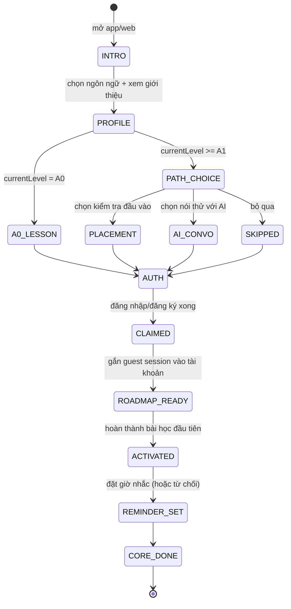

# Đặc tả luồng Onboarding — `onb_v3`

> **Trạng thái: DỰ THẢO, chờ owner duyệt.** Đây là Giai đoạn 0 của
> `plans/2026-08-28-ke-hoach-chi-tiet-onboarding-tong-the.md`.
> Sau khi duyệt, tài liệu này là **nguồn chân lý duy nhất** cho web, mobile và
> backend: contract test của GĐ 1–8 sinh ra từ đây, không từ code hiện có.
>
> Base: `origin/main` @ `1481a719` (đã có #375 và #407).

## 0. Cách đọc tài liệu này

Mỗi mục được gắn nhãn để không lẫn giữa "đang có" và "sẽ có":

| Nhãn | Nghĩa |
|---|---|
| 🟢 **ĐANG CHẠY** | Đã có trên `main`, đã đo được. Đổi là **breaking change**. |
| 🟡 **SẼ ĐỔI** | Có trên `main` nhưng `onb_v3` sẽ thay. Nêu rõ đường di trú. |
| 🔵 **MỚI** | Chưa tồn tại. |
| 🔴 **LỆCH** | Web và mobile đang khác nhau. Phải hợp nhất, hoặc ghi rõ là cố ý. |

Mọi con số/tên hàm trong tài liệu đã được đối chiếu với code trên `main` tại
thời điểm viết. Khi sửa code mà lệch tài liệu, **sửa tài liệu trong cùng PR**.

---

## 1. Từ vựng — ba định nghĩa hay bị nhầm

Ba khái niệm dưới đây hiện đang bị dùng lẫn lộn, và đó là lý do dashboard funnel
không đọc được. `onb_v3` tách bạch chúng:

| Khái niệm | Định nghĩa | Đo bằng |
|---|---|---|
| **Profile saved** | `POST /onboarding/profile` trả 2xx. Hồ sơ + learning plan đã nằm trên server. | `onboarding_profile_saved` |
| **Core done** | Người học đã đi hết luồng onboarding (kể cả bước nhắc học). Không đồng nghĩa với việc họ đã học gì. | `onboarding_core_completed` |
| **ACTIVATION** | Người học **hoàn thành bài học đầu tiên**. Đây là chỉ số bắc cầu sang retention, và là thứ duy nhất đáng gọi là "thành công". | `first_lesson_completed` |

🟡 **SẼ ĐỔI — cảnh báo quan trọng.** Sự kiện `onboarding_completed` hiện đang bắn
ở **cả web lẫn mobile ngay sau khi lưu hồ sơ**, tức nó thực chất là "profile
saved". Mọi báo cáo funnel đã dựng trên nó đang đo sai thứ mình tưởng. Đường di
trú ở §6.3 — **không** đổi ý nghĩa của tên cũ tại chỗ, mà phát sự kiện mới song
song rồi mới ngừng cái cũ.

---

## 2. Hành trình mục tiêu



### 2.1 Bảng trạng thái

| State | Vào bằng | Ra bằng | Bản ghi server-side |
|---|---|---|---|
| `INTRO` | mở ứng dụng | `intro_done` | ✗ (guest) |
| `PROFILE` | `intro_done` | `profile_submitted` | guest session |
| `A0_LESSON` | `profile_submitted` ∧ `level = A0` | `lesson_done` \| `lesson_fallback` | guest session |
| `PATH_CHOICE` | `profile_submitted` ∧ `level ≥ A1` | `path_selected` | guest session |
| `PLACEMENT` | `path_selected(placement)` | `placement_done` \| `placement_abandoned` | guest session |
| `AI_CONVO` | `path_selected(ai)` | `convo_done` \| `convo_abandoned` | guest session |
| `SKIPPED` | `path_selected(skip)` | tức thì | guest session |
| `AUTH` | mọi nhánh FIRST_ACTIVITY | `auth_succeeded` | ✓ user |
| `CLAIMED` | `auth_succeeded` | `claim_succeeded` | ✓ `user_onboarding_progress` |
| `ROADMAP_READY` | `claim_succeeded` | `lesson_started` | ✓ |
| `ACTIVATED` | `first_lesson_completed` | `reminder_prompt_shown` | ✓ `activated_at` |
| `REMINDER_SET` | `notification_permission_result` (kể cả từ chối) | `core_done` | ✓ |
| `CORE_DONE` | `core_done` | — | ✓ `core_completed_at` |

### 2.2 Bất biến — mỗi cái là một contract test

| # | Bất biến | Vì sao |
|---|---|---|
| **I-1** | A0 **không được** bỏ qua FIRST_ACTIVITY. | A0 không có gì để đo bằng placement; bài học đầu là toàn bộ giá trị họ thấy trước khi đăng ký. |
| **I-2** | Mọi state từ `AUTH` trở đi **phải** có bản ghi server-side. | Nếu không thì đổi thiết bị = mất tiến độ, và không đo được funnel thật. |
| **I-3** | `ACTIVATED` ⟺ `first_lesson_completed`. **Không** dùng `onboarding_completed`. | §1. |
| **I-4** | Từ chối quyền (mic, notification) **không** chặn tiến trình. | Người từ chối mic vẫn phải học được; xem I-5. |
| **I-5** | Mic bị từ chối ở `A0_LESSON` → chuyển biến thể **nghe-lặp**, không báo lỗi, không quay lui. | Đã có tiền lệ trên mobile (`onb_first_sentence_skipped` với `reason`). |
| **I-6** | `claim` là **idempotent** và **atomic**. Gọi lần hai = no-op. | Hai tab/hai request đua nhau không được tạo hai hồ sơ. |
| **I-7** | Draft khách **không bao giờ** được áp cho một tài khoản khác tài khoản đã tạo ra nó. | Lỗ F-3. Xem §4.3. |
| **I-8** | Hồ sơ đã nằm trên server ⟹ draft bị vứt; hồ sơ **chưa** nằm trên server ⟹ draft được giữ. | Bất biến này đã được #407 áp cho web; GĐ 5 phải giữ khi viết lại. |

---

## 3. Hiện trạng — bảng sự thật web ↔ mobile

Đây là phần quan trọng nhất của tài liệu: **hai nền tảng đang không chạy cùng
một luồng**, và mọi kế hoạch "parity" đều phải xuất phát từ đây.

| Khía cạnh | Web `/v2/onboarding` | Mobile `(auth)/onboarding` | |
|---|---|---|---|
| Số bước phễu | 5 (level → goal → target → quick-win → signup gate) | 1 màn cuộn + gate quick-win | 🔴 |
| Bài học đầu (A0) | **không có** | `(auth)/first-sentence` — nghe/nói/chấm cục bộ | 🔴 |
| Kiểm tra đầu vào | có (`/skill-tree/placement-test`) | **không có** | 🔴 |
| Nói thử với AI | không | không | 🔵 cả hai đều thiếu |
| Tôn trọng `postAction` của ma trận | chỉ nhánh `PRICING_CTA` | **bỏ qua hoàn toàn** — `nextAfterProfile()` luôn trả `/(auth)/first-sentence` | 🔴 cố ý (vá F-1, #375) |
| Nhắc học | không có | local notification 20:00, pre-permission + cooldown 3 ngày | 🔴 |
| Spotlight tour | không có | 5 bước, **thứ tự đã chốt với owner, có test khoá** | 🔴 |
| Draft khách | localStorage, TTL 30′ | SecureStore, TTL 30′ | 🟢 đã đồng bộ (#407) |
| i18n | copy tiếng Việt **hard-code** trong page | tiếng Việt hard-code toàn app | 🔴 |
| Tiền tố sự kiện | `onboarding_*` | `onboarding_*` **và** `onb_*` | 🔴 |

> ⚠️ **`postAction` là hợp đồng chết một nửa.** Backend tính toán và trả nó ở
> `GET /onboarding/route`, mobile bỏ qua hoàn toàn, web chỉ dùng cho một nhánh
> UI. Trước khi GĐ 5/6 xây trên nó, owner phải chốt: **hồi sinh** (client tôn
> trọng đủ 7 giá trị) hay **khai tử** (bỏ khỏi response, ma trận chỉ còn quyết
> định `placementRequired/Optional`). Xem §8 câu hỏi Q-A.

---

## 4. Hợp đồng API

### 4.1 🟢 ĐANG CHẠY — đóng băng, không được đổi

`OnboardingController`, class-level `@PreAuthorize("hasRole('STUDENT')")`:

| Endpoint | Trả về | Ghi chú |
|---|---|---|
| `POST /api/onboarding/profile` | **201** `LearningPlanResponse` | **UPSERT** — gọi lại là cập nhật, không phải lỗi. |
| `GET /api/onboarding/route?currentLevel=&platform=` | `OnboardingRouteResponse` | Ma trận §4.2. |
| `GET /api/onboarding/mentor?goalType=&industry=&currentLevel=` | `OnboardingMentorResponse` | Có `upsellCode` cho nhắc nâng cấp PRO. |
| `GET /api/onboarding/status` | `{ hasPlan: boolean }` | Guard `hasPlan === false` đang được dùng để đá về onboarding. |
| `POST /api/onboarding/upsell-interest` | **204** | |
| `GET /api/onboarding/me/profile` | `LearningProfileResponse` | |

`OnboardingPreviewController` — **công khai**, `SecurityConfig` cho
`GET /api/onboarding/preview/**` `permitAll()`:

| Endpoint | Ghi chú |
|---|---|
| `GET /api/onboarding/preview/mentor?goalType=&industry=&currentLevel=` | Bản FREE-tier cho khách chưa đăng ký. Chỉ đọc, không nhạy cảm. |

⛔ **`POST /api/auth/register` và `POST /api/auth/login` bất biến hợp đồng** —
mobile build 15 đang gọi. Đăng nhập mạng xã hội ở GĐ 3 phải là endpoint **mới**,
thuần additive.

⚠️ **409 KHÔNG có nghĩa "hồ sơ đã tồn tại".** Endpoint trả 201 và UPSERT; không
có `ConflictException` nào trên nhánh gọi. 409 duy nhất có thể tới là
optimistic-lock hoặc data-integrity từ `GlobalExceptionHandler`, và cả hai nổ
**lúc commit** ⟹ **toàn bộ ghi đã rollback**. Client **không được** coi 409 là
thành công. (Hiện `saveProfile()` trên web vẫn `return true` khi gặp 409 — nợ đã
ghi nhận, xem §8 Q-B.)

### 4.2 🟢 Ma trận điều hướng

`OnboardingTypeResolver.resolve(platform, level)` → `OnboardingRoute(type,
placementRequired, placementOptional, assessmentHookAfter, paywallAllowed,
postAction)`.

| Platform | A0 | A1–A2 | B1+ |
|---|---|---|---|
| **WEB** | `ZERO_START` · —/—/— · `ROADMAP_ALPHABET` | `PLACEMENT_VALIDATED` · opt+hook · `ROADMAP_NODE` | `PLACEMENT_VALIDATED` · opt+hook · `PRICING_CTA` |
| **ANDROID** | `ZERO_START` · —/—/— · `ROADMAP_ALPHABET` | `EXPRESS_PROFILE` · hook · `MOCK_HOOK_PAYWALL` | `ASSESSMENT_HOOK` · hook · `RADAR_CHECKOUT` |
| **IOS** | `MENTOR_LED_DEMO` · —/—/— · `EMAIL_CAPTURE_UPSELL` | `EXPRESS_PROFILE` · —/—/— · `START_PRACTICE` | `EXPRESS_PROFILE` · —/—/— · `INTERVIEW_FIRST` |

`paywallAllowed` = `platform.allowsInAppPaywall()` (iOS phải theo luật App Store).

> 🔴 Ô **IOS/A0 → `EMAIL_CAPTURE_UPSELL`** chính là nhánh đã giết onboarding v1
> (F-1): client đá thẳng sang màn upsell, bỏ qua bài học đầu + tour + nhắc học.
> #375 vá ở **client** (`nextAfterProfile` bỏ qua `postAction`), backend giữ
> nguyên chủ ý và **có test khoá** (`OnboardingTypeResolverTest`). Sửa ma trận
> phải sửa test đó — test đang khoá hành vi cũ **có chủ ý**.

### 4.3 🔵 MỚI — guest session (GĐ 1)

| Endpoint | Auth | Mô tả |
|---|---|---|
| `POST /api/onboarding/guest-session` | công khai + rate-limit theo IP | Tạo session, trả `sessionId` (UUID không đoán được). |
| `PATCH /api/onboarding/guest-session/{id}` | công khai, chỉ khi **chưa claim** và **chưa hết hạn** | Cập nhật `current_step` / `answers` / `activity_result`. |
| `POST /api/onboarding/claim` | authed | Gắn session → user. Idempotent (I-6), atomic (`UPDATE … WHERE claimed_by_user_id IS NULL`). |
| `GET /api/onboarding/progress` | authed | Trả progress server-side để resume trên thiết bị khác. |

**Ràng buộc bắt buộc:**

- TTL session **72h**; job dọn rác chạy theo đúng khuôn ShedLock của repo
  (một entry point, đủ `@Scheduled` + `@SchedulerLock` + `@Transactional`, trả
  `void` — bẫy proxy đã ghi nhận).
- Rate-limit **ngay từ PR đầu**: đây là bề mặt public mới, repo đã có tiền sử
  audit DDoS/EDoS và dùng Bucket4j.
- Audio của khách **không** lưu server (so khớp cục bộ như
  `mobile/lib/firstSentence.ts`). Nếu sau này cần lưu: TTL ≤24h, **không** gửi
  PostHog.
- `claim` giải quyết I-7: draft chỉ được áp cho user vừa claim session đó. Khoá
  bằng `sessionId` chứ không bằng "có mặt trên máy".

---

## 5. Hợp đồng dữ liệu dùng chung

Web và mobile phải gửi/nhận **cùng một hình dạng**. JSON Schema dưới đây là
nguồn cho contract test hai chiều.

### 5.1 `OnboardingAnswers`

```jsonc
{
  "motivation":   "JOB|AUSBILDUNG|STUDY|IMMIGRATION|EXAM|HOBBY",
  "goalType":     "WORK|CERT",        // dẫn xuất: EXAM → CERT, còn lại → WORK
  "currentLevel": "A0|A1|A2|B1|B2",   // null = chưa chọn
  "targetLevel":  "A1|A2|B1|B2|C1|C2",
  "industry":     "string|null",      // chỉ khi goalType=WORK
  "examType":     "GOETHE|TELC|TESTDAF|null", // chỉ khi goalType=CERT
  "dailyGoalMinutes": 10 | 15 | 20
}
```

🔴 **Lệch phải hợp nhất:** web dùng `weeklyTarget: number` (3/5/7) rồi dẫn xuất
`dailyGoalMinutes`; mobile dùng `dailyGoal: string` ('5'|'10'|'15'|'20') trực
tiếp. `onb_v3` chốt **`dailyGoalMinutes: number`** là trường chuẩn; nhịp tuần là
thứ hiển thị, không phải thứ lưu.

### 5.2 `EntitlementResponse` (GĐ 2)

```jsonc
{
  "tier":         "FREE|PRO|ULTRA|DEFAULT",
  "isTrial":      true,
  "trialEndsAt":  "2026-09-04T00:00:00Z",
  "capabilities": ["speaking", "placement", "..."]
}
```

Client **ẩn toàn bộ paywall/upsell** khi `isTrial && trialEndsAt > now`
(hệ quả của quyết định Q1). Ngày 8 mới được hiện.

---

## 6. Taxonomy sự kiện

### 6.1 🟢 Đang bắn hôm nay

**Web** (`useTracking`): `onboarding_step_completed` (qua `trackOnboardingStep`,
kèm `step_name`/`step_number`) · `onboarding_motivation_selected` ·
`onboarding_daily_goal_set` · `onboarding_type_assigned` ·
`onboarding_placement_offered` · `onboarding_placement_test_started` ·
`onboarding_placement_test_completed` · `onboarding_placement_skipped` ·
`onboarding_quickwin_completed` · `onboarding_signup_prompted` ·
`onboarding_mentor_upsell_clicked` · `onboarding_pricing_cta_clicked` ·
`onboarding_completed` · `register_started|success|failed`

**Mobile** (`captureEvent`): các sự kiện `onboarding_*` dùng chung ở trên, cộng
`onb_first_sentence_started|spoken|succeeded|retried|skipped` ·
`onb_notif_permission` · `onb_starter_checklist_completed` ·
`guide_tour_started|step_viewed|finished` · `login_*`

### 6.2 🔵 Đích `onb_v3`

```
onboarding_started
onboarding_step_completed(step)
onboarding_path_selected(path)              # a0_lesson | placement | ai_convo | skip
guest_activity_started(kind)
guest_activity_completed(kind)
signup_prompted
signup_succeeded(method)                    # email | google | apple
onboarding_session_claimed
onboarding_profile_saved                    # thay nghĩa cũ của onboarding_completed
placement_completed(level)
ai_conversation_completed
first_lesson_started
first_lesson_completed                      # ← ACTIVATION
reminder_prompt_shown
notification_permission_result(state)       # granted | denied | blocked
onboarding_core_completed
trial_expiring
trial_downgraded
paywall_viewed
```

### 6.3 🟡 Đường di trú — bắn song song, đừng đổi nghĩa tại chỗ

| Cũ | Mới | Cách làm |
|---|---|---|
| `onboarding_completed` (nghĩa: đã lưu hồ sơ) | `onboarding_profile_saved` | Bắn **cả hai** trong ≥2 tuần. Dashboard chuyển sang tên mới, rồi mới gỡ tên cũ. |
| `onb_first_sentence_succeeded` | `first_lesson_completed` | Như trên. Tiền tố `onb_*` bị khai tử; chỉ còn `onboarding_*` / tên phẳng. |
| `onb_notif_permission` | `notification_permission_result` | Đổi `granted: boolean` → `state: granted\|denied\|blocked` (mobile đã phân biệt được 3 trạng thái, đừng làm mất). |

⛔ **Đừng đổi ý nghĩa của một tên sự kiện đang chạy.** Dữ liệu lịch sử sẽ trộn
hai định nghĩa và không có cách nào tách lại.

### 6.4 Property bắt buộc trên **mọi** sự kiện

| Property | Giá trị |
|---|---|
| `flow_version` | `onb_v3` (hoặc `onb_v2` cho đường cũ trong lúc chạy song song) |
| `platform` | `web` \| `ios` \| `android` |
| `path` | `a0_lesson` \| `placement` \| `ai_convo` \| `skip` |

**Cách gắn — đừng sửa từng call site:**

- Mobile: đã có `registerSuperProperties()` dùng `posthog.register()`. Thêm
  `flow_version` vào đó.
- Web: **chưa có** cơ chế super-property — `frontend/src/providers/PostHogProvider.tsx`
  gọi `posthog.init()` nhưng không `register()`, còn `useTracking` gọi thẳng
  `posthog.capture`. Phải thêm `posthog.register({ flow_version })` ngay sau
  `init()`. 🔵

🔒 **Không PII, không audio vào PostHog.** `sessionId` dạng UUID được phép; email
thì không. Nhắc lại vì `onb_v3` thêm sự kiện cho khách chưa đăng ký.

---

## 7. Funnel & định nghĩa thành công

```
onboarding_started
  → guest_activity_completed
    → signup_succeeded
      → onboarding_session_claimed
        → first_lesson_completed        ← ACTIVATION
          → D1 / D3 / D7 retention
```

Dashboard phải tách theo `platform` và `path`. Chỉ số phụ: tỷ lệ rơi từng bước,
permission-grant rate, chuyển đổi trial→paid ngày 8–14.

**Feature flag `onboarding_v3`**: rollout theo %, giữ đường cũ 2 tuần để so
funnel, kill-switch quay về flow cũ **không cần deploy backend**.

---

## 8. Câu hỏi cần owner chốt trước khi thi công GĐ 1

| # | Câu hỏi | Vì sao chặn |
|---|---|---|
| **Q-A** | `postAction` — **hồi sinh** (client tôn trọng đủ 7 giá trị) hay **khai tử** (bỏ khỏi response)? | GĐ 5/6 sẽ xây điều hướng trên nó. Để nguyên trạng "backend tính, client bỏ qua" là ôm một hợp đồng chết vào flow mới. |
| **Q-B** | `saveProfile()` gặp 409 hiện vẫn `return true` và cho đi tiếp, dù 409 nghĩa là **rollback**. Sửa thành chặn + báo lỗi? | Là đổi hành vi điều hướng, cần chốt riêng. Hiện người dùng có thể đứng ở roadmap mà không có learning plan. |
| **Q-C** | Mốc TTL guest session 72h và draft 30′ — giữ hay đổi? | 30′ hợp lý cho web (register chuyển thẳng về onboarding) nhưng GĐ 3 thêm social auth có thể kéo dài quãng rời trang. |
| **Q-D** | i18n mobile: `onb_v3` chỉ phủ **luồng onboarding/auth**, phần còn lại của app để dự án riêng. Đồng ý? | Ảnh hưởng ước lượng GĐ 4. |

---

## 9. Nợ kỹ thuật đã biết, ảnh hưởng tới đo lường

Ghi ở đây vì chúng làm sai lệch cách đọc "CI xanh" và "đã có test":

- `frontend/vitest.config.ts` đặt ngưỡng coverage **sai tầng** cho Vitest 2.x
  (`lines`/`statements` phẳng thay vì trong `thresholds`) ⟹ `npm test --
  --coverage` của CI **không gác gì**; độ phủ thật ~44%.
- Bước `i18n Hardcoded String Check` trong `frontend-ci.yml` là **cổng chết**:
  `scripts/i18n/check_i18n.py` luôn `sys.exit(0)`, in 2573 vi phạm vẫn xanh.
- `frontend-ci.yml` lọc `paths` ⟹ PR chỉ đụng backend không chạy vitest. #407 đã
  thêm `backend/.../user/mentor/**`; mọi guard cross-stack mới phải thêm path
  tương ứng, nếu không nó vô dụng đúng lúc cần nhất.
- `frontend/src/lib/personas.ts` thiếu 6 mã mentor nhập môn ⟹ học viên được gán
  Jonas không chọn được Jonas trong picker Speaking.

---

## 10. Đổi tài liệu này thế nào

1. Spec đi **trước** code. Đổi hành vi ⟹ sửa spec trong **cùng PR**.
2. Mọi bất biến §2.2 phải có ít nhất một test trỏ ngược về ID của nó
   (`I-1`…`I-8`) trong tên hoặc comment.
3. Ba nơi phải trỏ về đây: `frontend/src/features/onboarding/machine.ts`,
   `mobile/lib/onboardingRouting.ts`, `OnboardingTypeResolver`.
